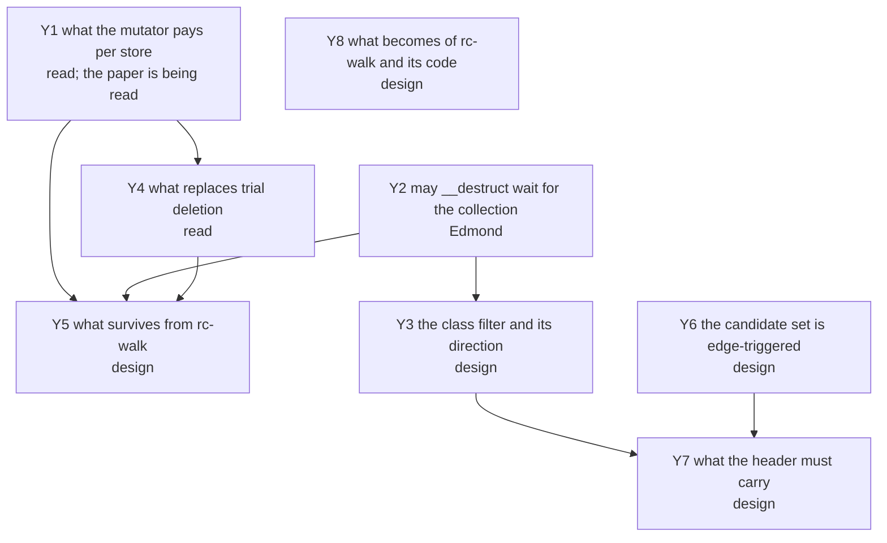

# The question graph

Every open question of `rc-cycle`, as a node with what would answer it and
what it blocks. A node carries a mark for what blocks it, the same legend
the closed graph of [`../walk/questions.md`](../walk/questions.md) used:
**today** — answerable with the code and instruments that exist;
**measure** — a number nobody has taken, on instruments that exist;
**design** — a decision to be made and written;
**read** — a paper or an implementation that has to be read first;
**corpus** — blocked on a measurement of real PHP programs;
**Edmond** — his to rule.

## The graph

## Y1. What the mutator pays per store, and whether the view needs enumerated roots  [read]

The load-bearing node: `rc-walk` was built on one constraint — the mutator
does no per-operation work for the collector, no write barrier, no snapshot
queue, no root publication ([`../rc-walk.md`](../rc-walk.md)) — and sliding
views are a write barrier. What is not yet known is the shape of it: the
coalescing form logs an object's state **once per epoch** rather than once
per store, which is the shape node A5 of the closed graph asked for and
priced as bounded by the checkpoint cadence.

**What would answer it:** the paper, "Efficient On-the-Fly Cycle Collection",
Paz, Petrank, Bacon, Kolodner and Rajan — what the barrier executes in the
common case, and whether a sliding view needs a thread to publish its local
roots at a safe point. If it does, `rc-cycle` inherits the debt that keeps
[`../satb.md`](../satb.md) unbuilt: the per-frame spill of every live
reference, which this runtime has no mechanism for.

**What it blocks:** everything downstream. A barrier that needs roots is a
different design from one that does not.

## Y2. May a destructor wait for the collection?  [Edmond]

**Every concurrent design surveyed pays in this coin**, and the survey of
2026-08-25 found no exception. Nim's YRC defers a destructor to collection
time for every cycle-capable type and keeps prompt reclamation only for
types annotated `.acyclic`; `scheme-rs` defers for **all** objects, its own
documentation conceding that collection happens "at a fixed cadence … as
opposed to when the type is Dropped"; Samsara keeps the prompt path for the
acyclic case and defers the rest; CIRC defers every destructor to an epoch
grace period.

So the question is exact: may PHP's `__destruct` weaken to **prompt for a
class proven acyclic, collection-time for the rest**? `rc-walk` promises
prompt for everything and pays a census for it.

**What it blocks:** if the answer is no weakening at all, four of the five
implementations collapse to "algorithm reusable, timing not", and the only
surviving shape is Bacon–Rajan's own — deterministic release, buffered
candidates, collection on the owning thread.

## Y3. The class filter, and which way its default runs  [design]

Edmond's own, 2026-08-25: classes that have held cyclic references are
suspect, and only they enter the candidate set.

**The direction has to be the other one.** "Has not been in a cycle so far"
is a fact about a run, and the next request refutes it; a class demoted on
that evidence loses its cycles for ever, because enrolment is edge-triggered
(Y6). So a class is **suspect by default** and leaves the set only by proof.

**The proof is available today, with no compiler.** A class whose declared
slots cannot hold a reference to a kind that can close a ring cannot be a
cycle member, and the crate already carries the slot kinds it needs to
decide that (`ll-model` `src/class.rs`, `SlotKind`). That is finer than
`CANDIDATE_KINDS`, which decides per entity kind, and it needs neither the
compiler ruled out of scope on 2026-08-23 nor a run's history.

**What would answer it:** the rule written against the class descriptor, and
the share of a real corpus's classes it demotes — which the corpus scan
already reports classes for.

## Y4. What replaces trial deletion's mutation of live counts  [read]

Bacon–Rajan's trial deletion decrements the object's own count during
`markGray`/`scan` and restores it in `scanBlack`. Concurrently that is a
write race against the mutator on the very word it owns, and the surveyed
implementations answer it three ways: the paper's own two-epoch Σ/Δ
confirmation, which `scheme-rs` implements faithfully; a side table with
the decision computed entirely off-heap and the heap touched only at commit,
which is Nim's YRC — Tarjan's SCC into a side table, deadness as array work
over the condensation, and a commit-time recheck of each member's count
against its captured value; and Samsara's smaller version of the same, an
external adjacency list with a per-object dirty bit and a count recheck at
commit.

**Why the third shape matters here:** an aborted collection costs no heap
write at all, and the deferred decrement queue is itself the snapshot. This
project already owns the re-verification half — the Phase 4 exact test on
the owning thread — so what it needs from this node is which of the three
it re-derives.

**What would answer it:** the paper for the Σ/Δ form; `lib/system/yrc.nim`
in Nim's devel branch for the side-table form, which ships with Lean 4 and
TLA+ proof artefacts and is in no released tag.

## Y5. What survives from `rc-walk`  [design]

The expensive half of concurrency is built and is not to be re-derived: a
collector that judges concurrently cannot be trusted, so the owner
re-verifies. The handshake, the Phase 4 exact test against current fields,
the deferred-free parking that keeps a slot from being recycled under an
identifier in flight, eager death, and ruling 5 — the collector judges and
the mutator frees.

**What would answer it:** which of these the new candidate source leaves
intact. The exact test is component-sized and cheap; what dies is Phase 1,
the census and the full edge build.

## Y6. The candidate set is edge-triggered, and a refusal is permanent  [design]

Buffering fires on a decrement that does not reach zero, so a refused
enrolment is never re-offered: if that decrement was the last external
release of a garbage cycle, no later collection can find it
([`../../../runtime/exceptions.md`](../../../runtime/exceptions.md)). A derived
population has the opposite property — it is re-derived every epoch, so a
miss costs one epoch. This is the strongest recorded argument against
sourcing candidates from the mutator and it is not a cost but a class of
failure.

**What would answer it:** a rule for what happens when the buffer cannot
grow — the fallback being a full walk, which is the census this design
exists to delete, admitted rarely rather than always.

## Y7. What the header must carry  [design]

Under `rc-trace`'s shape the cycle collector owns **twenty of the flags
word's thirty-two bits**: two for the colour, one for buffered, seventeen
for the candidate index (`ll-model` `src/refcount.rs`). Bit 15 is also the
string's out-of-line bit, safe only because a string never enters the
buffer, and pinned by a test rather than by construction.

**What would answer it:** what `rc-cycle` needs there. A side table (Y4)
needs a tag word rather than an index; a class filter (Y3) needs one bit
stamped at allocation; and the seventeen-bit index is what made unique
ownership `rc-walk`-only.

## Y8. What becomes of `rc-walk`, its registry row and its code  [design]

`rc-walk` is the built default and `rc-cycle` is not a line of code, so
"superseded" cannot mean deleted. The precedent is the capture-count
regime: refused, kept as a record, its documents bannered.

**What would answer it:** when the registry's default moves, and on what
evidence — which is Y1's answer and a measurement, not a preference.

## Prior art, as of 2026-08-25

Read against this design rather than surveyed for its own sake. Nim's
**YRC** is the nearest working thing: concurrent, thread-local candidate
buffers, no stack scan, Tarjan into a side table, commit-time validation,
in devel and in no release. **scheme-rs** implements the paper's concurrent
Σ/Δ form in Rust inside a real runtime and defers every destructor.
**Samsara** is the small version of the side-table idea and is an abandoned
prototype. **bacon_rajan_cc** is the synchronous shape with deterministic
release, single-threaded by construction. **CIRC** does not collect cycles
at all — its users break them by hand — and is deferred reference counting
over epoch-based reclamation. The older reading, LXR, arborescent GC and
Kim et al.'s partial tracing, stands in
[`../gc-research.md`](../gc-research.md) and in the closed graph's F1 to F3.
