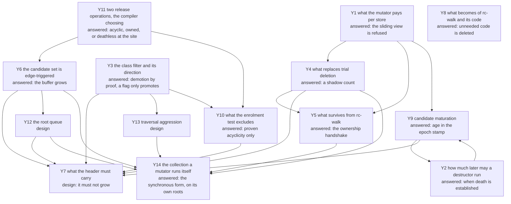

# The question graph

Every open question of `rc-cycle`, as a node with what would answer it and
what it blocks. A node carries a mark for what blocks it, the same legend
the closed graph of [`../walk/questions.md`](../walk/questions.md) used:
**today** — answerable with the code and instruments that exist;
**measure** — a number nobody has taken, on instruments that exist;
**design** — a decision to be made and written;
**read** — a paper or an implementation that has to be read first;
**corpus** — blocked on a measurement of real PHP programs;
**Edmond** — his to rule.

## The graph

## Y1. What the mutator pays per store, and whether the view needs enumerated roots  [answered 2026-08-25: the sliding view is refused]

The load-bearing node, and it closed the day it opened. Two papers were
read, not one: the sliding-view machinery — the barrier, the four
handshakes, the snoop, the slow-path frequencies — is Levanoni and
Petrank's (TOPLAS 2006), and the cycle collector over it — the `CRC`, the
mark/scan/collect passes, the `k + 1` maturation buffers, the root
differencing (its §4.2) — is Paz, Bacon, Kolodner, Petrank and Rajan's
(TOPLAS 2007). "The paper" below names the one whose mechanism is at hand.

**The refusal's ground, as re-argued after the Critic round of 2026-08-25:
the log is a per-store soundness cost no proof can delete, where this
design's per-release cost is deletable precision.** The original ground —
`rc-walk`'s rule that the mutator does no per-operation work for the
collector ([`../rc-walk.md`](../rc-walk.md)) — died the day it was used:
`rc-cycle` itself puts the enrolling decrement, the already-enrolled
test-and-set and the queue write on the mutator (Y9, Y11, Y12), so "no
per-operation work" refuses this design too and refuses nothing. What
actually separates the two costs is elidability. A skipped enrolment is a
deferral by Y11's covering claim, so the compiler deletes the test at every
proven site and a missed deletion costs precision; a skipped log entry is a
hole in the view and a wrong collection, so no site can be exempted — and
beside the log sits an unconditional snoop test on every store and a fence
on a weakly ordered machine when the dirty word and the slot fall in
different coherence granules, paid whether or not a collection runs.

**The counts have customers the barrier cannot serve, and that refuses the
coalesced form on its own.** Levanoni and Petrank's bargain is that the
barrier *replaces* eager retain/release, with counts reconstructed at a
collection from logged slot histories. Here the live count is read
synchronously by machinery that has nothing to do with collection: the
copy-on-write separation test (`dev/DECISIONS.md`, 2026-08-22), the
`RC − IN` root identity and the Phase 4 exact test, and the prompt
count-zero death the seventh entry chose. A count that exists only at
collection time serves none of them, so the count-replacing configuration
is out however its per-store price compares — and with it the fourth
handshake's stack scan and the §4.2 root differencing, which exist only to
compensate for deferred counting. A hybrid — the coalescing log kept, the
exact counts kept beside it — escapes that objection and the stack-scan one,
and is refused by the previous paragraph alone: it pays the log's
undeletable per-store cost on top of the counts it was meant to spare.

**The barrier's own price, for the record**, since it bounds any future
proposal of the same shape: the fast path is a load, a test and a not-taken
branch on a per-object `LogPointer`, with the slow path — copy every
non-null reference field into a thread-local buffer — taken "less than once
in a hundred" for javac and "less than once in a thousand" for the rest of
the measured set.

**One inference the reading yields and the papers do not state:** exact
counted stack references *remove* the need for the root workaround. Because
a stack reference here is counted like any other, dropping a root is a real
decrement and is seen; the blanket young-object candidacy and the root
differencing exist only to compensate for deferred counting. What that
costs is the candidate set's size — without coalescing it is Bacon–Rajan's
plain set rather than the paper's `o₀`-only one. Y9's maturation bounds the
*tracing* of that set; the enrolment traffic and the buffer footprint
remain bought, scaled by what the program touched, and no measurement of
either exists yet — the paper's 40–80 % figure was taken downstream of
coalescing and does not transfer.

**What survives separation from the barrier** — six pieces, and the sixth
is `rc-walk`'s, not the papers': the acyclic-class filter and its extension
to the traversal; the `CRC` shadow count (Y4); candidate maturation (Y9,
whose mechanism has since moved to the epoch stamp); running mark, scan and
collect over all candidates at once, which is what makes it linear rather
than quadratic; the collect stage's discipline of marking members released
before tearing them down; and the owner-thread exact test of Y5, which is
the load-bearing one — the papers' own safety mechanism against freeing an
entity that gained a reference mid-collection is the snooped set, and it
dies with the barrier, so the exact test is what stands between a white
verdict and a mutator that has just loaded a member into a counted local.
How that test squares with the collector-side free the ninth entry permits
is an open seam recorded at Y5. What else dies with the barrier: the
known-live filter — its three signals are the dirty word, the root set and
the snooped set, all absent here — and the live-stack pre-pass it feeds.

## Y2. How much later may a destructor run?  [answered 2026-08-25: when death is established]

**Ruled by Edmond: the destructor runs as soon as the death is established,
and the call is decoupled from the memory.** A count that reaches zero
destructs on the spot, as today; a cyclic component destructs at the
collection that confirms it dead. Neither call frees the block — the arena
holds it until its reset — so memory never hurries the call and never
delays it.

**The permission it narrows** stands as ruled the same day
(`../../../dev/DECISIONS.md`, sixth entry): PHP promises no instant, so
deferred and coalesced counting are not disqualified by destructor timing,
and the refusal in Y1 stands on its other two legs.

**The arena needs no collection at all.** The reset's first step is already
a trace-and-`__destruct` fixpoint over every dying object
([`../../memory/arena-reset.md`](../../memory/arena-reset.md)), so cyclic
garbage that no collection confirmed before the request ends gets its
destructor from that pass. The final collection at request end that the
open bound seemed to demand has nothing to do; the reset is the backstop.

**What the earlier open list comes to.** Before the request ends — yes, by
the backstop. Before the arena reset — yes, inside its destructor pass.
Observability — the ruling adds no observable state: a count-zero death
destructs immediately as before, and an unreachable cycle looks live until
a collection finds it under any reference-counted design, today included.
The `WeakMap` eager cleanup of `../weak-references.md` keys on count-zero
deaths and is untouched. The order of two collection-time destructors was
not ruled, and no document promises one.

## Y3. The class filter, and which way its default runs  [answered 2026-08-25: demotion by proof, a flag only promotes]

Edmond's own, 2026-08-25: classes that have held cyclic references are
suspect, and only they enter the candidate set.

**The direction has to be the other one.** "Has not been in a cycle so far"
is a fact about a run, and the next request refutes it; a class demoted on
that evidence loses its cycles for ever, because enrolment is edge-triggered
(Y6). So a class is **suspect by default** and leaves the set only by proof.

**The proof is available today, with no compiler.** A class whose declared
slots cannot hold a reference to a kind that can close a ring cannot be a
cycle member, and the crate already carries the slot kinds it needs to
decide that (`ll-model` `src/class.rs`, `SlotKind`). That is finer than
`CANDIDATE_KINDS`, which decides per entity kind, and it needs neither the
compiler ruled out of scope on 2026-08-23 nor a run's history.

**Edmond confirmed the direction on the map and added the other half:** the
runtime proves cyclicity, not just the compiler acyclicity. A collection
that finds a class's instances in a confirmed cycle may stamp the class
with a flag. The flag runs one way — it strengthens suspicion and never
demotes a class out of the set — and what it feeds is not enrolment but the
traversal's aggression, node Y13.

**What remains, and it is S6.3 unchanged:** the demotion rule written
against `SlotKind`, and the share of a real corpus's classes it demotes —
which the corpus scan already reports classes for.

## Y4. What replaces trial deletion's mutation of live counts  [answered 2026-08-25: a shadow count]

Bacon–Rajan's trial deletion decrements the object's own count during
`markGray`/`scan` and restores it in `scanBlack`. Beside a running mutator
that is a write race on the word the mutator owns, and beside a **destructor**
it is worse: user code could observe a count in a torn state.

**The answer is the paper's `CRC`, a second count field.** Mark sets
`obj.CRC := RC` on first reach and decrements the shadow thereafter; mark,
scan and collect operate solely on it, "leaving the reference count field
unmodified — thus, they do not need to be restored". The real count is
touched in exactly one place, the collect stage, and only for the non-white
children of a cycle actually reclaimed. The paper carries the shadow for its
own reason — its live set is not fixed during the algorithm — and notes that
a true snapshot would make it unnecessary; here it is load-bearing for a
different reason, and a better one: it is what lets trial deletion run at all
without disturbing the counts prompt destruction depends on.

**What it costs:** a second count field per entity, which the paper packs
with the colour and buffered bits into one 32-bit word plus an overflow hash
table. What that costs *here* is node Y7's business, and it is the same
header the candidate index already crowds.

**The alternative shape, recorded and not chosen:** Nim's YRC computes the
verdict entirely off-heap — Tarjan into a side table, deadness as array work
over the condensation — and touches the heap only at commit, where it
rechecks each member's count against the captured value. An aborted
collection then costs zero heap writes. It is worth reading before Y7 is
written, since a side table and a shadow field are two answers to one
question.

## Y5. What survives from `rc-walk`  [answered 2026-08-25: the ownership handshake]

**The census dies, the ownership discipline survives.** Ruled by Edmond on
the map: the full-heap walk leaves the design entirely — the collection
traces from the candidate set alone, and the maturation of Y9 with the
enrolment gates of Y10 and Y11 bound even that. Phase 1's census and full
edge build have no successor.

**Release is two-sided, with an asymmetric right to destruct.** Both the
mutator and the collector may free, but the collector itself may only run a
destructor proven pure ([`../pure-destructors.md`](../pure-destructors.md) —
the purity ladder returns here after leaving Y10) or tear down an entity
that has no destructor. An impure destructor runs on the owning thread.
That narrows `rc-walk`'s ruling 5 — the collector judged and only the
mutator freed — and it is what the surviving machinery is for: the
handshake, the Phase 4 exact test against current fields, the deferred-free
parking that keeps a slot from being recycled under an identifier in
flight, and eager death.

**Open seam, found by the Critic round of 2026-08-25:** the exact test's
warrant is that the owning thread holds the entity, so nothing races the
read of its current fields. A collector-side free has no such warrant — the
collector cannot read a component's counts at one instant without the
snapshot Y1 refused — so what check licenses the collector's own free of a
destructor-free entity is undesigned. The ruling names who may call the
destructor; it does not yet say what the freeing side re-verifies.

## Y6. The candidate set is edge-triggered, and a refusal is permanent  [answered 2026-08-25: the buffer grows]

Buffering fires on a decrement that does not reach zero, so a refused
enrolment is never re-offered: if that decrement was the last external
release of a garbage cycle, no later collection can find it
([`../../../runtime/exceptions.md`](../../../runtime/exceptions.md)). A derived
population has the opposite property — it is re-derived every epoch, so a
miss costs one epoch. This is the strongest recorded argument against
sourcing candidates from the mutator and it is not a cost but a class of
failure.

**The overflow rule is ruled: enrolment never drops a root.** Dropping the
candidate on a full buffer was proposed on the map and refused by Edmond —
a dropped enrolment is exactly the permanent miss this node records — and
the full-walk fallback goes with it. The buffer grows instead. Growth is
therefore a property the queue must supply natively, and the queue is node
Y12's; the double-buffered SPSC queue named there doubles its buffer on
overflow.

## Y7. What the header must carry  [design; ruled 2026-08-25: the header does not grow]

Under `rc-trace`'s shape the cycle collector owns **twenty of the flags
word's thirty-two bits**: two for the colour, one for buffered, seventeen
for the candidate index (`ll-model` `src/refcount.rs`). Bit 15 is also the
string's out-of-line bit, safe only because a string never enters the
buffer, and pinned by a test rather than by construction.

**The constraint, ruled by Edmond on the map: the header does not grow** —
no second word, no extra byte. Two directions came with the ruling. The
collection tag is first tried in the **epoch byte** `rc-walk` already
carries at offset 6 ([`../rc-walk.md`](../rc-walk.md#the-one-header-byte)),
written as today by single-byte atomic stores rather than through the flags
word. And the seventeen-bit candidate index is not needed at all: a
buffered entity is found through its entry in the root queue (Y12), which
frees the bits that made unique ownership `rc-walk`-only.

**What would answer it:** the layout of what the freed bits and the epoch
byte must now carry between them — the epoch, the maturation age (Y9), and
the mark that tells a stamp from a claim — under the same one-store
discipline the epoch byte lives by today. The layout is this repository's
to design; Edmond ruled the constraint and left the split open.

## Y8. What becomes of `rc-walk`, its registry row and its code  [answered 2026-08-25: unneeded code is deleted]

**Ruled by Edmond on the map: the code does not wait under a banner —
everything `rc-cycle` makes unneeded is deleted from `ll-model`.** That
reverses this node's opening premise, which reasoned from the
capture-count precedent (refused, kept as a record) to "superseded cannot
mean deleted"; the precedent holds for documents, which stay the record,
and not for code. The deletion follows the build: a piece goes when
`rc-cycle`'s replacement for it lands, not before there is one.

**What is still evidence-gated:** when the registry's default moves — Y1's
answer and a measurement, not a preference.

## Y9. Candidate maturation  [answered 2026-08-25: age in the epoch stamp]

**Maturation is kept, and its residence is ruled: an age carried in the
header's stamp, not a carousel of `k + 1` rotating buffers.** The rotating
form was Levanoni and Petrank's — only candidates that stayed candidates
across the last `k` collections are traced, measured there at 40–80 % of
the candidates their other filters had already passed — and Edmond chose
YRC's representation of the same idea on the map: a collection's commit
stamps each proven-live component with the current epoch and an age, the
minimum over the component's members plus one; a later claim reads the age
back, and a member whose stamp is current and whose age has reached the
promote bound has its edge pruned for the rest of the epoch instead of
being traced again. Ageing whole components rather than cells is what keeps
a component's members from maturing apart (`yrc.nim`, read 2026-08-25:
promote age 3, epoch advanced every 64 collections).

**Three more of YRC's economies come with it, taken on Edmond's ruling
("бери эти алгоритмы на вооружение"):** an *already-enrolled* bit taken by
atomic test-and-set, so an entity sits in exactly one buffer and a repeat
decrement re-enrols nothing; a start threshold deciding when a collection
runs at all — YRC's is adaptive, starting at 128 roots and moving by
outcome, which is the *trigger* lever `rc-trace`'s fixed ten thousand and
Nim ORC's `rootsThreshold` also pull, distinct from maturation's *which*
lever; and a separate suspects buffer for stamped survivors, which on
YRC's generational bench removed the 56 % of captures that were the same
survivors re-registering every collection.

**What would answer the rest:** the promote bound `k` — a measurement on a
real workload, YRC's 3 being the only known value — and the stamp's exact
residence in the header, which is Y7's layout under its no-growth rule.

## Y10. What the enrolment test excludes at the decrement  [answered 2026-08-25: proven acyclicity only]

**Ruled by Edmond on the map: the gate is one — proven acyclicity. Purity
has no bearing on enrolment.** His first phrasing named "a pure object" as
a second exclusion; shown that a class with a pure destructor still holds
references and closes rings like any other, he withdrew it: the exclusion
he meant was always the provably acyclic object. The gate is therefore
Y3's — a class property read from a bit the factory stamps into the
header, so the test is already in the word the release path loads — and
`CANDIDATE_KINDS` is the same gate at entity-kind granularity.

**Where purity does hold** is not here but in Y5: the collector may itself
run only a destructor proven pure. The purity ladder of
[`../pure-destructors.md`](../pure-destructors.md) keeps that one customer.

**What remains:** nothing at this node; the gate's cost is the one bit in
the loaded word, and the compiler's removal of the whole test is Y11 — as
is the object-level exclusion of 2026-08-25, a proven-owned entity never
entering the roots at all (fourteenth `dev/DECISIONS.md` entry).

## Y11. Two release operations, and the compiler choosing between them  [answered 2026-08-25: acyclic, or deathless at the site]

Edmond, 2026-08-25, and it is the sharpest of the three: the compiler emits
**two** decrements — a plain one, and one that also enrols a suspect — and
uses the plain one wherever it can prove the entity is held. His example is
the horizon's own shape: a reference extracted from a container that is
itself held cannot orphan a cycle by being dropped, so no suspicion arises.

**Why it matters more than the gates of Y10.** Those gates make the test
cheap; this removes the test. The candidate branch disappears entirely at
every site the proof discharges, so the mutator pays only where the compiler
could not prove anything — which is the same bargain the count elisions of
`../gc-horizon.md` struck, applied to enrolment rather than to the count
itself.

**What this repository owes, and what it does not.** The compiler's proof
logic is outside these documents since the scope ruling of 2026-08-23; what
is ours is the **contract**: two entry points on the release path, what each
guarantees, and the obligation the cheap one places on its caller. The
obligation has to be stated as a covering claim rather than as a hint,
because a wrong use of the cheap operation is not a lost optimisation — it is
a cycle no later collection can find (Y6), the enrolment being edge-triggered.
That asymmetry is what makes this node a contract question and not a
performance one.

**The covering claim is settled, 2026-08-25.** The plain decrement is legal
at exactly two kinds of site. Either the entity is provably acyclic — Y3's
proof hoisted to compile time, so the gate the enrolling form would test is
known false — or the entity provably cannot die at this site: it is held by
a reference whose own release comes later, and that later release will be
the enrolling form, so the enrolment is deferred rather than lost. Edmond's
examples of the second kind: the entity is a parameter, or was read out of
another entity that is itself held. Bare "someone still holds it after the
decrement" does not qualify — the holder may lie in the same ring, and then
this decrement was the cycle's last external release.

**Raised to an object-level rule, 2026-08-25** (fourteenth
`dev/DECISIONS.md` entry): an entity whose ownership is proven never enters
the candidate set at all — every release site of an owned entity takes the
plain form, the enrolling obligation riding the owning edge's own release.
And by Edmond's addendum the same proof elides more than the test: at the
proven sites the counting pair itself can go, which is `../gc-horizon.md`'s
count-elision bargain made available to `rc-cycle`. How the release path
knows the entity is owned is open — the compiler's site-by-site proof, or
an ownership mark in the header once Y7's freed bits are laid out.

**What remains:** the two signatures written down, and the default without
a proof — the enrolling form everywhere, which is what the crate does
today.

## Y12. The root queue: written by the mutator, read behind it by the collector  [design]

Filed by Edmond on the map, 2026-08-25. Candidates come from the release
path itself, so the enrolment write lands on the hottest path in the
system, while the collector reads the queue in the background without
stopping the writer. The node is the algorithm with both properties, under
Y6's rule: no root is ever dropped, so the buffer grows on overflow.

**The named candidate is already built:** the double-buffered SPSC handoff
queue of the `spsc-refactor` tree, `Zend/zend_spsc_queue.{c,h}`. Its top
comment claims a writer that pays a `fetch_add` and no CAS, a reader that
pays two CAS per batch taking one buffer while the writer fills the other,
and a full buffer that doubles — but the struct comment in the same header
describes a mutex-based handoff with a resize fallback, and the
specification the file points to, `spsc-handoff-queue.md`, is absent from
the tree, so the figures are the comment's claim and S6.4 verifies them
against the code, not against a document. One writer and one reader per
queue fits enrolment — the owning thread writes, the collector reads — at
one queue per thread. Edmond also recalled, unsure, that the algorithm was
in `true-async-server`; its `src/core/thread_queue.cc` wraps the moodycamel
queues, and their SPSC fails when full instead of growing, so that tree
holds a different queue.

**Rejected the same day: YRC's striped queues.** 64 process-wide stripes of
256 fixed slots each; on overflow the writer drains the stripe itself,
becoming the collector on its own hot path, and the stripe never grows.
Both properties fail the rule above.

**The OOM boundary is ruled** (2026-08-25, thirteenth `dev/DECISIONS.md`
entry): a failed growth allocation draws on the runtime's **reserved
critical memory area**, and the runtime stays out of normal mode until
every queued root has been walked — the walk is what makes the reserve's
use bounded. The root is never dropped, which overrides the
drop-as-known-leak licence of
[`../../../runtime/exceptions.md`](../../../runtime/exceptions.md) for
candidate roots. The reserved area has no write-up of its own yet; that
entry is its first written trace, and the area's size, residence and other
customers belong to the memory documents.

**What would answer it:** the queue's contract written for enrolment — who
owns each queue's read side, where the already-enrolled bit of Y9 is
tested relative to the queue write, what the collector's batch takes, and
the reserve-mode entry and exit above — against `zend_spsc_queue.{c,h}`
read first-hand.

## Y13. Traversal aggression, and what the class flag feeds  [design]

Edmond on the map, 2026-08-25: the collection will not trace every
candidate at once — some measure of aggression decides how much is traced
and when — and the flag a proven-cyclic class receives (Y3) raises that
aggression rather than gating enrolment. In his words, deliberately
unfinished: the flag "can influence the degree of aggressiveness; we will
not traverse everything at once; this is not yet clear."

**Open on purpose.** The node holds the question so the half-decision is
not lost; it interacts with Y9's trigger lever (when a collection runs) and
with maturation (which candidates it traces), and none of the three is the
same dial.

## Y14. The collection a mutator runs itself under memory pressure  [answered 2026-08-25: the synchronous form, on its own roots, while no collector runs elsewhere]

Edmond, 2026-08-25: under memory pressure the collector may start directly on
the mutator's thread, provided no collector is running on another thread.

**The rung it replaces already exists and is about to be deleted.**
[`../rc-walk.md`](../rc-walk.md#when-the-collector-runs-the-pressure-ladder)
sends a mutator that cannot serve an allocation down a ladder of self-help, and
its fourth rung runs `walk::collect_cycles` on the allocating thread before
honest failure. Y5 deletes that form with the census, and
[`../rc-cycle.md`](../rc-cycle.md) does not keep the ladder, so without this
node the allocation-failure path has nothing to call. `runtime/exceptions.md`
makes it worse than an omission: allocation failure is an ordinary catchable
`Throwable` only because "a coarser reclamation pass and a GC cycle" run first,
so "an exception here means the collector has already run and lost"
([`../../../runtime/exceptions.md`](../../../runtime/exceptions.md#allocation-failure-is-an-ordinary-exception)).
A runtime with no in-line collection raises memory-exhausted on a promise it
did not keep.

**What runs is the synchronous form, not the concurrent one on a borrowed
thread**, and every hazard of the in-line idea dissolves at that choice. The
synchronous collection opens no deferral window, so the memory it frees is
recyclable at once rather than parked until an epoch closes; in `ll-model` the
window has exactly one opener, the concurrent protocol (`src/collector.rs:206`
and `:535`), and `walk::collect_cycles` is not it. It runs no handshake and
posts no verdict, because the thread it judges on is the thread that owns what
it judges, which is the same warrant the Phase 4 exact test already runs on.
And it never crosses threads, which the ladder requires in terms: "the thread
feeling the pressure is the thread that needs the memory, its parked list and
its verdicts are thread-local, and no other mutator is paused, signalled, or
waited on". The scope is therefore this thread's own root queue and the
entities in its own heap partition. There is no general heap — every block
belongs to a thread's heap
([`../../../runtime/actors.md`](../../../runtime/actors.md#open-questions)) —
so that scope is closed rather than truncated.

**Why the exclusion is soundness and not courtesy.** Trial deletion runs on the
shadow count `CRC` (Y4): one scratch field, and the scratch of one collector.
A background collection reads every thread's entities, so two collections at
once each decrement what the other captured and each conclude from the other's
evidence. `rc-walk` had no such field, its counts being real and its
condemnation collector-private, which is why its ladder could let rung 4 run
during an open epoch and needed no rule. `rc-cycle` cannot: one collection
exists in the heap at a time, and whose thread runs it is then a question of
scheduling.

**A thread that finds the token taken does not wait for it.** It takes the rest
of the ladder — flush its own parked memory, drain the verdicts it already owes,
signal pressure — and then fails honestly. Waiting is what must not happen: the
running collection may be waiting for this thread's handshake acknowledgement,
which rides this thread's next checkpoint, so a thread parked on the token
deadlocks against a collection parked on its acknowledgement.

**Where it fires, and where it must not.** The arm/fire rule of
[`../strategies.md`](../strategies.md#triggering-arm-vs-fire) already names an
allocation slow path as a legal fire point, beside a statement boundary and
request end, and the rule is a correctness requirement: a store lowers the old
value's count before it overwrites the pointer, and a collection in that window
walks the stale edge, subtracts one reference twice and frees a live object.
That settles the neighbouring case the ruling's own words reach. A **failed
enrolment** is also a memory shortage, and it happens inside `ll_release`,
mid-mutation, so it arms and never fires; the queue draws on the reserve there,
as the thirteenth ruling has it, and the collection runs at the next clean
point. The tenth ruling's refusal of YRC's stripe drain therefore narrows
rather than reverses: the writer never collects at the enrolment, and what he
may do at an allocation is what principle 4 already licenses — "a thread short
of memory may spend its own time collecting".

**One hazard rc-walk could not have survived here, and rc-cycle does.** The
allocation that fails may be a factory's, with the entity's header not yet
published, and a collection that enumerated slots would read it. This one
traces from the candidate roots alone (Y5), and a half-built entity is in no
root queue and is reachable from nothing, so no read of it exists to be wrong.

**It runs destructors, and the gates are what make that safe.** Deferring them
to a later safepoint defers the free with them — the drain severs and frees
after the destructor, so a deferred destructor is a deferred reclamation, and
reclamation is what the collection was called for. The gates the crate already
enforces stand instead: `TEARDOWN_DEPTH` makes every fire point inside a
teardown collect nothing, and `WALK_ACTIVE` makes a nested collection a no-op
and refuses epoch pickup while it runs. What is missing is the entry gate, and
the crate names its absence where the gate belongs: "The entry gate belongs to
the pressure ladder ... unbuilt" (`ll-model` `src/walk.rs:724`). The gate reads
the token, `TEARDOWN_DEPTH` and the collecting flag; a closed gate sends the
allocation to the next rung rather than to a collection.

**Its working memory must be sized before it is needed.** `runtime/exceptions.md`
splits the reserve in three and gives the third to the collector: "The
collector's working room. Not blocks at all — the collector's own vectors — and
therefore bounded separately, not from here." The crate does the opposite today.
`deferred_free::park` allocates its `Vec` lazily and grows it with an ordinary
`push` (`src/memory/deferred_free.rs:77-123`), the collector phases take `Vec`
and `HashMap` with no fallible path, and the release profile is built
`panic = "abort"` (`Cargo.toml:137`); finding 4 of `ll-model`
`dev/RC_WALK_CRITICAL_REVIEW.md` records it as "dangerous precisely when
collection is triggered by memory pressure: freeing an object can require more
memory". A collection that takes its mark stack from the allocator that just
refused it aborts the process, so the in-line form is admissible only over a
pre-sized working set.

**What it can actually serve.** A freed slot returns to its block's free list
and the next allocation of that size class takes it, so a slot request is served
at once. A request for a whole block is served only when the collection empties
one: `Heap::retire_empty` hands a wholly empty block back to the global pool,
keeping at most one per size class in reserve (`ll-model`
`src/memory/heap.rs:1019-1043`). Garbage scattered one slot per block therefore
relieves slot pressure and not block pressure, and no measurement of how often
a collection empties a block exists.

**Two rules the partial case needs.** The collection stops when its root set is
exhausted or its bound is reached, never at the first served allocation — a
collection amortised over one allocation is paid in full and spent on nothing,
and the wall arrives again on the next call. And a root popped from the queue
but not walked stays enrolled, by Y6: dropping it is the permanent miss that
node exists to forbid, and the already-enrolled bit must not be cleared for it.

**What would answer the rest:** where the token lives, given that the collector
already keeps epoch state; the size of the collector's working reserve, which
belongs with the reserved critical memory area of
[`../../../BACKLOG.md`](../../../BACKLOG.md); how the queue is read when its
writer and its reader are one thread, since the collect stage's own releases
enrol while the drain runs, which wants a buffer swap rather than a cursor and
is Y12's to settle; and the bound on how much one in-line collection traces,
which is Y13's dial at a second setting and is unmeasured.

## Verification debt

Inherited from the dropped stage S4, whose tombstone re-aimed the
model-checker debt **at `rc-cycle` rather than at the cases**: the TLC
battery under `dev/tools/rc-walk/` proves the walk's drain
(`DrainPause.tla` and its kin, results in
[`../rc-walk-proof.md`](../rc-walk-proof.md)), and nothing yet models this
design's collection — the shadow count against a running mutator, the
edge-triggered enrolment, the collector-side free of Y5's open seam.
Whether the specs are re-derived for `rc-cycle` or retired with the walk's
code (twelfth ruling of 2026-08-25) is a placement Edmond has not made;
the debt itself does not lapse with the walk.

## Prior art, as of 2026-08-25

Read against this design rather than surveyed for its own sake. Nim's
**YRC** is the nearest working thing: concurrent, thread-local candidate
buffers, no stack scan, Tarjan into a side table, commit-time validation,
in devel and in no release. Its source was read first-hand on 2026-08-25
(`lib/system/yrc.nim`, devel, 1884 lines) and the read split its fate: the
striped enrolment queues are refused (Y12), while the devices against
repeated work are taken — the epoch stamp with a per-component age and
edge pruning (Y9), the already-enrolled bit, the adaptive start threshold,
the separate suspects buffer for stamped survivors, and the header word
that doubles as the cell-to-index map with stale collection tags never
swept. **scheme-rs** implements the paper's concurrent
Σ/Δ form in Rust inside a real runtime and defers every destructor.
**Samsara** is the small version of the side-table idea and is an abandoned
prototype. **bacon_rajan_cc** is the synchronous shape with deterministic
release, single-threaded by construction. **CIRC** does not collect cycles
at all — its users break them by hand — and is deferred reference counting
over epoch-based reclamation. The older reading, LXR, arborescent GC and
Kim et al.'s partial tracing, stands in
[`../gc-research.md`](../gc-research.md) and in the closed graph's F1 to F3.
