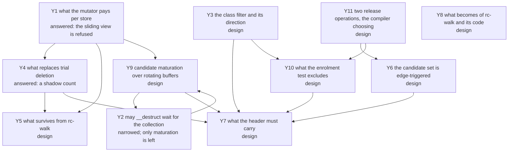

# The question graph

Every open question of `rc-cycle`, as a node with what would answer it and
what it blocks. A node carries a mark for what blocks it, the same legend
the closed graph of [`../walk/questions.md`](../walk/questions.md) used:
**today** — answerable with the code and instruments that exist;
**measure** — a number nobody has taken, on instruments that exist;
**design** — a decision to be made and written;
**read** — a paper or an implementation that has to be read first;
**corpus** — blocked on a measurement of real PHP programs;
**Edmond** — his to rule.

## The graph

## Y1. What the mutator pays per store, and whether the view needs enumerated roots  [answered 2026-08-25: the sliding view is refused]

The load-bearing node, and it closed the day it opened. `rc-walk` was built
on one constraint — the mutator does no per-operation work for the
collector, no write barrier, no snapshot queue, no root publication
([`../rc-walk.md`](../rc-walk.md)) — and the paper was read against it.

**All three of this runtime's constraints are broken by load-bearing parts
of that algorithm.** The write barrier **is** the snapshot mechanism:
`Read-Sliding-View` has no other source of old values, so there is no
barrier-free form of the algorithm to take. Stacks are scanned twice over —
the fourth handshake suspends each thread and marks what its state reaches,
and §4.2 differences the root set between consecutive collections, which is
how root-caused cycles enter the candidate set at all. And the counting
discipline is deferred: no reference count is maintained per store, they are
reconstructed at a collection from logged slot histories, so **no instant
exists at which "the last reference was dropped" is observable** to the
mutator, which is the `__destruct` promise.

**The barrier's own price, for the record**, since it decides nothing here
but bounds any future proposal of the same shape: the fast path is a load, a
test and a not-taken branch on a per-object `LogPointer`, with the slow path
— copy every non-null reference field into a thread-local buffer — taken
"less than once in a hundred" for javac and "less than once in a thousand"
for the rest of the measured set. Beside it sits an unconditional snoop test
on every store, paid whether or not a collection runs, and a fence on a
weakly ordered machine when the dirty word and the slot fall in different
coherence granules.

**One inference the reading yields and the paper does not state:** this
runtime's constraint (a) *removes* the need for the root workaround. Because
a stack reference here is counted like any other, dropping a root is a real
decrement and is seen; the blanket young-object candidacy and the root
differencing exist only to compensate for deferred counting. What that costs
is the candidate set's size — without coalescing it is Bacon–Rajan's plain
set rather than the paper's `o₀`-only one — and node Y9 is what buys that
back.

**What survives separation from the barrier**, and it is the whole of what
`rc-cycle` takes: the acyclic-class filter and its extension to the
traversal; the `CRC` shadow count (Y4); candidate maturation over rotating
buffers (Y9); running mark, scan and collect over all candidates at once,
which is what makes it linear rather than quadratic; and the collect stage's
discipline of marking members released before tearing them down. What dies
with the barrier is the known-live filter — its three signals are the dirty
word, the root set and the snooped set, all forbidden here — and the
live-stack pre-pass that the filter feeds.

## Y2. May a destructor wait for the collection?  [narrowed 2026-08-25; no weakening is needed]

The survey of 2026-08-25 found every concurrent design deferring a
destructor to collection time for cycle-capable types — Nim's YRC keeps
prompt reclamation only for types annotated `.acyclic`, `scheme-rs` defers
for **all** objects, CIRC defers every destructor to an epoch grace period —
and the question was whether PHP's `__destruct` may weaken that far.

**It need not, and the reason separates two things the survey ran
together.** Every one of those designs defers because its **counting** is
deferred or coalesced: where a count is reconstructed at a collection, no
instant exists at which the last reference was dropped. `rc-cycle` keeps
counts real and per-store, so an entity whose count reaches zero dies then
and there, destructor included. What still waits for the collector is
genuine cyclic garbage — and it waits under every design, today's included,
because a cycle member's count never reaches zero by construction.

**What is left of this node** is narrower and is still Edmond's: whether the
`k` collections of maturation (Y9) are an acceptable *additional* delay for
cyclic garbage's destructors, on top of the wait a cycle already has.

## Y3. The class filter, and which way its default runs  [design]

Edmond's own, 2026-08-25: classes that have held cyclic references are
suspect, and only they enter the candidate set.

**The direction has to be the other one.** "Has not been in a cycle so far"
is a fact about a run, and the next request refutes it; a class demoted on
that evidence loses its cycles for ever, because enrolment is edge-triggered
(Y6). So a class is **suspect by default** and leaves the set only by proof.

**The proof is available today, with no compiler.** A class whose declared
slots cannot hold a reference to a kind that can close a ring cannot be a
cycle member, and the crate already carries the slot kinds it needs to
decide that (`ll-model` `src/class.rs`, `SlotKind`). That is finer than
`CANDIDATE_KINDS`, which decides per entity kind, and it needs neither the
compiler ruled out of scope on 2026-08-23 nor a run's history.

**What would answer it:** the rule written against the class descriptor, and
the share of a real corpus's classes it demotes — which the corpus scan
already reports classes for.

## Y4. What replaces trial deletion's mutation of live counts  [answered 2026-08-25: a shadow count]

Bacon–Rajan's trial deletion decrements the object's own count during
`markGray`/`scan` and restores it in `scanBlack`. Beside a running mutator
that is a write race on the word the mutator owns, and beside a **destructor**
it is worse: user code could observe a count in a torn state.

**The answer is the paper's `CRC`, a second count field.** Mark sets
`obj.CRC := RC` on first reach and decrements the shadow thereafter; mark,
scan and collect operate solely on it, "leaving the reference count field
unmodified — thus, they do not need to be restored". The real count is
touched in exactly one place, the collect stage, and only for the non-white
children of a cycle actually reclaimed. The paper carries the shadow for its
own reason — its live set is not fixed during the algorithm — and notes that
a true snapshot would make it unnecessary; here it is load-bearing for a
different reason, and a better one: it is what lets trial deletion run at all
without disturbing the counts prompt destruction depends on.

**What it costs:** a second count field per entity, which the paper packs
with the colour and buffered bits into one 32-bit word plus an overflow hash
table. What that costs *here* is node Y7's business, and it is the same
header the candidate index already crowds.

**The alternative shape, recorded and not chosen:** Nim's YRC computes the
verdict entirely off-heap — Tarjan into a side table, deadness as array work
over the condensation — and touches the heap only at commit, where it
rechecks each member's count against the captured value. An aborted
collection then costs zero heap writes. It is worth reading before Y7 is
written, since a side table and a shadow field are two answers to one
question.

## Y5. What survives from `rc-walk`  [design]

The expensive half of concurrency is built and is not to be re-derived: a
collector that judges concurrently cannot be trusted, so the owner
re-verifies. The handshake, the Phase 4 exact test against current fields,
the deferred-free parking that keeps a slot from being recycled under an
identifier in flight, eager death, and ruling 5 — the collector judges and
the mutator frees.

**What would answer it:** which of these the new candidate source leaves
intact. The exact test is component-sized and cheap; what dies is Phase 1,
the census and the full edge build.

## Y6. The candidate set is edge-triggered, and a refusal is permanent  [design]

Buffering fires on a decrement that does not reach zero, so a refused
enrolment is never re-offered: if that decrement was the last external
release of a garbage cycle, no later collection can find it
([`../../../runtime/exceptions.md`](../../../runtime/exceptions.md)). A derived
population has the opposite property — it is re-derived every epoch, so a
miss costs one epoch. This is the strongest recorded argument against
sourcing candidates from the mutator and it is not a cost but a class of
failure.

**What would answer it:** a rule for what happens when the buffer cannot
grow — the fallback being a full walk, which is the census this design
exists to delete, admitted rarely rather than always.

## Y7. What the header must carry  [design]

Under `rc-trace`'s shape the cycle collector owns **twenty of the flags
word's thirty-two bits**: two for the colour, one for buffered, seventeen
for the candidate index (`ll-model` `src/refcount.rs`). Bit 15 is also the
string's out-of-line bit, safe only because a string never enters the
buffer, and pinned by a test rather than by construction.

**What would answer it:** what `rc-cycle` needs there. A side table (Y4)
needs a tag word rather than an index; a class filter (Y3) needs one bit
stamped at allocation; and the seventeen-bit index is what made unique
ownership `rc-walk`-only.

## Y8. What becomes of `rc-walk`, its registry row and its code  [design]

`rc-walk` is the built default and `rc-cycle` is not a line of code, so
"superseded" cannot mean deleted. The precedent is the capture-count
regime: refused, kept as a record, its documents bannered.

**What would answer it:** when the registry's default moves, and on what
evidence — which is Y1's answer and a measurement, not a preference.

## Y9. Candidate maturation over rotating buffers  [design]

Without coalescing, the candidate set is Bacon–Rajan's plain one — every
entity that saw a decrement to a non-zero value — which is larger than the
paper's, and Y1 records why. The paper buys the size back a second way, and
that way survives the barrier's loss: `k + 1` rotating buffers, an entity
removed from the older buffers when it is re-buffered, and **only candidates
that have stayed candidates across the last `k` collections without dying
are traced**. Measured there at 40–80 % of the candidates that had already
survived Bacon–Rajan's own filters.

It needs two facts this runtime already has: whether the entity was
released, and whether it was re-added. What it costs is `k` collections of
delay before a cyclic component is traced, which is node Y2's remaining
half.

**Edmond proposed the same thing independently the same day** — "suspicions
should accumulate, and this is worth borrowing from other algorithms" — which
is this node, and the paper is the borrowing. His phrasing carries a second
sense worth separating: accumulation as a **trigger**, collecting only once
enough suspects have gathered, which is `rc-trace`'s threshold of ten
thousand candidates and Nim ORC's `rootsThreshold`. That one decides *when* a
collection runs and belongs with the cadence; maturation decides *which*
candidates it traces. Both are wanted and they are not the same lever.

**What would answer it:** the value of `k`, which is a measurement on a real
workload, and the buffers' residence — the same question Y7 asks of the
header.

## Y10. What the enrolment test excludes at the decrement  [design]

Edmond, 2026-08-25: a decrement that does not reach zero enrols the entity
as a suspect **unless** it is a pure object, or an object whose freedom from
cycles is proven. Two gates rather than one, and they sit at the hottest
place in the system, so what each costs to test is the node.

**The acyclic gate is Y3's**, and it is a class property read from a bit the
factory stamps into the header, so the test is already in the word the
release path loads.

**"Pure" carries two readings here and they are different gates.** In this
repository the word is the purity ladder's — a destructor that runs no user
code ([`../pure-destructors.md`](../pure-destructors.md)) — and by that
reading the gate is unsound for this purpose: destructor purity says nothing
about whether the entity can hold a counted reference, and a P0 class with an
object field closes rings like any other. The reading that *is* sound is
"holds no counted slot", which for the entity kinds is what
`CANDIDATE_KINDS` already tests and for a class is Y3's filter one level
finer. A third reading — frozen, unable to acquire a new reference — would be
sound too and has no mechanism here.

**What would answer it:** which reading Edmond means, and then the gate
written against the header word the release path holds. The cost is one mask
and one branch if both gates live in that word, and a second load if either
does not.

## Y11. Two release operations, and the compiler choosing between them  [design]

Edmond, 2026-08-25, and it is the sharpest of the three: the compiler emits
**two** decrements — a plain one, and one that also enrols a suspect — and
uses the plain one wherever it can prove the entity is held. His example is
the horizon's own shape: a reference extracted from a container that is
itself held cannot orphan a cycle by being dropped, so no suspicion arises.

**Why it matters more than the gates of Y10.** Those gates make the test
cheap; this removes the test. The candidate branch disappears entirely at
every site the proof discharges, so the mutator pays only where the compiler
could not prove anything — which is the same bargain the count elisions of
`../gc-horizon.md` struck, applied to enrolment rather than to the count
itself.

**What this repository owes, and what it does not.** The compiler's proof
logic is outside these documents since the scope ruling of 2026-08-23; what
is ours is the **contract**: two entry points on the release path, what each
guarantees, and the obligation the cheap one places on its caller. The
obligation has to be stated as a covering claim rather than as a hint,
because a wrong use of the cheap operation is not a lost optimisation — it is
a cycle no later collection can find (Y6), the enrolment being edge-triggered.
That asymmetry is what makes this node a contract question and not a
performance one.

**What would answer it:** the two signatures, the covering claim the cheap
one asserts, and what a build without the compiler's proof does — presumably
emit the enrolling form everywhere, which is the safe default and is what the
crate does today.

## Prior art, as of 2026-08-25

Read against this design rather than surveyed for its own sake. Nim's
**YRC** is the nearest working thing: concurrent, thread-local candidate
buffers, no stack scan, Tarjan into a side table, commit-time validation,
in devel and in no release. **scheme-rs** implements the paper's concurrent
Σ/Δ form in Rust inside a real runtime and defers every destructor.
**Samsara** is the small version of the side-table idea and is an abandoned
prototype. **bacon_rajan_cc** is the synchronous shape with deterministic
release, single-threaded by construction. **CIRC** does not collect cycles
at all — its users break them by hand — and is deferred reference counting
over epoch-based reclamation. The older reading, LXR, arborescent GC and
Kim et al.'s partial tracing, stands in
[`../gc-research.md`](../gc-research.md) and in the closed graph's F1 to F3.
