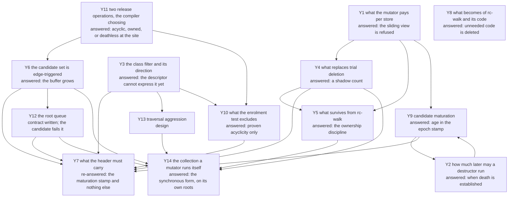

# The question graph

Every open question of `rc-cycle`, as a node with what would answer it and
what it blocks. A node carries a mark for what blocks it, in the legend the
closed question graph of `rc-walk` used before it was deleted with that
collector on 2026-08-26:
**design** — a decision to be made and written, which is the only mark this
graph has yet used;
**today** — answerable with the code and instruments that exist;
**measure** — a number nobody has taken, on instruments that exist;
**read** — a paper or an implementation that has to be read first;
**corpus** — blocked on a measurement of real PHP programs;
**Edmond** — his to rule.

## The graph

## Y1. What the mutator pays per store, and whether the view needs enumerated roots  [answered 2026-08-25: the sliding view is refused]

The load-bearing node, and it closed the day it opened. Two papers were
read, not one: the sliding-view machinery — the barrier, the four
handshakes, the snoop, the slow-path frequencies — is Levanoni and
Petrank's (TOPLAS 2006), and the cycle collector over it — the `CRC`, the
mark/scan/collect passes, the `k + 1` maturation buffers, the root
differencing (its §4.2) — is Paz, Bacon, Kolodner, Petrank and Rajan's
(TOPLAS 2007). "The paper" below names the one whose mechanism is at hand.

**The refusal's ground, as re-argued after the Critic round of 2026-08-25:
the log is a per-store soundness cost no proof can delete, where this
design's per-release cost is deletable precision.** The original ground —
`rc-walk`'s rule that the mutator does no per-operation work for the
collector (its document went with it on 2026-08-26; `archive/pre-rc-cycle`) —
died the day it was used:
`rc-cycle` itself puts the enrolling decrement, the already-enrolled
test-and-set and the queue write on the mutator (Y9, Y11, Y12), so "no
per-operation work" refuses this design too and refuses nothing. What
actually separates the two costs is elidability. A skipped enrolment is a
deferral by Y11's covering claim, so the compiler deletes the test at every
proven site and a missed deletion costs precision; a skipped log entry is a
hole in the view and a wrong collection, so no site can be exempted — and
beside the log sits an unconditional snoop test on every store and a fence
on a weakly ordered machine when the dirty word and the slot fall in
different coherence granules, paid whether or not a collection runs.

**The counts have customers the barrier cannot serve, and that refuses the
coalesced form on its own.** Levanoni and Petrank's bargain is that the
barrier *replaces* eager retain/release, with counts reconstructed at a
collection from logged slot histories. Here the live count is read
synchronously by machinery that has nothing to do with collection: the
copy-on-write separation test (`dev/DECISIONS.md`, 2026-08-22), the
`RC − IN` root identity and the Phase 4 exact test, and the prompt
count-zero death the seventh entry chose. A count that exists only at
collection time serves none of them, so the count-replacing configuration
is out however its per-store price compares — and with it the fourth
handshake's stack scan and the §4.2 root differencing, which exist only to
compensate for deferred counting. A hybrid — the coalescing log kept, the
exact counts kept beside it — escapes that objection and the stack-scan one,
and is refused by the previous paragraph alone: it pays the log's
undeletable per-store cost on top of the counts it was meant to spare.

**The barrier's own price, for the record**, since it bounds any future
proposal of the same shape: the fast path is a load, a test and a not-taken
branch on a per-object `LogPointer`, with the slow path — copy every
non-null reference field into a thread-local buffer — taken "less than once
in a hundred" for javac and "less than once in a thousand" for the rest of
the measured set.

**One inference the reading yields and the papers do not state:** exact
counted stack references *remove* the need for the root workaround. Because
a stack reference here is counted like any other, dropping a root is a real
decrement and is seen; the blanket young-object candidacy and the root
differencing exist only to compensate for deferred counting. What that
costs is the candidate set's size — without coalescing it is Bacon–Rajan's
plain set rather than the paper's `o₀`-only one. Y9's maturation bounds the
*tracing* of that set; the enrolment traffic and the buffer footprint
remain bought, scaled by what the program touched, and no measurement of
either exists yet — the paper's 40–80 % figure was taken downstream of
coalescing and does not transfer.

**What survives separation from the barrier** — six pieces, and the sixth
is `rc-walk`'s, not the papers': the acyclic-class filter and its extension
to the traversal; the `CRC` shadow count (Y4); candidate maturation (Y9,
whose mechanism has since moved to the epoch stamp); running mark, scan and
collect over all candidates at once, which is what makes it linear rather
than quadratic; the collect stage's discipline of marking members released
before tearing them down; and the owner-thread exact test of Y5, which is
the load-bearing one — the papers' own safety mechanism against freeing an
entity that gained a reference mid-collection is the snooped set, and it
dies with the barrier, so the exact test is what stands between a white
verdict and a mutator that has just loaded a member into a counted local.
That test is also why the collector-side free was withdrawn on 2026-08-25:
its warrant is the owning thread's hold, which a collector on another thread
cannot have (Y5). What else dies with the barrier: the
known-live filter — its three signals are the dirty word, the root set and
the snooped set, all absent here — and the live-stack pre-pass it feeds.

## Y2. How much later may a destructor run?  [answered 2026-08-25: when death is established]

**Ruled by Edmond: the destructor runs as soon as the death is established,
and the call is decoupled from the memory.** A count that reaches zero
destructs on the spot, as today; a cyclic component destructs at the
collection that confirms it dead.

**The clause about memory that stood here was wrong for the population the
collector reclaims, and is corrected 2026-08-25.** It read "neither call frees
the block — the arena holds it until its reset — so memory never hurries the
call and never delays it", which is true of a request-arena object and false of
a `GcHeap` one, and only `GcHeap` entities are collected. A freed `GcHeap` slot
returns to its block's free list and the next allocation of that size class
takes it ([`../heap-design.md`](../heap-design.md)), and a block that empties
goes back to the global pool. What the ruling actually decouples is the
destructor **call** from the reclamation: the call happens when death is
established, and whether the memory returns then, later or at a reset is a
separate question with a different answer per category.

**The permission it narrows** stands as ruled the same day
(`../../../dev/DECISIONS.md`, sixth entry): PHP promises no instant, so
deferred and coalesced counting are not disqualified by destructor timing,
and the refusal in Y1 stands on its other two legs.

**The arena needs no collection at all.** The reset's first step is already
a trace-and-`__destruct` fixpoint over every dying object
([`../../memory/arena-reset.md`](../../memory/arena-reset.md)), so cyclic
garbage that no collection confirmed before the request ends gets its
destructor from that pass. The final collection at request end that the
open bound seemed to demand has nothing to do; the reset is the backstop.

**What the earlier open list comes to.** Before the request ends — yes, by
the backstop. Before the arena reset — yes, inside its destructor pass.
Observability — the ruling adds no observable state: a count-zero death
destructs immediately as before, and an unreachable cycle looks live until
a collection finds it under any reference-counted design, today included.
The `WeakMap` eager cleanup of `../weak-references.md` keys on count-zero
deaths and is untouched. The order of two collection-time destructors was
not ruled, and no document promises one.

## Y3. The class filter, and which way its default runs  [answered 2026-08-25: demotion by proof; the descriptor cannot express it yet, and the evaluable form demotes nothing]

Edmond's own, 2026-08-25: classes that have held cyclic references are
suspect, and only they enter the candidate set.

**The direction has to be the other one.** "Has not been in a cycle so far"
is a fact about a run, and the next request refutes it; a class demoted on
that evidence loses its cycles for ever, because enrolment is edge-triggered
(Y6). So a class is **suspect by default** and leaves the set only by proof.

**The proof was claimed available today and is not, which the reading of
2026-08-25 settled.** The claim was that a class whose declared slots cannot
hold a reference to a ring-closing kind cannot be a cycle member, and that
`ll-model` `src/class.rs` already carries the slot kinds to decide it. It does
not. `SlotKind` is the machine representation, and its `Pointer` variant covers
"a declared class type, `string` or `array`" in one code (`src/class.rs:73-78`);
`PropSlot` carries name, offset, kind, declaration index and init bit, and no
target type (`:135-145`); `ClassBuilder::prop_pointer` takes a name and nothing
else. A string cannot close a ring and an array can, so the predicate the rule
needs has no input. The gap is the design's and not the crate's: this
repository's own slot table collapses the three the same way
([`../../classes.md`](../../classes.md), the slot-kinds table), and its
enumeration of `prop_layout` lists offset, slot kind, hook flags, declaration
index and init bit — no declared type — even though `../../values.md` says the
type lives there.

**What is evaluable today demotes nothing, and that is measured.** The only
predicate the descriptor supports is all-or-nothing: the class holds no counted
reference at all, `ptr_run_count == 0 && box_run_count == 0`, and even that
needs two exclusions, because a `CLASS_TEMPLATE` class has empty runs with its
counted children behind the shape pointer, and a `CLASS_OUTSIDE_CELLS` class
owns counted cells outside its body. On the corpus, booted Laravel plus one
request (2026-08-25, `/home/edmond/laravel-spawn-example` through
`dev/tools/heap-bootstrap-laravel.php`, 381 objects in 114 classes by the
recorded instrument): **no class with a live instance has all-scalar declared
properties — 0 of 114 classes and 0 of 381 objects.** Eight classes have no
declared property at all, 188 instances, and 179 of those are `Closure` and 2
are `WeakMap`, whose state lives outside the property table and which are
therefore the case an empty table proves nothing about; excluding `Closure`
leaves 7 classes and 9 instances. Statically over the vendor classmap the
all-scalar share is 94 of 5680 classes, two thirds of it test tooling, and the
application's own code contributes none of 49.

**So the filter is worth having only in the form the ruling names**, and that
form needs the class descriptor to gain a declared target per pointer slot: at
minimum a three-way tag separating class, string and array, and for the class
case a pointer or link-time id so the target's own slots can be examined. That
is owed by `dev/PLAN.md` S8.4, and it is a change to `classes.md` before it is
a change to `src/class.rs`.

**Edmond confirmed the direction on the map and added the other half:** the
runtime proves cyclicity, not just the compiler acyclicity. A collection
that finds a class's instances in a confirmed cycle may stamp the class
with a flag. The flag runs one way — it strengthens suspicion and never
demotes a class out of the set — and what it feeds is not enrolment but the
traversal's aggression, node Y13.

**What remains:** the declared-target field above, written into
[`../../classes.md`](../../classes.md) before it reaches `src/class.rs`. Two
smaller corrections came with the measurement. The recorded corpus instrument
cannot report this share, since `dev/tools/heap-composition.php` classifies a
slot by the runtime type of the value in it and reports only a class count and
a top five by instance, so the figures above were taken with a separate script
and cross-checked against the instrument on the walk, where both give 381
objects in 114 classes. And Y10's sentence that the gate is "a class property
read from a bit the factory stamps into the header" described nothing that
existed when this was written: no acyclic flag on the class, and none in the
header word either until the re-lay of 2026-08-26 gave the gate bit 8
([classes.md](../../classes.md), "Flags layout"). The class half still stands,
and the declared-target field the stamp would be computed from is this node's
own open question.

## Y4. What replaces trial deletion's mutation of live counts  [answered 2026-08-25: a shadow count; residence re-decided 2026-08-26]

> **Amended 2026-08-26.** The shadow count stands and its reason is unchanged.
> Its **residence** does not: the two passages below that put an eleven-bit
> index in the header, and that call the lookup an indexed load, describe a
> shape Y7 replaced with a hash displacement on 2026-08-25 and that
> 2026-08-26 replaced in turn. The row is now found by arithmetic from the
> entity's address — no index, no hash, no field in the header — and the row
> carries no captured count, because the commit stage judges again rather than
> comparing. See [`../rc-cycle.md`](../rc-cycle.md), "Where the shadow count
> lives", and Y7 below.

Bacon–Rajan's trial deletion decrements the object's own count during
`markGray`/`scan` and restores it in `scanBlack`. Beside a running mutator
that is a write race on the word the mutator owns, and beside a **destructor**
it is worse: user code could observe a count in a torn state.

**The answer is the paper's `CRC`, a second count field.** Mark sets
`obj.CRC := RC` on first reach and decrements the shadow thereafter; mark,
scan and collect operate solely on it, "leaving the reference count field
unmodified — thus, they do not need to be restored". The real count is
touched in exactly one place, the collect stage, and only for the non-white
children of a cycle actually reclaimed. The paper carries the shadow for its
own reason — its live set is not fixed during the algorithm — and notes that
a true snapshot would make it unnecessary; here it is load-bearing for a
different reason, and a better one: it is what lets trial deletion run at all
without disturbing the counts prompt destruction depends on.

**What it costs:** a second count field per entity, which the paper packs
with the colour and buffered bits into one 32-bit word plus an overflow hash
table.

**Where that field lives was settled by Y7 on 2026-08-25, and it is not the
header.** A full `u32` cannot share sixteen bits with the epoch, the age and
the stamp mark, so the count moved into the collector's side arrays and the
header carries an eleven-bit index into them. The shadow therefore keeps its
role here — mark and scan never disturb the real count — and gains a stronger
one: they write nothing into the heap at all, so an aborted collection costs
zero heap writes.

**Which makes the alternative shape the chosen one after all.** Nim's YRC
computes the verdict entirely off-heap — Tarjan into a side table, deadness as
array work over the condensation — and touches the heap only at commit, where
it rechecks each member's count against the captured value. This design takes
that residence with one difference: the pointer-to-index map is the header's
own field rather than a hash, so a lookup is an indexed load.

## Y5. What survives from `rc-walk`  [answered 2026-08-25: the ownership discipline; the handshake struck 2026-08-27]

**The census dies, the ownership discipline survives.** Ruled by Edmond on
the map: the full-heap walk leaves the design entirely — the collection
traces from the candidate set alone, and the maturation of Y9 with the
enrolment gates of Y10 and Y11 bound even that. Phase 1's census and full
edge build have no successor.

**Only the mutator frees, and that is `rc-walk`'s ruling 5 unnarrowed.** The
collector judges; every free and every destructor happens on the owning
thread. The machinery that survives is what makes the judgement usable: the
Phase 4 exact test against current fields, the deferred-free parking that keeps
a slot from being recycled under an identifier in flight, and eager death.

**The handshake was on that list until 2026-08-27 and is struck**
([`../../../dev/DECISIONS.md`](../../../dev/DECISIONS.md), "the trace token
covers the trace alone, and the accelerator hands off by buffer swap"). An
acknowledged rendezvous is what a thread waiting on the trace token would
deadlock against — the collection parked on an acknowledgement that rides the
waiter's own checkpoint — so the delivery it performed is done by buffer swap
instead: the token holder swaps a thread's live queue buffer for a spare, traces
the detached one, and at the token's release posts it to a per-thread inbox of
capacity one that nobody waits on. The rest of the list is untouched, and the
in-line form never used the handshake at all.

**The two-sided form was permitted for one day and withdrawn.** The ninth
entry of 2026-08-25 let the collector free an entity whose destructor is
proven pure or absent, an impure one still going to the owner. Two holes
opened under it the same day and neither could be closed, so Edmond withdrew
the permission (twenty-third entry) in the words "if you cannot guarantee it,
cancel it".

*The first hole is the exact test's warrant.* It is sound because the owning
thread holds the entity, so nothing races the read of its current fields. A
collector on another thread has no such warrant, and cannot get one: reading a
component's counts at a single instant needs the snapshot Y1 refused.

*The second is the weak cell.* Every design here nulls every weak cell naming a confirmed member **before**
any user code runs — `rc-walk` bound it first and
[`../rc-cycle.md`](../rc-cycle.md), "Cycle teardown", step 3, carries it now —
because a
weak load is the one channel that can hand a destructor a pointer the counted
world cannot account for. The mechanism that discharges it is a **per-thread**
weak table: the dying entity finds its subscribers through the owning thread's
row. A collector has no access to another thread's row.

**What the withdrawal costs is nothing, in this repository or in the crate.**
`ll-model` never had a collector-side free to remove: as of 2026-08-25
`collector.rs` wrote one thing into an entity, the epoch stamp, and its terminal
act per confirmed component was to post it; every teardown path lived behind
`drain_confirmed`, reached only from a mutator's checkpoint. That module was
deleted on 2026-08-26 and is on `archive/pre-rc-cycle`. The withdrawal restores the contract
the code already keeps. What it does change is where the design's centre of
gravity sits — the in-line collection of Y14, where judge and owner are one
thread, is the only shape in which a collection frees anything, so it stops
being an emergency measure and becomes the ordinary form.

## Y6. The candidate set is edge-triggered, and a refusal is permanent  [answered 2026-08-25: the buffer grows]

Buffering fires on a decrement that does not reach zero, so a refused
enrolment is never re-offered: if that decrement was the last external
release of a garbage cycle, no later collection can find it — the cost
[`../../../runtime/exceptions.md`](../../../runtime/exceptions.md) priced while
the buffer was refusable, and which it now keeps as a record, Edmond having
ruled the loss out on 2026-08-28. A derived
population has the opposite property — it is re-derived every epoch, so a
miss costs one epoch. This is the strongest recorded argument against
sourcing candidates from the mutator and it is not a cost but a class of
failure.

**The overflow rule is ruled: enrolment never drops a root.** Dropping the
candidate on a full buffer was proposed on the map and refused by Edmond —
a dropped enrolment is exactly the permanent miss this node records — and
the full-walk fallback goes with it. The buffer grows instead. Growth is
therefore a property the queue must supply natively, and which queue supplies
it is node Y12's, where the named SPSC candidate was read first-hand on
2026-08-25 and rejected: it drops the root when its growth allocation fails,
which is this node's permanent miss.

## Y7. What the header must carry  [re-answered 2026-08-26: the maturation stamp and nothing else]

> **Amended 2026-08-26, and the amendment is the answer in force.** The
> collector's way back to a row leaves the header entirely: the row is computed
> from the address, so the six bits of hash displacement below are not needed
> and bits 24–31 stay free, the collector reserve taking 20–23. What the
> header keeps from the collector is the
> maturation stamp — epoch and age, four bits — because it lives *between*
> collections, where no row exists.
>
> With both old collectors deleted the whole word is re-laid: category 0–1,
> entity kind **2–5** (four bits, so the string's out-of-line layout becomes a
> kind code and `STRING_OUT_OF_LINE` disappears), COW 6, arena reset mark 7,
> acyclic gate 8, ownership mark 9, enrolled 10, escapee 11, weak 12, destructor
> pending 13, destructor ran 14, free 15, epoch 16–17, age 18–19, collector
> reserve 20–23, byte 3 free. The kinds are renumbered so that "closes a
> cycle", "carries a class at +8" and "is a string" are mask tests.
>
> **The code assignment named here was superseded the same day.** It read
> `Object 0, Lazy 1, Array 2, Reference 3, String 4, StringDynamic 5, Box 6,
> WeakRef 7` with a gate of `flags & 0x733 == 0`, which held codes 0–3 for
> ring-closing kinds and assigned all four of them, so a fifth such kind would
> have taken code 8 and been refused by the mask forever — this question's own
> failure. In force: `Object 0, Lazy 1, Array 2, Reference 3, String 8,
> StringDynamic 9, Box 10, WeakRef 11`, codes 4–7 held free for ring-closing
> kinds and 12–15 free for the rest, gate `flags & 0x723 == 0`
> ([classes.md](../../classes.md), "Flags layout").
>
> **The wrap rule below is superseded too, and this one has a replacement
> rather than a removal.** The trace writes nothing — the stamp is written by a
> collection's commit on the owning thread and only read by the trace, which is
> what keeps an aborted collection free of heap writes — so the clearing "at
> the moment it first touches the entity" has no writer. The clause was useless
> where it stood in any case: eager clearing fires only on contact, and the
> stamp that wraps is exactly the one no trace has touched for four epochs.
> What bounds the damage is that **acquittal never clears the enrolment bit**:
> a proven-live root parks in a suspects buffer with its bit set and is
> re-offered at epoch turnover (Y12, clause 8), so a wrapped stamp, ring-mates
> matured apart and a wrong dirty proposal each become bounded floating garbage
> rather than a permanent miss
> ([`../../../dev/DECISIONS.md`](../../../dev/DECISIONS.md), "four rulings from
> the Critic round over `ll-model`'s plan, and what they change here").
>
> The text below is kept as the record of how the displacement was reasoned
> to, and of the two claims — `rc-trace`'s candidate index and `rc-walk`'s
> condemned byte — whose removal freed the word.

*(Record; the accounting below reasons about positions the re-lay of
2026-08-26 moved — see the note above.)* Under `rc-trace`'s shape the cycle
collector owns **twenty of the flags word's thirty-two bits**: two for the colour, one for buffered, seventeen
for the candidate index (`ll-model` `src/refcount.rs`). Bit 15 is also the
string's out-of-line bit, safe only because a string never enters the
buffer, and pinned by a test rather than by construction.

**The constraint, ruled by Edmond on the map: the header does not grow** —
no second word, no extra byte. Two directions came with the ruling. The
collection tag is first tried in the **epoch byte** `rc-walk` carried at
offset 6, written by single-byte atomic stores rather than through the flags
word — the layout the re-lay of 2026-08-26 kept, epoch at bits 16–17
([classes.md](../../classes.md), "Flags layout"). And the seventeen-bit candidate index is not needed at all: a
buffered entity is found through its entry in the root queue (Y12), which
frees the bits that made unique ownership `rc-walk`-only.

**The layout, written 2026-08-25, and what unlocked it was Edmond's two-bit
epoch.** The collector's field is header **bytes 6 and 7**, flags bits 16-31,
written as one aligned two-byte atomic store, which keeps the one-store
discipline the single-byte epoch stamp lives by today. Sixteen bits, split
four ways:

| bits | field | width |
|---|---|---|
| 16-17 | epoch | 2 |
| 18-19 | maturation age (Y9) | 2 |
| 20-25 | hash displacement | 6 |
| 26-31 | free | 6 |

Two bits of age is the exact room YRC's promote bound needs, that bound being
three. Bit 15 stays the string's out-of-line flag and is **not** taken: it is
the top bit of byte 5, so claiming it would widen the collector's store past
the aligned two-byte unit, and a string never enters the candidate set anyway.

**And that is where `CRC` goes: out of the heap.** The shadow count Y4 orders
is a full `u32` and sixteen bits cannot hold it beside the maturation fields,
so the count sits in the collector's side table at full width and the header
carries only the way back to it. Mark and scan then never write a count into
the heap, so Y4's reason for the shadow — never leaving a count torn where a
destructor could observe it — is met by construction rather than managed.

**The way back is a hash displacement, not an index, and that is Edmond's,
2026-08-25.** An index bounds the collection at whatever the field addresses;
a displacement does not, and the difference is where the entity's *address*
enters. The side table is open-addressed and keyed by the entity pointer. Its
home bucket is `hash(ptr) mod size`, a multiply and a shift with no memory
access, computed from a pointer the tracer already holds. The header's six
bits carry how far the entry sits from that home bucket, so a lookup is
`table[h + d]` — **one probe, always, no probe loop**. The row's key confirms
the landing, and the row holds the captured count and the working count.

**Six bits is not a compromise, it is surplus.** A displacement is small by
nature: at a load factor of 0.7 with a sound hash, probe distances run in
single digits, and Robin Hood addressing bounds them tightly. Sixty-three is
already two orders of magnitude of slack, and a displacement that would exceed
it is the signal to grow the table rather than an error. What the field
measures is the quality of the hash, not the size of the heap, which is why
the slice bound of the index form disappears rather than widening.

**The tag left the header with the index, and the key does its work better.**
The collection tag existed to answer "are these bits mine?". The row's stored
pointer answers it more completely, catching the case a tag cannot — bits that
are formally this collection's but stale because the table was rehashed. A
stale displacement lands on a wrong or empty row, the key mismatches, and the
lookup falls back to an honest probe from the home bucket. The stamp-against-
claim mark leaves with the tag, having existed only to say which of two
readings the shared bits carried; with the tag gone the fields no longer share.
What that costs is one wasted row read at an entity's first touch in a
collection, on a line the probe would have brought in anyway.

**What cannot leave is the maturation stamp**, and the boundary is worth
stating because it is not obvious. The epoch and age live **between**
collections, and the side table is one collection's working set, drawn from the
reserve and discarded at its end. The age is read at the start of a later
collection, before any table exists for that entity, and it is what decides not
to descend. Moving it off-heap would need a structure that outlives every
collection and covers every mature entity, which is a resident per-entity cost
— the thing the whole layout exists to avoid.

**The two-bit epoch wraps, and one rule covers it.** *(Record; superseded
2026-08-26 — see the note at the head of this node.)* Four values means a
maturation stamp four epochs old reads as current. The collector clears a stamp
whose epoch is not the current one at the moment it first touches the entity,
which it is doing anyway in order to trace it, so a stale stamp is retired on
contact and never survives to wrap.

**One cost the displacement brings that the index did not:** growing the table
moves every home bucket, so every stored displacement is invalidated at once.
The repair is a pass over the table rewriting each member's six bits, which is
possible because the table holds the pointers, and it is O(n) per doubling —
amortised, nothing. And one precondition the design already meets: the address
is the key, so entities must not move. The GC heap is non-moving, and arena
promotion is a boundary event rather than heap compaction
([`../../memory/arena-reset.md`](../../memory/arena-reset.md)).

**What this releases.** `rc-trace`'s seventeen-bit candidate index at bits
15-31 goes, as the eleventh ruling has it, and `rc-walk`'s condemned byte at
24-31 was already retired. Between them they are exactly the two claims that
forced strategy selection to be a build-time feature, since "the two
collectors claim the same top half of the header flags word" (`ll-model`
`Cargo.toml`). With one collector claiming bytes 6-7 and nothing else, that
exclusivity has no subject left.

> **Superseded on 2026-08-26 by the re-lay of the whole word**
> ([`../../../dev/DECISIONS.md`](../../../dev/DECISIONS.md), "the flags word is
> re-laid for one collector"; the table is
> [`../../classes.md`](../../classes.md), "Flags layout"). The bit-by-bit
> accounting below reasoned about the old positions, which is why it reads as
> a search for room: the kind field is now four bits at 2-5, the acyclic gate
> is **bit 8** rather than 4, the enrolled bit is **bit 10** rather than 6, and
> the ownership mark of Y11 has bit 9. The reasoning is kept because what it
> settles is not the positions but which bits have customers at all, and that
> answer survived the move.

**The mutator's own byte frees three bits, and they were the missing funding.**
Edmond, reading the layout on 2026-08-25: the colour is not needed any more.
It is not, and the reason generalises. The **cycle colour, bits 4-5**, is
Bacon–Rajan's black/grey/white, and `rc-trace` keeps it in the header because
its trial deletion runs there; once mark and scan compute in the side arrays,
the colour is per-collection state exactly like the working count, and it moves
with it. Beside it, **bit 3** is already dead: the GC-state field was declared
two bits wide for the CAS handoff of
[`../heap-design.md`](../heap-design.md), a device for a concurrent *marking*
collector, and the only value any code writes is `ARENA_RESET_MARK` at bit 2,
which is the arena reset's and stays. Bit 2 keeps its customer; bits 3, 4 and 5
have none.

Those three sit in **byte 4, the mutator's**, which is precisely where a test
on the release path wants to be, and it is what the two nodes below were short
of.

The **already-enrolled** bit of Y9 is bit 6, the buffered bit, which
`rc-trace`'s candidate machinery vacates when its buffer is replaced by the
queue: same position, same meaning, same writer. Y9 asks for it by atomic
test-and-set, and today the crate sets it with a plain whole-word
read-modify-write on the mutator's own half; whether the test-and-set has to
be atomic is a multi-mutator question, not a layout one. `rc-walk.md` was the
only document recording it as open and went on 2026-08-26, so it has no node
today; it is carried here.

The **acyclic gate** of Y10 takes bit 4. Y10 asks for "a class property read
from a bit the factory stamps into the header, so the test is already in the
word the release path loads", and until the colour was freed there was nowhere
to put it: bits 0 to 2 have live customers, bit 15 is the string's, and 16 to
31 are the collector's. The two fallbacks it would otherwise have needed — a
dereference into the class descriptor's cache line on the release path, or
staying at `CANDIDATE_KINDS`' entity-kind granularity and forfeiting exactly
what Y3 is trying to win — are both off the table. The factory stamps the bit
once, from the class's own answer, which is why it waits on Y3's
declared-target field rather than on this layout.

The **ownership mark** of the fourteenth ruling takes bit 5. That ruling made a
proven-owned entity skip the candidate set entirely and left open "how the
release path knows the entity is owned — the compiler's plain form at every
site it proves, or an ownership mark in the header once Y7's freed bits are
laid out". These are those bits, and the mark is now affordable: one bit in the
word the release path already holds, tested beside the acyclic gate.

**Bit 3 stays free and is recorded as free**, with no customer invented for it.

## Y8. What becomes of `rc-walk`, its registry row and its code  [answered 2026-08-25; the two clauses below reversed 2026-08-26, and executed]

**Ruled by Edmond on the map: the code does not wait under a banner —
everything `rc-cycle` makes unneeded is deleted from `ll-model`.** That
reverses this node's opening premise, which reasoned from the
capture-count precedent (refused, kept as a record) to "superseded cannot
mean deleted".

> **The two clauses that used to follow were reversed on 2026-08-26 and
> executed the same day**
> ([`../../../dev/DECISIONS.md`](../../../dev/DECISIONS.md), "the twelfth
> ruling's document half is reversed for all three bodies of text"). They read
> that the precedent holds for documents, which stay the record, and that the
> deletion follows the build, a piece going when `rc-cycle`'s replacement for
> it lands. Neither survived: `rc-walk`'s documents, `rc-trace`'s and the
> horizon's left the tree with the code, and all of it went first and at once
> rather than a piece at a time, on Edmond's ground that a superseded mechanism
> left in the tree is read as the design in force. The cost is what this node
> used to forbid — `ll-model` carries no cycle collector at all from the
> deletion until `rc-cycle` is built — and the old state is the branch
> `archive/pre-rc-cycle`.

**What is still evidence-gated:** when the registry's default moves — Y1's
answer and a measurement, not a preference.

## Y9. Candidate maturation  [answered 2026-08-25: age in the epoch stamp; the counter's residence ruled 2026-08-27]

**Maturation is kept, and its residence is ruled: an age carried in the
header's stamp, not a carousel of `k + 1` rotating buffers.** The rotating
form was Levanoni and Petrank's — only candidates that stayed candidates
across the last `k` collections are traced, measured there at 40–80 % of
the candidates their other filters had already passed — and Edmond chose
YRC's representation of the same idea on the map: a collection's commit
stamps each proven-live component with the current epoch and an age, the
minimum over the component's members plus one; a later trace reads the age
back, and a member whose stamp is current and whose age has reached the
promote bound has its edge pruned for the rest of the epoch instead of
being traced again.

**What "pruned" means was read exactly on 2026-08-25, and it is stronger than
this node first said.** It is not that the member is traced more cheaply the
second time: the traversal **does not descend into it at all**. YRC's
`claimCell` has a third outcome beside "my index" and "another collection's
cell" — it returns −2 for a cell whose stamp is the current epoch and whose age
has reached `YrcPromoteAge`, with the instruction "treat as an opaque live
external, don't descend". That is the only mechanism in this design that bounds
the closure, and it is load-bearing: measured on the corpus of 2026-08-25, the
subgraph reachable from a *median* candidate root is the entire object
population, 381 of 381, because a service container connects everything to
everything. Without the prune a single root costs a whole-heap traversal, which
is the cost `rc-cycle` exists to remove. With it, the mature live core stops
being descended after the first collection of an epoch, and what remains to
trace is what changed and its immature neighbours.

**The first collection of an epoch is therefore the expensive one**, and
nothing in the design bounds it. Whether that matters is a measurement nobody
has taken: how often an epoch turns over against how long a process runs. Ageing whole components rather than cells is what keeps
a component's members from maturing apart (`yrc.nim`, read 2026-08-25:
promote age 3, epoch advanced every 64 collections).

**Three more of YRC's economies come with it, taken on Edmond's ruling
("бери эти алгоритмы на вооружение"):** an *already-enrolled* bit taken by
atomic test-and-set, so an entity sits in exactly one buffer and a repeat
decrement re-enrols nothing; a start threshold deciding when a collection
runs at all — YRC's is adaptive, starting at 128 roots and moving by
outcome, which is the *trigger* lever `rc-trace`'s fixed ten thousand and
Nim ORC's `rootsThreshold` also pull, distinct from maturation's *which*
lever; and a separate suspects buffer for stamped survivors, which on
YRC's generational bench removed the 56 % of captures that were the same
survivors re-registering every collection.

**The epoch counter's residence was ruled 2026-08-27** with the suspects
buffer that reads it ([`../../../dev/DECISIONS.md`](../../../dev/DECISIONS.md),
"the suspects buffer is the owner's, and the re-offer is a splice at the
epoch's turn"): the counter is process-global and full-width, a collection's
commit advances it once every N collections, and the epoch field of the
header's four-bit maturation stamp carries its low two bits. A thread compares
it against a full-width local
mirror, so a stamp that wraps hides no turnover from the re-offer.

**What would answer the rest:** the promote bound `k` — a measurement on a
real workload, YRC's 3 being the only known value; the advance period `N`,
where YRC's 64 is likewise the only known value and the two dials are separate;
and how concurrent commits count `N` on one process-global word, several owner
threads being able to commit at the same instant. The stamp's residence in the
header is settled — epoch 16-17, age 18-19, under Y7's re-lay of 2026-08-26. The
381-of-381 figure also owes its instrument: it was taken on 2026-08-25 against
the booted Laravel corpus, the filed corpus tool
[`../../../dev/tools/heap-composition.php`](../../../dev/tools/heap-composition.php)
produces composition and not reachability, and the edge-walking instrument that
could reproduce it went with `rc-walk`. Until one exists the figure stands as
recorded and not as reproducible.

## Y10. What the enrolment test excludes at the decrement  [answered 2026-08-25: proven acyclicity only]

**Ruled by Edmond on the map: the gate is one — proven acyclicity. Purity
has no bearing on enrolment.** His first phrasing named "a pure object" as
a second exclusion; shown that a class with a pure destructor still holds
references and closes rings like any other, he withdrew it: the exclusion
he meant was always the provably acyclic object. The gate is therefore
Y3's — a class property read from a bit the factory stamps into the
header, so the test is already in the word the release path loads — and
`CANDIDATE_KINDS` is the same gate at entity-kind granularity.

**Where purity holds is not here, and the customer this node named for it was
the wrong one.** It said Y5 — the collector running only a destructor proven
pure — and that permission was withdrawn on 2026-08-25. The purity ladder of
[`../pure-destructors.md`](../pure-destructors.md) does not lapse with it: its
own scope line says it changes nothing in the collector's protocol and only
says which steps of the **drain** a component may skip, and since the drain is
now entirely the owning thread's, every skip it licenses is a saving on the
mutator's side.

**What remains:** nothing at this node; the gate's cost is the one bit in
the loaded word, and the compiler's removal of the whole test is Y11 — as
is the object-level exclusion of 2026-08-25, a proven-owned entity never
entering the roots at all (fourteenth `dev/DECISIONS.md` entry).

**The bit has an address: bit 8**, freed when the cycle colour left the header
for the collector's side arrays (Y7). It was bit 4 when this was written on
2026-08-25 and moved with the re-lay of the whole word on 2026-08-26
([classes.md](../../classes.md), "Flags layout"). Until then this
node spent a bit the layout did not have, every position in the mutator's half
having a live customer. The factory stamps it from the class's own answer, so
what it still waits on is Y3's declared-target field rather than the layout.

## Y11. Two release operations, and the compiler choosing between them  [answered 2026-08-25: acyclic, or deathless at the site]

Edmond, 2026-08-25, and it is the sharpest of the three: the compiler emits
**two** decrements — a plain one, and one that also enrols a suspect — and
uses the plain one wherever it can prove the entity is held. His example is
the horizon's own shape: a reference extracted from a container that is
itself held cannot orphan a cycle by being dropped, so no suspicion arises.

**Why it matters more than the gates of Y10.** Those gates make the test
cheap; this removes the test. The candidate branch disappears entirely at
every site the proof discharges, so the mutator pays only where the compiler
could not prove anything — the same bargain the horizon's count elisions
struck, applied to enrolment rather than to the count itself.

**What this repository owes, and what it does not.** The compiler's proof
logic is outside these documents since the scope ruling of 2026-08-23; what
is ours is the **contract**: two entry points on the release path, what each
guarantees, and the obligation the cheap one places on its caller. The
obligation has to be stated as a covering claim rather than as a hint,
because a wrong use of the cheap operation is not a lost optimisation — it is
a cycle no later collection can find (Y6), the enrolment being edge-triggered.
That asymmetry is what makes this node a contract question and not a
performance one.

**The covering claim is settled, 2026-08-25.** The plain decrement is legal
at exactly two kinds of site. Either the entity is provably acyclic — Y3's
proof hoisted to compile time, so the gate the enrolling form would test is
known false — or the entity provably cannot die at this site: it is held by
a reference whose own release comes later, and that later release will be
the enrolling form, so the enrolment is deferred rather than lost. Edmond's
examples of the second kind: the entity is a parameter, or was read out of
another entity that is itself held. Bare "someone still holds it after the
decrement" does not qualify — the holder may lie in the same ring, and then
this decrement was the cycle's last external release.

**Raised to an object-level rule, 2026-08-25** (fourteenth
`dev/DECISIONS.md` entry): an entity whose ownership is proven never enters
the candidate set at all — every release site of an owned entity takes the
plain form, the enrolling obligation riding the owning edge's own release.
And by Edmond's addendum the same proof elides more than the test: at the
proven sites the counting pair itself can go.

> **The count-elision bargain, moved here 2026-08-26** before the document
> that carried it was deleted with the horizon, and **bounded the same day by
> Edmond**: an entity named by a local variable or held on the stack carries a
> counted `+1`, always. A retain/release pair may be removed only inside a
> region where no collection can fire — no call, no store, no release, no
> checkpoint (`ll-model` `dev/DECISIONS.md`, "The set's bound") — so the
> elision is invisible to the collector rather than the reference being
> invisible to the counts. That bound is what makes the exact test exact:
> a covering reference of the "someone else holds it" kind is worthless here,
> because it may be an edge inside the very component under judgement, and a
> cycle collector frees at a non-zero count. The compiler's side — which
> sites qualify, and how a certificate is checked — left these documents with
> the scope ruling of 2026-08-23; the branch `archive/pre-rc-cycle` holds
> the text. **How the release path
knows is answered: bit 9 of the header**, one of the three the
cycle colour and the dead half of the GC-state field left behind when Y7 was
laid out. It was bit 5 when written on 2026-08-25 and moved with the re-lay of
2026-08-26. The mark is tested beside the acyclic gate at bit 8, in the word the
release path already holds, so an owned entity costs the same test as an
acyclic one. The compiler's site-by-site proof stays the stronger form — it
removes the test rather than answering it — and the mark is what serves the
sites the compiler could not prove.

**What remains:** the two signatures written down, and the default without
a proof — the enrolling form everywhere, which is what the crate does
today.

## Y12. The root queue: written by the mutator, read behind it by the collector  [contract written 2026-08-25; the named candidate does not meet it; clauses 3 and 8 ruled 2026-08-27]

Filed by Edmond on the map, 2026-08-25. Candidates come from the release
path itself, so the enrolment write lands on the hottest path in the
system, while the collector reads the queue in the background without
stopping the writer. The node is the algorithm with both properties, under
Y6's rule: no root is ever dropped, so the buffer grows on overflow.

**The named candidate was read first-hand on 2026-08-25, and it is not the
queue its own header advertises.** `Zend/zend_spsc_queue.{c,h}` of the
`spsc-refactor` tree is a pair of ring buffers with a hint-based handoff.
Against the top comment's four claims: "0 CAS on the fast path" holds, and
the rest do not. No `fetch_add` is executed anywhere, the definition at
`zend_ring_buffer.h:81` having no call site; the reader executes no CAS on
any path and there is no batch operation in the API at all, the whole reader
surface being `zend_spsc_queue_pop` and `..._pop_zval` on one item
(`zend_spsc_queue.h:154-155`); and the first overflow allocates a second
buffer at the **same** capacity, `zend_spsc_queue.c:265` passing
`current_buffer->capacity` under a comment that says "doubled capacity", so
doubling begins only on the later `realloc` path. The struct comment is the
accurate of the two blocks and still understates the lock: the writer takes
the handoff mutex unconditionally on every overflow, that being the first
statement of `zend_spsc_queue_resize`. The specification the file points to,
`spsc-handoff-queue.md`, is absent from the tree, which holds no design
document at all.

**Three of its properties refuse the enrolment contract, and each is
load-bearing.** Growth **drops the root** when the allocation fails: `push`
returns `false` and the item is lost (`zend_spsc_queue.c:322-324`), which is
exactly Y6's permanent miss and exactly what the thirteenth ruling forbids.
Growth **runs on the mutator's own thread** inside the mutex, calls the
general allocator and may `memcpy` the whole buffer, so a non-final decrement
occasionally pays a futex, a `malloc` and an `O(n)` copy. And the read side
**admits one reader only**: it frees a ring buffer while a pointer to it is
held unlocked, and owns `tail` with plain loads and stores, so a second
reader crashes — five runs of one producer against two consumers died five
times, on double-free and on segmentation fault, with none completing. That
last one is not academic: Y14 puts the mutator itself on the read side of its
own queue.

Edmond also recalled, unsure, that the algorithm was in `true-async-server`;
its `src/core/thread_queue.cc` wraps the moodycamel queues, and their SPSC
fails when full instead of growing, so that tree holds a different queue.

**Rejected the same day: YRC's striped queues.** 64 process-wide stripes of
256 fixed slots each; on overflow the writer drains the stripe itself,
becoming the collector on its own hot path, and the stripe never grows.
Both properties fail the rule above.

**The OOM boundary is ruled** (2026-08-25, thirteenth `dev/DECISIONS.md`
entry): a failed growth allocation draws on the runtime's **reserved
critical memory area**, and the runtime stays out of normal mode until
every queued root has been walked — the walk is what makes the reserve's
use bounded. The root is never dropped, which overrides the
drop-as-known-leak licence [`../../../runtime/exceptions.md`](../../../runtime/exceptions.md)
then carried for candidate roots — a licence that document has since demoted to
a record of its own, Edmond having ruled on 2026-08-28 that nothing may be lost
at any boundary. The reserved area's write-up is
[`../../memory/critical-reserve.md`](../../memory/critical-reserve.md), written
2026-08-25 on the twenty-first ruling of that day, and the area's size,
residence and other customers belong to it.

**The contract, written 2026-08-25 against that reading.** Eight clauses, and
the first three are what the candidate would have to be given.

1. **One queue per thread, owned by the thread that writes it.** A mutator
   enrols only into its own queue, so the write is uncontended by
   construction and needs no read-modify-write. Nothing else may write it.
2. **The live queue has one reader, and it is the trace token's holder**
   (amended 2026-08-27). The collector reads a thread's queue behind its
   writer; the owner reads its own when it collects in line (Y14). Both are
   readers of the same queue and only one may exist at a time, which the
   token guarantees, because holding it is what makes a thread the tracer.
   Judgement runs *outside* the token and reads no live queue at all: the
   holder swaps the live buffer for a spare and traces the detached one, and
   the owner judges from that detached buffer, which it alone holds. The
   queue stays single-reader across both phases, and the candidate's fatal
   second-reader case never arises.
3. **The enrolment write never allocates, never locks and never copies**, so
   the overflow path is a pointer swap: the filled segment is linked into the
   queue's chain and a fresh one becomes live. **The queue is a chain of
   segments**, so nothing is copied and nothing is discarded, and a drain
   reads every segment in it. A **segment is one 64 KiB pool block**, which is
   the only unit both funding doors dispense; any other size would put a
   carving allocator on the exhaustion path. Two consumers swap a segment in —
   the enrolment overflow and the trace, the token holder swapping a thread's
   live buffer out in order to trace it — and **each provisions its own swap**,
   through its own doors, because the two stand at different instants (ruled
   2026-08-27, [`../../../dev/DECISIONS.md`](../../../dev/DECISIONS.md), "each
   consumer of a queue segment provisions its own swap").

   **The owner provisions the overflow**, no reader existing at a non-final
   decrement to have provisioned it. It holds **two spare segments** in a
   thread-private inventory of two pointer cells, initialised to null without
   allocating, and fills them at thread init and at every safepoint poll
   through the ordinary door. The overflow swaps a cell in; with both cells
   null it draws the critical reserve and the runtime enters reserve mode
   (clause 6). What the poll asks is the null cell itself rather than a flag a
   draw sets, so a thread whose fill at init was refused is asked again at
   every poll instead of never.

    **Below the reserve is an escrow, and it cannot refuse** (2026-08-28,
    [`../../../dev/DECISIONS.md`](../../../dev/DECISIONS.md), "an enrolment
    cannot fail"; storage amended the same day, "the escrow's floor is
    allocator-issued"). The storage is one 64 KiB pool block — the **floor** —
    the allocator issues at thread init, before the best-effort reserve fills,
    and the thread holds for its life; the draw's refusal is the thread that
    never starts. A thread that never ran `ll_thread_init` draws its floor
    lazily at first enrol, once, through the ordinary door, and that draw's
    refusal aborts — the funded class's last resort, reached by one more door.
    A fixed, never-grown array in that block takes the entry by a store and an
    increment when the reserve is spent too, so this clause's three prohibitions
    hold through the last tier and **an enrolment has no store on it that can
    fail**. The escrow drains into the queue at the first poll any door funds a
    segment.
   **Whether an escrowed entry parks a slot the way a queue entry does is
   open**: clause 7 keys the parking on a queue entry naming the entity, and an
   escrow entry names it without being one. It is sized
   at one segment's entries, on the same argument this clause makes for two
   cells — a whole segment cannot fill between two polls at any entry size — and
   that argument holds only because **every loop keeps the poll contract, the
   runtime's own included** (2026-08-28,
   [`../../../dev/DECISIONS.md`](../../../dev/DECISIONS.md), "a runtime loop
   carries the poll contract it broke"). `ll_release_vector`'s count is the
   caller's and the compiler emits no poll inside it, so that loop polls on its
   own backedge every half-escrow; without it a container clear enrols without
   bound. **The escrow's capacity is an edge and the abort behind it is real** —
   what the poll contract buys is that no ordinary program reaches it.

   **The live segment is a cell too.** A thread holds none until its first
   enrolment, which finds no room by construction and takes the overflow path,
   so a thread that never enrols holds two segments and not three, and the
   empty-queue case needs no separate arm.

   Two cells cover the two consumptions a single interval between polls can
   hold: one overflow, and one in-line collection whose own request to the pool
   was refused, which then takes a cell. An accelerator's swap takes none,
   provisioning its own. Two overflows in one interval would need a whole
   segment — 65 280 bytes of entries — to fill between two polls, which the
   ABI's bound on operations between two polls excludes at any entry size; that
   bound is unwritten, so the exclusion is an argument and not yet a
   guarantee. Beyond the two, the critical reserve is what answers, which is
   what it is for.

   **The token holder provisions the trace's swap**, at the moment of the
   swap. A collector thread takes a block through its own ordinary door and
   skips the thread for the round when the pool refuses; the in-line form,
   which starts at a legal allocation point, asks the pool, then its own
   cells, then its own critical reserve, and aborts before tracing anything
   when all three refuse — a partial collection is legal (Y14) and a dropped
   root is not (Y6).

   **A consumed spare is replenished by the buffer that comes back.** At the
   inbox pickup the owner drains the detached segments, disposes of each entry
   (clauses 5, 7 and 8), refills its cells to two out of the drained segments,
   and returns the rest through the critical reserve's return path, which
   refills the reserve before the pool sees anything
   ([`../../memory/critical-reserve.md`](../../memory/critical-reserve.md)).
   The poll's fill is what covers a thread that has not been traced.
4. **The already-enrolled bit is set before the queue write and cleared by
   the owner at the entity's death, and at no other point** (narrowed
   2026-08-26). Setting it after the write lets a second decrement enrol the
   same entity twice in the window. Clearing it at the end of a walk is the
   acquittal the law of 2026-08-26 reserves to the owner on an exact reading
   ([`../rc-cycle.md`](../rc-cycle.md), "Who judges, and what a trace is
   worth"), and enrolment is edge-triggered, so a dirty pass that walked the
   root and cleared its bit has spent the entity's one enrolment and the ring
   is unreachable garbage for ever. **A dirty reader marks the entry and
   leaves the bit**, which is what keeps the entity offerable to a later
   exact reading. The bit reserves the entity that examination and the queue
   entry is its evidence, so the bit outlives the entry — and clause 8 is the
   other half, without which the reservation is never redeemed.
5. **A root the trace did not walk stays enrolled**, its bit uncleared and its
   entry re-enqueued by the owner out of the detached buffer — the owner being
   its queue's one writer, which is what makes the re-enqueue legal
   (amended 2026-08-27). **So does a root the trace marked and the owner did not
   judge**: a mark is a proposal and only an exact reading disposes of one, so
   an unjudged proposal is re-enqueued exactly as an unwalked root is. A partial
   collection is legal (Y14) and a dropped root is not (Y6).
6. **Growth that cannot allocate draws on the reserve.** The thirteenth
   ruling: the enrolment does not drop, the runtime enters reserve mode, and
   it leaves reserve mode only after every queued root has been walked. **The
   floor under that draw is clause 3's escrow** (2026-08-28): the reserve
   spent too, the entry still lands, and the report is the poll's — which
   collects behind an open gate, waits on the token when another thread holds
   it, and raises memory-exhausted from its own frame when the collection runs
   and loses. **A poll whose gate is closed does none of the three** — it
   refills, drains, and carries the entries to the next poll, a closed gate
   meaning a collection or a teardown is already running. Nothing is dropped at
   any of those arms, which is Edmond's ruling and the reason this clause has a
   floor at all.
7. **A root that dies before it is read is left in the queue and refused at
   the read**, never removed at the death. `rc-trace` removes it, through the
   header index and a swap-remove (`ll-model` `gc.rs`, `forget_candidate`),
   and that index is exactly what Y7 takes away; there is no successor and
   none is wanted, because the read side belongs to whoever holds the
   trace token and a dying mutator may not hold it. The reader applies
   `rc-walk`'s corpse rule instead: it reads the refcount word first, and an
   entry whose entity reads zero is **marked a corpse and passed on**, never
   dropped by the reader. Since clause 4's narrowing that entry is the owner's
   only signal that a parked slot may be returned, so a reader that dropped it
   would park the slot for ever
   ([`../rc-cycle.md`](../rc-cycle.md), "Death while enrolled"); the owner
   drops the entry, clears the bit and returns the slot at its exact reading.
   What this costs is a stale entry occupying queue space until the owner
   reads it, which the growth rule already pays for.

8. **An acquitted root is re-offered rather than forgotten** (2026-08-26;
   residence and instant ruled 2026-08-27,
   [`../../../dev/DECISIONS.md`](../../../dev/DECISIONS.md), "the suspects
   buffer is the owner's, and the re-offer is a splice at the epoch's turn").
   The bit staying set is only half the backstop: with it set no decrement
   re-enrols the entity, so an exact acquittal that forgot the root would
   leave a ring that later becomes garbage with nothing left to name it. A
   proven-live root therefore parks in a **suspects buffer** with its bit set
   and is re-offered at epoch turnover, which is what turns ring-mates matured
   apart, a wrapped stamp (Y7) and a wrong dirty proposal into bounded floating
   garbage instead of a permanent miss (Y6).

   **The buffer is one per mutator thread, beside that thread's queue**, a
   chain of the same segments, and the owner is its only writer and its only
   reader. It takes no atomics and the trace token does not cover it, because
   acquittal is the owner's exact reading in both forms — the in-line commit
   and the inbox pickup — and the re-offer is a write into the queue, whose one
   writer is the owner (clause 1).

   **Parking is the owner's disposition at that reading.** Draining a detached
   buffer, the owner sorts each entry four ways: an entry whose entity reads
   zero drops, its bit clears and its slot returns (clause 7); a condemned
   component goes to teardown; a root the trace did not walk, or one a dirty
   pass only marked, is re-enqueued (clause 5); a root the exact test acquitted
   is appended here. Under the law of 2026-08-26 the park is a reduction of
   queue state paired with an addition, made by the owner on an exact reading,
   which is the actor and the instant the law entitles. A dirty pass never
   parks. The append is funded by the tail segment's free space and then by the
   ordinary door, and by nothing the pickup itself frees: clause 3 spends those
   segments in a fixed order — the cells first, the reserve's return after — and
   a segment retained here is one the reserve does not get back. Both refusing
   re-enqueues the root instead, which puts it back on the queue's own funding
   path, cells and then reserve, so what the buffer's growth can cost is a queue
   slot and never a root.

   **Epoch turnover is the maturation epoch of Y7 and Y9**, `rc-walk`'s drain
   epoch having been deleted with it. The counter is process-global and
   full-width, a collection's commit advances it once every N collections (N is
   Y9's dial, and YRC's 64 is the only known value), and the epoch field of the
   header's four-bit maturation stamp carries its low two bits. **The re-offer instant is the owner's first
   safepoint poll that finds the counter moved** from a thread-local
   full-width mirror recorded at the last re-offer; full-width on both sides,
   so a stamp that wraps hides no turnover. At that poll, after clause 3's
   cells are refilled and its escrow drained, the owner links every suspects
   segment onto its own live queue, one link per segment and no entry copied,
   and records the counter. The order among the poll's three writers of the live
   queue is refill, drain, splice: the drain writes entries and the splice
   whole segments, so a splice first would put the drained entries behind a
   chain the trace has already been offered.
   The poll is the instant rather than the owner's next judgement, because a
   thread whose only garbage is a parked ring has an empty queue, and Y14 fixes
   an in-line collection's scope at that queue: no roots, so no judgement, and
   the parked ring is outside the token's coverage where no accelerator reaches
   it either. Waiting for a judgement would therefore wait for ever, which is
   Y6's miss by another road.

   **A suspect that dies while parked keeps its slot parked** until the splice
   puts its entry back where clause 7's corpse rule reads it. An in-line
   collection on the pressure path may sweep its own suspects buffer for
   corpses first, in place, which is lawful because the owner is doing it on an
   exact reading. That retention window is up to one epoch and is the widest
   this design carries, wider than clause 7's "until the owner reads it".

**What is still open:** what the writer and the swapper of clause 2 agree on, so that an entry written while the
live buffer is being detached lands in exactly one of the two buffers and in
neither twice; the poll bound clause 3's two cells and its escrow are
sized against, which the ABI has not written down and which since 2026-08-28
must satisfy `B` ≤ escrow minus stride; and the reserved critical
area's sizing —
[`../../memory/critical-reserve.md`](../../memory/critical-reserve.md) exists
and records that **no** share of it is derivable today, the collector's having
lost its arithmetic when the header index went.

## Y13. Traversal aggression, and what the class flag feeds  [design; licensed 2026-08-26]

> **Amended 2026-08-26.** This node asked how far a trace may be cut without
> breaking the collection. The answer is that it may be cut arbitrarily: the
> collector produces a shortlist and the owner judges, so a pruned, budgeted or
> abandoned trace costs recall and never correctness
> ([`../rc-cycle.md`](../rc-cycle.md), "Who judges"). What stays open is the
> policy — how much to cut, and the density of a real traced set, which also
> decides whether the chunked row form is ever taken.

Edmond on the map, 2026-08-25: the collection will not trace every
candidate at once — some measure of aggression decides how much is traced
and when — and the flag a proven-cyclic class receives (Y3) raises that
aggression rather than gating enrolment. In his words, deliberately
unfinished: the flag "can influence the degree of aggressiveness; we will
not traverse everything at once; this is not yet clear."

**Open on purpose.** The node holds the question so the half-decision is
not lost; it interacts with Y9's trigger lever (when a collection runs) and
with maturation (which candidates it traces), and none of the three is the
same dial.

## Y14. The collection a mutator runs itself under memory pressure  [answered 2026-08-25; strengthened 2026-08-26: it is the exact form]

> **Amended 2026-08-26.** The in-line collection is not merely admissible, it
> is the **standard**: run on the owning thread it sees that thread's stack and
> its own counts, so its judgement is exact and needs no second phase, no
> verdict list and no handshake. A collector thread is an accelerator that
> narrows the owner's list. A mutator that cannot allocate while a collector
> thread holds the claim — the **trace token**, as it has been named since
> 2026-08-27 — waits rather than preempting (Edmond, 2026-08-26); waiting is
> safe because the token covers the trace alone. Coroutines yielding
> inside a destructor would reintroduce interleaving on one thread and are
> **out of scope** by Edmond's ruling of the same day — recorded, not designed.

Edmond, 2026-08-25: under memory pressure the collector may start directly on
the mutator's thread, provided no collector is running on another thread.

**The rung it replaces existed until 2026-08-26 and went with the collector that defined it.**
`rc-walk` sent a mutator that cannot serve an allocation down a ladder of
self-help, and its fourth rung ran `walk::collect_cycles` on the allocating
thread before
honest failure. Y5 deletes that form with the census, and
[`../rc-cycle.md`](../rc-cycle.md) does not keep the ladder, so without this
node the allocation-failure path has nothing to call. `runtime/exceptions.md`
makes it worse than an omission: allocation failure is an ordinary catchable
`Throwable` only because "a coarser reclamation pass and a GC cycle" run first,
so "an exception here means the collector has already run and lost"
([`../../../runtime/exceptions.md`](../../../runtime/exceptions.md#allocation-failure-is-an-ordinary-exception)).
A runtime with no in-line collection raises memory-exhausted on a promise it
did not keep.

**What runs is the synchronous form, not the concurrent one on a borrowed
thread**, and every hazard of the in-line idea dissolves at that choice. The
synchronous collection opens no deferral window, so the memory it frees is
recyclable at once rather than parked until an epoch closes; in `ll-model` as of 2026-08-25 the
window had exactly one opener, the concurrent protocol in the since-deleted
`collector.rs`, and `walk::collect_cycles` was not it. It runs no handshake and
posts no verdict, because the thread it judges on is the thread that owns what
it judges, which is the same warrant the Phase 4 exact test already runs on.
And it never crosses threads, which the ladder requires in terms: "the thread
feeling the pressure is the thread that needs the memory, its parked list and
its verdicts are thread-local, and no other mutator is paused, signalled, or
waited on". The scope is therefore this thread's own root **queue**, and that is what is
bounded: the closure reaching out of it goes wherever the edges lead, across
heap partitions, which is why every thread parks its frees while any trace runs
([`../rc-cycle.md`](../rc-cycle.md), "Concurrency"). There is no general heap —
every block belongs to a thread's heap
([`../../../runtime/actors.md`](../../../runtime/actors.md#open-questions)) — so
the root set is closed rather than truncated.

**Why the exclusion is soundness and not courtesy.** Trial deletion runs on the
shadow count `CRC` (Y4): one scratch field, and the scratch of one collector.
A background collection reads every thread's entities, so two collections at
once each decrement what the other captured and each conclude from the other's
evidence. `rc-walk` had no such field, its counts being real and its
condemnation collector-private, which is why its ladder could let rung 4 run
during an open epoch and needed no rule. `rc-cycle` cannot: one **trace**
exists in the heap at a time — teardowns run concurrently and need no exclusion
— and whose thread runs the trace is then a question of scheduling
([`../rc-cycle.md`](../rc-cycle.md), "Concurrency").

> **Retired on 2026-08-26 with the handshake that was its reason, and the rule
> that replaced it was settled on 2026-08-27**
> ([`../../../dev/DECISIONS.md`](../../../dev/DECISIONS.md), "the trace token
> covers the trace alone, and the accelerator hands off by buffer swap"). The
> paragraph below argues the refusal to wait from a deadlock against a
> handshake acknowledgement; the handshake is deleted design-wide, and a
> collector thread hands its shortlist over by posting a swapped queue buffer
> to an inbox nobody waits on. In force: the word is the **trace token**, it
> covers mark and scan and is released at the end of scan before any exact
> test, so it is never held across user code. A thread whose allocation fails
> reads its own entry gate first — the collecting flag and `TEARDOWN_DEPTH` —
> and goes down the ladder when the gate is closed, because it could not
> collect on taking the token anyway; otherwise it waits, takes the token and
> collects. Gate before wait is also why the word needs no holder identity.
> What survives from the paragraph below is one rung, flushing the thread's own
> parked memory and signalling pressure: the verdicts it also names went with
> the second phase ([`../rc-cycle.md`](../rc-cycle.md), "Who judges, and what a
> trace is worth").

**A thread that finds the token taken does not wait for it.** *(Record;
retired 2026-08-26 — see the note above.)* It takes the rest
of the ladder — flush its own parked memory, drain the verdicts it already owes,
signal pressure — and then fails honestly. Waiting is what must not happen: the
running collection may be waiting for this thread's handshake acknowledgement,
which rides this thread's next checkpoint, so a thread parked on the token
deadlocks against a collection parked on its acknowledgement.

**Where it fires, and where it must not.** The arm/fire rule of
[`../strategies.md`](../strategies.md#triggering-arm-vs-fire) already names an
allocation slow path as a legal fire point, beside a statement boundary and
request end, and the rule is a correctness requirement: a store lowers the old
value's count before it overwrites the pointer, and a collection in that window
walks the stale edge, subtracts one reference twice and frees a live object.
That settles the neighbouring case the ruling's own words reach. A **failed
enrolment** is also a memory shortage, and it happens inside `ll_release`,
mid-mutation, so it arms and never fires; the queue draws on the reserve there,
as the thirteenth ruling has it, and the collection runs at the next clean
point.

**What that clean point does was ruled on 2026-08-28**
([`../../../dev/DECISIONS.md`](../../../dev/DECISIONS.md), "an enrolment cannot
fail"), Edmond having ruled that nothing may be lost. The poll refills the
cells first, then drains the escrow into the queue as far as the refill made
room, then picks up its inbox — the cheap memory first, an accelerator's
finished proposal being where collector-freed memory actually arrives. **The
arming outlives the drain:** a poll that emptied the escrow still fires if the
refusal armed it, which is `../strategies.md`'s own rule that the refusal arms
and the poll fires. It then reads this thread's own entry gate. An open gate
CASes the trace token: free, the thread takes it and collects in line; held, it
waits on the word and retries. **That wait is for the right to trace and not
for memory** — the token is released before any free — and it terminates
because the token is never held across user code; the thread's own progress
guarantee is the in-line collection it then runs. **A closed
gate neither collects nor waits** — the thread carries on to its next poll with
its entries in escrow, its gate being closed because the machinery that frees
memory is what holds it. A collection that runs and loses raises
memory-exhausted from the frame the poll holds, and the escrowed roots survive
the raise with their bits set.

**The window's edge is ruled, not assumed** (2026-08-28). The boundary between
two whole releases of a bulk run is **not** the forbidden window: iteration
`i − 1` has fully returned, its death and destructor with it, and `entities[i]`
has not been read, which is `../strategies.md`'s "between mutator operations,
after the current store or teardown has completed". What makes it safe is the
precondition [`../../memory/bulk-operations.md`](../../memory/bulk-operations.md)
now states — the caller severs every traced edge to an entry before submitting
the vector — under which an already-released entry has no surviving edge and an
unreleased one has a count the vector's hold keeps high, which is the
conservative skew acquittal already tolerates.

**The obligation that comes with it:** the trace's arena — shadow rows, met
bitmap, mark stack — **returns at the token's release**, before judgement and
teardown, so a teardown's own decrements meet a refilled reserve rather than a
spent one. The readership rule already makes that legal, mark and scan being
the rows' only readers and the release coming after the last touch of one
([`../rc-cycle.md`](../rc-cycle.md), "Concurrency"); this ruling makes it
required. The tenth ruling's refusal of YRC's stripe drain therefore narrows
rather than reverses: the writer never collects at the enrolment, and what he
may do at an allocation is what principle 4 already licenses — "a thread short
of memory may spend its own time collecting".

**One hazard rc-walk could not have survived here, and rc-cycle does.** The
allocation that fails may be a factory's, with the entity's header not yet
published, and a collection that enumerated slots would read it. This one
traces from the candidate roots alone (Y5), and a half-built entity is in no
root queue and is reachable from nothing, so no read of it exists to be wrong.

**It runs destructors, and the gates are what make that safe.** Deferring them
to a later safepoint defers the free with them — the drain severs and frees
after the destructor, so a deferred destructor is a deferred reclamation, and
reclamation is what the collection was called for. The gates the crate already
enforces stand instead: `TEARDOWN_DEPTH` makes every fire point inside a
teardown collect nothing, and the collecting flag makes a nested collection a
no-op. **Neither exists in the crate today**: `gc::GC_ACTIVE`, `gc::TEARDOWN_`
`DEPTH`, `epoch::TEARDOWN_DEPTH` and `walk::WALK_ACTIVE` all went with the two
collectors on 2026-08-26. All four were `thread_local!` cells, which is what
the gate ruling's premise needs and what the step that rebuilds them owes
([`../../../dev/DECISIONS.md`](../../../dev/DECISIONS.md), "the gate's two
inputs were thread-local in the deleted code, and neither exists today"). What is missing is the entry gate, and
the crate named its absence where the gate belonged, in the `walk.rs` deleted on
2026-08-26: "The entry gate belongs to the pressure ladder ... unbuilt". The gate reads two things
and no third — this thread's own collecting flag and `TEARDOWN_DEPTH` — and it
is read **before** any wait, which it can be because it depends on no other
thread. A closed gate sends the allocation down the ladder and never touches the
token word; an open one CASes the token, and a failed CAS waits and retries
rather than falling back to the ladder (`dev/DECISIONS.md`, "the entry gate
reads this thread's own state and never the trace token").

**Its working memory must be sized before it is needed.** `runtime/exceptions.md`
splits the reserve in three and gives the third to the collector: "The
collector's working room. Not blocks at all — the collector's own vectors — and
therefore bounded separately, not from here." The crate does the opposite today.
`deferred_free::park` allocated its `Vec` lazily and grew it with an ordinary
`push`, the collector phases took `Vec` and `HashMap` with no fallible path, and
the release profile is built `panic = "abort"`; both modules went on 2026-08-26
and the profile stands. Finding 4 of `ll-model`'s audit report — untracked, so
quoted rather than cited — records it as "dangerous precisely when
collection is triggered by memory pressure: freeing an object can require more
memory". The answer is not to stop asking the allocator but to ask it
differently: it holds a block taken from the operating system for exactly this,
and the in-line collection draws its mark stack and its shadow arrays through
that door ([`../../memory/critical-reserve.md`](../../memory/critical-reserve.md)).
What is inadmissible is the ordinary path, which has already refused.

**What it can actually serve.** A freed slot returns to its block's free list
and the next allocation of that size class takes it, so a slot request is served
at once. A request for a whole block is served only when the collection empties
one: `Heap::retire_empty` hands a wholly empty block back to the global pool,
keeping at most one per size class in reserve (`ll-model`
`src/memory/heap.rs:1019-1043`). Garbage scattered one slot per block therefore
relieves slot pressure and not block pressure, and no measurement of how often
a collection empties a block exists.

**Two rules the partial case needs.** The collection stops when its root set is
exhausted or its bound is reached, never at the first served allocation — a
collection amortised over one allocation is paid in full and spent on nothing,
and the wall arrives again on the next call. And a root popped from the queue
but not walked stays enrolled, by Y6: dropping it is the permanent miss that
node exists to forbid, and the already-enrolled bit must not be cleared for it.

**What would answer the rest:** the size of the collector's working reserve,
which belongs with the reserved critical memory area of
[`../../../BACKLOG.md`](../../../BACKLOG.md); and the bound on how much one
in-line collection traces,
which is Y13's dial at a second setting and is unmeasured.

## Verification debt

Inherited from a dropped stage of 2026-08-23, whose tombstone re-aimed the
model-checker debt **at `rc-cycle` rather than at the cases**. **The debt
lives here from 2026-08-26**, the battery that used to carry it having been
deleted with the walk: a TLC battery — `DrainPause.tla`, `DrainWindow.tla` and `RcWalk.tla` —
model-checked the walk's drain against a running mutator, and its specs and
results are on the branch `archive/pre-rc-cycle` under `dev/tools/rc-walk/`
and `model/gc/rc-walk-proof.md`. **Nothing models this design's collection**:
the shadow count against a running mutator, and the edge-triggered enrolment.
The collector-side free is not among them: it was withdrawn on 2026-08-25 and
Y5 records the withdrawal, so there is no seam left to model. Deleting the walk's specs retired the
instrument, not the obligation, and the obligation is owed before a collector
thread exists — the in-line form is exact by construction and needs no model
**of its judgement** — its concurrency still does, because every thread parks
its frees while any trace runs, so the racing slot return below happens under an
in-line trace as much as under the accelerator.

**Its second obligation, named 2026-08-28.** A gate-closed thread inside a long
teardown, enrolling across many polls while the pool refuses throughout: the
mid-run poll refills and drains but fires nothing, so the escrow fills and the
abort behind it is what the model has to show unreachable — or show reachable,
which would send the ruling back.

**Its first obligation is named, 2026-08-27.** The model runs a trace
concurrently with an owner's teardown and with a slot return racing the instant
the trace token is taken, because the in-trace parking is decided by one load of
that word and the boundary case is exactly a return already in flight. Under the
law the worst outcome there is lost precision rather than a wrong free, and that
is what the model has to establish rather than assume
([`../rc-cycle.md`](../rc-cycle.md), "Concurrency" and "Death while enrolled").

## Prior art, as of 2026-08-25

Read against this design rather than surveyed for its own sake. Nim's
**YRC** is the nearest working thing: concurrent, thread-local candidate
buffers, no stack scan, Tarjan into a side table, commit-time validation,
in devel and in no release. Its source was read first-hand on 2026-08-25
(`lib/system/yrc.nim`, devel, 1884 lines) and the read split its fate: the
striped enrolment queues are refused (Y12), while the devices against
repeated work are taken — the epoch stamp with a per-component age and
edge pruning (Y9), the already-enrolled bit, the adaptive start threshold,
the separate suspects buffer for stamped survivors, and the header word
that doubles as the cell-to-index map with stale collection tags never
swept. **scheme-rs** implements the paper's concurrent
Σ/Δ form in Rust inside a real runtime and defers every destructor.
**Samsara** is the small version of the side-table idea and is an abandoned
prototype. **bacon_rajan_cc** is the synchronous shape with deterministic
release, single-threaded by construction. **CIRC** does not collect cycles
at all — its users break them by hand — and is deferred reference counting
over epoch-based reclamation. The older reading, LXR, arborescent GC and
Kim et al.'s partial tracing, stands in
[`../gc-research.md`](../gc-research.md) and in the closed graph's F1 to F3.
