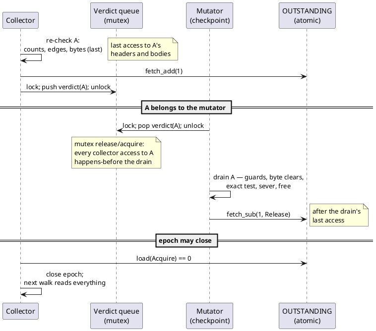
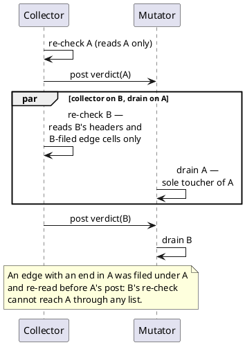

# The Drain-Exclusivity Window

> **Status: proven invariant of the shipped protocol.** Formalized in
> `dev/tools/rc-walk/DrainWindow.tla`; the sound model exhausts in 23
> states, and each of the three kill variants below violates the
> invariant, so every link of the argument is individually load-bearing.
> Code anchors: `epoch.rs` (`post_verdict`, `checkpoint_attend`,
> `OUTSTANDING_VERDICTS`), `collector.rs` (`recheck_and_post`,
> `can_close`), `walk.rs` (`drain_confirmed`, `acquit_condemned`).

## The claim

From the moment the collector posts a component's verdict until the
mutator's drain of that component acks it, **the collector performs no
access — read or write — to that component's headers or bodies**. The
drain therefore runs in a window where it is the only thread touching
the condemned members: its guard bumps, byte clears, exact-test reads,
severs and frees interleave with nothing.

This is a protocol property, not a memory-ordering accident, and it is
what makes the verdict message a true transfer of ownership: the
collector hands the component to the owning mutator and provably never
looks back until the hand-off is acknowledged.

## The three links

1. **Post follows the last read.** `recheck_and_post` processes
   components one at a time: counts, edge cells, condemned bytes (bytes
   last), *then* the post. The verdict queue is a mutex; the drain pops
   under the same mutex. Lock release/acquire orders every collector
   access to the component before every drain access — on top of the
   collector-thread program order that already put the post last.

2. **No return after post.** Once posted, a component is `mem::take`n
   out of the candidate list; later components' re-checks cannot touch
   it, including through edge cells: an edge with either end inside a
   candidate component is assigned to the **first** candidate component
   the `[src, dst]` probe finds, so an edge out of (or into) an
   already-posted component was filed under *that* component and was
   re-read before its post, never after.

3. **The ack follows the drain, and the close gate reads it with
   Acquire.** `checkpoint_attend` decrements `OUTSTANDING_VERDICTS`
   with `Release` only *after* `drain_confirmed` / `acquit_condemned`
   return; `can_close` reads the counter with `Acquire` and the epoch
   cannot end — so the next epoch's walk cannot start — until it reads
   zero. A collector that observes zero therefore observes every effect
   of every drain.

## Sequence: one component through the window

## Sequence: components pipeline without crossing

## What the code does anyway

The drain's header accesses go through the same relaxed helpers as
every other post-publish access (`update_header_flags`,
`mutator_guard_retain`, `mutator_load_header`), although the window
makes plain accesses sound. The rule "post-publish header access on a
walked header is never a plain store" is kept **absolute** so that no
call site requires this proof to be read correctly, and so the sites
survive the day the argument's premises move (see below). On x86 the
relaxed forms are the same instructions; the choice costs nothing.

## What would break the invariant

Guard rails for future changes — each is a kill variant of the model:

- **Posting before the last read** of the component
  (`DW_post_before_read.cfg`): any re-check read moved past the post
  re-opens the race.
- **Touching a posted component** (`DW_touch_after_post.cfg`): e.g. a
  collector-side statistics pass or a re-validation over old
  candidates.
- **Acking at pop instead of at finish** (`DW_early_sub.cfg`): the
  close gate then passes mid-drain and the next epoch's walk overlaps
  it.
- **A second mutator** (not modelled): acquitted members are live and
  shared; a foreign thread's retain/release may touch them mid-drain.
  The narrow mutator confines foreign writes to the counter half, but
  the exclusivity claim as stated is single-mutator and must be
  re-proven for the owner-bound-death design.

## The model

`dev/tools/rc-walk/DrainWindow.tla` + `DW_*.cfg`, checked with the
vendored TLC (see `dev/tools/rc-walk/README.md`). Access-interest
windows only — no refcounts, no fields, two components; the next
epoch's walk is modelled as a read of everything.

| Config | Expectation | Result (2026-07-27) |
|---|---|---|
| `DW_sound.cfg` | exhausts clean | no error, 23 distinct states |
| `DW_post_before_read.cfg` | violates `NoOverlap` | violated, trace: pop A between post and read |
| `DW_touch_after_post.cfg` | violates `NoOverlap` | violated |
| `DW_early_sub.cfg` | violates `NoOverlap` | violated |

A sound config that reports a violation, or a kill config that goes
green, means the spec or the protocol regressed — same discipline as
the rc-walk battery (`rc-walk-proof.md`).
