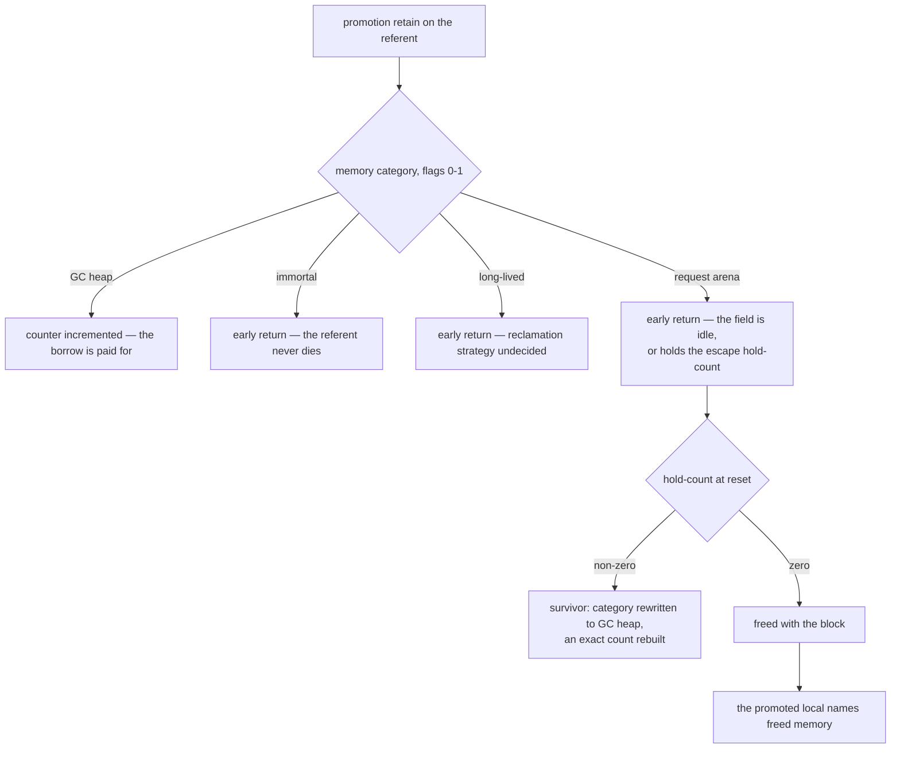

# Arena and immortal referents

## 1. The case

A borrow's chain may end in a root that is not a frame slot — an arena
slot, a static, an immortal, an FFI handle
([gc-horizon.md](../gc-horizon.md#the-ownership-lattice)) — and the
first chain edge is counted there for the same reason it is counted in a
frame: the store barrier retains on any store regardless of the holder's
category
([rc-walk.md](../rc-walk.md#the-central-identity-roots-are-derived-not-enumerated)).
The case exists for what happens when the **referent's** category
changes instead of the holder's: on an immortal entity retain and
release return early, and a request-arena entity is not lifetime-counted
at all
([arenas.md](../../memory/arenas.md#object-categories-by-memory-strategy)).
The promotion retain is then an instruction that buys nothing.

```php
#[Actor]
final class Session {
    private Profile $profile;          // arena-resident: the actor owns its arenas

    public function handle(Request $r): string {
        $prefs = $this->profile->prefs;   // anchored: Prefs is closed, pure,
                                          //   destructor-free, typed field
        audit($r);                        // unsummarized call: a horizon
        return $prefs->locale;            // promoted at the horizon —
                                          //   and the retain is a no-op
    }
}
```

## 2. The lattice verdict

`$prefs` is **anchored** under the normative text: the base-case list
reads the static class and the path, and names no memory category
([gc-horizon.md](../gc-horizon.md#the-ownership-lattice)). The state
document draws the category rung in its cascade and marks it unadopted,
which is question 8
([gc-horizon-states.md](../gc-horizon-states.md#the-lattice-decision-drawn)).
So the algorithm as written anchors this borrow and pays for it at the
horizon, and the payment lands on an entity that has no count.

`$this` is **owned** as the receiver
([gc-horizon.md](../gc-horizon.md#the-ownership-lattice)), which is the
same problem one level up: the base case exists because the callee frame
holds a counted reference for the receiver, and for an arena receiver
the convention retain returns early like any other retain
([lowering.md](../../lowering.md#retain--release), the category test in
`ll_retain`).

**The four roots, and which of them counts what.** A store into a static
block, an arena container or an immortal container retains the stored
entity, so the reference the root holds is counted and appears in `RC`
and never in `IN`
([rc-walk.md](../rc-walk.md#the-central-identity-roots-are-derived-not-enumerated)).
For an arena container holding a **heap** entity the retain is paired by
one release from the arena's release-at-reset list, one entry per store,
which is why the store barrier releases no displaced value there
([arenas.md](../../memory/arenas.md#the-reverse-direction-request-arena--heap)).
For an arena container holding an **arena** entity nothing is counted:
the categories match, the barrier does no extra work, and the entity is
not lifetime-counted in the first place. FFI handles are the fourth root
and their own case ([ffi.md](ffi.md);
[ffi.md](../../memory/ffi.md#the-owner-model)).

## 3. The horizon set

One horizon in the snippet: **a call without a trusted summary**, at
`audit($r)`
([gc-horizon-states.md](../gc-horizon-states.md#the-eight-horizon-kinds)).
The promotion point is the load-dominated point before it, by the
ordinary rule
([gc-horizon.md](../gc-horizon.md#at-the-horizon-promotion)).

Two events end this borrow's coverage and appear in no horizon kind.

**The arena reset.** An actor's arena is reset at a message boundary and
at actor death, reclaiming everything not promoted
([actors.md](../../../runtime/actors.md#actor-memory)). The reset decides
promotion from hold-counts and never dereferences a holder slot, by
construction: only the count is kept, not which slots hold the escapee
([arenas.md](../../memory/arenas.md#cross-arena-references)). A frame
slot is not a holder it can see, and neither is a promoted local.

**The reset's own destructor fixpoint.** Step 1 iterates: it walks the
escapee list, traces the escaped subgraph, runs `__destruct` for tracked
dying objects, and repeats while the list grows or new destructors
register
([arena-reset.md](../../memory/arena-reset.md#step-1--validate-trace-destruct-a-fixpoint-loop)).
Those destructors are arbitrary PHP that allocates and stores managed
references, which is what the loop's dirty and heap-effecting classes
are
([arena-reset.md](../../memory/arena-reset.md#what-keeps-the-fixpoint-going--destructor-purity)).
That is user code storing into live paths — the checkpoint condition's
threat shape exactly ([checkpoint.md](checkpoint.md)) — at a site the
horizon list does not name.

## 4. The lowering

```
$prefs = load $this->profile->prefs   ; no retain
retain $prefs                          ; ll_retain: early return on a
                                       ;   non-zero category, entity not COW
call audit($r)
$t = load $prefs->locale
release $prefs                         ; ll_release: same test, returns false
```

Both entry points test the memory-category bits first and return before
touching the counter word: the test is
`(flags & LL_MEMCAT_MASK) && !(flags & LL_COW)`, so every non-zero
category returns early ([lowering.md](../../lowering.md#retain--release)).
So the promotion
lowering and today's owned lowering emit the same two calls with the
same two early returns: this borrow costs one call pair in both worlds
and is protected in neither. The COW arm does not collide with it — the
early return is conditional on the entity not being COW, and every
COW-eligible reference is owned by base case anyway
([values.md](../../values.md#refcount-is-always-maintained-on-cow-entities)).

The immortal category differs from the arena one in what the missing
count would have bought. An immortal entity never dies, and all
retain/release operations on it are no-ops checked via the immortality
flag ([arenas.md](../../memory/arenas.md#immortal-objects)), so the
protection comes from the referent's own lifetime and the elision is
free rather than unsound. A request-arena entity's lifetime is the
arena's, decided at reset by a count the promotion never touched.

## 5. States touched

- **lattice state**: `Anchored(chain)` → `Owned` at a retain that
  changes no count
  ([gc-horizon-states.md](../gc-horizon-states.md#the-axes-the-lattice-creates)).
- **horizon set**: ∅ → {a call without a trusted summary}.
- **memory category, flags 0–1**: read by neither the lattice nor the
  promotion; rewritten from request-arena to GC heap for a retained
  survivor at reset
  ([arena-reset.md](../../memory/arena-reset.md#retention-dense-blocks)).
- **`IS_ESCAPEE`, flag 11**: while set, the refcount field is an escape
  hold-count rather than a count
  ([gc-horizon-states.md](../gc-horizon-states.md#the-axes-the-lattice-reads)).
- **GC state and colour, flags 2–5**: borrowed by the reset's trace as
  its mark, then reset to the canonical value in the same store that
  rewrites the category
  ([arena-reset.md](../../memory/arena-reset.md#retention-dense-blocks)).

## 6. The picture



## 7. The oracle

**A1 — the promotion retain changes nothing.** Allocate an entity in the
request-arena category, call `ll_retain` and then `ll_release` on it, and
assert the refcount word is unchanged, the release reports no death, and
the entity is not enrolled as an escapee. Instrument: a runtime test in
the ll-model crate, against `model/src/refcount.rs` and
`model/src/memory/arena.rs`.

**A2 — the reset frees under an outstanding reference.** Allocate an
arena entity referenced only from a raw local, reset the arena, and
assert the entity's block is freed: the escapee list is empty, so the
reset has nothing to promote and no slot to consult. Same instrument,
against the reset path (`memory::arena::Arena::reset`, `drain_escapees`,
`finish_reset`).

**A3 — a survivor keeps its address.** Retain a dense block's survivor
through the promotion path and assert the entity's address is unchanged
while the category bits read GC heap, which is what makes an anchor
chain through a retained survivor stay intact
(`model/src/promote.rs`).

**A4 — the lattice's category blindness.** That the compiler anchored a
borrow whose referent is arena-resident is a compile-time verdict, and
the detector is the shadow-count lowering's journal
([gc-horizon.md](../gc-horizon.md#verification-artifacts-a-precondition-of-implementation)).

Buildable today: yes for A1, A2 and A3, against the crate's refcount,
arena and promotion paths; no for A4, which needs the compiler.

## 8. Prior art in this repository

- [checkpoint.md](checkpoint.md) owns the threat shape the reset's
  destructor fixpoint repeats, and the discharge that does not cover it.
- [suspension.md](suspension.md) owns the frame that can span a message
  boundary, which is what question 8's second half needs to be
  realizable in an actor.
- [ffi.md](ffi.md) owns the fourth non-frame root and its `#[Borrow]`
  views.
- [object.md](object.md) owns the anchorable kind this case's referent
  belongs to; the category is the axis it does not vary.
- [array.md](array.md) owns anchor identity under a re-seating, which is
  the same property retention relies on at reset.
- [adversarial.md](adversarial.md), PH4, PH5, PH6 and PH24 — the reset that removes
  a whole root category under a live borrow, and its generalisation: every
  non-frame root is revocable by an operation that is no managed-slot
  store.

## 9. Open items

1. **Promotion buys nothing in three of the four categories.** The early
   return is on any non-zero category bar COW
   ([lowering.md](../../lowering.md#retain--release)), so it covers the
   long-lived category as well as the immortal and request-arena ones,
   and the lattice reads the static class and never the category —
   question 8 ([gc-horizon.md](../gc-horizon.md#open-questions)). The
   failing shape is section 1's snippet: the borrow is promoted at the
   call, the retain returns early, and the reset frees the referent under
   a local the lattice records as owned. **It needs no fiber and no
   message boundary**, which the widened question records and this item
   claimed otherwise until 2026-08-23. Two shapes reach it inside one
   frame. A long-lived referent dies by explicit free or minimal RC
   ([arenas.md](../../memory/arenas.md#object-categories-by-memory-strategy)),
   with no reset, no hold-count and no escapee list involved. And a
   `#[Region]` arena resets when the region object's own count reaches
   zero ([regions.md](../../memory/regions.md#definition)), which an
   unsummarized call in the borrow's live range can cause. The parked
   fiber ([actors.md](../../../runtime/actors.md#the-queue-is-the-only-door),
   [suspension.md](suspension.md)'s hole) is a third route and not the
   precondition. Read from the count side this is also PH4's rule
   failing: the retain is emitted, no live count stands behind the local
   it marks owned, and a further borrow may end its chain there —
   question 16.
2. **The convention retains have the same defect, and question 8 names
   only the promotion retain.** The receiver and by-value parameter base
   cases exist because the callee frame holds a counted reference
   ([gc-horizon.md](../gc-horizon.md#the-ownership-lattice)); on an arena
   or immortal argument it holds none
   ([lowering.md](../../lowering.md#retain--release)). The
   question's sub-question — whether the category belongs in the lattice
   as an axis — should read the base-case list as well as the promotion.
3. **The arena reset's destructor fixpoint is a user-code point in no
   horizon kind.** It runs `__destruct` in rounds, and a round may store
   into a live path
   ([arena-reset.md](../../memory/arena-reset.md#step-1--validate-trace-destruct-a-fixpoint-loop)).
   Whether it is a checkpoint in the protocol's sense — whether a
   verdict can be picked up inside it — is not determinable from the RFC
   as it stands; the missing specification is the relation between the
   reset and the checkpoint protocol
   ([rc-walk.md](../rc-walk.md#the-design-constraint-that-produced-this-shape)).
4. **Evacuation would move a referent with no slot to fix up.** Anchor
   identity is counted reachability from the anchor's current referent
   ([gc-horizon.md](../gc-horizon.md#the-ownership-lattice)), and
   retention preserves the address, so a chain through a retained
   survivor survives. Evacuation copies instead, and the escape count
   records no slots, so an escapee cannot be moved
   ([arenas.md](../../memory/arenas.md#cross-arena-references));
   evacuation is deferred and retention is the whole of the first
   implementation
   ([arena-reset.md](../../memory/arena-reset.md#retention-dense-blocks)).
   The missing specification is the back-pointer scheme, and it is owed
   before evacuation lands rather than before this design does.
5. **Every non-frame root is revocable, and the reset is one instance.**
   A static table torn down, a module unloaded, an FFI handle
   unregistered: each destroys a root this case's chains may end in
   without an ordinary managed-slot store, so `stable_path` inside the
   heap is intact while the counted root is gone. Question 18 asks for
   identity, ownership and revocation per category. PH24.
6. **PH6's remedy is the instruction section 4 prices at nothing.** It
   has every suspension promote its live anchored borrows before
   yielding, and on an arena referent `ll_retain` returns early on the
   category test: the retain is emitted, the count does not move, and the
   reset still decides by a hold-count the promotion never touched. PH5's
   rule is not in this item — its second disjunct is the reset's own
   promotion fixpoint retaining the whole path, which is the escapee
   hold-count and the escaped-subgraph trace
   ([arena-reset.md](../../memory/arena-reset.md#step-1--validate-trace-destruct-a-fixpoint-loop)),
   and its primary rule is that the reset is a horizon no ordinary call
   summary may lift. That primary rule is what item 3 and question 8 are
   missing.
