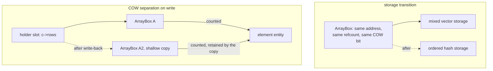

# Array: exclusion by COW, qualified by storage transitions

## 1. The case

An array reference is owned by base case, and the fact this case exists
for is what happens to a *path* that runs through an array while the
array changes shape underneath it. A storage transition and a COW
separation are two different re-seatings, and only one of them is
visible to the borrow's proofs.

```php
final class Cart { public array $rows; }

function tally(Cart $c, string $k): int {
    $rows = $c->rows;      // owned: array is a COW-eligible kind
    $c->rows[$k] = 1;      // separates if shared; may transition 2 → 3
    return count($rows);
}
```

`$c` and `$k` are owned by convention
([gc-horizon.md](../gc-horizon.md#the-ownership-lattice)). The insertion
of a string key is what makes line 2 interesting: it can separate the
array, migrate its storage from a mixed vector to an ordered hash, and
raise, all at one site.

## 2. The lattice verdict

**Owned, at the COW rung**, the second rung of the cascade
([gc-horizon-states.md](../gc-horizon-states.md#the-lattice-decision-drawn)).
The rule is that every reference to a COW-eligible value is owned,
because the uniqueness test reads the count and an uncounted holder
falsifies it
([values.md](../../values.md#refcount-is-always-maintained-on-cow-entities)).
The separation rule fires on `COW && refcount > 1`
([values.md](../../values.md#copy-on-write-protocol)), so eliding
`$rows`'s pair would let line 2 read a count of 1 on an entity two
holders name and write into the buffer `$rows` is about to read.

That is also why the design's one no-change row for the COW protocol is
a soundness argument rather than an economy
([gc-horizon-states.md](../gc-horizon-states.md#what-the-runtime-must-not-change)):
the lattice never decrements a COW holder's count, so the protocol needs
no arm for the feature.

### The flag is per entity, and the base case is worded over the kind

COW is not hard-wired to types: any heap entity can carry the flag,
strings and arrays are created COW by default, and **both can exist in
non-COW form**
([values.md](../../values.md#cow-is-a-per-object-flag)). So an array
entity with the flag clear is licensed by the RFC, and on such an entity
no write ever reads the count.

The two documents then read one base case two ways. The algorithm
enumerates kinds — "every reference to a COW-eligible value — array,
string, reference box"
([gc-horizon.md](../gc-horizon.md#the-ownership-lattice)) — and the
collapse identity restates that as COW-eligibility by kind
([gc-horizon-states.md](../gc-horizon-states.md#the-product-and-what-collapses-it)),
while the axis table reads the same eligibility off header flag 10, "per
entity rather than per class"
([gc-horizon-states.md](../gc-horizon-states.md#the-axes-the-lattice-reads)).
Under the kind reading a flag-clear array is still owned and the base
case is merely broader than its stated reason, which costs a pair and
never a proof — the failure default's own direction. Under the entity
reading such an array leaves the exclusion and can reach the ANCHORED
leaf, which would make the anchorable population three kinds instead of
two.

Neither document resolves it, and the lattice cannot resolve it by
reading the flag: the verdict is assigned at compile time over a static
type, while the flag is a property of the entity a slot holds at run
time. Open item 1.

## 3. The horizon set

**Empty for `$rows`**, which is owned and therefore carries no proofs.
The set that matters here belongs to a borrow whose path crosses this
array — `$e = $c->rows[0]` with `$e` an object — and it has one member:
the store on line 2 is a store through a path base, since the base is
`$c` and the edge `rows` is on the path
([gc-horizon.md](../gc-horizon.md#the-horizon-list)).

### A transition is invisible to the path; a separation is not

The three storage strategies are a typed vector of unboxed elements, a
mixed vector of ValueBoxes and an ordered hash, chosen per array
([arrays.md](../../arrays.md#arrayinterface-one-class-three-storage-implementations)).
A transition replaces the storage under the same entity, leaving the
array's identity, refcount and COW state alone
([arrays.md](../../arrays.md#transition-rules)), so it moves no counted
edge and `stable_path` — counted reachability from the anchor's current
referent — reads exactly as it did before. This is the sentence the
algorithm cites when it says anchor identity survives representation
changes
([gc-horizon.md](../gc-horizon.md#the-ownership-lattice)).

A separation is the other shape. It allocates a new entity and the
holder stores the pointer the barrier returns
([values.md](../../values.md#copy-on-write-protocol)), so `$c->rows`
names a different array afterwards. The path survives because separation
is shallow and children are retained and shared
([arrays.md](../../arrays.md#external-contract)), so an element that
stays in the array keeps a counted in-edge from the new entity. It
survives only for elements the write leaves in place, which is why the
same store is a horizon under the rule above: a write that overwrites or
removes the borrowed element severs the path, and the horizon is what
covers the difference.

### Element borrows read the element's kind, not the array's

The array on such a path is a path member and not the referent, so the
COW rung never looks at it; what the chain invariant asks of it is that
every path edge be a counted heap edge
([gc-horizon.md](../gc-horizon.md#the-ownership-lattice)). Elements in
the mixed vector and the ordered hash are ValueBox slots, and the walker
traces an array through exactly those
([rc-walk.md](../rc-walk.md#what-the-walker-traces-entity-kinds)), so
the retain those stores paid is matched by an `IN` edge and the invariant
holds. The typed vector stores raw unboxed elements
([arrays.md](../../arrays.md#arrayinterface-one-class-three-storage-implementations)),
and whether a class-typed pointer element there is a counted edge is not
stated — open item 2.

### The storage buffer is not a node

Table storage is not an entity and has no header
([arrays-hashtable.md](../../arrays-hashtable.md#what-the-table-owes-the-memory-manager)),
so the walker never enters it as a node in `rc[]`; it is read through,
and the deferred-free bit has to cover buffer frees because a mid-epoch
grow would otherwise leave the walker chasing freed memory
([rc-walk.md](../rc-walk.md#what-the-walker-traces-entity-kinds)). For a
borrow this settles which predicate is the right one: a grow moves every
element slot to a new address while moving no entity, so a proof over
slot addresses would break at every growth and a proof over counted
reachability does not.

## 4. The lowering

Owned, so there is one lowering: today's retain at the acquisition and
release at the drop point, unchanged
([static-lifetimes.md](../../memory/static-lifetimes.md#drop-point-policy)).

## 5. States touched

- **COW eligibility**: read as yes for the `array` kind, which decides
  the verdict at the second rung and ends the cascade.
- **storage strategy**: mixed vector → ordered hash at line 2, with
  identity, refcount and COW state fixed across it — the sub-axis that
  splits this case by mode rather than by kind
  ([gc-horizon-states.md](../gc-horizon-states.md#the-axes-the-lattice-reads)).
- **lattice state**: `$rows` is `Owned`, which is what today's lowering
  assigns, so nothing moves.
- **horizon set**: for a borrow of an element, one member at line 2 —
  a store through a may-alias of a path base.

## 6. The picture



## 7. The oracle

A test asserts two things. First, that no lowering ever elides the pair
for an array-typed local: the static elision-site list the release build
and the counting build both emit contains no site whose target kind is
array, and the shadow lowering's journal never names one
([gc-horizon-states.md](../gc-horizon-states.md#the-instruments-and-which-exist)).
Second, that the premises hold: a transition leaves refcount and the COW
bit unchanged, and a separation on `refcount > 1` produces a new entity
whose elements are the old entity's, retained.

The first needs the compiler, through the shadow-count lowering and the
release-build elision counter. The second is a runtime test in the
ll-model crate over a hand-built array — build an array with two
holders, force the string-key insertion, and read the header words and
the element counts on both entities.

Buildable today: no for the elision claim; yes for the transition and
separation premises, as a runtime test in the ll-model crate against the
existing array and refcount code.

## 8. Prior art in this repository

- The COW rung and its citation
  ([gc-horizon.md](../gc-horizon.md#the-ownership-lattice)), which this
  case instantiates and does not extend.
- The anchor-identity sentence
  ([gc-horizon.md](../gc-horizon.md#the-ownership-lattice)), whose
  "re-seating the anchor's array" is the separation half of section 3.
- [string.md](string.md), which asks open item 1 of the same source and
  gets a sharper answer, because a string's sub-modes make the
  flag-clear form a named allocation choice.
- [object.md](object.md) for the complementary verdict, and
  [reference-box.md](reference-box.md) for the third COW-excluded kind.

## 9. Open items

1. **The COW base case is worded over the kind and the state axis is
   read over the entity.** An array entity may carry the flag clear
   ([values.md](../../values.md#cow-is-a-per-object-flag)), on which no
   write reads the count, so the base case's stated reason does not
   apply to it. What is missing is a sentence saying which of the two
   readings is normative for the lattice — over the static kind, which
   is what a compile-time verdict can actually read, or over flag 10,
   which is what the axis table names.
2. **The chain invariant is unproven across a typed-vector element.**
   The walker's array arm names the element ValueBoxes
   ([rc-walk.md](../rc-walk.md#what-the-walker-traces-entity-kinds)) and
   the typed vector holds raw unboxed elements
   ([arrays.md](../../arrays.md#arrayinterface-one-class-three-storage-implementations)),
   so whether a pointer element there is a counted heap edge is
   unspecified. No crate produces strategy 1 yet, so the answer is owed
   before one does.
3. **The store on line 2 is a raise site.** Separation allocates, the
   store reports refusal, and generated code raises memory-exhausted
   ([exceptions.md](../../../runtime/exceptions.md#allocation-failure-is-an-ordinary-exception)),
   so this snippet's live ranges have a raise site that is not a call
   site — the shape of open question 9 of
   [gc-horizon.md](../gc-horizon.md#open-questions).
