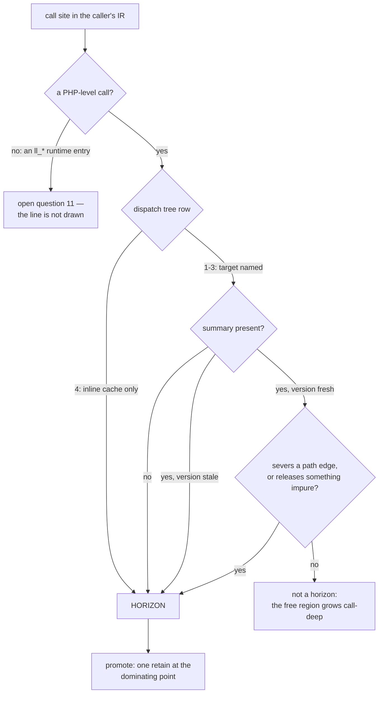

# Calls, dynamic dispatch and reflection

## 1. The case

Three of the eight horizon kinds are shaped like a call, and they belong
in one case because one fact ends the proof in all three: the callee's
instructions are not in the caller's IR, so no analysis over the caller
covers what runs inside. [gc-horizon.md](../gc-horizon.md#the-horizon-list)
lists them separately because a different instrument lifts each — a
summary for the first, a closed class set for the second, nothing at all
for the third
([gc-horizon-states.md](../gc-horizon-states.md#the-eight-horizon-kinds)).

```php
function price(Order $o, ReflectionProperty $rp): float {
    $rate = $o->rate;          // anchored: Rate is closed, pure, typed slot
    audit($o);                 // horizon 1: no summary for audit()
    $o->shipper->quote();      // horizon 2: the Shipper set is not closed
    $rp->setValue($o, null);   // horizon 3: reflection
    return $rate->value;
}
```

## 2. The lattice verdict

`$rate` is **anchored**: it passes every rung of the cascade
([gc-horizon-states.md](../gc-horizon-states.md#the-lattice-decision-drawn)) —
an object referent, not COW-eligible, a class whose destructor closure is
empty, no unique-ownership entity and no weak cell on the path, and a
birth that dominates the three horizons and the exit.

`$o` and `$rp` are **owned by convention**, and so is every result of the
two calls that return one. Both conventions are base cases of the lattice
rather than consequences of the horizon list
([gc-horizon.md](../gc-horizon.md#the-ownership-lattice)), and each rests
on a boundary the caller's analysis cannot see across.

**The receiver and every by-value parameter are counted in the callee
frame**, today's calling convention. An anchored parameter's chain would
end in the caller's frame, and per-function horizon detection reads one
function at a time, so a re-entrant store that kills the caller's slot
mid-call is invisible to the callee compiling its own borrows. Lifting
this through caller-guarantee summaries is open question 6.

**Every call result is owned.** The callee retains the returned reference
before its epilogue, and that retain precedes both the batched scope-exit
release run and the epilogue checkpoint, so the value cannot die under
them. A borrowed return would surface behind that checkpoint, outside any
promotion point the caller could place, because the caller's earliest
instruction after the call is already past it. Borrowed returns therefore
do not exist until the summary language learns callee-side promotion,
which is open question 1.

## 3. The horizon set

Three points, one per row.

- `audit($o)` — **a call without a trusted summary**. The callee may
  sever any path and release anything, so nothing about `$o->rate`
  survives it.
- `$o->shipper->quote()` — **dynamic dispatch the class set cannot
  close**. The compiler resolves a call site by the dispatch decision
  tree ([classes.md](../../classes.md#dispatch-decision-tree)); rows 1
  to 3 name a target, row 4 names none and reaches the inline cache.
  Summaries are per callee, so an unclosed set has no callee to summarize.
- `$rp->setValue($o, null)` — **reflection**. Nothing lifts it, and this
  site shows why: a `ReflectionProperty` write is one of the dynamic
  paths that resolve a property at runtime
  ([classes.md](../../classes.md#property-access)), so it can sever the
  very slot the borrow's path runs through.

**Read literally, the first row also covers the runtime's own entry
points, and the design does not say otherwise.** The lowering emits
`ll_retain` and `ll_release` around counted references
([lowering.md](../../lowering.md#retain--release)), `store_ptr`,
`store_box` and `drop` at every reference store
([strategies.md](../strategies.md#1-the-store-barrier-as-micro-operations)),
`ll_cow_separate` before a write to a shared value
([values.md](../../values.md#copy-on-write-protocol)), and an allocation
entry per `new` ([lowering.md](../../lowering.md#allocation)). None of
them carries a summary, because summaries are written for PHP functions.
Under the row as written every one of them is a horizon, every borrow's
live range contains at least one, and the free region is empty. The line
the design intends is that a **horizon is a PHP-level call**, runtime
entries being nothrow, effect-known and summarized by construction. That
line is written nowhere in [gc-horizon.md](../gc-horizon.md), and open
question 11 records the gap. One half of the intended criterion needs
care where it is drawn: a COW-separating store allocates, and the barrier
reports refusal rather than raising, so the entry is nothrow and the
generated code that reads the refusal raises memory-exhausted
([values.md](../../values.md#copy-on-write-protocol),
[exceptions.md](../../../runtime/exceptions.md#allocation-failure-is-an-ordinary-exception)) —
which moves the site into open question 9's raise-site problem instead.

## 4. The lowering

`$rate`'s birth is the load, and the closest point dominated by it that
dominates all three horizons and the exit is the instruction after the
load ([gc-horizon.md](../gc-horizon.md#at-the-horizon-promotion)). One
retain lands there, and the release stays at today's drop point:

```
$rate = load $o->rate        ; no retain
retain $rate                 ; the promotion, before the first horizon
call audit($o)
call quote(load (load $o->shipper))
call setValue($rp, $o, null)
release $rate                ; the drop-point policy, unchanged
```

Against today's lowering that is the same pair over a shorter subrange,
which is the cost bound: per borrow the scheme never pays more than the
current code. With a summary proving `audit()` severs nothing on the
`$o->rate` path and releases nothing impure, that one row lifts and the
other two remain, so the promotion point moves to the instruction before
`quote()` and the pair count is unchanged. The free lowering needs the
whole horizon set empty, not one row of it.

**The loop and the back-edge.** Birth position relative to the loop
decides the whole cost, and both shapes fit in one function:

```php
function scan(Order $o, int $n): float {
    $rate = $o->rate;          // born before the loop
    $sum  = 0.0;
    for ($i = 0; $i < $n; $i++) {
        $tax = $o->tax;        // born inside the loop
        audit($o);             // the horizon, in the body
        $sum += $tax->value * $rate->value;
    }
    return $sum;
}
```

```
$rate = load $o->rate        ; no retain
retain $rate                 ; promotion, once, dominating the loop
loop:
  $tax = load $o->tax
  retain $tax                ; owned from birth, one retain per iteration
  call audit($o)
  ...
  release $tax               ; drop point, inside the body
  br loop
exit:
release $rate                ; drop point, after the loop
```

`$rate` is born before the loop, so a point dominating every horizon in
its live range exists and the loop's horizon is paid once. `$tax` is born
inside, and its live range re-enters the body over the back-edge, so no
point dominated by its birth dominates every horizon in that range: the
promotion point is ⊥, and ⊥ sends the borrow to owned-from-birth by the
failure default
([gc-horizon-states.md](../gc-horizon-states.md#the-axes-the-lattice-creates)).
Owned-from-birth is today's lowering exactly, so the loop-born borrow
loses the saving and gains no cost.

## 5. States touched

- **lattice state**: `$rate` `Anchored(chain)` → `Owned` at the
  promotion; `$tax` never enters `Anchored`.
- **horizon set**: empty → three call-shaped kinds, and back to two when
  a summary for `audit()` exists.
- **promotion point**: the instruction after the load for `$rate` in both
  snippets; ⊥ for `$tax`.
- **call summary**: absent for `audit()`, so the row stands; present and
  version-fresh, so it lifts.
- **class regime**: `Shipper` is unnarrowable at that site, which is the
  counted default ([gc-horizon.md](../gc-horizon.md#the-hybrid-counted-class-horizon-class)).
- **landing-pad set**: `$rate` joins the owned set live at all three call
  sites, static per site because the promotion dominates them.

## 6. The picture



## 7. The oracle

Three assertions, one instrument each.

- **The destructor sequence and the death set per checkpoint batch are
  identical with horizons off and on**, for a program whose only horizon
  is a summarized call. Instrument: the differential lowering
  ([gc-horizon.md](../gc-horizon.md#verification-artifacts-a-precondition-of-implementation)).
  The oracle is deliberately nesting-insensitive, because an elided
  borrow of a destructor-free target moves the free into the parent's
  cascade legitimately.
- **No shadow word reaches zero while its real count is nonzero**, over a
  corpus exercising the three call shapes; when one does, the per-object
  journal names the elided acquisition sites owing a retain. Instrument:
  the shadow-count lowering, run under its dual release schedule.
- **A caller compiled against summary version *v* refuses its elisions
  when the callee publishes *v+1***. Instrument: the compiler's
  summary-version check, whose rule is open question 1 and does not exist.

**Buildable today: no.** All three need the compiler Phase D supplies. A
model-checker scenario is not the substitute: the TLC specs model the
pre-eager-death protocol, so a scenario written against them would test a
collector this design does not target
([README.md](README.md#which-cases-can-be-tested-today)).

## 8. Prior art in this repository

- The worked example of [README.md](README.md#the-template-filled-one-function-both-lowerings)
  is this case at its smallest: `audit()` with and without a summary.
- The owned base cases and the placement rule are
  [gc-horizon.md](../gc-horizon.md#the-ownership-lattice) and
  [gc-horizon.md](../gc-horizon.md#at-the-horizon-promotion); this case
  instantiates them and adds nothing.
- [store.md](store.md) carries the severing store a summary must exclude,
  and [release.md](release.md) the impure release it must exclude; a
  summary is exactly the claim that a callee contains neither.
- [unwind.md](unwind.md) owns the raise-site half of the placement rule
  that the runtime-entry boundary above touches.
- The dispatch decision tree is
  [classes.md](../../classes.md#dispatch-decision-tree), the inline cache
  is [caches.md](../../caches.md#the-sites), and the Borrowed state this
  design's borrow specialises is
  [static-lifetimes.md](../../memory/static-lifetimes.md#ownership-states-and-moves).

## 9. Open items

1. **The PHP-call boundary is not drawn.** Section 3 states it; the
   algorithm does not. Open question 11 of
   [gc-horizon.md](../gc-horizon.md#open-questions).
2. **A monomorphic inline cache is a runtime class check, and the lift is
   stated statically.** The row is lifted by "a closed class set", while
   the mechanism that resolves an untyped receiver is a per-site cache
   holding one `(class, target)` pair checked at run time
   ([classes.md](../../classes.md#inline-caches)). Whether a guarded
   monomorphic site may carry the callee's summary under its guard is not
   determinable from the RFC as it stands, and no numbered question
   covers it: the missing specification is the summary language's
   treatment of guarded sites, owed with open question 1.
3. **Anchored parameters.** Open question 6, unchanged by this case.
4. **Borrowed returns.** Open question 1, and the reason every call
   result is owned above.
5. **Summary versioning has no rule.** A summary is a soundness
   assumption, so a stdlib update that adds a destructor or a severing
   store invalidates every caller compiled against it, and without a
   versioning rule every such update is a silent soundness event
   ([gc-horizon.md](../gc-horizon.md#verification-artifacts-a-precondition-of-implementation)).
   The downstream blast radius is sized by the scan's summary-dependency
   channel, bracketed under two receiver resolutions, and only the
   under-approximation carries kill authority
   ([gc-horizon.md](../gc-horizon.md#economics)).
