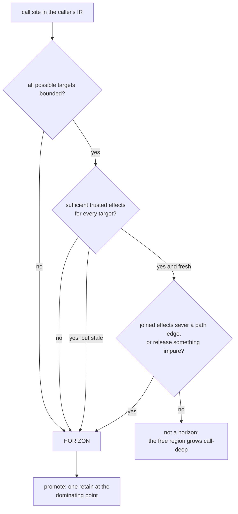

# Calls, dynamic dispatch and reflection

## 1. The case

Three of the eight horizon kinds are shaped like a call, and they belong
in one case because one fact ends the proof in all three: the compiler
cannot establish sufficiently precise effects for every target that may
run at the site. Caller-local analysis alone cannot cover instructions
outside the caller, but it is not the only admissible source of knowledge:
interprocedural analysis, builtin and intrinsic models, runtime ABI
contracts, and fresh stored summaries may all supply trusted effects.
[gc-horizon.md](../gc-horizon.md#the-horizon-list) lists the three kinds
separately because a different instrument lifts each — a sufficient
trusted effect model for the first, resolution and effect coverage of all
possible targets for the second, and nothing at all for the third
([gc-horizon-states.md](../gc-horizon-states.md#the-eight-horizon-kinds)).

```php
function price(Order $o, ReflectionProperty $rp): float {
    $rate = $o->rate;          // anchored: Rate is closed, pure, typed slot
    audit($o);                 // horizon 1: no summary for audit()
    $o->shipper->quote();      // horizon 2: the Shipper set is not closed
    $rp->setValue($o, null);   // horizon 3: reflection
    return $rate->value;
}
```

## 2. The lattice verdict

`$rate` is **anchored**: it passes every rung of the cascade
([gc-horizon-states.md](../gc-horizon-states.md#the-lattice-decision-drawn)) —
an object referent, not COW-eligible, a class whose destructor closure is
empty, no unique-ownership entity and no weak cell on the path, and a
birth that dominates the three horizons and the exit.

`$o` and `$rp` are **owned by convention**, and so is every result of the
two calls that return one. Both conventions are base cases of the lattice
rather than consequences of the horizon list
([gc-horizon.md](../gc-horizon.md#the-ownership-lattice)), and each rests
on a boundary the caller's analysis cannot see across.

**The receiver and every by-value parameter are counted in the callee
frame**, today's calling convention. An anchored parameter's chain would
end in the caller's frame, and per-function horizon detection reads one
function at a time, so a re-entrant store that kills the caller's slot
mid-call is invisible to the callee compiling its own borrows. Lifting
this through caller-guarantee summaries is open question 6.

**Every call result is owned.** The callee retains the returned reference
before its epilogue, and that retain precedes both the batched scope-exit
release run and the epilogue checkpoint, so the value cannot die under
them. A borrowed return would surface behind that checkpoint, outside any
promotion point the caller could place, because the caller's earliest
instruction after the call is already past it. Borrowed returns therefore
do not exist until the summary language learns callee-side promotion,
which is open question 1.

## 3. The horizon set

Three points, one per row.

- `audit($o)` — **a call without sufficient trusted effects**. Those
  effects may come from analysis of the body, a builtin or intrinsic
  model, a runtime ABI contract, or a fresh stored summary. None is
  available here, so the callee may sever any path and release anything,
  and nothing about `$o->rate` survives it.
- `$o->shipper->quote()` — **dynamic dispatch the class set cannot
  close**. The compiler resolves a call site by the dispatch decision
  tree ([classes.md](../../classes.md#dispatch-decision-tree)); rows 1
  to 3 name a target, row 4 names none and reaches the inline cache. A
  singleton callee is not required: a finite target set can be lifted when
  the joined trusted effects of every possible target preserve the proof.
  Here the set is not closed, so its effect union cannot be bounded.
- `$rp->setValue($o, null)` — **reflection**. Nothing lifts it, and this
  site shows why: a `ReflectionProperty` write is one of the dynamic
  paths that resolve a property at runtime
  ([classes.md](../../classes.md#property-access)), so it can sever the
  very slot the borrow's path runs through.

**The first row does not define what counts as trusted effect knowledge.**
The lowering emits
`ll_retain` and `ll_release` around counted references
([lowering.md](../../lowering.md#retain--release)), `store_ptr`,
`store_box` and `drop` at every reference store
([strategies.md](../strategies.md#1-the-store-barrier-as-micro-operations)),
`ll_cow_separate` before a write to a shared value
([values.md](../../values.md#copy-on-write-protocol)), and an allocation
entry per `new` ([lowering.md](../../lowering.md#allocation)). Requiring a
stored call summary as the only proof source would classify every one of
these effect-known operations as a horizon and make the free region empty.
Conversely, restricting horizons to PHP-level calls would discard effects
the compiler already knows for builtins, intrinsics, analyzable PHP
functions, runtime entries, and closed multi-target dispatch. The missing
rule is therefore source-independent: a call is lifted exactly when the
compiler has a trusted, fresh effect model, from any admitted source,
sufficient to prove that every possible target preserves this borrow's
anchor path and performs no impure release relevant to it. Open question
11 records the still-missing registry, trust and invalidation rules for
those sources. One part of the criterion needs care: a COW-separating
store allocates, and the barrier
reports refusal rather than raising, so the entry is nothrow and the
generated code that reads the refusal raises memory-exhausted
([values.md](../../values.md#copy-on-write-protocol),
[exceptions.md](../../../runtime/exceptions.md#allocation-failure-is-an-ordinary-exception)) —
which moves the site into open question 9's raise-site problem instead.

## 4. The lowering

`$rate`'s birth is the load, and the latest point dominated by it that
dominates all three horizons, the exit and every raise site of the live
range — the three calls are raise sites too — is the instruction after
the load ([gc-horizon.md](../gc-horizon.md#at-the-horizon-promotion)). One
retain lands there, and the release stays at today's drop point:

```
$rate = load $o->rate        ; no retain
retain $rate                 ; the promotion, before the first horizon
call audit($o)
call quote(load (load $o->shipper))
call setValue($rp, $o, null)
release $rate                ; the drop-point policy, unchanged
```

Against today's lowering that is the same pair over a shorter subrange,
which is the cost bound: per borrow the scheme never pays more than the
current code. With a summary proving `audit()` severs nothing on the
`$o->rate` path and releases nothing impure, that one row lifts and the
other two remain, so the promotion point moves to the instruction before
`quote()` and the pair count is unchanged. The free lowering needs the
whole horizon set empty, not one row of it.

**The loop and the back-edge.** Birth position relative to the loop
decides the whole cost, and both shapes fit in one function:

```php
function scan(Order $o, int $n): float {
    $rate = $o->rate;          // born before the loop
    $sum  = 0.0;
    for ($i = 0; $i < $n; $i++) {
        $tax = $o->tax;        // born inside the loop
        audit($o);             // the horizon, in the body
        $sum += $tax->value * $rate->value;
    }
    return $sum;
}
```

```
$rate = load $o->rate        ; no retain
retain $rate                 ; promotion, once, dominating the loop
loop:
  $tax = load $o->tax
  retain $tax                ; the promotion, once per iteration
  call audit($o)
  ...
  release $tax               ; drop point, inside the body
  br loop
exit:
release $rate                ; drop point, after the loop
```

`$rate` is born before the loop, so the cycle condition keeps its
promotion out of the body and the loop's horizon is paid once. `$tax` is
born inside it, and its live range ends inside the iteration: nothing
carries it over the back-edge, so its birth dominates every horizon of
its own live range and the placement rule returns the instruction after
the load. One promotion per iteration, which is today's lowering for that
borrow, and which a summary for `audit()` removes altogether. This case
is where the algorithm used to say two things — the base case excluded a
borrow "born inside a loop with a horizon reachable over the back-edge"
while the placement bullet said the back-edge fails the dominance test
outright — and open question 22 closed it on 2026-08-23 in favour of the
first: over strict SSA the test cannot fail for a non-phi borrow, and a
borrow that is live across a back edge is a loop-header phi, which the
edge rule and PH15 decide.

## 5. States touched

- **lattice state**: `$rate` `Anchored(chain)` → `Owned` at the
  promotion; `$tax` never enters `Anchored`.
- **horizon set**: empty → three call-shaped kinds, and back to two when
  a summary for `audit()` exists.
- **promotion point**: the instruction after the load for `$rate` in both
  snippets; ⊥ for `$tax`.
- **call effect model**: no admitted source supplies sufficient effects
  for `audit()`, so the row stands; a fresh sufficient model lifts it.
- **class regime**: `Shipper` is unnarrowable at that site, which is the
  counted default ([gc-horizon.md](../gc-horizon.md#the-hybrid-counted-class-horizon-class)).
- **landing-pad set**: `$rate` joins the owned set live at all three call
  sites, static per site because the promotion dominates them.

## 6. The picture



## 7. The oracle

Three assertions, one instrument each.

- **The destructor sequence and the death set per checkpoint batch are
  identical with horizons off and on**, for a program whose only horizon
  is a summarized call. Instrument: the differential lowering
  ([gc-horizon.md](../gc-horizon.md#verification-artifacts-a-precondition-of-implementation)).
  The oracle is deliberately nesting-insensitive, because an elided
  borrow of a destructor-free target moves the free into the parent's
  cascade legitimately.
- **No shadow word reaches zero while its real count is nonzero**, over a
  corpus exercising the three call shapes; when one does, the per-object
  journal names the elided acquisition sites owing a retain. Instrument:
  the shadow-count lowering, run under its dual release schedule.
- **A caller compiled against summary version *v* refuses its elisions
  when the callee publishes *v+1***. Instrument: the compiler's
  summary-version check, whose rule is open question 1 and does not exist.

**Buildable today: no.** All three need the compiler Phase D supplies. A
model-checker scenario is not the substitute: the TLC specs model the
pre-eager-death protocol, so a scenario written against them would test a
collector this design does not target
([README.md](README.md#which-cases-can-be-tested-today)).

## 8. Prior art in this repository

- The worked example of [README.md](README.md#the-template-filled-one-function-both-lowerings)
  is this case at its smallest: `audit()` with and without a summary.
- The owned base cases and the placement rule are
  [gc-horizon.md](../gc-horizon.md#the-ownership-lattice) and
  [gc-horizon.md](../gc-horizon.md#at-the-horizon-promotion); this case
  instantiates them and adds nothing.
- [store.md](store.md) carries the severing store a summary must exclude,
  and [release.md](release.md) the impure release it must exclude; a
  summary is exactly the claim that a callee contains neither.
- [unwind.md](unwind.md) owns the raise-site half of the placement rule
  that the effect-model boundary above touches.
- The dispatch decision tree is
  [classes.md](../../classes.md#dispatch-decision-tree), the inline cache
  is [caches.md](../../caches.md#the-sites), and the Borrowed state this
  design's borrow specialises is
  [static-lifetimes.md](../../memory/static-lifetimes.md#ownership-states-and-moves).
- [adversarial.md](adversarial.md), PH7, PH11, PH12, PH18 and PH21 — the
  five attacks on this case's rows: an alias the summary's field-level
  effects miss, a subclass loaded after the caller shipped, a stale
  summary whose own version is unchanged, a callee that runs with no call
  in the source, and the convention retain deleted after inlining.

## 9. Open items

1. **The trusted-effect boundary is not drawn.** Section 3 states it; the
   algorithm does not define the admitted sources, their trust rules, how
   their effects compose, or how each is invalidated. Open question 11 of
   [gc-horizon.md](../gc-horizon.md#open-questions).
2. **A monomorphic inline cache is a runtime class check, and the lift is
   stated statically.** The row is lifted by a bounded target set with
   sufficient joined effects, while
   the mechanism that resolves an untyped receiver is a per-site cache
   holding one `(class, target)` pair checked at run time
   ([classes.md](../../classes.md#inline-caches)). Whether a guarded
   monomorphic site may carry the callee's summary under its guard is not
   determinable from the RFC as it stands, and no numbered question
   covers it: the missing specification is the summary language's
   treatment of guarded sites, owed with open question 1.
3. **Anchored parameters.** Open question 6, unchanged by this case.
4. **Borrowed returns.** Open question 1, and the reason every call
   result is owned above.
5. **Summary versioning has no rule.** A summary is a soundness
   assumption, so a stdlib update that adds a destructor or a severing
   store invalidates every caller compiled against it, and without a
   versioning rule every such update is a silent soundness event
   ([gc-horizon.md](../gc-horizon.md#verification-artifacts-a-precondition-of-implementation)).
   The downstream blast radius is sized by the scan's summary-dependency
   channel, bracketed under two receiver resolutions, and only the
   under-approximation carries kill authority
   ([gc-horizon.md](../gc-horizon.md#economics)).
6. **Every implicit invoke owes its effects to the final IR.** Property
   hooks, magic access, casts, iteration hooks, autoload, error handlers
   and stream wrappers run user code with no call in the source, so the
   obligation runs the other way from the horizon list: a mechanism that
   reaches user code must appear in the final effectful IR, or the pass
   that enumerates horizons will not see it. A later lowering pass can
   also turn a certified region into one that contains an invoke.
   Question 17.
7. **The convention retain can be deleted after inlining.** The by-value
   parameter's counted reference is section 2's base case, and out of
   line it may end another borrow's chain. The lowering already ships the
   pass that removes it: `ll_retain` is annotated for reordering and
   paired retain/release within a function cancel out
   ([lowering.md](../../lowering.md#optimization-summary)), so after
   inlining the dependent chain ends at an uncounted SSA copy. Question
   16, whose other case is [object.md](object.md).
