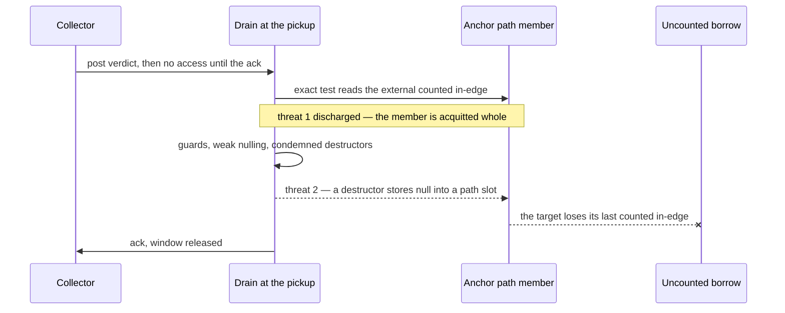

# The checkpoint horizon

## 1. The case

A checkpoint threatens a live borrow twice, and only one threat survives
as a condition: the drain frees condemned components, which the chain
invariant answers by construction, and the drain runs `__destruct`
bodies that store, which nothing in the compiler answers yet
([gc-horizon.md](../gc-horizon.md#the-horizon-list)).

```php
function render(Page $p): string {
    $meta = $p->meta;      // anchored: Meta is closed, pure, destructor-free
    $buf  = new Buffer();  // owned: the result of `new`
    $buf  = null;          // Buffer's purity closure is pure, so this is no
                           //   release horizon — but the death reaches a pickup
    return $meta->title;   // the borrow is live across that pickup
}
```

The release of `$buf` reaches zero and tears down eagerly, and message
pickup runs at the exit of the outermost dispose
([rc-walk.md](../rc-walk.md#the-design-constraint-that-produced-this-shape)).
So a lifetime with no call and no impure release still contains a drain
site, and the checkpoint horizon is the one kind that survives the
sound configuration's own defaults
([gc-horizon.md](../gc-horizon.md#the-algorithm-in-two-sentences)).

## 2. The lattice verdict

`$meta` is **anchored**. It clears every rung of the cascade
([gc-horizon-states.md](../gc-horizon-states.md#the-lattice-decision-drawn)):
it is neither a `new` result nor a call result nor a parameter, `Meta`
is not COW-eligible, its class is transitively destructor-free under
the closed-world closure
([pure-destructors.md](../pure-destructors.md#purity-is-transitive)), the
path crosses no unique-ownership entity and no weak cell, and the load
dominates the one horizon and the return.

`$p` is **owned** as a by-value parameter and `$buf` as the result of
`new`, both by base case
([gc-horizon.md](../gc-horizon.md#the-ownership-lattice)). `$p` is the
counted root the chain ends in.

## 3. The horizon set

One horizon: **a checkpoint that can drain a verdict**, at the exit of
`$buf`'s dispose
([gc-horizon-states.md](../gc-horizon-states.md#the-eight-horizon-kinds)).
The `$buf = null` release is not a release horizon, `Buffer`'s
transitive-purity closure being pure
([pure-destructors.md](../pure-destructors.md#the-purity-ladder)), and the
store to `$buf` is not a store horizon, `$buf` sitting on no anchor
chain.

Where checkpoints sit, all from
[rc-walk.md](../rc-walk.md#the-design-constraint-that-produced-this-shape):

| Site | What runs there | Drains a verdict |
|---|---|---|
| the death branch of `ll_release` | the handshake ack, before this death's teardown | no |
| the exit of the outermost dispose | message pickup and the parked flush | yes |
| a batched scope-exit run | `ll_gc_checkpoint_ack` in front, the pickup after the run | yes, after the run |
| `ll_release_vector` | the same split, in one call | yes, after the run |
| the compiler's poll, `ll_gc_maybe_collect` | pickup between operations | yes |

The condition binds every site in the right-hand column. Under the
hand-off design that is two arms — the prologue visit, which runs P2
destructor calls, and the unchanged whole drain an NR-or-impure
component takes at whatever death or poll picks it up
([pure-destructors.md](../pure-destructors.md#the-hand-off-drain)).

**Reclamation is discharged at every one of them.** The drain severs
and frees condemned components whether or not destructors exist, and the
argument that no path member can be among them has three links. The
exact test balances counted references against in-component in-degree,
so a component holding an external counted in-edge is acquitted whole
([rc-walk.md](../rc-walk.md#phase-4--verify-and-release-mutator-thread-by-message)).
Every edge of the anchor path is a counted heap edge and the chain ends
in a counted root, so such an in-edge exists for every path member
([gc-horizon.md](../gc-horizon.md#the-ownership-lattice)). And the
collector performs no access to a posted component between the post and
the drain's ack, so the state the exact test reads is the state the
mutator itself last wrote
([drain-window.md](../drain-window.md#the-claim)).

**Path severing by a drain destructor is what remains.** A `__destruct`
the drain runs is PHP code that can store into the anchor path
([rc-walk.md](../rc-walk.md#phase-4--verify-and-release-mutator-thread-by-message),
step 2). The discharge named by the algorithm is reverse reachability
whose root set is the downward closure of the condemned set — the sever
releases external children destructors and all — and that closure is
what transitive purity computes
([gc-horizon.md](../gc-horizon.md#the-horizon-list)). Until the analysis
exists, the pickup is a horizon.

## 4. The lowering

```
$meta = load $p->meta        ; no retain
$buf  = new Buffer           ; owned, birth count or the creation reference
retain $meta                 ; the promotion, dominating the pickup
release $buf                 ; zero: dispose, then the pickup at its exit
$t    = load $meta->title
release $meta                ; drop point: last use, Meta being pure
```

Today's lowering retains `$meta` at the load and releases it at the same
drop point, so the horizon lowering pays the same pair over a shorter
subrange
([static-lifetimes.md](../../memory/static-lifetimes.md#drop-point-policy)).
The saving appears only when the checkpoint is certified: with the
condemned-set closure proven pure the horizon set is empty, no promotion
point is computed, and both instructions disappear.

## 5. States touched

- **lattice state**: `Anchored(chain)` → `Owned` at the promotion retain
  ([gc-horizon-states.md](../gc-horizon-states.md#the-axes-the-lattice-creates)).
- **horizon set**: ∅ → {a checkpoint that can drain a verdict}.
- **promotion point**: ⊥ → the point after the load of `$meta` and
  before the release of `$buf`.

Two collector axes are read as premises and moved by nothing here: the
drain-exclusivity window, held from post to ack, and the collector phase
that posts the verdict
([gc-horizon-states.md](../gc-horizon-states.md#the-collector-states-the-design-must-survive-but-never-touches)).
The checkpoint protocol itself is unchanged in code; what thins is the
rate of batched scope-exit acks
([gc-horizon-states.md](../gc-horizon-states.md#what-the-runtime-must-not-change)).

## 6. The picture



## 7. The oracle

**A1 — reclamation does not reach the path.** Build a component whose
members carry an external counted in-edge from a frame-rooted chain,
post a verdict for it, and drain: the exact test balances nowhere, the
message is dropped whole, and no member is freed. Instrument: a runtime
test in the ll-model crate, against product code (`model/src/walk.rs`,
`model/src/collector.rs`, `model/src/epoch.rs`).

**A2 — a drain destructor severs.** Build a condemned component one of
whose members has a `__destruct` that nulls a field on a live chain, and
assert the chain target reaches zero and is freed inside the drain
visit. Same instrument; the assertion is the free order the runtime
already produces.

**A3 — the promotion precedes the pickup.** The compile-time half: the
shadow word reaches zero under a live elided borrow whenever the
promotion was placed after the pickup, and the journal names the
elided site ([gc-horizon.md](../gc-horizon.md#verification-artifacts-a-precondition-of-implementation)).

Buildable today: yes for A1 and A2, against the crate's drain, exact
test and destructor path; no for A3, which needs the shadow-count
lowering and therefore the compiler.

## 8. Prior art in this repository

- [release.md](release.md) owns the death this case's pickup rides, and
  the release horizon that a P0 class exempts it from.
- [destructor-bearing.md](destructor-bearing.md) owns the purity closure
  that makes `Meta` anchorable and `Buffer`'s release quiet.
- [arena.md](arena.md) carries the second user-code point with this
  threat shape, the arena reset's destructor fixpoint.
- [drain-window.md](../drain-window.md) is the exclusivity invariant,
  proven for the shipped protocol, with the eager-death amendment noted
  in its own banner.
- [rc-walk-danger-cases.md](../rc-walk-danger-cases.md) carries DC5's
  mitigation sentence, which follows the chain invariant rather than
  leading it.
- [adversarial.md](adversarial.md), PH13 and PH16 — the drained verdict
  whose purity differs between two executions of one instruction, and the
  loop whose whole release run is elided, leaving the epoch no ack site.

## 9. Open items

1. **The discharge has no compile-time form.** The condemned set is a
   runtime object, and the condition is stated over its downward
   closure. What a compiler quantifies over instead — every class whose
   destructor can store into a field of the path's type, or something
   narrower — is not determinable from the RFC as it stands. The missing
   specification is the reverse-reachability analysis in a form a
   compiler can run, alongside the summary language's conservative
   default ([gc-horizon.md](../gc-horizon.md#open-questions), question
   1).
2. **This horizon kind is unmeasurable before Phase D.** Compiler-placed
   checkpoints do not exist in source, so checkpoint horizons are absent
   from both bounds of the corpus scan by construction
   ([gc-horizon-states.md](../gc-horizon-states.md#scan-channels)). The
   only pre-D instrument can therefore neither kill nor open on the one
   horizon kind that binds even a call-free lifetime.
3. **The condition moves with the purity ladder.** If the ladder's open
   questions move user-code duties into the sliced tail, every
   checkpoint carrying a slice inherits the condition
   ([gc-horizon.md](../gc-horizon.md#composition-with-the-designed-family);
   [pure-destructors.md](../pure-destructors.md#open-questions)).
4. **A second user-code point matches this threat shape and is in no
   horizon kind.** The arena reset runs `__destruct` in rounds
   ([arena-reset.md](../../memory/arena-reset.md#step-1--validate-trace-destruct-a-fixpoint-loop)),
   which is question 8's second half
   ([gc-horizon.md](../gc-horizon.md#open-questions)); the failing shape
   is in [arena.md](arena.md).
