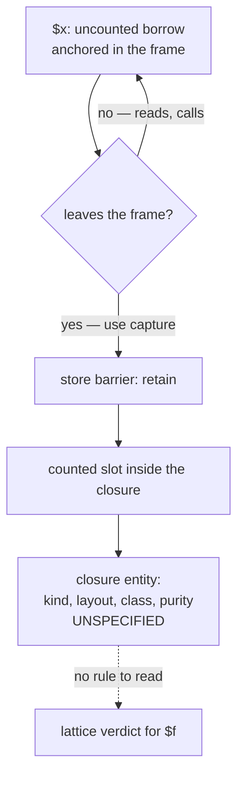

# Closure — a hole report

## 1. The case

**This case is a hole report.** The repository specifies no closure
entity kind, no closure layout and no closure class, so the sections
below carry one substantive fact and, wherever a verdict would need a
layout, the words "not determinable from the RFC as it stands". The
entity-kind field's eighth code is reserved and the parenthesis that
disposes of closures reads "a plain closure is an object"
([classes.md](../../classes.md#flags-layout)); the backlog carries
closures — capture by value and by reference, `$this` binding,
first-class callable syntax — as an unwritten document
([BACKLOG.md](../../../BACKLOG.md#model--remaining-documents)).

The one fact that exists is the third worked case of "What may own a
borrow": a `use` capture is a store, and every store goes through the
barrier, so the captured reference is counted by construction
([static-lifetimes.md](../../memory/static-lifetimes.md#what-may-own-a-borrow)).

```php
$x = $obj->other;                            // a borrow of a heap field
$f = function () use ($x) { $x->run(); };    // capture is a store: +1
$f();
```

That fact is what makes the uncounted-borrow obligation a within-frame
property rather than a whole-program one: an uncounted borrow can only
ever live in a frame slot, and both it and its owner are decided by one
compilation of one function
([static-lifetimes.md](../../memory/static-lifetimes.md#what-may-own-a-borrow)).

## 2. The lattice verdict

Split, and only one half is determinable.

- **The captured reference** — counted, by the barrier rather than by the
  lattice. The capture store retains, exactly as any store into a heap
  slot does, so the closure's slot holds a counted reference whatever the
  lattice decided about `$x` before that point.
- **`$x` up to the capture** — not determinable from the RFC as it stands.
  Whether the capture site is a horizon for `$x` depends on what the
  capture lowers to, and the lowering does not exist here. Under the
  failure default the answer is owned, because analysis failure selects
  owned and never guesses anchored
  ([gc-horizon.md](../gc-horizon.md#the-ownership-lattice)).
- **`$f` itself** — not determinable from the RFC as it stands. The
  lattice reads six properties of the referent
  ([gc-horizon-states.md](../gc-horizon-states.md#the-axes-the-lattice-reads)),
  and a closure supplies an answer to one of them: its kind is object,
  by the parenthesis in the flags table. Its class, its transitive purity
  closure, whether its captured slots are counted slots and whether it is
  COW-eligible are all unstated, and four of the six axes therefore have
  no value to read.

## 3. The horizon set

One kind is determinable, the rest are not.

- `$f()` — a call, and by default a call without a trusted summary, so a
  horizon ([gc-horizon.md](../gc-horizon.md#the-horizon-list)). Whether it
  is instead dynamic dispatch the class set cannot close depends on
  whether a closure carries a class the compiler can narrow, which is
  unstated. Both readings land on horizon, which is why the default is
  safe here and useless as a measurement.
- The capture store — not determinable from the RFC as it stands. A store
  is a horizon when it severs a borrowed path under the may-alias rule
  ([gc-horizon.md](../gc-horizon.md#inside-the-horizon-what-the-borrow-must-prove)),
  and whether a capture slot can alias a path base cannot be answered
  without the layout that says what a capture slot is.
- The closure's own release — not determinable. The release horizon reads
  the released class's transitive purity closure
  ([pure-destructors.md](../pure-destructors.md#purity-is-transitive)), and
  a closure has no stated class to compute it over.

## 4. The lowering

One line is available and the rest is not. The capture's retain is the
store barrier's, emitted by the same rule as any counted store, and it is
not an elision candidate: the lattice elides pairs on anchored locals,
never on heap slots ([gc-horizon.md](../gc-horizon.md#the-two-forms)).

```
$x = load $obj->other        ; lattice state: owned by the failure default
$f = <closure creation>      ; not determinable: no layout, no kind code
store $x -> <capture slot>   ; the barrier retains: +1, counted by construction
call $f()                    ; a horizon under the conservative default
```

The middle line is the hole. Everything the horizon lowering would decide
about a closure — whether the creation allocates a traced entity, whether
the bound receiver occupies a counted slot, whether the body can be
summarized — is decided by the missing specification and not by this
design.

## 5. States touched

| Axis | Transition |
|---|---|
| entity kind | reads `object` for a closure, by the flags table's parenthesis ([classes.md](../../classes.md#flags-layout)); the eighth code stays reserved |
| lattice state | `$x`: `Owned` by the failure default, for want of an analysis that can see the capture |
| horizon set | gains a call kind at `$f()`, by the conservative default rather than by a computed summary |

Every other axis of
[gc-horizon-states.md](../gc-horizon-states.md#the-axes-the-lattice-reads)
is unmoved because it is unreadable: a closure's memory category, COW
flag, purity closure and uniqueness are properties of a layout this
repository does not define.

## 6. The picture



The diagram's subject is the boundary: everything left of the barrier is
specified by [static-lifetimes.md](../../memory/static-lifetimes.md#what-may-own-a-borrow),
everything right of it is the missing document.

## 7. The oracle

Not determinable from the RFC as it stands, and not for want of a
compiler. A test asserts a lowering, and the lowering has no
specification to be checked against: there is no closure entity for a
runtime test in the `ll-model` crate to construct, no kind code for it to
tag, and no destructor sequence for a differential lowering to compare.

The one assertion that survives is the barrier's, and it belongs to
another case: a store into a heap slot retains, so a captured reference
is counted — the store case's oracle, not this one's
([store.md](store.md)).

Buildable today: no, and the blocker is the specification rather than the
instrument. When the closure document exists, the first oracle it owes is
a differential-lowering assertion that a captured borrow's count matches
between the horizon build and the classic build, because the capture is
the one point where this design's uncounted region ends by construction.

## 8. Prior art in this repository

- [static-lifetimes.md](../../memory/static-lifetimes.md#what-may-own-a-borrow)
  — the third worked case, which is the whole factual base of this file.
- [classes.md](../../classes.md#flags-layout) — the eighth kind code is
  reserved, and a plain closure is an object.
- [classes.md](../../classes.md#entity-kind-and-non-object-teardown) — what
  a kind code buys: the free routine for a bare pointer, and the
  candidate buffer's membership test.
- [BACKLOG.md](../../../BACKLOG.md#model--remaining-documents) — closures
  as an owed document.
- [suspension.md](suspension.md) — the other hole report of this book, on
  the same terms.
- [adversarial.md](adversarial.md), PH10 — the captured borrow published
  through a return, a registry, a property or a backtrace, which is the
  shape the missing specification has to answer.

## 9. Open items

The missing specification, itemized. None of these is a gap in
[gc-horizon.md](../gc-horizon.md); each is a document this repository owes
before the lattice can be evaluated on a closure at all.

1. **The closure's entity kind.** Whether a closure occupies the reserved
   eighth code or is an ordinary object with a generated class
   ([classes.md](../../classes.md#flags-layout)). The kind selects the free
   routine and decides candidate-buffer membership, so the answer settles
   whether a closure can hold a counted slot a cycle closes through.
2. **The closure's layout.** What a capture slot is, whether by-value and
   by-reference captures occupy different slot kinds, and whether the
   captured set is traced as data the way `traced_runs` traces an object's
   properties ([classes.md](../../classes.md#entity-kind-and-non-object-teardown)).
3. **The bound receiver.** Whether `$this` binding occupies a counted slot
   or is reconstructed at call time. A counted slot makes every bound
   closure a counted holder of its receiver; the alternative is an
   uncounted edge, which is the shape [weakref.md](weakref.md) shows the
   chain invariant cannot carry.
4. **What a closure call does to the horizon set.** Whether a summary can
   name a closure body, which is the summary language's question —
   [gc-horizon.md](../gc-horizon.md#open-questions) question 1 — read on a
   callee that has no name. Without it every `$f()` is a horizon and the
   free region ends at the first invocation.
5. **The closure's purity closure.** The release horizon and the
   checkpoint condition both read a class-level verdict
   ([pure-destructors.md](../pure-destructors.md#purity-is-transitive));
   a closure with captured counted slots has a death cascade and therefore
   owes one.
6. **The by-value half of PH10 is answered by section 1's one fact; the
   rest is not.** A capture is a store and the barrier retains, so a
   closure published through a return, a registry, a property or a
   backtrace carries a counted reference whatever its escape analysis
   concluded. One shape stays open and needs the missing
   specification: a closure the compiler does not allocate at all, where
   there is no store and therefore no retain. The by-reference half needs
   no layout — `use (&$x)` is a by-reference escape, a horizon kind with
   no lift ([gc-horizon.md](../gc-horizon.md#the-horizon-list)), and it
   is what [reference-box.md](reference-box.md) carries. PH10.
