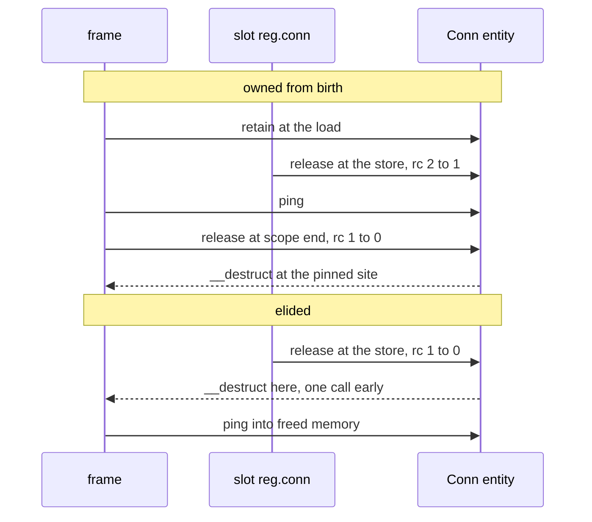

# Destructor-bearing target — exclusion by the purity closure

## 1. The case

A borrow whose target's class is not transitively destructor-free is
owned from birth, because eliding its count lets a severing store between
the borrow's last use and the scope's end reach zero early, which moves
`__destruct` off the scope-end pin the drop-point policy sets
([gc-horizon.md](../gc-horizon.md#the-ownership-lattice)). The pin is
Zend-observable timing, so the move is a semantic change and not a
performance one.

```php
class Conn {
    function __destruct() { $this->log->close(); }   // impure: an external write
}

function serve(Registry $reg): void {
    $c = $reg->conn;      // Conn is not transitively destructor-free
    $reg->conn = null;    // the displaced reference's release
    $c->ping();
}                         // scope end: where today's release of $c runs __destruct
```

## 2. The lattice verdict

**Owned from birth.** "Transitively destructor-free" is computed by the
same closed-world closure purity uses: the classes every counted field
can hold, their fields' classes, and so on to the closure, with one
impure destructor anywhere in it making the holder impure
([pure-destructors.md](../pure-destructors.md#purity-is-transitive)).

The default direction is what makes the exclusion wide. An open hierarchy
under the static class, or an unresolvable field, defaults to
not-destructor-free and the borrow to owned
([gc-horizon.md](../gc-horizon.md#the-ownership-lattice)): a
destructor-free base with a destructor-bearing subclass must not pass,
which is the same failure mode the acyclic flag has — a subclass opening
the set, `mixed`, an array of unknown element class
([pure-destructors.md](../pure-destructors.md#purity-is-transitive)).

**Which ladder tiers count as destructor-bearing here.** The ladder grades
one destructor body and the closure joins the tiers into a class-level
verdict ([pure-destructors.md](../pure-destructors.md#the-purity-ladder)):

| Tier | For this exclusion | Why |
|---|---|---|
| P0 | destructor-free | no `__destruct` in the hierarchy; nothing runs at the release |
| P1 | destructor-free after erasure | erased to P0 — the compiler clears `CLASS_HAS_DESTRUCTOR` and emits no registration, so no user code runs at any release |
| P2 | destructor-bearing | P2 keeps its call: child-release order is language surface, so the body still runs at the release site |
| NR | destructor-bearing | NR counts as impure in the release horizon, and it does I/O at the release site |

The erasure boundary is an inference from two documents rather than a
sentence either of them writes; item 1 of section 9 records it.

## 3. The horizon set

- `$reg->conn = null` — two kinds at one site: a store through a path
  base, and a release of a class whose purity closure is not pure. Eager
  death runs `__destruct` at the release site, no drain involved
  ([gc-horizon.md](../gc-horizon.md#the-horizon-list)).
- `$c->ping()` — a call without a trusted summary.
- The scope's end — a checkpoint that can drain a verdict, and the release
  site the drop-point policy pins `__destruct` to
  ([static-lifetimes.md](../../memory/static-lifetimes.md#drop-point-policy)).

The set is computed and then unused: the base case fires before the
horizon list is consulted, so no promotion point is placed. Recording the
set anyway is what section 4 needs.

## 4. The lowering

The verdict is owned, so the horizon lowering is today's lowering, pair
for pair. The sequence worth printing is the elided one, because it shows
the move rather than a dangling pointer alone:

```
;; today, and under the horizon lowering: owned from birth
$c = load $reg->conn       ; retain $c
store null -> $reg->conn   ; release the displaced reference: rc 2 -> 1, no death
call $c->ping()
release $c                 ; rc 1 -> 0: __destruct runs HERE, at scope end

;; the elided lowering the exclusion forbids
$c = load $reg->conn       ; no retain
store null -> $reg->conn   ; release: rc 1 -> 0
                           ; __destruct runs HERE, before $c->ping()
call $c->ping()            ; use after free
```

Two defects in one sequence, and only the second survives a
destructor-free target. The use-after-free is what any severing store
does to an unprotected borrow, and [store.md](store.md) owns it. The move
of `__destruct` from the scope-end release to the store is what this
exclusion exists for: teardown's three phases run in the wrong place —
`__destruct`, then the weak nulling, then the child releases, then the
memory
([object-lifecycle.md](../../../runtime/object-lifecycle.md#teardown-three-phases))
— and every one of them is observable to the program through the
destructor body.

**The boundary against [release.md](release.md).** This case is the
*entity* exclusion that keeps a borrow out of the lattice before any
horizon is consulted; the release horizon is the *event* that ends a
borrow of an already-pure target when some other entity's impure release
runs user code on the path.

## 5. States touched

| Axis | Transition |
|---|---|
| transitive purity closure | reads not-pure, at the verdict; unresolved reads the same way, by the failure default ([gc-horizon-states.md](../gc-horizon-states.md#the-axes-the-lattice-reads)) |
| lattice state | `$c`: `Owned` from birth, the fourth rung of the cascade ([gc-horizon-states.md](../gc-horizon-states.md#the-lattice-decision-drawn)) |
| `DESTRUCTOR_PENDING`, flag 8 | set once the constructor returned successfully; the per-instance half of the class-level verdict ([classes.md](../../classes.md#flags-layout)) |
| `DESTRUCTOR_RAN`, flag 9 | clear → set before the call, the exactly-once guard ([object-lifecycle.md](../../../runtime/object-lifecycle.md#teardown-three-phases)) |
| horizon set | computed and unused, because the verdict precedes it |

## 6. The picture



The two halves share a program and differ in where the dashed arrow
lands, which is the whole content of the exclusion.

## 7. The oracle

**Runtime.** Eager death runs `__destruct` at the release site with no
drain involved, and a second counted holder moves that site to its own
release. A test builds an entity with two counted holders, releases one,
asserts no destructor ran, releases the other, and asserts the destructor
ran exactly once, at that release, ahead of the child releases and the
weak nulling order teardown specifies
([object-lifecycle.md](../../../runtime/object-lifecycle.md#teardown-three-phases)).
Instrument: a runtime test in the `ll-model` crate, whose release path,
`DESTRUCTOR_RAN` guard and dispose phases exist today.

**Lowering.** The destructor sequence and the death set per checkpoint
batch are identical between the horizon build and the classic build.
Instrument: the differential lowering. Its oracle is nesting-insensitive
by design — a destructor-free target may legitimately move its *free*
into a parent's cascade — but a destructor-bearing target is owned from
birth, so its timing is pinned and any destructor-sequence diff is a real
defect ([gc-horizon.md](../gc-horizon.md#verification-artifacts-a-precondition-of-implementation)).

Buildable today: yes for the runtime assertion, against the crate's
release and dispose paths; no for the lowering assertion, which needs the
compiler.

## 8. Prior art in this repository

- [pure-destructors.md](../pure-destructors.md#the-purity-ladder) — the
  four tiers, their compiler obligations, and what each lets the runtime
  skip.
- [pure-destructors.md](../pure-destructors.md#the-verdict-first) — what
  freeing becomes per case, including the row where an impure member routes
  its component to the unchanged whole drain.
- [static-lifetimes.md](../../memory/static-lifetimes.md#drop-point-policy)
  — the split by observability that this exclusion protects.
- [object-lifecycle.md](../../../runtime/object-lifecycle.md#teardown-three-phases)
  — the three phases, and the load-bearing order of the weak nulling
  against the child releases.
- [gc-horizon.md](../gc-horizon.md#the-record) — Critic round 3 raised the
  move of `__destruct` off the scope-end pin as a soundness finding, and
  round 4 closed the subclass hole in the same exclusion.

## 9. Open items

1. **Which tier the lattice reads is unstated.** The base case says
   "transitively destructor-free" and cites the purity closure
   ([gc-horizon.md](../gc-horizon.md#the-ownership-lattice)), while the
   closure produces a tier rather than a boolean
   ([pure-destructors.md](../pure-destructors.md#purity-is-transitive)).
   Section 2's table reads P1 as destructor-free through its erasure and
   P2 as destructor-bearing through its kept call; neither reading is
   written down, and the two differ on a real population — the P2 share is
   its own sub-channel of the corpus scan
   ([gc-horizon.md](../gc-horizon.md#economics)).
2. **The exclusion's own price is unmeasured.** The
   destructor-bearing-target share is a scan channel and carries no number
   ([gc-horizon-states.md](../gc-horizon-states.md#scan-channels)); with
   the open-hierarchy default folded in, the channel measures the
   unresolvable population as well as the genuinely destructor-bearing
   one, and the two are not separated in the channel list.
3. **The checkpoint condition moves with the purity ladder.** If the
   ladder's open questions move user-code duties into the sliced tail,
   every checkpoint carrying a slice inherits the condition
   ([gc-horizon.md](../gc-horizon.md#composition-with-the-designed-family)).
   The residual duties and the tail bound are open questions 2 and 3 of
   [pure-destructors.md](../pure-destructors.md#open-questions), and this
   exclusion is stable under both, because an owned-from-birth borrow
   crosses a checkpoint on its own count.
4. **The no-throw obligation prunes the passing population by an
   unmeasured amount.** An exception leaving `__destruct` carries `$this`
   in its backtrace, so P1, P2 and NR all require a no-throw proof, and
   the hypothesis on record is that this obligation prunes harder than any
   other rule ([pure-destructors.md](../pure-destructors.md#the-purity-ladder)).
   Every class it prunes lands on this exclusion.
