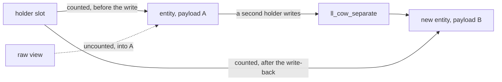

# FFI — the exclusion, and the view no horizon kind names

## 1. The case

An FFI class owns its pointer and freeing is the class's own
`__destruct`, lowered into the type's `dispose`
([ffi.md](../../memory/ffi.md#freeing)). So an `FFIBox` is never
transitively destructor-free, every borrow of one is owned from birth by
the destructor base case, and the exclusion is one line. This case exists
for what the line leaves open: a `#[Borrow]` view, whose invalidation is
visible to no horizon kind, and an FFI handle used as a chain root, whose
liveness is checked by nothing.

```php
#[FFI]
class Row {
    #[Borrow] public string $cell;   // a pointer into managed bytes
}

function render(Report $r): string {
    $row  = borrow_cell($r->title);  // a view over the string's payload
    $r->title .= "!";                // a write: the COW rule separates
    return read($row->cell);         // reads the old payload
}
```

The declaration syntax for `borrow_cell` is deferred with foreign
functions and libraries ([ffi.md](../../memory/ffi.md#deferred)); what the
attribute catalog does state is the field: `#[Borrow]` is a borrowed
pointer or string, not owned, not freed, anchored to an owner
([ffi.md](../../memory/ffi.md#attribute-catalog)).

## 2. The lattice verdict

Owned or outside the lattice, by three different routes.

- **A reference to an `FFIBox`** — owned from birth. The box's teardown
  runs the wrapped type's `dispose`
  ([classes.md](../../classes.md#entity-kind-and-non-object-teardown)), so
  the class is never transitively destructor-free and the base case fires
  before any horizon is consulted
  ([gc-horizon.md](../gc-horizon.md#the-ownership-lattice)). The state set
  reaches the same result as identity 4 of its collapse arithmetic
  ([gc-horizon-states.md](../gc-horizon-states.md#the-product-and-what-collapses-it)).
- **`$r->title`** — owned, a string, COW-eligible by kind, because the
  separation test reads the count
  ([values.md](../../values.md#refcount-is-always-maintained-on-cow-entities)).
- **A bare `#[FFI]` reference** — outside the lattice entirely. A
  zero-abstraction entity carries no `RcHeader` and no class pointer, is
  invisible to every memory-management strategy, and never enters a
  ValueBox ([zero-abstraction.md](../../memory/zero-abstraction.md#definition)).
  There is no count to elide, so there is no saving to measure and no
  proof to discharge; its lifetime is the owner-binding tier of
  [static-lifetimes.md](../../memory/static-lifetimes.md#the-tier-ladder),
  not this design.

An FFI handle is also a legitimate root for someone else's chain:
rc-walk names it among the root categories a covering reference may be
([rc-walk.md](../rc-walk.md#what-this-design-does-not-solve)), and the
anchor definition repeats the list
([gc-horizon.md](../gc-horizon.md#the-ownership-lattice)). A borrow
anchored on a handle is lawful and its liveness is checked by nothing at
all — the difference between the two anchors the terminology note draws
([README.md](README.md#terminology-three-meanings-of-borrow-in-this-repository)).

## 3. The horizon set

- `borrow_cell(...)` — a call without a trusted summary.
- `$r->title .= "!"` — a store through a path base, and a COW separation:
  the write allocates a new entity and the holder stores the returned
  pointer back at its own site
  ([values.md](../../values.md#copy-on-write-protocol)).
- `read($row->cell)` — a call without a trusted summary.

The invalidation of `$row->cell` appears in none of them. It is not a
counted edge, so no release names it; it is not a store the IR can read as
severing, because the entity the store targets is `$r->title` and the
pointer that dies is a raw address inside that entity's payload. A
pointer into a managed string's bytes is invalidated by any mutation of
that string, and nothing detects the violation
([ffi.md](../../memory/ffi.md#strings-and-arrays-at-the-boundary)). The
same sentence holds for an array. An FFI handle cannot perform the
write-back the COW barrier requires, because the foreign side holds its
own copy of the pointer
([values.md](../../values.md#copy-on-write-protocol)).

## 4. The lowering

The verdict is owned everywhere a count exists, so the horizon lowering
is today's lowering, instruction for instruction. Nothing in this case is
an elision candidate.

What changes with the view is not the count but the address:

```
$p = <payload address of $r->title>   ; the #[Borrow] view, a raw pointer
retain / release on $r->title         ; unchanged: the string is owned
store separated -> $r->title          ; new entity, new payload, old rc intact
read $p                               ; the old payload: no count moved,
                                      ;   no horizon fired, no test failed
```

Every counted holder behaves correctly through that sequence, which is
the point: the failure is invisible to the mechanism this design reasons
with. The escape hatches the documents name are a copy at the boundary or
an interned string, whose address and contents are fixed for the life of
the process ([ffi.md](../../memory/ffi.md#strings-and-arrays-at-the-boundary)).

## 5. States touched

| Axis | Transition |
|---|---|
| entity kind | reads `FFIBox` for the wrapper; the wrapped type's descriptor is an instance field in the box's body, never at `+8` ([classes.md](../../classes.md#entity-kind-and-non-object-teardown)) |
| transitive purity closure | not pure, through the wrapped class's `__destruct` ([ffi.md](../../memory/ffi.md#freeing)) — the axis that produces the exclusion |
| anchor chain | may end in an FFI handle as its counted root, one of the categories rc-walk derives ([rc-walk.md](../rc-walk.md#the-central-identity-roots-are-derived-not-enumerated)) |
| COW eligibility | `$r->title`: the write fires separation, so the holder's slot takes a new entity address while the borrowed payload address does not move with it |

## 6. The picture



The mechanism is the split between the entity and its payload: the
holder's write-back keeps every counted reference correct, and the raw
view was never one of them.

## 7. The oracle

**Runtime.** A test writes through a second holder of a COW string and
asserts the payload address recorded before the write no longer belongs
to the entity — that is, that a `#[Borrow]` view taken before the write
is stale while every count is correct. Instrument: a runtime test in the
`ll-model` crate, which already exercises the separation order
(`model/src/string/tests/the_cow_rule_and_the_order_it_reads_in.rs`).
The assertion is a negative one: it proves the invalidation is
undetectable by the count, and it is the only thing a test can say about
this hole until the interop pass rules.

**Lowering.** No borrow of an `FFIBox` is anchored. Instrument: the
differential lowering, whose oracle is the destructor sequence and the
death set per checkpoint batch — an `FFIBox`'s destructor frees C memory,
so a sequence diff here is a real defect rather than a nesting change
([gc-horizon.md](../gc-horizon.md#verification-artifacts-a-precondition-of-implementation)).

Buildable today: yes for the runtime assertion, against the crate's COW
string paths; no for the lowering assertion, which needs the compiler the
differential lowering runs on.

## 8. Prior art in this repository

- [ffi.md](../../memory/ffi.md#the-owner-model) — the owner model, and the
  `FFIBox` fallback that supplies the header a headerless struct lacks.
- [zero-abstraction.md](../../memory/zero-abstraction.md#lifetime-two-compiler-strategies)
  — the two compiler strategies, owner binding and box attachment.
- [values.md](../../values.md#copy-on-write-protocol) — the separation
  rule, and the sentence that an FFI handle cannot write back.
- [rc-walk.md](../rc-walk.md#what-this-design-does-not-solve) — cycles
  through FFI wrappers are skipped totally, so a ring through one is never
  collected; conservative, and independent of this case.
- The terminology note of [README.md](README.md#terminology-three-meanings-of-borrow-in-this-repository),
  which separates `#[Borrow]` from the anchored borrow and from ffi.md's
  own "anchor".

## 9. Open items

1. **Boxing a struct with a live `#[Borrow]` field is a recorded
   defect.** Deferred to the interop pass with a leaning already agreed
   on 2026-07-22: model `#[Borrow]` as an `FFIBox` sub-kind carrying a
   don't-free flag, make a borrow into managed memory retain its owner at
   the box point, and make a borrow into raw C memory not boxable, raising
   at that point ([BACKLOG.md](../../../BACKLOG.md#ffi-document--review-findings)).
   Until it is written, the horizon lattice has no statement to read about
   a boxed view's owner.
2. **The view's invalidation has no horizon kind.** Section 3 shows a
   severing event outside all eight kinds
   ([gc-horizon-states.md](../gc-horizon-states.md#the-eight-horizon-kinds)).
   It is not a gap this design can close alone: the event is severing for
   the FFI surface's invariants and not for the chain invariant, so the
   ruling belongs with the family-wide borrow-analysis question — one
   analysis parameterized by the invalidation set,
   [gc-horizon.md](../gc-horizon.md#open-questions) question 5 — or with
   the interop pass named in item 1.
3. **Foreign memory has no memory-category value.** The category axis has
   four values, all managed
   ([arenas.md](../../memory/arenas.md#object-categories-by-memory-strategy)),
   and the missing fifth is a recorded smaller contradiction of the FFI
   review ([BACKLOG.md](../../../BACKLOG.md#ffi-document--review-findings)).
   A borrow anchored on an FFI handle therefore has a root whose category
   the lattice cannot read, which is adjacent to question 8 without being
   covered by it.
4. **An FFI-handle root is checked by nothing.** The chain invariant's
   discharge runs through the Phase 4 exact test
   ([rc-walk.md](../rc-walk.md#phase-4--verify-and-release-mutator-thread-by-message)),
   which reads counted references; a handle held only by foreign code
   contributes no count and is trusted as a root by declaration. The
   repository states the root category and states no obligation on the
   foreign side that keeps it true.
