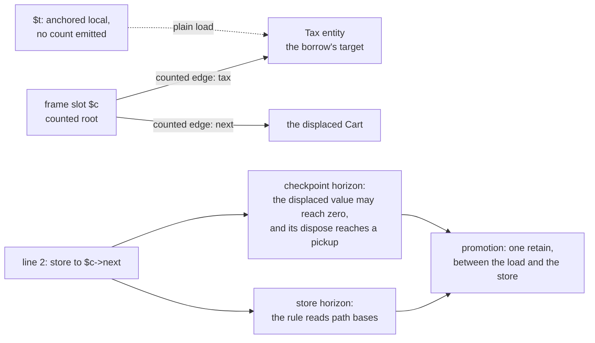

# Object: the anchorable kind

## 1. The case

A plain object reached by a property load is the referent every other
case is measured against. It is one of the two entity kinds that reach
the ANCHORED leaf of the cascade
([gc-horizon-states.md](../gc-horizon-states.md#the-axes-the-lattice-reads)),
so it is the only kind in this book whose borrow can cost nothing at
all.

```php
final class Tax  { public float $rate; }
final class Cart { public Tax $tax; public ?Cart $next; }

function rate(Cart $c, Cart $more): float {
    $t = $c->tax;        // birth: a load at a constant offset
    $c->next = $more;    // a store to a different declared property
    return $t->rate;
}
```

`$c` and `$more` are owned by convention, because the callee frame holds
a counted reference for the receiver and every by-value parameter
([gc-horizon.md](../gc-horizon.md#the-ownership-lattice)). `$t` is the
borrow the case is about. A typed property whose declared type is a
class is a bare pointer at a fixed offset
([classes.md](../../classes.md#slot-kinds)), so the load emits one
instruction and the anchored lowering emits nothing beside it.

## 2. The lattice verdict

**Anchored, at the last rung of the cascade.** `$t` clears the base
cases in order
([gc-horizon.md](../gc-horizon.md#the-ownership-lattice)): the value is
not a `new` result, a call result, a receiver or a by-value parameter;
its kind is object, so the COW rung does not take it; `Tax` is final
with one `float` field, so its transitive-purity closure is pure and the
destructor rung passes
([pure-destructors.md](../pure-destructors.md#purity-is-transitive));
the path crosses no unique-ownership entity and no weak cell; and the
birth dominates the one horizon of section 3 and the exit.

Object and lazy object are the two kinds that get this far because the
other five leave the anchorable population by an identity rather than by
a per-site proof
([gc-horizon-states.md](../gc-horizon-states.md#the-product-and-what-collapses-it)):
string, array and ReferenceBox are excluded as COW-eligible values
([array.md](array.md), [string.md](string.md),
[reference-box.md](reference-box.md)), `FFIBox` through the destructor
rung, since an FFI class owns its pointer and so always has a destructor
([ffi.md](../../memory/ffi.md#freeing)), and WeakRef through the
uncounted `target` edge
([weak-references.md](../../weak-references.md#the-weak-cell-is-the-canonical-weakreference-itself)).

The rung the source cannot answer is the memory category. Retain and
release return early on immortal entities and are absent for
request-arena ones
([arenas.md](../../memory/arenas.md#object-categories-by-memory-strategy)),
while the lattice reads the static class and never the category, so
`Tax` carries one verdict for instances that would answer that rung
differently — open question 8.

## 3. The horizon set

**One member: the store on line 2**, under the may-alias rule as
written. The rule is that a store through any may-alias of a path base
is a severing store
([gc-horizon.md](../gc-horizon.md#inside-the-horizon-what-the-borrow-must-prove)),
and the store's base is `$c`, which is the path base itself rather than
a may-alias of it. So the store qualifies without the alias oracle being
consulted at all.

**A second member, from the same store.** An ordinary store retains the
new value, publishes it and drops the displaced one, so line 2 releases
whatever `$c->next` held. `Cart` is pure, so the release row does not
fire; the death that release may cause is not dismissed so easily. There
is no finality conjunct — "may reach zero" is not dischargeable
([gc-horizon.md](../gc-horizon.md#the-horizon-list)) — and if it does
reach zero, dispose runs, and message pickup at the exit of the outermost
dispose drains a verdict ([checkpoint.md](checkpoint.md)). `$t` is live
across it, the read of `$t->rate` coming after the store. So the set is
`{a store, a checkpoint that can drain a verdict}`, and the second member
is what any displacing store adds to any live range that spans it.

No escape, suspension, reflection or dynamic dispatch appears in the
snippet, and the call of section 4's second reading is absent from it, so
the remaining kinds
([gc-horizon-states.md](../gc-horizon-states.md#the-eight-horizon-kinds))
contribute nothing.

### Typed properties lift the store horizon

The named must-not-alias instrument is closed-class typed properties
giving type-incompatibility disjointness, and nothing else is assumed
([gc-horizon.md](../gc-horizon.md#inside-the-horizon-what-the-borrow-must-prove)).
It answers the shape where the store's base is a *different* local: a
store `$x->tax = $new` with `$x` declared as a class the closed set says
cannot be `Cart` reaches no edge of `$t`'s path, so the borrow survives
it. The instrument works because a declared class type closes the set of
classes a slot can hold, which is the same closure the acyclic flag and
the purity verdict are computed over
([static-lifetimes.md](../../memory/static-lifetimes.md#the-tier-ladder)).

The snippet's store is disjoint on a second ground the rule does not
name: `tax` and `next` are distinct declared properties, so they occupy
distinct fixed offsets in the same body
([classes.md](../../classes.md#slot-order)), and a store to one cannot
reach the other whatever `$c` aliases. The rule is stated over path
bases rather than over base-and-field pairs, so it reads this store as a
horizon — open item 2.

### The lazy object: materialization is call-shaped

A Ghost is allocated at full size with `+8` pointing at a generated
shim descriptor whose every vtable slot runs the initializer, rewrites
`class` back to the real descriptor and retries the call; the kind is
lazy until first touch and object after it
([classes.md](../../classes.md#ghost--class-pointer-swap-opt-in-cost)).
A Proxy is a separate wrapper instance holding one field in the `UNINIT`
state, and the first forwarded call materializes the real instance and
stores it into that field
([classes.md](../../classes.md#proxy--no-new-mechanism)).

Both materializations are horizons under kinds the list already carries.
The Proxy's forwarded call is a call without a trusted summary, and the
store that publishes the real instance is a store through the proxy,
which severs any borrowed path based on it. The Ghost's initializer runs
through a shim vtable slot, so a method call or an `instanceof` on an
untouched ghost is a call horizon
([classes.md](../../classes.md#instanceof-under-ghostproxy)). The
initializing stores that follow displace nothing, since the body is
zero-filled and every slot reads as uninitialized, and the store horizon
exists because the chain is severed
([gc-horizon-states.md](../gc-horizon-states.md#the-eight-horizon-kinds));
whether the rule's syntactic wording admits that distinction is the same
question as open item 2.

What the RFC does not settle is the plain property read. A property of a
known type compiles to a load at a constant offset that reads no class
pointer ([classes.md](../../classes.md#property-access)), so the shim
cannot interpose on it, while the Ghost section says initialization is
triggered "like any other access" without naming the mechanism for a
plain read. Until that is specified, whether `$b = $g->prop` on an
untouched ghost is a plain load or a call is not determinable from the
RFC as it stands, and with it the verdict for the second anchorable kind
— open item 1.

## 4. The lowering

```
; today
$t = load $c->tax
retain $t
store $c->next, $more
%r = load $t->rate
release $t                ; the drop-point policy
ret %r

; the horizon lowering, store horizon standing
$t = load $c->tax
retain $t                 ; the promotion, dominating the horizon
store $c->next, $more
%r = load $t->rate
release $t                ; unchanged
ret %r
```

The two differ in where the retain stands and in nothing else. The
promotion point is the latest point dominated by the birth that
dominates every horizon, every exit and every raise site of the live
range, and that lies inside no cycle the birth lies outside of
([gc-horizon.md](../gc-horizon.md#at-the-horizon-promotion)); here that
is between the load and the store, so `$t` holds its count over a
subrange of exactly the lifetime today's code counts it over.

Admit the field-level disjointness of section 3 and the store row lifts,
while the checkpoint row the same store carries does not: the displaced
value may still reach zero, and its dispose still reaches a pickup. The
promotion stays. Both instructions disappear only where the live range
spans no displacing store at all, which is what the worked example prints
for `$tax` ([README.md](README.md)), its one store-shaped event being a
summarized call.

## 5. States touched

- **lattice state**: `$t` is assigned `Anchored` where today's lowering
  assigns `Owned`; `$c` and `$more` stay `Owned` by convention.
- **anchor chain**: one chain is created — `$c`'s frame slot, a counted
  root, then the counted heap edge `tax` to the `Tax` entity.
- **horizon set**: `{a store to a chain local, or through a may-alias of
  a path base}`, one crossing, at line 2.
- **promotion point**: between the load and the store; ⊥ never arises
  here, because the birth dominates both the horizon and the exit.
- **class regime**: `Cart` and `Tax` are horizon classes — final,
  closed, destructor-free, which is the selection heuristic's own
  description ([gc-horizon.md](../gc-horizon.md#the-hybrid-counted-class-horizon-class)).
- **entity kind**: lazy → object at a ghost's first touch. No other case
  in this book moves this axis.

## 6. The picture



The lazy kind's materialization is a second mechanism and is drawn
nowhere, because what interposes on a plain property read of an
untouched ghost is the thing open item 1 says the RFC does not
specify.

## 7. The oracle

A test asserts that the compiled `rate()` contains exactly one retain of
`$t` when the store horizon stands and none when the disjointness
instrument admits the store, and that the destructor sequence and the
death set per checkpoint batch are identical between the two builds. The
instruments are the differential lowering, whose oracle is that sequence
and that set, and the shadow-count lowering, which fires when the shadow
word reaches zero under a live borrow and names the elided site
([gc-horizon.md](../gc-horizon.md#verification-artifacts-a-precondition-of-implementation)).
Both need a compiler that does not exist.

One premise of this case is testable without one: a runtime test in the
ll-model crate can build an untouched ghost, run the walk over it, and
assert that the shim's `traced_runs` and `dispose` behave as the real
class's would for an all-uninitialized instance, which is what makes a
borrow across a checkpoint safe while the ghost is still a ghost.

Buildable today: no for the lattice verdict, which needs the
differential and shadow lowerings; yes for the ghost premise, as a
runtime test in the ll-model crate against a hand-built ghost and the
existing walk.

## 8. Prior art in this repository

- The case book's worked example, `total()`
  ([README.md](README.md)), whose `$tax` is this case with the horizon
  lifted by a summary instead of by disjointness.
- The cascade and its six base-case reasons
  ([gc-horizon-states.md](../gc-horizon-states.md#the-lattice-decision-drawn)).
- The chain rule and the borrow-is-use amendment
  ([static-lifetimes.md](../../memory/static-lifetimes.md#the-chain-rule-and-the-borrow-as-a-use-of-its-anchor)),
  which is what licenses a heap field to cover this borrow at all.
- The three exclusion cases this one is the complement of:
  [array.md](array.md), [string.md](string.md),
  [reference-box.md](reference-box.md).
- [adversarial.md](adversarial.md), PH4 — the chain of section 5 ends in
  an owned frame local, and PH4 is what happens when that local's pair is
  elided by an always-provable rule; PH15 bounds which phis may carry such
  a chain at all.

## 9. Open items

1. **A plain property read of an untouched ghost has no specified
   materialization path.** The Ghost mechanism is a shim vtable
   ([classes.md](../../classes.md#ghost--class-pointer-swap-opt-in-cost))
   and a known-type property access is a constant-offset load that reads
   no class pointer ([classes.md](../../classes.md#property-access)).
   The missing specification is what interposes on the second, and until
   it exists the lattice verdict for a borrow born from a lazy object is
   not determinable from the RFC as it stands.
2. **The may-alias rule is stated over path bases and not over
   base-and-field pairs.** Two distinct declared properties of one
   object are distinct fixed offsets, so a store to one severs no path
   through the other; the store horizon
   ([gc-horizon.md](../gc-horizon.md#the-horizon-list)) reads it as a
   horizon anyway. Either the rule gains the field conjunct or the
   commonest object store in typed code is unliftable.
3. **The category rung is unanswerable from the static class** — open
   question 8 of [gc-horizon.md](../gc-horizon.md#open-questions),
   reached here because `Tax` may have instances in the request arena
   and in the GC heap with one lattice verdict between them.
4. **An elided pair can remove the count this case's chain ends in.** The
   chain of section 5 ends in `$c`, which is owned by convention, and
   inlining plus ordinary ARC cleanup deletes exactly that pair while the
   borrow metadata still ends at the now-uncounted copy — the chain then
   ends in an uncounted root, which is DC5. The other route reaches a
   plain property-load local rather than `$c`, and not in this snippet:
   an always-provable rule may take a counted class's local pair, but
   only where the enclosed region holds no call, no store, no release and
   no checkpoint
   ([gc-horizon.md](../gc-horizon.md#the-hybrid-counted-class-horizon-class)),
   and section 3's store is inside `$c`'s live range. Whether the
   convention pairs are in that set at all is unstated. Question 16.
