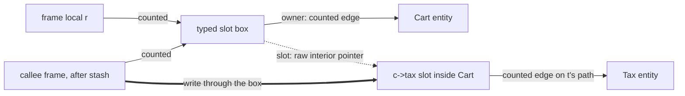

# ReferenceBox: exclusion by COW, qualified by the by-reference escape

## 1. The case

A reference to a ReferenceBox is owned by base case, and the fact this
case exists for is the other half of `&`: taking a reference is itself
one of the eight horizon kinds, so `&` both excludes a local from the
lattice and ends the proofs of every borrow whose path runs through the
slot it boxes.

```php
final class Tax  { public float $rate; }
final class Cart { public Tax $tax; }

function stash(Tax &$slot): void { /* may keep the box */ }

function apply(Cart $c): float {
    $t = $c->tax;      // birth: a plain load, anchored on $c
    $r = &$c->tax;     // by-reference escape: the box is allocated here
    stash($r);         // the callee may keep it past this frame
    return $t->rate;
}
```

`$c` is owned by convention
([gc-horizon.md](../gc-horizon.md#the-ownership-lattice)). The snippet
carries two verdicts: `$r` is excluded from the lattice, and `$t` is an
anchored borrow that the escape on line 2 promotes.

## 2. The lattice verdict

**`$r` is owned at the COW rung**, which names the reference box among
the COW-eligible values
([gc-horizon.md](../gc-horizon.md#the-ownership-lattice)), so the
collapse identity removes the kind from the anchorable population
([gc-horizon-states.md](../gc-horizon-states.md#the-product-and-what-collapses-it)).
**`$t` is anchored at birth and owned from the promotion point**, by the
placement rule of section 4.

### What a box is, and which count it holds

A reference is a separate refcounted box holding one Value slot,
`RcHeader | Value`, and variables bound by `&` point to the same box; it
is the only extra indirection in the model, paid only by code that uses
`&` ([values.md](../../values.md#referencebox-)). A box is allocated in
the GC heap whatever the holder's category, because every rule about a
box asks how many holders it has and the heap is the one place a count
means that.

The count is read by the duplication collapse rather than by the COW
separation rule: a copy of an array unwraps an element whose box nobody
else holds and takes the value behind it, and shares the box otherwise,
and nothing else collapses a reference
([values.md](../../values.md#referencebox-)). The base case's reason
therefore holds in shape and not in name — an uncounted holder falsifies
a count-reading test, and this is a count-reading test — while the base
case's own citation is to the COW invariant
([values.md](../../values.md#refcount-is-always-maintained-on-cow-entities)),
which never assigns the COW flag to a box. Open item 1.

The request arena makes the exclusion load-bearing rather than
precautionary. There the holder count is an upper bound, since a
container is reclaimed by the reset, so a duplication errs toward
sharing — and that is the safe direction only because "every live holder
carries a counted `+1`, so a count of one still proves sole ownership"
([values.md](../../values.md#referencebox-)). An anchored holder would
turn a safe over-approximation into an undercount and collapse a box two
bindings still name.

### The typed slot reference

`&$c->tax` on a typed property allocates the second variant of the box,
`RcHeader | owner (ptr, retained) | slot (ptr) | type`, distinguished by
a flag bit in the box's own header; reads box the raw value on the fly
and writes type-check and store raw
([values.md](../../values.md#references-into-unboxed-slots)). Two
properties matter to the chain invariant. The `owner` field is retained,
so the box holds a counted edge to the `Cart`, and a path that reaches
the box from a root stays a counted path. The `slot` field is a raw
interior pointer into the `Cart` body rather than an entity reference,
so it is no counted heap edge and the walker cannot record it as one —
which is where open item 2 starts.

## 3. The horizon set

**Two members, both at line 2 and line 3 of the body**: a by-reference
escape at `&$c->tax`, and a call without a trusted summary at
`stash($r)`
([gc-horizon-states.md](../gc-horizon-states.md#the-eight-horizon-kinds)).
The escape is the one that survives every instrument the design owns.

### The escape is not the store horizon, and no summary lifts it

The store horizon covers a store the compiler can see: a store to a
chain local, or a store through a may-alias of a path base, under a rule
whose lift is a must-not-alias instrument
([gc-horizon.md](../gc-horizon.md#inside-the-horizon-what-the-borrow-must-prove)).
The escape removes the store from the IR instead of aliasing it. After
line 2 the slot `$c->tax` is writable through a box whose future holders
this frame does not enumerate, so a write that severs `$t`'s path
happens at a site the analysis never reads. That is why the state table
records the escape's reason as "the local becomes writable elsewhere"
and its lift as nothing
([gc-horizon-states.md](../gc-horizon-states.md#the-eight-horizon-kinds)),
and why a summary for `stash()` proving it severs nothing leaves the
horizon standing: a summary describes a callee, and the box outlives the
call. The whole tier ladder refuses `&` on the same
ground, demoting a local touched by a reference to the runtime tier
([static-lifetimes.md](../../memory/static-lifetimes.md#the-tier-ladder)).

### A `&` field makes its class cyclic, so the chain can be condemned

A class holding a `&` reference box is cyclic, because the field can
hold anything
([rc-walk.md](../rc-walk.md#the-compilers-acyclic-flag)). The walk skips
an acyclic entity completely — no `rc[]` row, no out-edge, no in-edge —
so a chain built only from acyclic classes is never condemnable at all,
and the chain invariant's reclamation discharge has nothing to do. A
chain through a `&` field is the opposite: every member is walked,
entered into `rc[]`, and can fall in a condemned component, so the
discharge is what acquits it — the exact test balances counted
references and the chain ends in a counted root, so a component
intersecting the path carries an external counted in-edge
([gc-horizon.md](../gc-horizon.md#the-horizon-list),
[rc-walk.md](../rc-walk.md#phase-4--verify-and-release-mutator-thread-by-message)).
The second checkpoint threat is unchanged and still applies: a
destructor the drain runs can store into the path, which is gated on the
purity of the condemned set's downward closure
([pure-destructors.md](../pure-destructors.md#purity-is-transitive)).

## 4. The lowering

```
; today
$t = load $c->tax
retain $t
$r = ll_ref_to $c->tax          ; the box: retain on its own creation
call stash($r)
%v = load $t->rate
release $t
release $r
ret %v

; the horizon lowering
$t = load $c->tax               ; no retain at the acquisition
retain $t                       ; the promotion, dominating both horizons
$r = ll_ref_to $c->tax
call stash($r)
%v = load $t->rate
release $t                      ; the drop-point policy, unchanged
release $r
ret %v
```

`$r` is identical in both, which is what the owned verdict means. `$t`
differs only in where its retain stands: the promotion point is the
closest point dominated by the birth that dominates every horizon and
every exit, and both horizons follow the load, so the point is between
the load and the escape
([gc-horizon.md](../gc-horizon.md#at-the-horizon-promotion)).

## 5. States touched

- **lattice state**: `$r` is `Owned` by base case; `$t` moves
  `Anchored` → `Owned` at the promotion.
- **entity kind**: ReferenceBox, which identity 1 removes from the
  anchorable population
  ([gc-horizon-states.md](../gc-horizon-states.md#the-product-and-what-collapses-it)).
- **memory category**: the box is GC heap whatever the category of the
  holder that boxed the slot, so this kind's category is fixed by its
  own rule rather than inherited.
- **anchor chain**: `$t`'s chain — `$c`'s frame slot, then the counted
  heap edge `tax` — is created at the load and ends at the escape.
- **horizon set**: `{a by-reference escape, a call without a trusted
  summary}`, both crossed once.
- **promotion point**: between the load and the escape.

## 6. The picture



The heavy arrow is the severing write, from a frame `apply()`'s analysis
never reads; the dotted arrow is the raw interior pointer, matched by no
counted edge.

## 7. The oracle

A test asserts that `$t` carries exactly one retain, placed before the
escape, in a build where `stash()` has a summary and in one where it
does not — the escape alone fixes the placement, so the two builds
produce the same instruction stream for `$t`. It asserts in addition
that no site whose target kind is ReferenceBox appears in the static
elision-site list or in the shadow lowering's per-object journal
([gc-horizon-states.md](../gc-horizon-states.md#the-instruments-and-which-exist)).
The instruments are the differential lowering, reading the destructor
sequence and the death set per checkpoint batch, and the shadow-count
lowering; both need a compiler that does not exist.

The premise under the second assertion is testable without one: a
runtime test in the ll-model crate can build an array holding a boxed
element with two bindings, duplicate the container, and assert the box
is shared rather than collapsed.

Buildable today: no for the placement claim; yes for the
duplication-collapse premise, as a runtime test in the ll-model crate
against the existing ReferenceBox and array code.

## 8. Prior art in this repository

- The by-reference escape as a horizon kind with no lift
  ([gc-horizon-states.md](../gc-horizon-states.md#the-eight-horizon-kinds)).
- The chain invariant and its reclamation discharge
  ([gc-horizon.md](../gc-horizon.md#the-ownership-lattice)), which this
  case is the first to exercise against a condemnable chain.
- [array.md](array.md) and [string.md](string.md), the other two
  COW-excluded kinds, which ask one question of
  [values.md](../../values.md#cow-is-a-per-object-flag) and get two
  further answers.
- [object.md](object.md), whose `$t` is the same borrow with no escape
  in its live range.
- [adversarial.md](adversarial.md), PH10 — capture by reference, which
  adds a writable alias to the local and is the escape kind this case
  carries.

## 9. Open items

1. **The base case names the reference box as COW-eligible, and no
   document gives a box the COW flag.**
   [values.md](../../values.md#cow-is-a-per-object-flag) makes strings
   and arrays COW by default and objects opt-in; a box's count is read
   by the duplication collapse
   ([values.md](../../values.md#referencebox-)) instead. The exclusion
   is right and its citation is not. What is missing is a sentence
   saying whether "COW-eligible" in the base case means "carries flag
   10" or "has a rule that reads the count", since the second is what
   the reason argues and the first is what the axis table measures
   ([gc-horizon-states.md](../gc-horizon-states.md#the-axes-the-lattice-reads)).
2. **The walker's ReferenceBox arm is written for one of the two box
   layouts.** It reads "one Value; traced"
   ([rc-walk.md](../rc-walk.md#what-the-walker-traces-entity-kinds)),
   while the typed slot variant's body is `owner | slot | type` and its
   discriminant is a flag bit the kind dispatch does not read
   ([values.md](../../values.md#references-into-unboxed-slots)). Which
   words the arm reads for that variant is unspecified. If the `owner`
   edge is traced, the retain it paid is matched in `IN`; if it is not,
   `RC − IN` inflates toward roothood, which is the safe direction but
   pins the owner for an epoch. The chain invariant's premise — every
   path edge is a counted heap edge — cannot be checked for a path
   through such a box until this is settled.
3. **`&` has no lift and no measurement channel.** The scan channels
   price unresolved receivers, severing stores, purity tiers and
   destructor-bearing targets
   ([gc-horizon-states.md](../gc-horizon-states.md#scan-channels)), and
   none counts by-reference escapes, so this horizon kind's weight in
   real code stays unmeasured.
