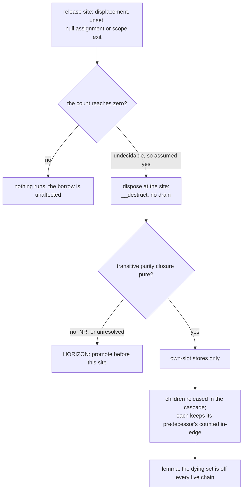

# Releases, eager death and the drop point

## 1. The case

A release is a horizon when the released class's transitive-purity
closure is not pure, because eager death runs `__destruct` at the release
site with no drain involved
([gc-horizon.md](../gc-horizon.md#the-horizon-list)). The destructor
hazard is therefore a property of releases rather than of checkpoints,
which is the relocation Critic round 2 forced: a checkpoint is the site
where a *drained* verdict can run user code, and an ordinary release is
the site where the program's own code runs it.

```php
function render(Page $p): string {
    $meta = $p->meta;      // anchored: Meta is closed, pure, typed slot
    $log  = new Logger();  // owned: the result of new
    $log  = null;          // horizon: Logger::__destruct writes a file
    return $meta->title;
}                          // scope exit: the batched release run
```

## 2. The lattice verdict

`$meta` is **anchored** by the cascade
([gc-horizon-states.md](../gc-horizon-states.md#the-lattice-decision-drawn))
and promoted before the displacement. `$log` is **owned** twice over: it
is the result of `new`, and a borrow of a class whose destructor closure
is impure is owned from birth regardless, which is what keeps
`__destruct` on the scope-end pin the drop-point policy sets for an
observable class
([static-lifetimes.md](../../memory/static-lifetimes.md#drop-point-policy)).
`$p` is owned by the parameter convention and is the chain's counted root.

## 3. The horizon set

One point in the snippet: `$log = null`, a release of a class whose
purity closure is not pure. Three properties of that row decide how the
whole case behaves.

**The predicate is purity's, and it is deliberately coarse.** It is the
one boolean per class that transitive purity computes over the field-type
closure, with NR counting as impure because NR admits external writes
that sever live paths
([pure-destructors.md](../pure-destructors.md#purity-is-transitive),
[pure-destructors.md](../pure-destructors.md#the-purity-ladder)). An open
hierarchy, a `mixed` field or an unresolvable element class makes the
class impure, so unresolved and impure land on the same verdict.

**There is no finality conjunct.** "May reach zero" is not dischargeable
without a count-value analysis nobody plans, so every qualifying release
is a horizon whether or not the count could actually reach zero
([gc-horizon.md](../gc-horizon.md#the-horizon-list)). The rule
over-approximates in the direction that costs a pair.

**The pure-cascade lemma keeps the rule from swallowing pure cascades.**
An object that reaches zero is off every live anchor chain, so the
own-slot stores of a dying pure cascade never sever a live path. The
lemma holds because every entry point into such a cascade is itself some
horizon, and the algorithm states four:

1. a summarized callee's internal release cannot zero a path member, each
   member keeping a counted in-edge from its path predecessor and the
   root staying live by borrow-is-use;
2. scope-exit batches fail the same way;
3. checkpoint drains are acquitted by the chain invariant, whose exact
   test balances counted references and finds the external in-edge
   ([rc-walk.md](../rc-walk.md#phase-4--verify-and-release-mutator-thread-by-message));
4. explicit displacement of a pure-class anchor is closed by the
   store-to-anchor rule, which [store.md](store.md) carries.

## 4. The lowering

```
$meta = load $p->meta        ; no retain
retain $meta                 ; the promotion, before the horizon
$log  = call new Logger()    ; owned by base case
store $log, null             ; drop the Logger: __destruct runs here
release $meta                ; the drop-point policy
```

Today's lowering emits the same two instructions for `$meta` over a
longer subrange, so the promotion costs nothing new. Deleting the
`Logger` from the function empties the horizon set, and both `$meta`
instructions disappear.

**Borrow-is-use, and the shape that fails without it.** Every point of a
live borrow is a use of its transitive anchor, for the drop-point
policy's release sites and for the move rule's transfer sites alike
([gc-horizon.md](../gc-horizon.md#the-ownership-lattice),
[static-lifetimes.md](../../memory/static-lifetimes.md#the-chain-rule-and-the-borrow-as-a-use-of-its-anchor)):

```php
$graph = makeGraph();   // owned; Graph and Node are pure, destructor-free
$node  = $graph->head;  // anchored; $graph's last syntactic use
echo $node->label;      // the borrow's last use
```

Computed over the anchor's own last syntactic use, `$graph`'s drop point
is the load — its class is destructor-free, so the policy drops at last
use rather than at scope end. If `$graph` held the last count, `head`
reaches zero at that release, eager death frees it, and the read on the
next line dereferences freed memory. The move rule fails identically: a
`consume($graph)` in the same position transfers ownership at the load
and the callee's release does the freeing instead. Computed over the
borrow's live range, `$graph`'s use extends to the `echo`, the release
lands after it, and the chain holds for the whole borrow.

**Scope exit is a batched release run, and eliding it whole has a
protocol effect.** Lowering emits the run as one `ll_release_vector`,
which splits the epoch checkpoint around itself: the ack at entry, before
any death, and the full pickup after the last release
([bulk-operations.md](../../memory/bulk-operations.md#vector-release),
[rc-walk.md](../rc-walk.md#the-design-constraint-that-produced-this-shape)).
A scope whose whole release run is elided emits no run and therefore no
ack pair, which thins epoch progress. The death-branch ack rate is
unchanged, because an elided borrow's release was non-final by the
borrow's own obligations; what moves is the batched pair and the pickup
sites where a destructor-free death nests into a parent's cascade
([gc-horizon.md](../gc-horizon.md#economics)). The compensating-poll rule
is the shared dependency, and it is owed by a different document.

## 5. States touched

- **lattice state**: `$meta` `Anchored(chain)` → `Owned` at the retain;
  `$log` never enters `Anchored`.
- **horizon set**: one entry, the release row; empty once the `Logger` is
  removed or its class becomes pure.
- **promotion point**: the instruction after the load, dominating the
  displacement and the exit.
- **transitive purity closure**: read per class, and the axis that
  decides the row — pure leaves the release outside the horizon set, NR
  and unresolved do not
  ([gc-horizon-states.md](../gc-horizon-states.md#the-axes-the-lattice-reads)).
- **the checkpoint protocol's ack rate**: unchanged in code, thinned in
  frequency where a whole scope-exit run is elided
  ([gc-horizon-states.md](../gc-horizon-states.md#what-the-runtime-must-not-change)).

## 6. The picture



## 7. The oracle

- **Releasing an anchor at its last syntactic use frees the borrowed
  entity.** The assertion is the hazard, stated positively: build an
  owner holding one child in the crate, release the owner while a raw
  reference to the child is held, and assert that the child died and its
  destructor ran. Instrument: a runtime test in the `ll-model` crate
  against `ll_release` and `ll_entity_die` (`model/src/refcount.rs`,
  `model/src/object.rs`). What it verifies is the premise of
  borrow-is-use, not the analysis that implements it.
- **A batched run acks at entry and picks up after the last release, and
  a run of length zero does neither.** Instrument: a runtime test calling
  `ll_release_vector` with a populated and an empty vector and reading
  the epoch handshake state (`model/src/object.rs`, `model/src/gc.rs`).
  This measures the protocol effect of eliding a whole run; the elision
  itself is not expressible without the compiler.
- **The destructor sequence and the death set per checkpoint batch are
  identical with horizons off and on.** Instrument: the differential
  lowering, whose oracle is nesting-insensitive by design, so a free
  moving from a borrow's own release into the parent's cascade is not a
  diff while a destructor-sequence change is.

**Buildable today: yes** for the first two, which run against the
existing `ll-model` crate. The third needs the compiler Phase D supplies.

## 8. Prior art in this repository

- The release row, the missing finality conjunct and the pure-cascade
  lemma are [gc-horizon.md](../gc-horizon.md#the-horizon-list);
  borrow-is-use is in
  [gc-horizon.md](../gc-horizon.md#the-ownership-lattice) and is carried
  forward by
  [static-lifetimes.md](../../memory/static-lifetimes.md#the-chain-rule-and-the-borrow-as-a-use-of-its-anchor).
- [store.md](store.md) owns the fourth entry point of the lemma and the
  severing half of a displacement whose release half is here.
- [checkpoint.md](checkpoint.md) owns the drained-verdict hazard this
  case is distinguished from; [destructor-bearing.md](destructor-bearing.md)
  owns the owned-from-birth exclusion the purity closure decides;
  [arena.md](arena.md) owns the categories the exception below sits in.
- The purity ladder and its transitivity are
  [pure-destructors.md](../pure-destructors.md#the-purity-ladder) and
  [pure-destructors.md](../pure-destructors.md#purity-is-transitive); the
  mutator's total cost, against which the ack budget is read, is
  [rc-walk.md](../rc-walk.md#what-the-mutator-pays-in-total).

## 9. Open items

1. **A store into an arena container performs no release, and the
   predicate names one.** The release row fires on "any store
   displacement", while a store into a request-arena container retains
   the new value, appends it to the release-at-reset list, and does not
   release the displaced one; the release happens later, once per entry,
   at reset
   ([arenas.md](../../memory/arenas.md#the-reverse-direction-request-arena--heap)).
   The predicate therefore over-fires at the store, which costs a pair,
   and the site that does release is not in the horizon list at all.
   Open question 8 of [gc-horizon.md](../gc-horizon.md#open-questions).
2. **Arena reset runs `__destruct` in rounds, at a site no horizon kind
   names.** Step 1 of the reset iterates a fixpoint of trace and
   destruct, and a destructor in it can create new escapes and new
   release-log entries
   ([arena-reset.md](../../memory/arena-reset.md#step-1--validate-trace-destruct-a-fixpoint-loop),
   [arena-reset.md](../../memory/arena-reset.md#what-keeps-the-fixpoint-going--destructor-purity)).
   The horizon list has no row for it, and the same open question 8
   records this.
3. **The compensating-poll rule that would answer the thinned ack rate
   does not exist here.** It is open question 3 of
   `model/dev/design/owned-slots-and-the-walk.md`, cited by
   [gc-horizon.md](../gc-horizon.md#economics) as a shared dependency, so
   the epoch-progress effect of eliding whole release runs is named and
   unpriced.
