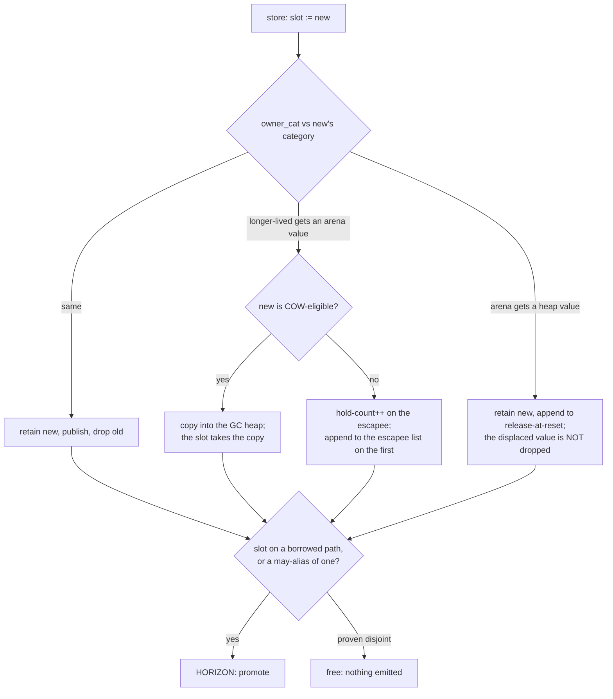

# Severing stores

## 1. The case

A borrow's second obligation is `stable_path`: counted reachability from
the anchor's current referent to the borrowed entity
([gc-horizon.md](../gc-horizon.md#the-algorithm-in-two-sentences)). A
store can end it two ways, and the horizon row covers both — a store
*through* a may-alias of a path base, which replaces an edge of the
chain, and a store *to* a chain local, which removes the counted root the
chain hangs from
([gc-horizon-states.md](../gc-horizon-states.md#the-eight-horizon-kinds)).

```php
function apply(Cart $c, Registry $r): float {
    $line = $c->head;       // anchored: Line is closed, pure, typed slot
    $r->cart->head = null;  // horizon 1: a store through a may-alias of $c
    $c = null;              // horizon 2: a store to the chain local itself
    return $line->amount;
}
```

## 2. The lattice verdict

`$line` is **anchored** at birth by the cascade
([gc-horizon-states.md](../gc-horizon-states.md#the-lattice-decision-drawn)),
and promoted before the first store. `$c` and `$r` are owned by the
parameter convention, which is what makes `$c` a counted root and the
chain `$c → head → $line` well-formed
([rc-walk.md](../rc-walk.md#the-central-identity-roots-are-derived-not-enumerated)).

## 3. The horizon set

Two points, both of the same row.

**A store through any may-alias of a path base is a severing store.**
The rule is conservative on purpose, because without a must-not-alias
instrument the compiler cannot tell `$r->cart` from `$c`, and treating an
unresolved store as harmless is the unsound direction
([gc-horizon.md](../gc-horizon.md#inside-the-horizon-what-the-borrow-must-prove)).

**One instrument lifts it, and nothing else is assumed.** Closed-class
typed properties give type-incompatibility disjointness: where
`Registry::$cart` is declared `Order` and `$c` is `Cart`, no value
inhabits both slots, so the store cannot reach `$c`'s chain. The
declaration is what makes the slot a bare pointer of a known class in the
first place ([classes.md](../../classes.md#slot-kinds)), and the closure
that decides whether the class set is closed is the same closed-world
closure purity and the acyclic flag use
([pure-destructors.md](../pure-destructors.md#purity-is-transitive)). An
untyped slot is a 16-byte ValueBox with no static class, and a dynamic
property is stored in a hashtable the layout does not describe
([classes.md](../../classes.md#property-access)), so neither carries the
disjointness the lift needs.

**A store to a chain local ends `live(anchor)` whatever it displaces.**
`$c = null` and `unset($c)` are not stores through a path base, so the
may-alias rule does not reach them, and the release they perform is
exempt from the release horizon whenever the displaced class is pure.
Critic round 4 recorded this as a critical: a pure-class anchor
displaced by an explicit assignment fell under no horizon kind at all,
and the borrow dangled at a site the list did not name. The rule closes
it by reading the anchor local as a path base for stores *to* it and not
only through it, and [release.md](release.md) uses the same rule as the
fourth entry point of the pure-cascade lemma
([gc-horizon.md](../gc-horizon.md#the-ownership-lattice)).

**COW values are the self-repairing population.** A foreign alias
separates before writing, because the separation rule fires on
`COW && refcount > 1` and the invariant is that a COW entity's refcount
equals its holder count
([values.md](../../values.md#copy-on-write-protocol),
[values.md](../../values.md#refcount-is-always-maintained-on-cow-entities)).
The write lands in the new entity and the path member the borrow's chain
runs through is left as it was, so a typed-array path is the cheap case.
That self-repair is also the reason every COW-eligible reference is owned
by base case: an uncounted holder would falsify the count the separation
test reads, and the first foreign write would then mutate in place.

### The category barrier

A store that crosses a category boundary does not publish-and-release,
and the horizon list classifies by slot rather than by direction.

**A longer-lived container receiving a request-arena value.** For an
object the barrier increments a **hold-count** kept in the escapee's
otherwise-idle `refcount` field and appends the escapee to the arena's
list on the first escape; the count is decremented by an overwrite, by
holder teardown, or by a collector freeing a holder
([arenas.md](../../memory/arenas.md#the-dangerous-direction-longer-lived--shorter-lived)).
For a COW value the barrier allocates a copy in the GC heap and the slot
takes the copy, and the hold-count is never touched
([values.md](../../values.md#copy-on-write-protocol)). What that means
for a path base on the arena side: an arena entity is not
lifetime-counted at all
([arenas.md](../../memory/arenas.md#object-categories-by-memory-strategy)),
so an edge into it is not the counted heap edge the chain invariant's
premise names, and once the escape bit is set the same four bytes hold a
hold-count rather than a count
([gc-horizon-states.md](../gc-horizon-states.md#the-axes-the-lattice-reads),
`IS_ESCAPEE`). A path base on the heap side is re-seated instead: after
the copy the destination slot references a different entity from the one
a borrow loaded through it earlier.

**A request arena receiving a heap value.** The barrier retains the new
value and appends the heap entity to the arena's release-at-reset list,
and, unlike an ordinary store, does **not** release the displaced one;
the list performs one release per entry at reset
([arenas.md](../../memory/arenas.md#the-reverse-direction-request-arena--heap)).
For a path base in an arena slot the severing half still applies, since
the slot points elsewhere afterwards and the chain loses its edge, while
the freeing half is deferred: the displaced entity lives until reset,
holding the retain its own store gave it, and counts stay inflated until
then, which costs a spurious COW separation on the next write.

Storing between two request arenas is out of scope rather than handled:
the barrier compares the 2-bit category only, and the invariant that no
reference into a different, longer-lived arena is ever created is held by
construction
([arenas.md](../../memory/arenas.md#between-two-request-arenas-forbidden)).

## 4. The lowering

The promotion point is the instruction after the load, since it must
dominate both horizons and the exit:

```
$line = load $c->head        ; no retain
retain $line                 ; the promotion, before the first store
store (load $r->cart)->head, null
store $c, null               ; releases the Cart, $line unaffected
release $line                ; the drop-point policy
```

With `Registry::$cart` typed disjointly from `Cart`, horizon 1 lifts and
horizon 2 stands, so the promotion point moves to the instruction before
`$c = null` and the pair count is unchanged. Deleting both stores from
the function empties the horizon set and both instructions disappear —
that is the shape the design exists to produce, and it needs the whole
set empty.

## 5. States touched

- **lattice state**: `$line` `Anchored(chain)` → `Owned` at the retain.
- **anchor chain**: `$c → head` at birth; both stores end it, the first
  by replacing the edge, the second by removing the root.
- **horizon set**: two entries of the store row, one of which the
  disjointness instrument removes.
- **promotion point**: the instruction after the load, moving later as
  rows lift.

## 6. The picture

Every reference store passes the category barrier before anything reads
the slot's relation to a borrowed path, and the barrier's four arms do
not perform the same operation
([arenas.md](../../memory/arenas.md#cross-arena-references)).



## 7. The oracle

- **A missed severing store surfaces as a shadow zero under a live
  borrow**, and the per-object journal names the elided acquisition
  sites. Instrument: the shadow-count lowering. This is the only
  instrument that sees a may-alias error, because a certificate checker
  would inherit the same alias oracle it is meant to check
  ([gc-horizon.md](../gc-horizon.md#the-hybrid-counted-class-horizon-class)).
- **Applying type-incompatibility disjointness changes no destructor
  sequence and no death set per checkpoint batch.** Instrument: the
  differential lowering, built with the disjointness instrument off and
  on.
- **The scan's severing-store channel reports the share of stores that
  stay horizons under the sound rule**, which is what prices the
  disjointness instrument
  ([gc-horizon-states.md](../gc-horizon-states.md#scan-channels)).

**Buildable today: no** for the first two, which need the compiler. The
third is compiler-free and runs against a corpus of deployed PHP with
vendor trees, and it can only kill.

## 8. Prior art in this repository

- The may-alias rule and its single lifter are
  [gc-horizon.md](../gc-horizon.md#inside-the-horizon-what-the-borrow-must-prove);
  the store-to-anchor rule is in
  [gc-horizon.md](../gc-horizon.md#the-ownership-lattice) and was the
  round-4 critical.
- [release.md](release.md) owns the displacement's *release* half and the
  pure-cascade lemma this case's second horizon closes.
- [call.md](call.md) owns the summary that must claim "severs no path" on
  the callee's behalf.
- [arena.md](arena.md) owns the non-frame counted roots the barrier's
  directions are stated over.
- The barrier's micro-operations and the `owner_cat` parameter are
  [strategies.md](../strategies.md#1-the-store-barrier-as-micro-operations).

## 9. Open items

1. **The horizon list has no row for a category-crossing store.** Section
   7 states what the four arms do; the list classifies stores by slot and
   may-alias, and the lattice reads the static class and never the
   category. Open question 8 of
   [gc-horizon.md](../gc-horizon.md#open-questions).
2. **Whether a barrier deep-copy preserves the chain is not determinable
   from the RFC as it stands.** Whether the heap copy's element edges are
   retained references to the same entities, or copies of them, is not
   specified in [values.md](../../values.md#copy-on-write-protocol) or
   [arenas.md](../../memory/arenas.md#the-dangerous-direction-longer-lived--shorter-lived);
   the first case leaves `stable_path` intact through the copy and the
   second breaks it. The missing specification is the deep-copy's
   recursion rule for entity-valued elements.
3. **The retain held by the release-at-reset list has no stated
   in-edge.** Whether the walk can attribute that counted reference to a
   traceable edge, or sees it as an unattributable count inflating
   `RC − IN` toward roothood, is not stated in
   [arenas.md](../../memory/arenas.md#the-reverse-direction-request-arena--heap)
   or [rc-walk.md](../rc-walk.md#phase-4--verify-and-release-mutator-thread-by-message).
   It is the conservative direction either way, and the case records it
   because the chain invariant's discharge is stated over attributable
   in-edges.
