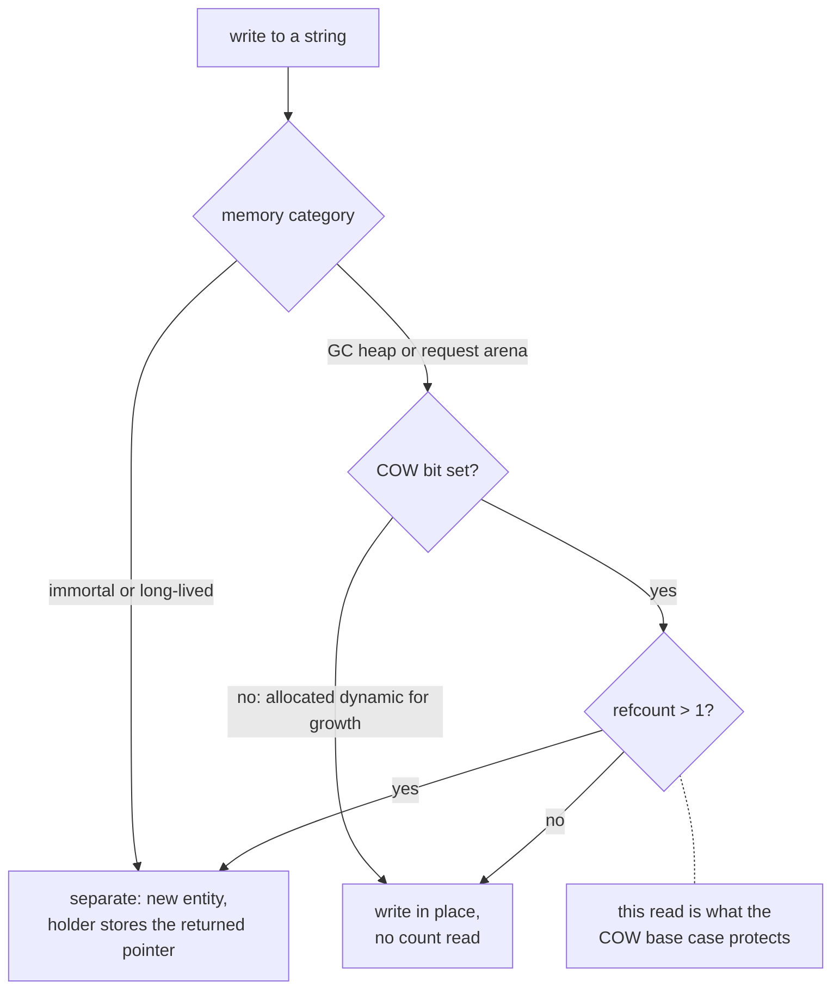

# String: exclusion by COW, qualified by the sub-modes

## 1. The case

A string reference is owned by base case, and the fact this case exists
for is that the base case's stated reason holds for two of the three
sub-modes and is absent from the third. Inline, out of line and interned
are the three; there is no frozen mode
([strings.md](../../strings.md#writes-obey-the-cow-rule-there-is-no-freeze-operation)).

```php
final class Row { public string $name; }

function label(Row $r): int {
    $n = $r->name;        // owned: string is a COW-eligible kind
    $r->name = "other";   // displaces the string $n names
    return strlen($n);
}
```

`$r` is owned by convention
([gc-horizon.md](../gc-horizon.md#the-ownership-lattice)). Line 2 is the
site the count pays for: the store publishes a new string and then drops
the displaced one, and `$n` is the only holder left.

## 2. The lattice verdict

**Owned, at the COW rung**, the same rung and the same citation as
[array.md](array.md): a reference to a COW-eligible value is owned
because the uniqueness test reads the count
([gc-horizon.md](../gc-horizon.md#the-ownership-lattice),
[values.md](../../values.md#refcount-is-always-maintained-on-cow-entities)).

The three sub-modes then divide by whether that reason applies.

**Inline.** The bytes follow the header in one allocation
([strings.md](../../strings.md#layout)), the entity carries `COW = 1`,
and a write runs the barrier rule: immortal and long-lived separate
always, `refcount > 1` separates, and only a sole owner writes in place
([values.md](../../values.md#copy-on-write-protocol)). The reason holds
exactly, and an uncounted `$n` would let the write on line 2's successor
land in bytes two holders name.

**Out of line, by size.** A string whose content exceeds what the
category's allocator packs in one slot is allocated dynamic by the
factory, keeps `COW = 1`, and "takes the ordinary rule, separating into
a fresh out-of-line entity when a second holder writes"
([strings.md](../../strings.md#writes-obey-the-cow-rule-there-is-no-freeze-operation)).
The reason holds identically, so the layout changes nothing about the
verdict.

**Out of line, by growth.** Where the compiler sees the string being
appended to it allocates the string dynamic and clears `COW`
([strings.md](../../strings.md#two-layouts-behind-stringinterface)), and
on such an entity "a write goes in place, always, and no sharing test is
performed"
([strings.md](../../strings.md#writes-obey-the-cow-rule-there-is-no-freeze-operation)).
The base case still takes it, because the base case enumerates kinds;
the reason it gives is absent. The ground the flag was cleared on is a
single-owner proof — the compiler allocates a string dynamic only where
it has proved the value never reaches a second holder — which is the
same proof shape the lattice wants and does not consult. Open item 2.

**Interned.** Compile-time-known strings are interned as immortal
entities, one string to one address
([strings.md](../../strings.md#interned-strings)). Retain and release
return early and leave the count at 1 forever, which is why the
separation rule reads the category before the count
([values.md](../../values.md#copy-on-write-protocol)). So the count on
an interned string is not a sharing signal, the base case protects
nothing there, and a promotion retain would be a no-op — open question 8
of [gc-horizon.md](../gc-horizon.md#open-questions), reached here
through the one entity kind whose immortal population is largest.

A fourth sub-mode was specified and withdrawn. Freeze — a mode-bit flip
closing a dynamic string for writing in place — was rejected, because
the two layouts hold their bytes in different places and moving between
them is a copy
([strings.md](../../strings.md#writes-obey-the-cow-rule-there-is-no-freeze-operation)).
Nothing in this design may assume a string's layout can change after
allocation, and nothing needs to.

## 3. The horizon set

**Empty for `$n`**, which is owned and carries no proofs. The store on
line 2 is a horizon for any borrow based on `$r`, as a store through a
may-alias of a path base
([gc-horizon.md](../gc-horizon.md#the-horizon-list)), and `$n` is not
such a borrow.

### A string is a chain terminus and never a mid-path member

No out-edge of a string can close a ring, so its singleton descriptor
carries the acyclic flag and the walk skips it completely — no `rc[]`
row, no out-edge from it, no in-edge to it
([rc-walk.md](../rc-walk.md#what-the-walker-traces-entity-kinds),
[rc-walk.md](../rc-walk.md#the-compilers-acyclic-flag)). Two
consequences follow for a borrow. A string can be the target of an
anchor chain and never an interior node of one, because there is nothing
to borrow through it. And the reclamation half of the checkpoint horizon
cannot arise for a string referent: the walk never condemns a skipped
entity, so such a string dies only when its own count reaches zero,
which is the count the base case keeps.

### The hash cache moves under a live borrow

The hash is computed on first use and cached in the header, with zero
meaning "not computed", an append clearing it, and the hash function
mapping a genuine zero to one
([strings.md](../../strings.md#layout)). A read through a borrow can
therefore write the entity's header word. That moves no reference edge,
so `stable_path` is untouched and the write is not a severing store
under any reading of the may-alias rule. It races nothing on the
collector side either, since the skip above is total and the walker
never reads a string's words. `len` and `hash` sit at the same offsets
in both layouts, so the read does not branch on the sub-mode — the
borrow path is identical for all three.

## 4. The lowering

Owned, so there is one lowering: today's retain at the acquisition and
release at the drop point, unchanged
([static-lifetimes.md](../../memory/static-lifetimes.md#drop-point-policy)).

## 5. States touched

- **COW eligibility**: read as yes for the `string` kind, which decides
  the verdict at the second rung and ends the cascade.
- **memory category**: the interned sub-mode takes the immortal value,
  where the separation rule reads the category before the count and the
  promotion retain returns early.
- **string layout**: read and never moved. The flag is set at creation
  and no operation flips it
  ([strings.md](../../strings.md#two-layouts-behind-stringinterface)),
  which is what makes the sub-mode decidable at the allocation site.
- **lattice state**: `$n` is `Owned`, which is what today's lowering
  assigns, so nothing moves.

## 6. The picture



## 7. The oracle

A test asserts that no lowering elides the pair for a string-typed
local — no site whose target kind is string appears in the static
elision-site list or in the shadow lowering's per-object journal
([gc-horizon-states.md](../gc-horizon-states.md#the-instruments-and-which-exist))
— and that the sub-mode premises hold: an inline `COW = 1` string with
two holders separates on write, a `COW = 0` dynamic string writes in
place with no count read, and an interned string separates on the
category arm with its count still 1.

The elision claim needs the compiler, through the shadow-count lowering
and the release-build elision counter. The premises are a runtime test
in the ll-model crate over hand-built strings in the three sub-modes,
reading the header words and the returned pointer on each arm of
`cow_separation_needed`.

Buildable today: no for the elision claim; yes for the three sub-mode
premises, as a runtime test in the ll-model crate against the existing
string and refcount code.

## 8. Prior art in this repository

- [array.md](array.md), which asks the same per-entity question of the
  same source; this case answers it with a named population instead of a
  possibility, because a string's flag-clear form is an allocation
  choice the compiler makes deliberately.
- The COW rung and the no-change row for the protocol
  ([gc-horizon-states.md](../gc-horizon-states.md#what-the-runtime-must-not-change)).
- [object.md](object.md) for the complementary verdict, and
  [reference-box.md](reference-box.md) for the third COW-excluded kind.

## 9. Open items

1. **Two documents disagree about what flag 10 means on a string, and
   the state axis cites the one that lost.**
   [values.md](../../values.md#cow-is-a-per-object-flag) says the flag
   "**is** the layout — set means bytes inline, clear means a dynamic
   string with its bytes out of line".
   [strings.md](../../strings.md#two-layouts-behind-stringinterface),
   revised 2026-08-10, gives the layout a bit of its own, bit 15, and
   says `COW` means copy-on-write and nothing else, because a string out
   of line by size is copy-on-write like any other. The axis table reads
   COW eligibility off flag 10 citing values.md
   ([gc-horizon-states.md](../gc-horizon-states.md#the-axes-the-lattice-reads)).
   The same drift sits inside one section of strings.md, which says a
   dynamic string is "outside that rule entirely" and then that a
   by-size dynamic string "takes the ordinary rule". What is missing is
   the amendment note reconciling them; until it exists, "COW-eligible"
   is two different predicates on a string.
2. **A string entity may carry the flag clear, and the proof that
   cleared it is unavailable to the lattice.** The dynamic-for-growth
   form is allocated on a proved single owner, and
   [values.md](../../values.md#refcount-is-always-maintained-on-cow-entities)
   grants a narrower licence on exactly that ground — a pair may be
   elided where no second holder arises. Whether the lattice may consume
   that allocation-site proof, or must keep the kind-level exclusion, is
   the same unresolved reading as open item 1 of [array.md](array.md).
3. **The interned population makes open question 8 concrete.** Promotion
   buys nothing on an immortal entity
   ([arenas.md](../../memory/arenas.md#object-categories-by-memory-strategy)),
   and every compile-time-known string is immortal
   ([strings.md](../../strings.md#interned-strings)), so the category
   axis is not a rare corner for this kind — question 8 of
   [gc-horizon.md](../gc-horizon.md#open-questions).
