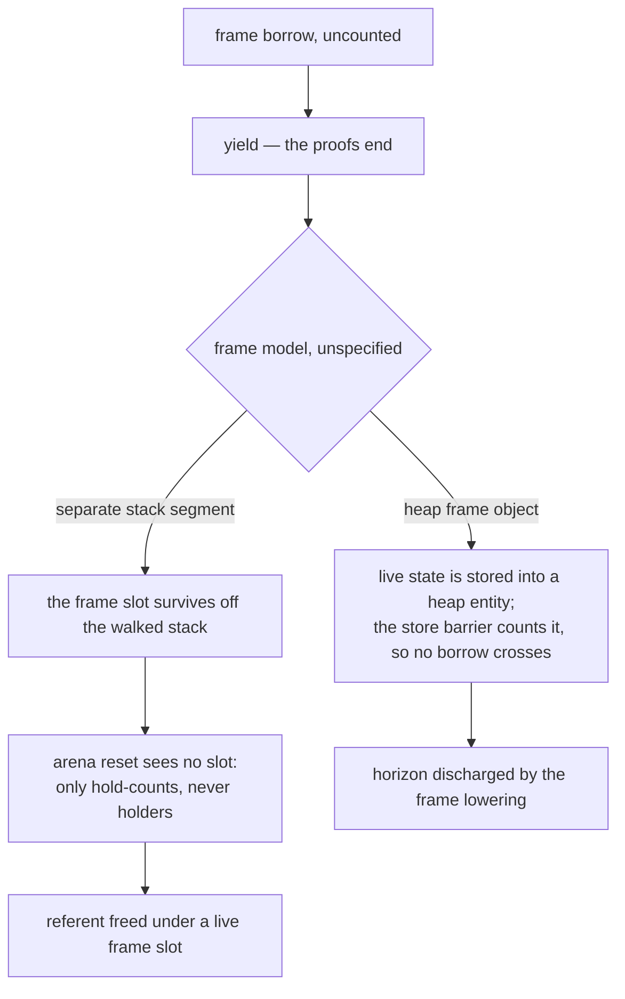

# Suspension

## 1. The case

**This is a hole report.** A yield is a horizon under the conservative
default, and that default is the whole of what the algorithm holds: open
question 2 records that the summary system does not learn resumption
points, and that a fiber suspended across an arena reset carries frame
borrows the reset cannot see
([gc-horizon.md](../gc-horizon.md#open-questions)). The repository
specifies neither a generator nor a fiber frame model. A grep for the
two words over this repository returns one deferred heading in the
exceptions design
([exceptions.md](../../../runtime/exceptions.md#inlining-and-generators)),
two backlog entries ([BACKLOG.md](../../../BACKLOG.md)), one deferral in
the arena rules ([arenas.md](../../memory/arenas.md#between-two-request-arenas-forbidden)),
and one line in the plan that predicted this case would be a hole report
([PLAN.md](../../../dev/PLAN.md)).

```php
function titles(Catalog $c): Generator {
    $meta = $c->meta;                  // a borrow, if the frame model allows one
    foreach ($c->rows as $row) {
        yield $meta->prefix . $row;    // suspension: the resumption point
    }                                  //   is unknown, so the proofs end here
}
```

What the case can state is the shape of the question, the one
suspension-adjacent boundary the repository does specify — the actor's
message boundary — and the frame-model consequence that follows from two
already-written rules.

## 2. The lattice verdict

**Not determinable from the RFC as it stands.** The cascade's rungs are
properties of the referent and of the live range
([gc-horizon-states.md](../gc-horizon-states.md#the-lattice-decision-drawn)),
and the last rung asks whether the birth dominates every horizon and
every exit of the live range. Neither the live range nor the exits of a
generator body are defined until the frame model is: the body's locals
either become fields of a heap frame object or stay on a separate stack
segment, and the two differ completely
([exceptions.md](../../../runtime/exceptions.md#inlining-and-generators)).

One consequence does follow, conditional on the first option and on the
frame object being a managed entity. Live state across a suspension goes
into a heap frame object under the flat state machine
([exceptions.md](../../../runtime/exceptions.md#inlining-and-generators));
anything that leaves the frame is counted by construction, leaving
meaning a store and every store going through the barrier
([static-lifetimes.md](../../memory/static-lifetimes.md#what-may-own-a-borrow));
so a borrow that survives a suspension is a counted reference from the
moment it is stored, and the anchored state cannot cross the yield at
all. Under that option the horizon is discharged by the frame's own
lowering rather than by a promotion, and the design's conservative
default costs one redundant retain. Under the separate-stack option the
frame slot stays a frame slot and nothing above applies.

## 3. The horizon set

**A suspension — yield, fiber — is the eighth horizon kind**, lifted by
nothing that exists
([gc-horizon-states.md](../gc-horizon-states.md#the-eight-horizon-kinds)).
The loop makes it the ordinary placement case: a borrow born before the
loop promotes before the loop, by the cycle condition of the placement
rule ([gc-horizon.md](../gc-horizon.md#at-the-horizon-promotion)).
`$meta` is born before the loop, so the conservative lowering is one
retain ahead of it. A borrow born *inside* the loop is
promoted once per iteration, by the closure of open question 22 on
2026-08-23; [call.md](call.md) carries the shape.

Beyond that the set is **not determinable from the RFC as it stands**.
Whether a resumption carries its own horizons — whether the frame is
re-entered with the same anchor chain, whether anything ran between the
yield and the resume — is exactly what a resumption-point summary would
say, and there is no summary language for it.

**The one specified boundary is the actor's.** Between two messages an
actor's stack is empty and its state consistent, which is why message
boundaries are the collection points and why actor code carries no poll
safepoints at all
([actors.md](../../../runtime/actors.md#per-actor-collection-at-message-boundaries)).
An empty stack holds no frame borrow, so the boundary is not a horizon
for the actor's own code — it is the absence of a live range. What
crosses instead is a message, and the payload discipline decides what
that means for a reference: a proven transfer is a pointer handoff and
the sender's bindings are dead, everything else arena-born is deep-copied
into the recipient's arena, and only immortal and frozen-COW values pass
by reference
([actors.md](../../../runtime/actors.md#message-payload-discipline)). A
reference into actor memory never crosses raw, the queue being the only
door ([actors.md](../../../runtime/actors.md#the-queue-is-the-only-door)),
so no anchor chain spans two actors.

The exception is the frame that does span a boundary: an external call
parks the calling fiber and the reply resumes it
([actors.md](../../../runtime/actors.md#the-queue-is-the-only-door)).
That frame's locals are live across a collection point, and they are the
subject of question 2's second half.

## 4. The lowering

Under the conservative default, and only under it:

```
$meta = load $c->meta        ; the borrow
retain $meta                 ; the promotion, dominating the loop's yield
loop:
  ...
  yield                      ; the horizon, paid once from before the loop
  ...
release $meta                ; drop point: last use
```

Against today's lowering this is the same pair over a shorter subrange,
which is the scheme's cost bound rather than a saving
([gc-horizon.md](../gc-horizon.md#at-the-horizon-promotion)). Whether the
retain and the release land in the same frame — and whether that frame
still exists at the release — is the frame-model question again.

## 5. States touched

- **lattice state**: `Anchored(chain)` → `Owned`, at a promotion before
  the loop, under the conservative default only
  ([gc-horizon-states.md](../gc-horizon-states.md#the-axes-the-lattice-creates)).
- **horizon set**: ∅ → {a suspension}.
- **promotion point**: ⊥ → the point before the loop.

The axis this case would need does not exist in either state table:
where a suspended frame's references live, and which category owns them.
The memory-category axis is defined per entity and not per frame
([gc-horizon-states.md](../gc-horizon-states.md#the-axes-the-lattice-reads)).

## 6. The picture



## 7. The oracle

**Not determinable from the RFC as it stands.** A test would assert that
a borrow live across a suspension still names its referent after the
resume, and that assertion needs three things this repository does not
hold: a frame model that says where the borrow is stored, a resumption
semantics that says what may run in between, and a compiler that lowers
either. The instrument would be the differential lowering, whose oracle
is the destructor sequence and the death set per checkpoint batch
([gc-horizon.md](../gc-horizon.md#verification-artifacts-a-precondition-of-implementation));
the model-checker alternative carries the recorded protocol drift — the
TLC specs model the pre-eager-death protocol, so a scenario written
against them needs the re-derivation first
([README.md](README.md)).

Buildable today: no. The ll-model crate has no fiber or generator, so
there is no runtime shape to hand a test, and the two compiler
instruments do not exist.

## 8. Prior art in this repository

- [call.md](call.md) owns the horizon kind a resumption-point summary
  would join, and the conservative default at every unknown.
- [arena.md](arena.md) owns the reset that question 2's second half
  names, and the categories in which a promotion retain buys nothing.
- [checkpoint.md](checkpoint.md) owns the drain sites; a message
  boundary is the actor-scoped analogue, with an empty stack instead of
  a live frame.
- [unwind.md](unwind.md) carries the other half of the exceptions
  design's suspended-frame hole: a suspended generator's frames are
  alive with a lifetime independent of the catching frame.
- [closure.md](closure.md) is the other hole report, for the same reason
  in a different structure: the layout is unspecified.
- [adversarial.md](adversarial.md), PH6 and PH17 — a borrow suspended
  across an arena reset, and the suspended generator whose teardown runs
  `finally` with no userland destructor.

## 9. Open items

1. **The generator and fiber frame model is missing.** The exceptions
   design names the two options and defers the choice, calling the
   segmented walk its main open item
   ([exceptions.md](../../../runtime/exceptions.md#inlining-and-generators));
   the backlog carries the feature as unstarted and coupled to the
   runtime design ([BACKLOG.md](../../../BACKLOG.md)). Every section
   above that reads "not determinable" reads so because of this one
   missing specification.
2. **Resumption-point summaries do not exist.** A yield stays a horizon
   until the summary language learns them, which is question 2 and which
   the design says shapes the IR early
   ([gc-horizon.md](../gc-horizon.md#open-questions)).
3. **A fiber suspended across an arena reset is unprotected by
   construction.** The reset decides promotion from hold-counts and
   never dereferences a holder slot, so a frame slot is invisible to it
   ([arenas.md](../../memory/arenas.md#cross-arena-references)); and
   cross-lifetime arena references are deferred until a feature requires
   them, with fibers named as one such feature
   ([arenas.md](../../memory/arenas.md#between-two-request-arenas-forbidden)).
   The missing specification is which arena a parked fiber's frame
   belongs to.
4. **The message boundary needs no horizon kind, and the design does not
   say so.** The actor's stack is empty there
   ([actors.md](../../../runtime/actors.md#per-actor-collection-at-message-boundaries)),
   so the boundary ends every live range rather than crossing one — for
   the actor's own frames. The parked caller's frame is the exception,
   and it is the same hole as item 3.
5. **A generator's destruction is observable without a destructor.** A
   suspended generator may be destroyed first, and its segment unwinds
   separately so its `finally` blocks run
   ([exceptions.md](../../../runtime/exceptions.md#inlining-and-generators)),
   while the class satisfies P0 — no `__destruct` in the hierarchy. The
   exclusion that keeps a destructor-bearing target owned therefore does
   not fire for it. Question 15, whose other case is
   [destructor-bearing.md](destructor-bearing.md). The item needs no
   frame model: P0 classifies the generator and the teardown behaviour is
   already written, in the section exceptions.md calls its own main open
   item.
6. **Section 2's escape hatch does not rest on the count it names.** The
   conditional consequence says a borrow that survives a suspension is
   counted from the moment it is stored. Where the frame object and the
   referent are in one arena nothing is counted at all — the categories
   match and the barrier does no extra work ([arena.md](arena.md),
   section 2) — and what protects the borrow there is that the two die at
   the same reset
   ([arenas.md](../../memory/arenas.md#cross-arena-references)), or, if
   the frame survives, that the reset's trace promotes the escaped
   subgraph its field belongs to
   ([arena-reset.md](../../memory/arena-reset.md#step-1--validate-trace-destruct-a-fixpoint-loop)).
   The hatch holds and its stated reason does not cover the arena case.
   PH6's attack lands on the separate-stack branch instead, which is item
   3, and on the residency item 3 says is unspecified.
