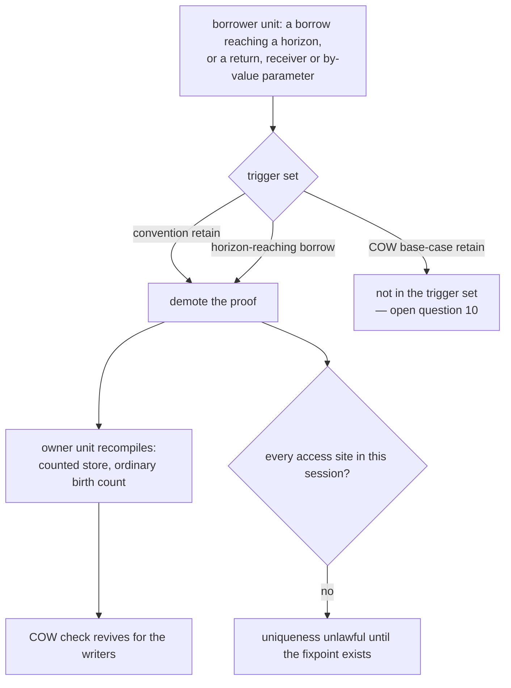

# Unique entity — exclusion by the sentinel

## 1. The case

A unique entity's count word holds the occupancy sentinel 1, which no
operation touches, so a retain written into it protects nothing
([rc-walk.md](../rc-walk.md#unique-ownership-one-owning-slot-and-no-count)).
A borrow whose path crosses such an entity is therefore owned from birth,
and it cannot be promoted at a horizon either — the two mechanisms below
are what the exclusion costs.

```php
class Owner {
    private Node $e;                   // the one owning slot, no count

    function run(): void {
        $n = $this->e;                 // a borrow crossing a unique entity
        audit();                       // a horizon
        $n->tick();
    }

    function getE(): Node {
        return $this->e;               // the convention retain: transfer
    }
}
```

## 2. The lattice verdict

**Owned from birth**, by the base case that names a path crossing a
unique-ownership entity
([gc-horizon.md](../gc-horizon.md#the-ownership-lattice)). The reason
stated there is the chain invariant's premise rather than a hazard: every
path edge must be a counted heap edge, and the owning slot pays no count,
so the invariant as stated fails even though the composition happens to
stay sound — the entity is never condemned, and its overwrite is a
may-alias severing store.

Owned against *what* is the second half. A retain against a still-unique
entity writes the sentinel, so the borrow is owned against the entity as
demoted, and the borrow's existence is what demotes it: a horizon-reaching
borrow demotes the uniqueness proof
([gc-horizon.md](../gc-horizon.md#at-the-horizon-promotion)), recorded in
the code repository as `model/dev/design/owned-slots-and-the-walk.md`.

`getE()` never reaches a horizon and demotes the proof anyway. The
uniqueness prover counts every convention retain site — return transfer,
receiver, by-value parameter — as a second counted reference, so an entity
that is ever returned or passed is by proof never unique. Without that
rule `getE()` writes the sentinel inside the owner's own compilation unit,
where no horizon is in sight to trigger a demotion.

## 3. The horizon set

- `audit()` — a call without a trusted summary.
- `$n->tick()` — a call without a trusted summary.

Neither matters to the verdict: the base case fires before the horizon
list is consulted, and the placement rule is never reached because
promotion is barred outright. What the horizons do decide is the demotion:
a borrow reaching one is a trigger site of the whole-program fixpoint,
while a borrow reaching none leaves the proof standing.

## 4. The lowering

The verdict is owned, so the borrower's own instructions are today's
pairs exactly. The lowering that changes is the **owner's**, and it
changes in another compilation unit:

```
;; before demotion, in Owner's unit
store $new -> $this->e     ; plain store in both directions: the overwrite
                           ;   is the death, eager destruction replaces the release
<factory>                  ; header written with the occupancy sentinel

;; after demotion, forced by a borrower compiled later
store $new -> $this->e     ; counted store: retain $new, release the displaced
<factory>                  ; header written with an ordinary count
                           ;   and the COW check revives for its writers
```

Demotion is a whole-program fixpoint rather than a local lowering: the
owner's unit already compiled the plain-store overwrite and the sentinel
factory, so a later-compiled borrower forces the owner's recompile — an
upstream blast radius the economics prices, and the reverse direction of
the downstream stdlib-summary radius
([gc-horizon.md](../gc-horizon.md#economics)). The trigger set is the
convention sites plus the horizon-reaching borrows. Until the fixpoint
exists, the conservative default is narrower than either: uniqueness is
lawful only for entities whose every access site compiles in the same
session ([gc-horizon.md](../gc-horizon.md#at-the-horizon-promotion)).

## 5. States touched

| Axis | Transition |
|---|---|
| unique ownership on the path | not crossed → crossed at the load, which is the rung that decides the verdict ([gc-horizon-states.md](../gc-horizon-states.md#the-lattice-decision-drawn)) |
| the count word | sentinel → ordinary count, at demotion; while the sentinel stands, no promotion and no convention retain may be emitted against it ([gc-horizon-states.md](../gc-horizon-states.md#what-the-runtime-must-not-change)) |
| demotion worklist | gains this entity, with the trigger recorded as a convention site or a horizon-reaching borrow ([gc-horizon-states.md](../gc-horizon-states.md#the-axes-the-lattice-creates)) |
| COW eligibility | unchanged as a flag; what changes is the check — demotion revives the separation test for the entity's writers |

## 6. The picture



The diagram's subject is the third branch: two trigger kinds reach the
demotion and the base-case retain reaches nothing.

## 7. The oracle

**Lowering.** No retain instruction targets a header whose count word
holds the sentinel — the property the runtime non-changes table states as
a prohibition. Instrument: the differential lowering, comparing the
instruction stream of the horizon build against the classic build at
every convention site and every promotion point.

**Protocol.** A unique entity is traced as an ordinary node, its
out-edges recorded in `IN`, and it is never condemned directly
([rc-walk.md](../rc-walk.md#unique-ownership-one-owning-slot-and-no-count)).
A model-checker scenario is the natural instrument for that, and it is
owed a re-derivation first: the TLC specs model the pre-eager-death
protocol, so a scenario written against them today tests a collector this
design does not target ([README.md](README.md#which-cases-can-be-tested-today)).

Buildable today: no, on both counts. Uniqueness is designed and not
implemented (2026-08-17), so the crate has no sentinel-bearing header to
assert over, and the discriminant that keeps the collector from reading
the sentinel as a count is undecided
([rc-walk.md](../rc-walk.md#unique-ownership-one-owning-slot-and-no-count))
— a test would have to pick one and would then assert its own choice.

## 8. Prior art in this repository

- [rc-walk.md](../rc-walk.md#unique-ownership-one-owning-slot-and-no-count)
  — the proof obligations, the sentinel, what the mutator pays, and the
  open move rule.
- [rc-walk.md](../rc-walk.md#the-birth-count-a-known-in-degree-is-written-at-allocation)
  — the adjacent family member, birth-side against death-side.
- [values.md](../../values.md#refcount-is-always-maintained-on-cow-entities)
  — the invariant that the count equals the holders on a COW entity, in
  every memory category.
- [gc-horizon-states.md](../gc-horizon-states.md#the-product-and-what-collapses-it)
  — the collapse arithmetic, where COW ∧ unique is named inconsistent.
- `model/dev/design/owned-slots-and-the-walk.md` in the code repository —
  the cross-design constraint in its own words, and the ack-budget
  accounting the fast class thins.

## 9. Open items

1. **COW ∧ unique has no defined lowering** —
   [gc-horizon.md](../gc-horizon.md#open-questions) question 10, and this
   case is where the shape is concrete. Take a unique-owned array field:

   ```php
   class Grid {
       private array $cells;   // provably one owning slot, and COW by kind
   }
   ```

   rc-walk permits it outright: the entity may be COW, uniqueness
   statically answers the separation test, and a copy-on-write value under
   this policy emits neither count nor uniqueness check and writes in
   place ([rc-walk.md](../rc-walk.md#unique-ownership-one-owning-slot-and-no-count)).
   The lattice's COW base case demands the opposite for every reference to
   it, because the separation test reads the count
   ([values.md](../../values.md#refcount-is-always-maintained-on-cow-entities)),
   and `$a = $this->cells` is such a reference. One base case requires a
   retain; the other forbids every retain, the count word being the
   sentinel. The demotion trigger set names convention retains and
   horizon-reaching borrows and does not name the base-case retain, so
   nothing in the fixpoint resolves the collision — the two rules meet at
   a site that triggers neither.
2. **The discriminant is undecided.** One bit of the retired condemned
   byte or a reserved count value
   ([rc-walk.md](../rc-walk.md#unique-ownership-one-owning-slot-and-no-count)).
   Every oracle in section 7 waits on it, because a test that asserts "no
   retain against the sentinel" must first say how the sentinel is
   recognized.
3. **The move rule is open.** Re-seating the unique reference into a
   different slot is an edge insertion no count reports; until it is
   ruled, a move copies the entity, or the proof includes "never moved",
   or the move emits a barrier
   ([rc-walk.md](../rc-walk.md#unique-ownership-one-owning-slot-and-no-count)).
   A borrow of a moved entity is outside every statement this case makes.
4. **The family-wide borrow analysis is one instrument with two
   invalidation disciplines** — uniqueness bans checkpoint crossing
   outright, this design substitutes the chain invariant plus the
   path-severing condition. The ruling is
   [gc-horizon.md](../gc-horizon.md#open-questions) question 5, and its
   working default is one analysis with two invalidation sets.
