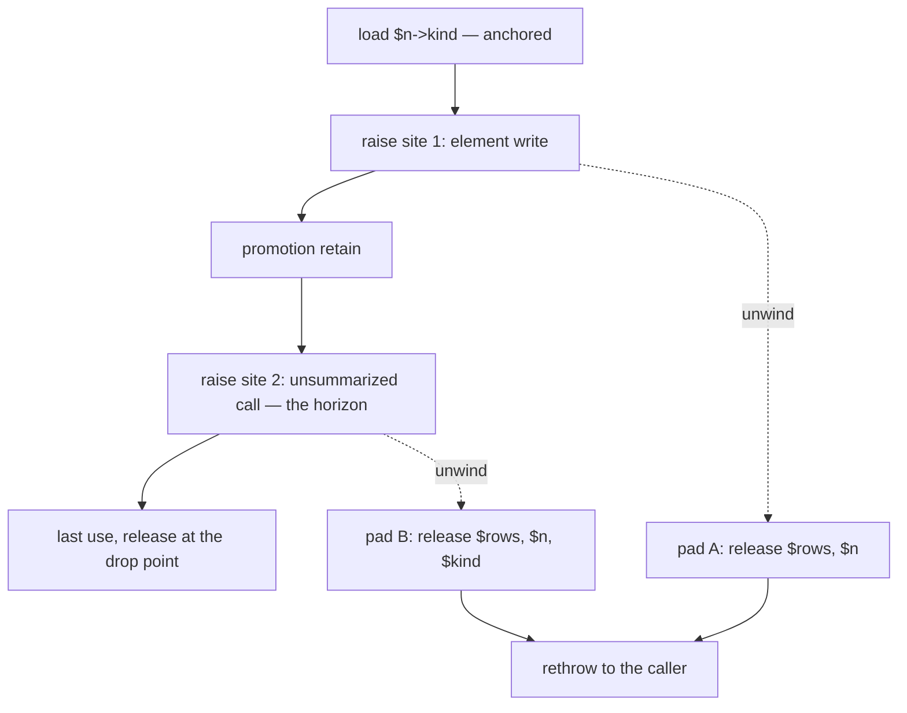

# Placement under unwinding

## 1. The case

Unwinding is not a horizon kind, and the sites it constrains are the
sites that can **raise**. Those are not a subset of the call sites: a
COW-separating store allocates, allocation failure is an ordinary
exception, so a plain property or element store can raise
([exceptions.md](../../../runtime/exceptions.md#allocation-failure-is-an-ordinary-exception)).
The placement rule quantifies over horizons and exits, which leaves the
landing-pad sentence resting on a set the rule never mentions
([gc-horizon.md](../gc-horizon.md#at-the-horizon-promotion)).

```php
function label(Node $n, array $rows): string {
    $kind   = $n->kind;   // anchored: Kind is closed, pure, destructor-free
    $rows[] = $n->id;     // element write: migrates storage, so it can raise
    audit($n);            // unsummarized call: a horizon, and it can raise
    return $kind->name;   // the borrow is live across both
}
```

Two raise sites, one horizon. The promotion point is computed from the
horizon and the exit alone, so it lands between the two raise sites, and
the two landing pads owe different releases.

## 2. The lattice verdict

`$kind` is **anchored**: the cascade clears at every rung, the load
dominating the one horizon and the return
([gc-horizon-states.md](../gc-horizon-states.md#the-lattice-decision-drawn)).
`$n` and `$rows` are **owned** as by-value parameters, and `$rows` is
owned twice over, being COW-eligible
([gc-horizon.md](../gc-horizon.md#the-ownership-lattice)).

## 3. The horizon set

One horizon: **a call without a trusted summary**, at `audit($n)`
([gc-horizon-states.md](../gc-horizon-states.md#the-eight-horizon-kinds)).
The element write is not a horizon — it stores into `$rows`, whose type
is disjoint from the `$n->kind` path under the closed-class rule
([gc-horizon.md](../gc-horizon.md#inside-the-horizon-what-the-borrow-must-prove))
— and unwinding contributes no kind of its own.

The raise sites of the live range, as this repository supports them:

| Site | Why it can raise |
|---|---|
| an unsummarized call | the callee raises through channel U by default ([exceptions.md](../../../runtime/exceptions.md#why-unwinding-is-the-default-and-the-universal-one)) |
| a COW-separating store | separation copies the storage, and the copy is an allocation ([values.md](../../values.md#copy-on-write-protocol)) |
| an element write that migrates storage | the generic write dispatches on the strategy tag and migrates, so it may allocate and may raise ([arrays.md](../../arrays.md#transition-rules)) |
| a store that escapes a request-arena COW entity | the barrier deep-copies into the heap, and generated code raises memory-exhausted ([arenas.md](../../memory/arenas.md#cross-arena-references)) |
| `new` | the allocation itself |
| the compiler's poll | log-reserve replenishment failing there reclaims, collects, retries and raises ([exceptions.md](../../../runtime/exceptions.md#allocation-failure-is-an-ordinary-exception)) |

Two sites that look like raise sites and are not. A release is a
horizon, and eager death runs `__destruct` at it, but a destructor
cannot let an exception escape: it is caught at the destructor's own
boundary and handed back as a value, because runtime code must run after
it
([exceptions.md](../../../runtime/exceptions.md#destructors-never-propagate)).
And a call into the Rust runtime is nothrow by construction, so it
compiles to an ordinary `call` rather than an `invoke`
([exceptions.md](../../../runtime/exceptions.md#the-channels-are-not-exclusive-it-is-an-abi-property-of-the-function)).
An allocation still raises, because the Rust core returns a status and
the Limelight-side entry point raises from an ordinary frame
([exceptions.md](../../../runtime/exceptions.md#the-runtime-boundary-and-destructors)).

## 4. The lowering

```
$kind = load $n->kind        ; no retain, no landing-pad obligation
invoke element_write($rows)  ; pad A: release $rows, $n
retain $kind                 ; the promotion, dominating the call
invoke audit($n)             ; pad B: release $rows, $n, $kind
$t = load $kind->name
release $kind                ; drop point: last use, Kind being pure
```

Pad A and pad B differ by exactly the promoted borrow, and that
difference is the mechanism this case exists for. Today's lowering
retains `$kind` at the load, so both pads carry it and both sets are the
same.

Two lowering consequences follow from the elision rather than from the
promotion. A function with no `try` still gets landing pads when it
holds heap references in locals, because unwinding past it must release
them
([exceptions.md](../../../runtime/exceptions.md#what-zero-cost-does-and-does-not-mean));
a scope whose every reference is anchored holds no counted reference and
owes no pad at all. And a call that can raise is an `invoke`, which
terminates the basic block and pins the values the pad needs
([exceptions.md](../../../runtime/exceptions.md#what-zero-cost-does-and-does-not-mean))
— so an elided borrow is one fewer pinned value at every pad in its
range.

**The three channels, and what each does to the lowering.** Channel U is
table-driven and universal, requiring no agreement between caller and
callee, so it is the fallback for anything the compiler cannot see, and
the pad sets above are its tables
([exceptions.md](../../../runtime/exceptions.md#channel-u-how-the-tables-work)).
Channel R returns the error and the caller branches, so the releases run
as ordinary code on the error path and no pad is generated; a function
may use channel R only where every call to it is statically resolved
([exceptions.md](../../../runtime/exceptions.md#the-channels-are-not-exclusive-it-is-an-abi-property-of-the-function)),
which is the same closure the summary system needs to lift the call
horizon. Channel B — a `longjmp` running no user code and no destructors
— was considered and rejected, and the design has two channels
([exceptions.md](../../../runtime/exceptions.md#two-channels)); had it
survived, every promoted count on the abandoned frames would have been
lost with the pads that release them.

**`isThrow` is what would make the raise set enumerable.** Allocation
takes the flag: with `isThrow = false` it returns null and the caller
checks, so raising becomes impossible rather than discouraged
([exceptions.md](../../../runtime/exceptions.md#isthrow-making-must-not-throw-enforceable)).
`nothrow` is the same property at function granularity and should be
inferred wherever provable
([exceptions.md](../../../runtime/exceptions.md#the-channels-are-not-exclusive-it-is-an-abi-property-of-the-function)).
Together they are the instrument that would take the runtime entries out
of the raise set, and out of the horizon list with them — which is what
open question 11 asks for
([gc-horizon.md](../gc-horizon.md#open-questions)).

## 5. States touched

- **lattice state**: `Anchored(chain)` → `Owned` at the promotion retain
  ([gc-horizon-states.md](../gc-horizon-states.md#the-axes-the-lattice-creates)).
- **horizon set**: ∅ → {a call without a trusted summary}.
- **promotion point**: ⊥ → the point between the element write and the
  call.
- **landing-pad set**: per site, `{$rows, $n}` at pad A and
  `{$rows, $n, $kind}` at pad B.

## 6. The picture



## 7. The oracle

**A1 — the pad sets match the lattice state at each site.** For every
raise site in a function, the set of references the landing pad releases
equals the owned locals live there under the lattice. The instrument is
the differential lowering: the same program built with horizons off and
on, raising at each site under a fault-injecting allocator, with the
oracle being the destructor sequence and the death set per checkpoint
batch
([gc-horizon.md](../gc-horizon.md#verification-artifacts-a-precondition-of-implementation)).
A pad that releases a borrow the promotion never retained shows up as a
death the horizons-off build does not produce.

**A2 — a raise site before the promotion owes nothing.** The shadow-count
lowering's journal names any elided site whose retain is missing when
the shadow word reaches zero, which is the detection path for a
promotion placed after a raise site that needed it.

Buildable today: no. Both instruments need the compiler, and A1 needs
besides them the fault-injecting allocator path that the exception
reserve does not yet have — there is no exception-construction
reserve at all, and the failure half of the reserve protocol is unbuilt
([exceptions.md](../../../runtime/exceptions.md#allocation-failure-is-an-ordinary-exception)).

## 8. Prior art in this repository

- [call.md](call.md) owns the horizon this case's promotion pays for,
  and the summaries that lift it.
- [store.md](store.md) owns the severing store; this case reads the same
  stores for their allocation instead.
- [array.md](array.md) owns the COW exclusion and the storage
  transitions that make an element write a raise site.
- [release.md](release.md) owns eager death, whose destructors are the
  reason a release is a horizon and not a raise site.
- [checkpoint.md](checkpoint.md) owns the poll, which appears here as a
  raise site and there as a drain site.
- [adversarial.md](adversarial.md), PH9, PH19 and PH22 — the promotion
  that must dominate the throwing edge, the backtrace that publishes a
  borrowed argument, and the shared pad whose ownership is per edge.

## 9. Open items

1. **The placement rule does not quantify over raise sites.** It names
   horizons and exits, and the landing-pad sentence claims a set that is
   static per site
   ([gc-horizon.md](../gc-horizon.md#at-the-horizon-promotion)). For the
   two sites above the claim holds, because both are dominated by the
   birth and separated by the promotion. Whether a raise site can be
   reachable both with the promotion executed and without it under the
   dominance conditions the rule imposes is not determinable from the
   RFC as it stands. Either the rule reads "dominates every horizon,
   every exit and every raise site", or the sentence is weaker than it
   claims — question 9
   ([gc-horizon.md](../gc-horizon.md#open-questions)).
2. **The raise set is not enumerable while runtime entries are
   unclassified.** Read literally, every `ll_*` entry the lowering emits
   is a call without a trusted summary, which empties the free region;
   the intended line — runtime entries being nothrow, effect-known and
   summarized by construction — is written nowhere, and it is the same
   line that decides which entries are raise sites. Question 11.
3. **Allocation failure runs a collection before it raises.** The
   failure path first runs a coarser reclamation pass and a GC cycle,
   using the reserve as working room
   ([exceptions.md](../../../runtime/exceptions.md#allocation-failure-is-an-ordinary-exception)).
   Whether that cycle can pick up a verdict and run drain destructors —
   which would make every allocating store a checkpoint horizon as well
   as a raise site — is not determinable from the RFC as it stands. The
   missing specification is the relation between that pass and the
   checkpoint protocol
   ([rc-walk.md](../rc-walk.md#the-design-constraint-that-produced-this-shape)).
4. **Landing pads for a suspended frame are unspecified.** A suspended
   generator's frames are alive with a lifetime independent of the
   catching frame, and the segmented walk is the main open item of the
   exceptions design
   ([exceptions.md](../../../runtime/exceptions.md#inlining-and-generators));
   the borrow half of that hole is [suspension.md](suspension.md).
5. **One trace mode can publish a borrowed argument, and its capture is
   unspecified.** The default mode publishes nothing that holds an entity
   alive: scalars by value, truncated string copies, and for an object
   the class name only, class metadata being immortal
   ([exceptions.md](../../../runtime/exceptions.md#arguments-must-not-hold-references)).
   Live values are needed only by the array form of `getTrace()`, which
   that document makes a separate heavier mode whose promotion cost it
   says must be documented rather than discovered — and whether its
   capture goes through the store barrier is not written. Until it is, a
   borrow passed to a callee that may raise under that mode has a
   publication channel no summary describes. PH19.
