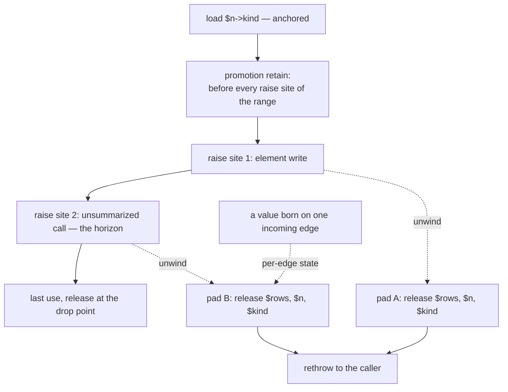

# Placement under unwinding

## 1. The case

Unwinding is not a horizon kind, and the sites it constrains are the
sites that can **raise**. Those are not a subset of the call sites: a
COW-separating store allocates, allocation failure is an ordinary
exception, so a plain property or element store can raise
([exceptions.md](../../../runtime/exceptions.md#allocation-failure-is-an-ordinary-exception)).
The raise sites are in the placement quantifier, ruled 2026-08-22
([gc-horizon.md](../gc-horizon.md#at-the-horizon-promotion)), and this
case is what that costs: the promotion is placed before the first raise
site of the live range, so it executes on paths that reach no horizon at
all, and every pad of the range carries the promoted value.

```php
function label(Node $n, array $rows): string {
    $kind   = $n->kind;   // anchored: Kind is closed, pure, destructor-free
    $rows[] = $n->id;     // element write: migrates storage, so it can raise
    audit($n);            // unsummarized call: a horizon, and it can raise
    return $kind->name;   // the borrow is live across both
}
```

Two raise sites, one horizon. The promotion point is computed over all
three sets, so it lands before the element write, and both landing pads
owe the same releases — which is the ruling's whole effect on this
snippet. Where pad sets do differ is where the value itself differs by
edge, and section 4's second listing is that shape.

## 2. The lattice verdict

`$kind` is **anchored**: the cascade clears at every rung, the load
dominating the one horizon and the return
([gc-horizon-states.md](../gc-horizon-states.md#the-lattice-decision-drawn)).
`$n` and `$rows` are **owned** as by-value parameters, and `$rows` is
owned twice over, being COW-eligible
([gc-horizon.md](../gc-horizon.md#the-ownership-lattice)).

## 3. The horizon set

One horizon: **a call without a trusted summary**, at `audit($n)`
([gc-horizon-states.md](../gc-horizon-states.md#the-eight-horizon-kinds)).
Whether the element write is a horizon as well turns on an instrument
this design has not admitted: the disjointness it would need is between
two locals' declared types, `array` against `Node`, while the named
lifter is type-incompatibility between closed-class typed *properties*
and nothing else is assumed
([gc-horizon.md](../gc-horizon.md#inside-the-horizon-what-the-borrow-must-prove),
[store.md](store.md)). Read under the sound rule the write is a second
horizon, and the placement is the same either way — which is why this
case is written over the raise sites rather than over the horizon count.
Unwinding contributes no kind of its own.

The raise sites of the live range, as this repository supports them:

| Site | Why it can raise |
|---|---|
| an unsummarized call | the callee raises through channel U by default ([exceptions.md](../../../runtime/exceptions.md#why-unwinding-is-the-default-and-the-universal-one)) |
| a COW-separating store | separation copies the storage, and the copy is an allocation ([values.md](../../values.md#copy-on-write-protocol)) |
| an element write that migrates storage | the generic write dispatches on the strategy tag and migrates, so it may allocate and may raise ([arrays.md](../../arrays.md#transition-rules)) |
| a store that escapes a request-arena COW entity | the barrier deep-copies into the heap, and generated code raises memory-exhausted ([arenas.md](../../memory/arenas.md#cross-arena-references)) |
| `new` | the allocation itself |
| the compiler's poll | log-reserve replenishment failing there reclaims, collects, retries and raises ([exceptions.md](../../../runtime/exceptions.md#allocation-failure-is-an-ordinary-exception)) |
| a release of a class whose closure carries no no-throw proof | conditional: the destructor boundary hands the error back as a value, and one named candidate for what happens next raises it in the frame that dropped the last reference ([exceptions.md](../../../runtime/exceptions.md#destructors-never-propagate)). P0 runs no code, and P1, P2 and NR carry a hard no-throw obligation ([pure-destructors.md](../pure-destructors.md#the-purity-ladder)), so the population is the impure and unresolved closures — which are release horizons already |

One site looks like a raise site and is not: a call into the Rust
runtime is nothrow by construction, so it
compiles to an ordinary `call` rather than an `invoke`
([exceptions.md](../../../runtime/exceptions.md#the-channels-are-not-exclusive-it-is-an-abi-property-of-the-function)).
An allocation still raises, because the Rust core returns a status and
the Limelight-side entry point raises from an ordinary frame
([exceptions.md](../../../runtime/exceptions.md#the-runtime-boundary-and-destructors)).

## 4. The lowering

```
$kind = load $n->kind        ; no retain
retain $kind                 ; the promotion: it dominates the horizon,
                             ;   the exit and both raise sites
invoke element_write($rows)  ; pad A: release $rows, $n, $kind
invoke audit($n)             ; pad B: release $rows, $n, $kind
$t = load $kind->name
release $kind                ; drop point: last use, Kind being pure
```

Both pads carry the same set, and today's lowering produces the same one
from the same position: it retains `$kind` at the load, where the
promotion now stands. The cost of the quantifier is in what executes
rather than in what a pad releases — the retain runs before an allocating
store that may raise, on every path, including those that never reach
`audit()`, and a borrow whose only horizon sat behind a cold branch pays
at the first raise site instead.

**Where the pads do differ: a value born on one edge.** Pad state is per
exceptional edge and per SSA generation, not per site
([gc-horizon.md](../gc-horizon.md#at-the-horizon-promotion)).

```php
if ($wide) {
    $unit = $n->unit;   // born, and promoted, on one edge only
}
audit($n);              // one raise site, two incoming edges, one pad
```

A union cleanup releases `$unit` on the edge that never created it,
possibly twice; an intersection cleanup leaks it on the edge that did.
The pad carries the state per edge, by split pads or an ownership phi;
a runtime tag is excluded by the granularity ruling of 2026-08-18.

Two lowering consequences follow from the elision rather than from the
promotion. A function with no `try` still gets landing pads when it
holds heap references in locals, because unwinding past it must release
them
([exceptions.md](../../../runtime/exceptions.md#what-zero-cost-does-and-does-not-mean));
a scope whose every reference is anchored holds no counted reference and
owes no pad at all. And a call that can raise is an `invoke`, which
terminates the basic block and pins the values the pad needs
([exceptions.md](../../../runtime/exceptions.md#what-zero-cost-does-and-does-not-mean))
— so an elided borrow is one fewer pinned value at every pad in its
range.

**The three channels, and what each does to the lowering.** Channel U is
table-driven and universal, requiring no agreement between caller and
callee, so it is the fallback for anything the compiler cannot see, and
the pad sets above are its tables
([exceptions.md](../../../runtime/exceptions.md#channel-u-how-the-tables-work)).
Channel R returns the error and the caller branches, so the releases run
as ordinary code on the error path and no pad is generated; a function
may use channel R only where every call to it is statically resolved
([exceptions.md](../../../runtime/exceptions.md#the-channels-are-not-exclusive-it-is-an-abi-property-of-the-function)),
which is the same closure the summary system needs to lift the call
horizon. Channel B — a `longjmp` running no user code and no destructors
— was considered and rejected, and the design has two channels
([exceptions.md](../../../runtime/exceptions.md#two-channels)); had it
survived, every promoted count on the abandoned frames would have been
lost with the pads that release them.

**`isThrow` is what would make the raise set enumerable.** Allocation
takes the flag: with `isThrow = false` it returns null and the caller
checks, so raising becomes impossible rather than discouraged
([exceptions.md](../../../runtime/exceptions.md#isthrow-making-must-not-throw-enforceable)).
`nothrow` is the same property at function granularity and should be
inferred wherever provable
([exceptions.md](../../../runtime/exceptions.md#the-channels-are-not-exclusive-it-is-an-abi-property-of-the-function)).
Together they are the instrument that would take the runtime entries out
of the raise set, and out of the horizon list with them — which is what
open question 11 asks for
([gc-horizon.md](../gc-horizon.md#open-questions)).

## 5. States touched

- **lattice state**: `Anchored(chain)` → `Owned` at the promotion retain
  ([gc-horizon-states.md](../gc-horizon-states.md#the-axes-the-lattice-creates)).
- **horizon set**: ∅ → {a call without a trusted summary}.
- **promotion point**: ⊥ → the point between the element write and the
  call.
- **landing-pad set**: `{$rows, $n, $kind}` at both pads, the promotion
  dominating both raise sites; per edge and per SSA generation where a
  value is born on one incoming edge only.

## 6. The picture



## 7. The oracle

**A1 — the pad sets match the lattice state at each site.** For every
raise site in a function, the set of references the landing pad releases
equals the owned locals live there under the lattice. The instrument is
the differential lowering: the same program built with horizons off and
on, raising at each site under a fault-injecting allocator, with the
oracle being the destructor sequence and the death set per checkpoint
batch
([gc-horizon.md](../gc-horizon.md#verification-artifacts-a-precondition-of-implementation)).
A pad that releases a borrow the promotion never retained shows up as a
death the horizons-off build does not produce.

**A2 — a raise site before the promotion owes nothing.** The shadow-count
lowering's journal names any elided site whose retain is missing when
the shadow word reaches zero, which is the detection path for a
promotion placed after a raise site that needed it.

Buildable today: no. Both instruments need the compiler, and A1 needs
besides them the fault-injecting allocator path that the exception
reserve does not yet have — there is no exception-construction
reserve at all, and the failure half of the reserve protocol is unbuilt
([exceptions.md](../../../runtime/exceptions.md#allocation-failure-is-an-ordinary-exception)).

## 8. Prior art in this repository

- [call.md](call.md) owns the horizon this case's promotion pays for,
  and the summaries that lift it.
- [store.md](store.md) owns the severing store; this case reads the same
  stores for their allocation instead.
- [array.md](array.md) owns the COW exclusion and the storage
  transitions that make an element write a raise site.
- [release.md](release.md) owns eager death, whose destructors are the
  reason a release is a horizon and a conditional raise site, pending the
  returned-error policy.
- [checkpoint.md](checkpoint.md) owns the poll, which appears here as a
  raise site and there as a drain site.
- [adversarial.md](adversarial.md), PH9, PH19 and PH22 — the promotion
  that must dominate the throwing edge, the backtrace that publishes a
  borrowed argument, and the shared pad whose ownership is per edge.

## 9. Open items

1. **The quantifier's cost is unmeasured.** The rule reads "dominates
   every horizon, every exit and every raise site", ruled 2026-08-22, so
   a promotion is placed before the first raise site of the live range
   rather than before its first horizon. How often those two points
   differ, and how much of the difference executes, is a number no
   channel of the corpus scan carries
   ([gc-horizon-states.md](../gc-horizon-states.md#scan-channels)): the
   channels count severing stores and unresolved receivers, and an
   allocating store that raises is neither. Until it is measured the
   ruling's price is stated and unpriced.
2. **The raise set is not enumerable while runtime entries are
   unclassified.** Read literally, every `ll_*` entry the lowering emits
   is a call without a trusted summary, which empties the free region.
   Half of the line that would fix it is written: every entry point into
   the Rust runtime is `nothrow` by construction
   ([exceptions.md](../../../runtime/exceptions.md#isthrow-making-must-not-throw-enforceable)),
   which takes those entries out of the raise set. The other half — that
   they are effect-known and summarized by construction, so they are not
   call horizons either — is written nowhere. Question 11.
3. **The raise set moves with the returned-error policy.** A
   destructor's boundary returns the error as a value, and what is done
   with it — raised in the frame that dropped the last reference, chained
   onto an exception already in flight, or reported where there is no
   frame at all — "still needs work"
   ([exceptions.md](../../../runtime/exceptions.md#destructors-never-propagate)).
   Until it is ruled the table above reads the release row as raising,
   which is the failure default this design uses everywhere else. The
   ruling is `exceptions.md`'s to make, and it decides one more thing
   this case would then owe: what a raise from the middle of a batched
   `ll_release_vector` leaves the pad to release, the run having already
   released part of its vector.
4. **Allocation failure runs a collection before it raises.** The
   failure path first runs a coarser reclamation pass and a GC cycle,
   using the reserve as working room
   ([exceptions.md](../../../runtime/exceptions.md#allocation-failure-is-an-ordinary-exception)).
   Whether that cycle can pick up a verdict and run drain destructors —
   which would make every allocating store a checkpoint horizon as well
   as a raise site — is not determinable from the RFC as it stands. The
   missing specification is the relation between that pass and the
   checkpoint protocol
   ([rc-walk.md](../rc-walk.md#the-design-constraint-that-produced-this-shape)).
5. **Landing pads for a suspended frame are unspecified.** A suspended
   generator's frames are alive with a lifetime independent of the
   catching frame, and the segmented walk is the main open item of the
   exceptions design
   ([exceptions.md](../../../runtime/exceptions.md#inlining-and-generators));
   the borrow half of that hole is [suspension.md](suspension.md).
6. **One trace mode can publish a borrowed argument, and its capture is
   unspecified.** The default mode publishes nothing that holds an entity
   alive: scalars by value, truncated string copies, and for an object
   the class name only, class metadata being immortal
   ([exceptions.md](../../../runtime/exceptions.md#arguments-must-not-hold-references)).
   Live values are needed only by the array form of `getTrace()`, which
   that document makes a separate heavier mode whose promotion cost it
   says must be documented rather than discovered — and whether its
   capture goes through the store barrier is not written. Until it is, a
   borrow passed to a callee that may raise under that mode has a
   publication channel no summary describes. PH19.
