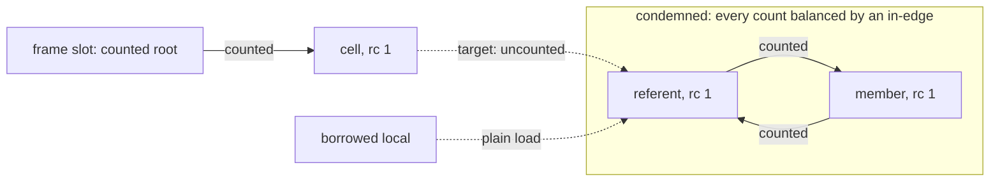

# WeakRef — the uncounted target edge

## 1. The case

A `WeakReference` holder counts the cell and never the referent. The
canonical `WeakRef` instance *is* the shared cell — its own entity kind, sixteen
bytes, an `RcHeader` every `$w` copy counts and a `target` field that
carries no count at all
([weak-references.md](../../weak-references.md#the-weak-cell-is-the-canonical-weakreference-itself)).
`get()` is a load of `target`, a null test, and a retain on the non-null
path, so the caller receives a strong reference.

```php
function tick(WeakReference $w): void {   // $w: owned by convention (parameter)
    $node = $w->get();                    // a call result: owned by convention
    if ($node === null) {
        return;
    }
    audit();                              // a checkpoint may drain here
    $node->run();
}
```

The algorithm carries one rule about them, and it arrived after this case
was written: the value a weak-cell read produces is an owned base case,
counted always and elided never, by Edmond's ruling 11 of 2026-08-22
([gc-horizon.md](../gc-horizon.md#the-ownership-lattice)). This case
exists for the edge under that rule — the `target` field itself, which no
count covers.

## 2. The lattice verdict

Two references carry a verdict, and one kind carries none.

- `$w` — **owned**, a by-value parameter, one of the convention base cases
  ([gc-horizon.md](../gc-horizon.md#the-ownership-lattice)).
- `$node` — **owned**, a call result. The convention makes every call
  result owned because the callee retains the returned reference before
  its epilogue ([gc-horizon.md](../gc-horizon.md#the-ownership-lattice)),
  and `get()` performs exactly that retain on its non-null path
  ([weak-references.md](../../weak-references.md#operations)). Today's
  surface is safe by that convention and by no rule about weak cells.
- A local born from a load of `target` — **owned**, by the base case
  ruling 11 added: a value read through a weak cell is counted always and
  reached by no elision rule
  ([gc-horizon.md](../gc-horizon.md#the-ownership-lattice),
  [gc-horizon-states.md](../gc-horizon-states.md#the-axes-the-lattice-reads)).
  Until that ruling the base-case list named COW eligibility,
  destructor-bearing targets, unique-crossing paths and the convention
  sites and no uncounted heap edge; section 4 is what the omission
  admitted.

The chain invariant requires every edge from the anchor to the target to
be a counted heap edge
([gc-horizon.md](../gc-horizon.md#the-ownership-lattice)). The `target`
edge is not counted, so a path through a cell is not a chain, and the
soundness argument that discharges the reclamation threat — a condemned
component on the path keeps an external counted in-edge, which the Phase 4
exact test reads
([rc-walk.md](../rc-walk.md#phase-4--verify-and-release-mutator-thread-by-message))
— has no premise to run on.

## 3. The horizon set

- `$w->get()` — a call without a trusted summary, under the literal
  reading of the horizon list. Whether a runtime entry such as
  `ll_weakref_get` is a call for this purpose is
  [gc-horizon.md](../gc-horizon.md#open-questions) question 11.
- `audit()` — a call without a trusted summary.
- The scope's end — a checkpoint that can drain a verdict. The drain nulls
  every cell naming a confirmed member before it runs any user code
  ([rc-walk.md](../rc-walk.md#what-this-design-does-not-solve), the weak
  obligation of 2026-07-26), so a `get()` after such a drain returns null
  rather than a freed address.

## 4. The lowering

The verdict is owned at both sites, so the horizon lowering is today's
lowering instruction for instruction: one retain inside `get()`, one
release for `$node` at its drop point, one pair for the parameter.

What must not be emitted is the anchored form, and the reason it is
tempting is that its IR shape is unremarkable:

```
$t = load $w->target      ; uncounted edge, no counted chain behind $t
                          ; the retain elided
call audit()              ; a drain condemns $t's component here
call $t->run()            ; use after free
```

The drain frees `$t` because the exact test balances counted references
only: `$t`'s count is matched by its in-degree inside the component, and
the borrow left no trace anywhere. That is DC5's shape
([rc-walk-danger-cases.md](../rc-walk-danger-cases.md#dc5--uncounted-borrow))
reached through the weak cell rather than through a dropped frame
reference, and DC5 names neither the cell nor this route to it.

**Whether the always-provable rules admit `get()`'s body, and what was
done about it.** The question does not have to be answered, and that is
what the ruling buys: whether a convention retain is in the
always-provable set at all is open question 16 of
[gc-horizon.md](../gc-horizon.md#open-questions), and ruling 11 removes
the candidate whichever way 16 goes. What the region test alone admits,
IR shape being all it reads: A rule qualifies when the enclosed region contains no
call, no store, no release and no checkpoint, with the owned base cases
as preconditions rather than competitors: the target is non-COW-eligible,
transitively destructor-free and non-unique
([gc-horizon.md](../gc-horizon.md#the-hybrid-counted-class-horizon-class)).
The region between the `target` load and the return holds a null test and
a retain, and a referent can satisfy all three preconditions, so nothing
in the admitted set bars the elision — after which the returned reference
is uncounted and every caller of `get()` inherits the shape above. Two
repairs were on the table and Edmond took the first: the owned base case
names the value a weak-cell read produces, so the elision has no
candidate left to remove. The second — a precondition reading "the region
contains no weak-cell load" — was refused for forbidding more than the
hazard
([walk/questions.md](../walk/questions.md#g1-the-weak-cell-is-an-uncounted-edge--closed)).

## 5. States touched

| Axis | Transition |
|---|---|
| a weak cell on the path | absent → present, at the `target` load ([gc-horizon-states.md](../gc-horizon-states.md#the-axes-the-lattice-reads)) |
| `HAS_WEAK_REFERENCES`, flag 7 | clear → set at `create`, set → clear at notify; the gate that says a cell exists to be nulled ([classes.md](../../classes.md#flags-layout)) |
| horizon set | gains the checkpoint kind, because the drain's nulling is what keeps `get()` honest across it |
| lattice state | `$node`: `Owned` from birth, by the call-result base case |

## 6. The picture



The two dotted edges are the ones the exact test cannot read. The solid
edge from the frame reaches the cell and stops there, because the cell
counts itself and not its referent.

## 7. The oracle

Three assertions, two instruments.

**Ordering.** Every weak cell naming a confirmed member reads null before
the drain runs any user code. A member's destructor calls `get()` on a
fellow member's cell and records the result, which must be null.
Instrument: a runtime test in the `ll-model` crate, whose weak machinery
and drain already produce this sequence
(`model/src/weak/tests/when_the_notification_arrives.rs`).

**Arithmetic.** A component whose only external reference is a cell's
`target` is condemned rather than acquitted. Instrument: a runtime test
over a hand-built heap, asserting the exact test's verdict.

**Lowering.** No local born from a `target` load is anchored, and no
always-provable rule elides `get()`'s retain. Instrument: the
shadow-count lowering, whose divergence signal — a shadow zero under a
live borrow — is exactly this defect
([gc-horizon.md](../gc-horizon.md#verification-artifacts-a-precondition-of-implementation)).

Buildable today: yes for the two runtime assertions, against the crate's
weak table and its drain; no for the lowering assertion, which waits on
the compiler the shadow lowering needs.

## 8. Prior art in this repository

- [rc-walk-danger-cases.md](../rc-walk-danger-cases.md#dc5--uncounted-borrow),
  DC5 — the free of a borrowed member with every gate passing honestly.
- [rc-walk.md](../rc-walk.md#what-this-design-does-not-solve) — the
  uncounted-borrow bullet states the root rule this case's edge fails,
  and the weak-references bullet states the nulling obligation.
- [weak-references.md](../../weak-references.md#death-notification) — the
  three notification sites and the invariant common to them.
- [pure-destructors.md](../pure-destructors.md#the-five-owner-bound-races)
  — races 3 and 4: `ll_weakref_get`'s retain is the channel that keeps a
  component reachable until the cells are nulled, and the nulling is
  owner-TLS work, which is why it stays in the prologue.
- The terminology note of [README.md](README.md#terminology-three-meanings-of-borrow-in-this-repository)
  separates this case's edge from the `#[Borrow]` attribute of
  [ffi.md](ffi.md).
- [adversarial.md](adversarial.md), PH1 and PH2 — the same referent
  observed through a cell and through a `WeakMap` key, with the death
  moved by the drop-point policy rather than by an elided retain.

## 9. Open items

1. ~~**The missing base case**~~ — question 7 of
   [gc-horizon.md](../gc-horizon.md#open-questions), closed by ruling 11
   on 2026-08-22: the base-case list names the value a weak-cell read
   produces, and the region precondition was refused. Section 4 records
   what the omission admitted while it stood.
2. **The `WeakRef` kind's own verdict is unstated.** A borrow of a cell itself,
   rather than through it, has no base case: the kind row assigns
   verdicts to the other six kinds
   ([gc-horizon-states.md](../gc-horizon-states.md#the-axes-the-lattice-reads)),
   and whether the `WeakRef` teardown arm, which clears the cell's
   weak-table registration ([classes.md](../../classes.md#entity-kind-and-non-object-teardown)),
   makes the kind not transitively destructor-free is not determinable
   from the RFC as it stands.
3. **The arena's weak list runs after a user-code fixpoint.** Reset
   notifies the list after its destructor fixpoint and before the pages
   are reused ([weak-references.md](../../weak-references.md#death-notification)),
   and that fixpoint runs user code in rounds
   ([arena-reset.md](../../memory/arena-reset.md#step-1--validate-trace-destruct-a-fixpoint-loop))
   — a severing point the horizon list does not name, recorded under
   question 8.
4. **A `get()` result is not evidence of anything but its own retain.**
   Nulling is irrevocable: a member its destructor resurrects lives on
   with the cell already null
   ([weak-references.md](../../weak-references.md#death-notification)), so
   no analysis may read a non-null `get()` as a liveness proof for a
   third entity.
5. **A weak-subscribed target's lifetime is decided by the drop-point
   policy, not by this design.** The policy drops a destructor-free class
   at last use because the timing is unobservable
   ([static-lifetimes.md](../../memory/static-lifetimes.md#drop-point-policy)),
   and a cell or a `WeakMap` key observes exactly that death. Question 14
   of [gc-horizon.md](../gc-horizon.md#open-questions) carries it. What
   this design does add lands on the same blind spot: the differential
   oracle licenses a destructor-free target's free to move from its own
   release into the parent's cascade, and borrow-is-use moves deaths on
   the chain later, while the oracle compares destructor sequences and
   death sets per batch — a weak cell reports both moves and the oracle
   reports neither.
