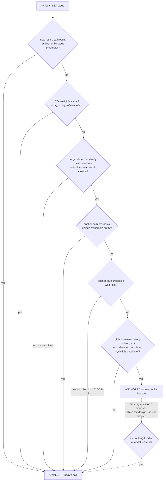
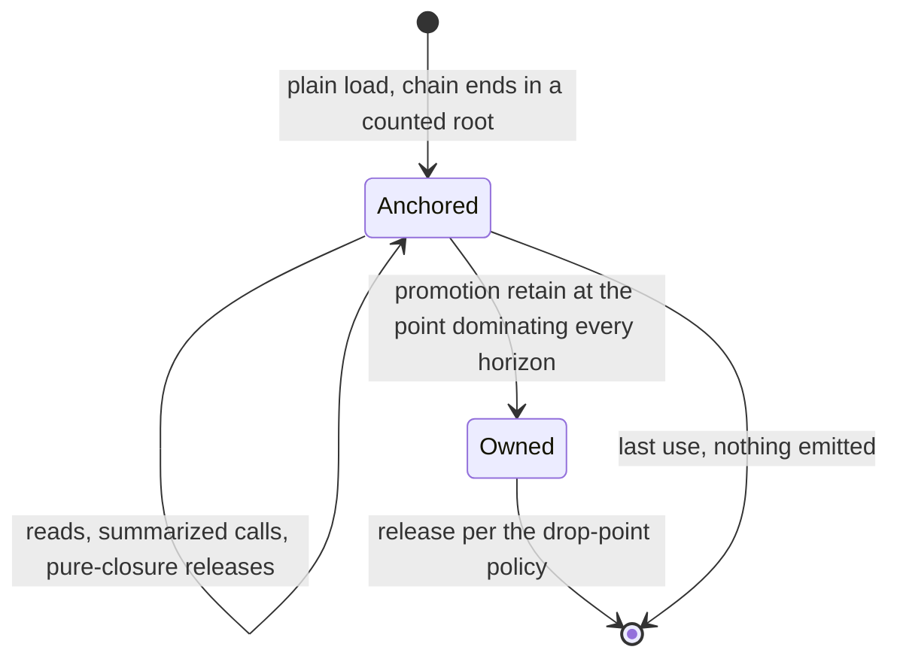
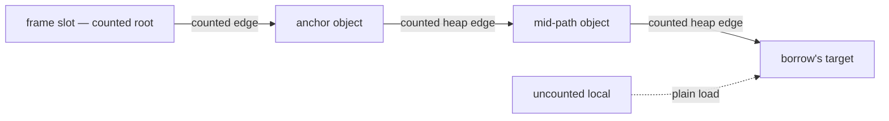
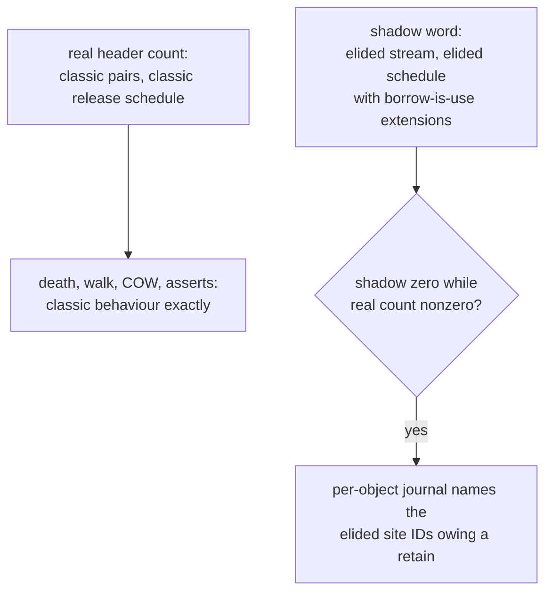

# GC horizon — the state set

## Scope

Every state the GC-horizon design reads, every state it creates, and the
one table of states it must leave alone. Companion to
[gc-horizon.md](gc-horizon.md), which stays normative: where the two
disagree, that document wins and this one is wrong. The per-case
projections are in [gc-horizon-cases/](gc-horizon-cases/README.md); each
case's "states touched" section names axes from the tables below and
nothing else.

This state set enumerates adopted Form A only. Form C's
`ImmediateCounted`, `DeferredCounted`, boundary-count and local-root-token
states are a gated candidate in
[gc-horizon.md](gc-horizon.md#candidate-inversion-selective-collector-computed-counts),
not runtime states this companion claims the current design creates.

The counts here are **derived by enumerating the axes, not measured**.
How much traffic each configuration carries is what the corpus scan of
[gc-horizon.md](gc-horizon.md#economics) exists to find out, and no
number below anticipates it. The genre is the one
[rc-walk-states.md](rc-walk-states.md) established for the collector: a
derived bracket, honest about which of its numbers a run would have to
supply.

## What the runtime must not change

The design's load-bearing property is that every structure it owns is
compile-time or instrument-side. Each row is a soundness argument rather
than an economy: change the row and the algorithm loses a premise.

| Runtime state | Change | Why it must not change |
|---|---|---|
| `RcHeader` refcount | none | owned locals and promotions use today's pair, so eager death and `__destruct` timing stay where [static-lifetimes.md](../memory/static-lifetimes.md#drop-point-policy) pins them |
| the COW protocol | none | the lattice never *decrements* a COW holder's count: every COW-eligible reference is owned by base case. The separation rule itself — four-armed, category before count — is [values.md](../values.md#copy-on-write-protocol)'s, and no summary of it belongs here |
| the epoch byte and the walk | none | there is no protection set, no candidate arm and no death-branch test; a promoted borrow is one more owned local and the collector cannot tell it from any other |
| the Phase 4 exact test | none | the chain invariant is discharged *by* that test balancing counted references ([rc-walk.md](rc-walk.md#phase-4--verify-and-release-mutator-thread-by-message)); an approximate test would take the discharge with it |
| the unique-ownership count word | none | it holds the occupancy sentinel, never a count, so no promotion and no convention retain may be emitted against it ([rc-walk.md](rc-walk.md#unique-ownership-one-owning-slot-and-no-count)) |
| the checkpoint protocol | none in code | what thins is the *rate* of batched scope-exit acks where a whole release run is elided — a budget effect, priced in the economics, not a protocol edit |

## The axes the lattice reads

Six properties of the referent decide whether a borrow may be anchored
at all. Five are stated by other documents; the sixth is an open
question of the design.

| Axis | Values | Where it lives | Effect on the verdict |
|---|---|---|---|
| entity kind | object, string, array, ReferenceBox, FFIBox, WeakRef, lazy object; an eighth code reserved | header flags 12–14 ([classes.md](../classes.md#flags-layout)); which code names which kind is the runtime ABI's business, never transcribed | string, array and ReferenceBox are COW-eligible and so owned; FFIBox is owned through its destructor; object and lazy object are the anchorable kinds |
| memory category | GC heap, request arena, long-lived, immortal | header flags 0–1 ([arenas.md](../memory/arenas.md#object-categories-by-memory-strategy)) | retain and release return early on immortal entities and are absent for arena ones, so the promotion retain buys nothing there — [gc-horizon.md](gc-horizon.md#open-questions), question 8 |
| COW eligibility | yes, no | header flag 10, and per-entity rather than per-class ([values.md](../values.md#cow-is-a-per-object-flag)) | yes → owned, because the uniqueness test reads the count |
| transitive purity closure | pure (P0, P1, P2) or not (NR, impure, unresolved) | class-level verdict ([pure-destructors.md](pure-destructors.md#purity-is-transitive)) | not pure → the borrow is owned from birth, keeping `__destruct` on the scope-end pin |
| unique ownership on the path | crossed, not crossed | the entity's count word holds the sentinel ([rc-walk.md](rc-walk.md#unique-ownership-one-owning-slot-and-no-count)) | crossed → owned: the chain invariant's premise (every path edge counted) fails |
| a weak cell on the path | present, absent | the cell's `target` field is uncounted ([weak-references.md](../weak-references.md#the-weak-cell-is-the-canonical-weakreference-itself)) | present → the path is not a counted chain. The value a read of the cell produces is an owned base case, by the ruling of 2026-08-22 that closed question 7 ([gc-horizon.md](gc-horizon.md#open-questions)) |

Three further per-entity axes bound the design without deciding a
verdict: `DESTRUCTOR_PENDING` and `DESTRUCTOR_RAN` (flags 8–9) are the
per-instance half of the purity decision; `HAS_WEAK_REFERENCES` (flag 7)
says a cell exists to be nulled before any drained destructor runs; and
`IS_ESCAPEE` (flag 11) means the refcount field is currently an escape
hold-count rather than a count at all, which is why the arena categories
need question 8 answered.

Two axes vary inside one entity kind and are the reason two cases split
by sub-mode rather than by kind. An array's storage is a typed vector, a
mixed vector or an ordered hash, and a transition replaces the storage
under the same entity, leaving identity, refcount and COW state alone
([arrays.md](../arrays.md#transition-rules)) — which is exactly what
makes `stable_path` survive a re-seating. A string is laid out inline or
out of line, and may be interned; there is no frozen mode
([strings.md](../strings.md#writes-obey-the-cow-rule-there-is-no-freeze-operation)).

## The axes the lattice creates

All of these are compile-time or instrument-side. Nothing here has a
runtime representation, which is why the collector cannot observe the
feature.

| Axis | Per | Values | Consumer |
|---|---|---|---|
| lattice state | SSA value | `Owned`, `Anchored(chain)` | the emitter |
| anchor chain | borrow | path edges ending in a counted root: frame slot, arena slot, static, immortal, FFI handle | the chain invariant; the checkpoint reclamation discharge |
| horizon set | live range | any subset of the eight horizon kinds below | promotion placement; the failure default |
| promotion point | promoted borrow | the latest point dominated by the birth that dominates every horizon, every exit and every raise site of the live range, and that lies inside no cycle the birth lies outside of — or ⊥, which sends the borrow to owned-from-birth ([gc-horizon.md](gc-horizon.md#at-the-horizon-promotion), as ruled 2026-08-22) | the emitter; the landing-pad sets |
| landing-pad set | exceptional edge and SSA generation | a pad whose frame dies releases the owned locals live at the raise site; a pad whose frame runs on, those of them dead where control resumes. Per edge, not per site, ruled 2026-08-22 ([gc-horizon.md](gc-horizon.md#at-the-horizon-promotion)) | unwind lowering |
| class regime | class | counted, horizon, or unnarrowable (which is counted) | the emitter's default under the hybrid |
| call effect model | call target or closed target set | source and trust, severable anchor paths, purity of internal releases, destructor reachability, **freshness identity** | the call-horizon lift; invalidation when its source changes |
| always-provable rule registry | admitted rule | statement, proof sketch, reviewer, date — one `model/dev/DECISIONS.md` entry each | the granularity ruling's bound |
| demotion worklist | unique entity | trigger sites: convention retains and horizon-reaching borrows; whether the set is one-pass and whether it names release sites is question 10 | the whole-program uniqueness fixpoint |
| per-site certificate | deviating site, future | anchor chain, summary IDs, horizon set | the independent checker |

## The eight horizon kinds

| Horizon | Why the proofs end there | What lifts it |
|---|---|---|
| a call without sufficient trusted, fresh effects | the callee may sever or release anything | an admitted effect model: no severable path, pure internal releases |
| dynamic dispatch whose possible targets or joined effects cannot be bounded | some callee or effect is unknown | a closed target set with sufficient trusted effects for every target |
| reflection | unbounded effects | nothing |
| a by-reference escape | the local becomes writable elsewhere | nothing |
| a release of a class whose purity closure is not pure | eager death runs `__destruct` at the release site | transitive purity of the closure, NR counting as impure |
| a store to a chain local, or through a may-alias of a path base | the chain is severed | must-not-alias through closed-class typed-property disjointness |
| a checkpoint that can drain a verdict | a drained destructor may store into the path | purity of the condemned set's downward closure |
| a suspension: yield, fiber | the resumption point is unknown | open question 2 of the design |

Two entries carry fine print. The release horizon has no finality test —
"may reach zero" is undecidable without count-value analysis nobody
plans, so every qualifying release is a horizon. The store horizon
covers assignment and `unset` of the anchor itself: a store *to* a chain
local ends `live(anchor)` whatever the purity of what it displaces.

## The lattice decision, drawn

Every IR local passes one cascade at compile time. Any "no" and any
analysis failure lands on owned, which is today's code, so a mistake
costs a pair and never a proof.



The base cases exist for six different reasons, and none of them is
horizon-crossing. Call results and parameters, because a borrowed return
surfaces behind the callee's epilogue checkpoint and an anchored
parameter dies to re-entrancy. COW values, because the uniqueness test
reads the count. Destructor-bearing targets, because elision would move
`__destruct` off the drop-point pin. Unique entities, because a retain
would write the occupancy sentinel. The weak-cell rung was the last of
the six to be settled: a cell's target edge is uncounted, and Edmond
ruled on 2026-08-22 that the value a read of the cell produces is owned,
counted always. The seventh rung in the drawing is not a rung — it is
what question 8 proposes, drawn dashed and outside the cascade because
the design has not adopted it: a promotion retain returns early in the
arena, long-lived and immortal categories
([lowering.md](../lowering.md#retain--release)), so it buys nothing
there, and the lattice reads the static class and never the category.

## A borrow's life



The promotion point is the latest point dominated by the birth that
dominates every horizon, every exit and every raise site of the live
range, and that lies inside no cycle the birth lies outside of. The
cycle condition is what makes a loop's horizon paid once, from before
the loop: without it the latest such point sits in the loop body and the
retain runs per iteration. A promoted borrow holds its
count over a subrange of exactly the lifetime today's code counts it
over — which is both the cost bound (never more than today) and the
death-order argument.

## The chain invariant



Every solid edge is counted, so at any drain a condemned component
intersecting the path has an external counted in-edge traceable to the
root and the exact test acquits it whole; an incoherent-array skip on
the path only inflates `RC − IN` toward roothood, conservative in the
safe direction (`model/src/walk.rs`, the give-up through
`StorageHead::coherent`). The uncounted arrow is the whole saving, and
the store horizon guards it: a store to any chain local, or through a
may-alias of a path base, ends the borrow's coverage.

## The collector states the design must survive but never touches

| Axis | Values | Source |
|---|---|---|
| slot occupancy | virgin, live, free, parked | [rc-walk-states.md](rc-walk-states.md) |
| epoch byte, offset 6 | 0 (new this epoch), the current number, an older number; numbers cycle 1–255 and skip 0 | [rc-walk.md](rc-walk.md#the-one-header-byte) |
| collector phase | idle, walking, condemning, awaiting ack, re-checking, posted, flushing | [rc-walk-states.md](rc-walk-states.md) |
| condemnation | collector-private since the 2026-07-27 eager-death amendment; the condemned byte is retired and bits 24–31 are free | [rc-walk.md](rc-walk.md#the-one-header-byte) |
| the drain-exclusivity window | held, released | [drain-window.md](drain-window.md) |
| GC state, flags 2–3 | `LIVE`, `SCANNING`, `DEAD`, `OWNED` — the CAS handoff, idle for arena entities, borrowed by the arena reset as its trace mark | [classes.md](../classes.md#flags-layout) |
| colour, flags 4–5, and the buffered bit, flag 6 | the rc-trace candidate machinery | [classes.md](../classes.md#flags-layout) |

The design reads none of these. It appears in the same paragraph as
three of them for one reason only: the checkpoint horizon is defined by
what a drain can do, so a case that reasons about a checkpoint reasons
about the phase it runs in.

## The product, and what collapses it

Six referent axes decide whether a borrow is anchorable, and their raw
product is

```
7 entity kinds × 4 memory categories × 2 COW × 2 purity
  × 2 uniqueness × 2 weak-cell  =  224 referent configurations
```

against which a live range carries its own two axes: the horizon set,
any of the 2⁸ = 256 subsets of the kinds above, and whether a dominating
promotion point exists. Per borrow site that is 224 × 256 × 2 ≈ 1.1 ×
10⁵ combinations — the naive bound, useful only as the honest starting
point before the algorithm's own identities are applied.

Four identities collapse it, and each is one of the owned base cases
read as an equation rather than as a rule:

1. **COW-eligible ⇒ owned.** String, array and ReferenceBox are
   COW-eligible by kind, so three of the seven kinds leave the anchorable
   population entirely, whatever their other five axes read.
2. **Not transitively pure ⇒ owned.** The purity axis stops being free:
   only the pure value survives.
3. **Unique on the path ⇒ owned**, and **weak cell on the path ⇒ not a
   counted chain**, which the ruling of 2026-08-22 answers with an owned
   base case for the read. Both axes stop being free the same way.
4. **FFI classes own their pointers**, so their destructor is never
   absent ([ffi.md](../memory/ffi.md#freeing)) and the FFIBox kind falls
   out through identity 2 rather than needing one of its own.

What is left is two kinds — object and lazy object — with the four
memory categories still open, which is exactly **8 of the 224 referent
configurations** — four of them belonging to the lazy kind, whose
verdict is undetermined while a plain property read of an untouched
ghost has no specified materialization path
([gc-horizon-cases/object.md](gc-horizon-cases/object.md), open item 1), and 4 of them if question 8 resolves against the arena
and immortal categories. On top of that, one of the 256 horizon-set
values leaves a borrow paying nothing at all: the empty set.

Two intersections of the collapses are not clean, and naming them is
half the value of doing the arithmetic:

- **COW ∧ unique is inconsistent.** Identity 1 demands a counted holder;
  the uniqueness sentinel forbids every retain. A referent in both sets
  has no defined lowering, and the demotion trigger set does not name the
  base-case retains that would resolve it — question 10.
- **Category is orthogonal to all four.** The collapses are stated over
  the static class, and the category is a runtime property of the
  entity; a class with instances in two categories has one lattice
  verdict and two different meanings for the promotion retain —
  question 8.

The number this arithmetic does not produce is the one that decides the
design: how much of a real program's borrow traffic lands in those 8
configurations with an empty horizon set. That is the corpus scan's
free-fraction bracket, and it is unmeasured.

## The instruments, and which exist

| Instrument | Produces | Authority | Buildable |
|---|---|---|---|
| graded corpus scan | the doubt map: a free-fraction bracket and the channels below | kill only, and only by reading the bracket | pre-Phase-D, compiler-free |
| summary-dependency channel | an invalidation-share bracket per stdlib class | kill on the under-approximation only | pre-Phase-D, inside the scan |
| pair-cost-over-contexts sweep | the dispersion band the economics lacks | calibration | pre-Phase-D, from the store probe's shape |
| release-build elision counter | the elided-pair count from the shipping lowering | the economics' count; the counting build is never clocked | needs the compiler |
| shadow-count lowering | divergence detection with site naming | verification | needs the compiler |
| differential lowering | the destructor sequence and death set per checkpoint batch | verification, nesting-insensitive by design | needs the compiler |
| Phase D publish census | borrow density per class, crossings per lifetime, live borrows per horizon, family coverage flags | the only gate that can open the design | Phase D |



One binary, two release schedules. With one schedule for both streams a
sound elision fires the signal and the diagnostic is dead on arrival;
under the dual schedule the false-positive rate is provably zero, because
shadow(target) equals real(target) minus the live elided borrows, and a
shadow zero under a live borrow would mean no counted holder exists in
the elided stream — which a sound elision's intact chain forbids.
Elisions made under always-provable rules, in either regime, enter the
same journal, so no elision class is uninstrumented.

## Scan channels

| Channel | Measures | Feeds |
|---|---|---|
| free-fraction bracket | lifetimes that are horizon-free under the graded classification: provably-horizon, provably-free, unresolved | the kill rule |
| unresolved-receiver share | where the doubt concentrates on calls | receiver-resolution pricing |
| severing-store share | the may-alias horizon's weight | the value of a disjointness instrument |
| purity tier per release | P0-syntactic, closure-unresolved, provably-impure, with a P2 share | the release horizon's weight |
| destructor-bearing-target share | the cost of the owned-from-birth exclusion | the economics' population |
| referent static class | per-class regime pricing | the hybrid's selection |
| summary-dependency bracket | the downstream recompilation blast radius | the standing-cost paragraph |

Checkpoint horizons appear in no channel: compiler-placed sites do not
exist in source, so both bounds omit them by construction. That is a
recorded structural limit of the scan rather than an oversight.
