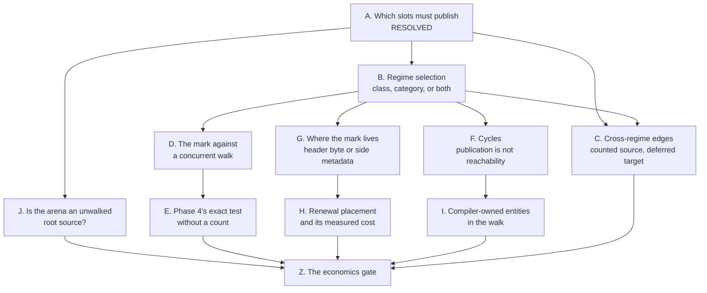

# The question graph

What is still open in the second design, in the order the answers unlock
each other. Each node names what would answer it and what it blocks, so a
session can pick up one node without re-deriving the rest. Resolved nodes
stay in place with their answer, because a later node's argument often
rests on one.

## A. Scope — which slots must publish  [resolved 2026-08-21]

**Resolved, and the question was posed wrongly.** The deferred regime is a
property of the entity and is available in any memory; it is not tied to
actors (Edmond). What decides who must publish is whether the walk sees the
slot holding the reference, not where the memory came from. A slot inside a
walked GC-heap entity costs nothing, because the collector enumerates the
edge. Every slot the walk does not see needs its own answer, and
[top-level.md](top-level.md), "Which slots must publish", gives it: the
frame takes the mark, and an arena slot, a static, an immortal container
and an FFI handle take a capture count, each having an owner that ends at a
known point.

The arena's store rule is cheaper when the target is deferred: no `retain`
and no release-at-reset entry, only the target's address on a root list the
collector reads each epoch. What licenses that is eager death — the count
exists on that path to stop the entity being freed under the arena slot,
and a deferred entity is never freed by reaching zero.

The original framing, kept because a later node's argument rests on the
correction:

**Open, and it is the root.** An actor's arenas are already collected at
message boundaries, where the stack is empty and the state consistent
([../../../runtime/actors.md](../../../runtime/actors.md)). Both Pony ORCA
and Iso reach the same place from different directions: collect at a
quiescent point and the question of which entities the frames hold does not
arise. If that rule extends to the general heap, the mark is needed only
where no quiescent point exists — a long request, a batch behaviour, code
outside any actor — and the deferred regime narrows to that population.

**What would answer it:** the share of allocation that is actor-private in
the corpus, and whether a PHP request reaches any point at which its stack
is empty before it ends.

**Blocks:** every node below, by deciding how much heap they govern.

## B. Regime selection — class, category, or both

**Provisionally decided, open in the second half.** The regime is a class
property, because the compiler must emit the right code without a runtime
mode test, and it takes its own flags bit rather than a fifth memory
category ([top-level.md](top-level.md)). What is open is the category axis:
`retain` and `release` are already absent for arena entities and return
early for immortal ones
([../../memory/arenas.md](../../memory/arenas.md#object-categories-by-memory-strategy)),
so a capture count exists only in the GC-heap category, and the pair
"class × category" has no stated lowering.

**What would answer it:** one table over the four memory categories saying,
for each, whether a deferred entity may live there and what its capture
count means.

**Blocks:** C, D, F, G.

## C. Cross-regime edges — a counted source with a deferred target

**Open, and less closed than an earlier revision of this file claimed.**
An `ImmediateCounted` source may die between two collector reads and remove
its edge into deferred space. Iso's corollary of the Doligez-Leroy-Gonthier
invariant — only the thread that allocated a private entity can publish it —
covers private entities only ([prior-art.md](prior-art.md)), and A resolved
against confining the deferred regime to private memory, so the corollary
covers a part of the population rather than half the question. The first
design's Form C names the two instruments — a boundary count, or a barrier
with a snapshot ([../gc-horizon.md](../gc-horizon.md)) — and neither is
chosen.

**What would answer it:** whether the counted source's own death path can
be made to publish the target instead of dropping the edge silently, which
is the same operation as the arena's release-at-reset list performed at a
different owner's end.

## D. The mark against a concurrent walk

**Open.** A walker that has already read an older epoch for a slot has
recorded its `rc[]` row, so a mark stored after that read arrives too late
and the entity is judged in this epoch. Today a lost stamp costs a wasted
message, because no byte is a safety gate
([../rc-walk.md](../rc-walk.md#the-one-header-byte)); under this design a
lost mark is a freed live entity.

**What would answer it:** either an ordering rule that makes the mark
visible before the row can be recorded, or a second race-free channel for
the publication, or a Phase 4 arm that re-reads the mark under the drain's
exclusivity window ([../drain-window.md](../drain-window.md)).

**Blocks:** E.

## E. Phase 4's exact test without a count

**Open.** Phase 4 is exact because it re-reads counts and edge sources
race-free. A deferred entity has no count to re-read, so the only thing
separating "a frame holds it" from "garbage" is the mark, and D decides
whether that read can be trusted.

**What would answer it:** the deferred arm of the exact test, stated as
what it reads and under which exclusivity.

## F. Cycles — publication answers roothood, not reachability

**Open.** A mark pins one entity and a capture count pins one entity; an
unreachable cycle among deferred entities has neither, so reclaiming it
still needs a trace from the roots. Every system in the prior art answers
this the same way, with an occasional backup trace — LXR with SATB, RC
Immix with a backup trace, partial tracing by tracing the heap as its
primary mechanism ([prior-art.md](prior-art.md)).

**What would answer it:** which of `rc-walk`'s existing machinery serves as
the backup trace over deferred space, and what triggers it.

**Blocks:** I.

## G. Where the mark lives — header byte or side metadata

**Open, and the prior art moved it.** The header byte is cheaper for the
mutator: the cache line is already loaded by the operation next to it. Dense
side metadata is cheaper for the collector: a linear sweep instead of
scattered header reads, and the entity's own cache line is never touched.
The first design's Form C rejected side metadata because it "would turn root
discovery into heap-metadata scanning"
([../gc-horizon.md](../gc-horizon.md)); LXR does exactly that scan as its
ordinary allocation path, at two bits per 16 bytes — four bytes of metadata
per 256-byte line ([prior-art.md](prior-art.md)) — so the objection is not
decisive.

**What would answer it:** the cost of one mark store in each placement, and
the cost of one collector sweep in each, measured rather than argued.

**Blocks:** H.

## H. Renewal placement and its cost

**Provisionally decided, cost open.** The mark is placed at every horizon
rather than once at a dominating point, because it expires and does not
accumulate; a live range crossing many horizons takes the capture-count pair
instead ([top-level.md](top-level.md)). What is open is where the crossover
sits, and that depends on G.

**What would answer it:** the horizon-crossing distribution per borrow
lifetime, which the corpus scan already owes a channel for
([../gc-horizon.md](../gc-horizon.md#economics)).

## I. Compiler-owned entities in the walk

**Provisionally decided, cost open.** A compiler-owned entity is walked as a
root and never condemned, and it may hold deferred children; forbidding that
edge would need a test on every store into such a field, which is a write
barrier. The cost is the `rc[]` row and the out-edges, not a traversal,
because Phase 1 visits every slot of the snapshotted blocks already
([top-level.md](top-level.md)).

**What would answer the rest:** the share of the heap under compiler
ownership, which decides whether the added rows matter.

## J. Is the arena an unwalked root source, or should the walk enter it?

**Open, raised by Edmond 2026-08-21 as a question of its own.** Today the
walk does not enter arena memory, so an arena's edges never appear in `IN`,
`RC - IN` stays positive for their targets and the targets are roots — the
identity's own corollary that an un-walked region is a root source
([../rc-walk.md](../rc-walk.md)). The deferred regime removes the count
that makes that corollary work, and node A's arena rule replaces it with a
root list. Whether that is the right answer, or whether the walk should
enter arena memory and enumerate its edges like any other, is undecided.

**What would answer it:** the cost of one walk over live arena memory
against the cost of maintaining and re-reading the root list, and whether
arena memory can be scanned at all — the walk finds object boundaries in
entity blocks by slot arithmetic, and an arena hands out memory by cursor.

## Z. The economics gate

**Not reachable yet.** The first design's rule holds unchanged: a gross
number may only kill, and only the marginal number may open
([../gc-horizon.md](../gc-horizon.md#economics)). This design adds two
channels of its own — marks stored per horizon crossing, and captures
acquired and released — and inherits every channel the first design owes.

## Resolved in the session of 2026-08-21

- **Prior art.** The design sits in the count-the-roots quadrant; the
  quadrant is occupied and the expiring form of the publication was not
  found ([prior-art.md](prior-art.md)).
- **Occupancy.** A slot is occupied when `refcount != 0 || deferred`, and
  the bit is cleared by whoever frees the slot, which for a deferred entity
  is the collector.
- **Unresolved call sites.** A site whose static class the compiler cannot
  narrow emits both the retain and the mark, the mark being sound in both
  regimes and the retain being a no-op in the deferred one.
- **The capture count is not a reference count.** It counts code-side
  captures, so zero means the code holds the entity nowhere; no death branch
  runs and no destructor fires at zero.
