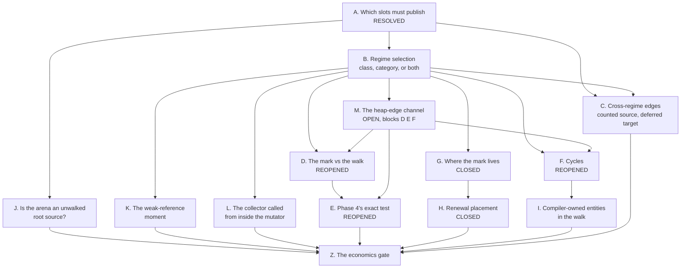

# The question graph

What is still open in the second design, in the order the answers unlock
each other. Each node names what would answer it and what it blocks, so a
session can pick up one node without re-deriving the rest. Resolved nodes
stay in place with their answer, because a later node's argument often
rests on one.



## A. Scope — which slots must publish  [resolved 2026-08-21]

**Resolved, and the question was posed wrongly.** The deferred regime is a
property of the entity and is available in any memory; it is not tied to
actors (Edmond). What decides who must publish is whether the walk sees the
slot holding the reference, not where the memory came from. A slot inside a
walked GC-heap entity costs nothing, because the collector enumerates the
edge. Every slot the walk does not see needs its own answer, and
[top-level.md](top-level.md), "Which slots must publish", gives it: the
frame takes the mark, and an arena slot, a static, an immortal container
and an FFI handle take a capture count, each having an owner that ends at a
known point.

The arena's store rule is cheaper when the target is deferred: no `retain`
and no release-at-reset entry, only the target's address on a root list the
collector reads each epoch. What licenses that is eager death — the count
exists on that path to stop the entity being freed under the arena slot,
and a deferred entity is never freed by reaching zero.

The original framing, kept because a later node's argument rests on the
correction:

**Open, and it is the root.** An actor's arenas are already collected at
message boundaries, where the stack is empty and the state consistent
([../../../runtime/actors.md](../../../runtime/actors.md)). Both Pony ORCA
and Iso reach the same place from different directions: collect at a
quiescent point and the question of which entities the frames hold does not
arise. If that rule extends to the general heap, the mark is needed only
where no quiescent point exists — a long request, a batch behaviour, code
outside any actor — and the deferred regime narrows to that population.

**What would answer it:** the share of allocation that is actor-private in
the corpus, and whether a PHP request reaches any point at which its stack
is empty before it ends.

**Blocks:** every node below, by deciding how much heap they govern.

## B. Regime selection — class, category, or both

**Mostly decided 2026-08-21.** The regime is a class property decided by
the compiler, and the store that skips the count is licensed by the
*declared type of the destination slot*, not by a runtime test on the
target — otherwise the elision costs a load and a branch on every store,
which is the write barrier this design exists to avoid. Two things force a
class to stay counted, and only two: a COW-eligible value, whose count is
read while it is alive, and an entity the walk does not collect at all
([top-level.md](top-level.md), "What forces a class to stay counted"). On
top of the class bit sits a per-allocation-site decision — whether the
compiler owns this instance and frees it itself — which is where
pretenuring's per-site advice fits ([prior-art.md](prior-art.md)).

What stays open is the profitability threshold in the selector, which needs
measurement and belongs to Z.

The original entry, kept because the correction rests on it:

**Provisionally decided, open in the second half.** The regime is a class
property, because the compiler must emit the right code without a runtime
mode test, and it takes its own flags bit rather than a fifth memory
category ([top-level.md](top-level.md)). What is open is the category axis:
`retain` and `release` are already absent for arena entities and return
early for immortal ones
([../../memory/arenas.md](../../memory/arenas.md#object-categories-by-memory-strategy)),
so a capture count exists only in the GC-heap category, and the pair
"class × category" has no stated lowering.

**What would answer it:** one table over the four memory categories saying,
for each, whether a deferred entity may live there and what its capture
count means.

**Blocks:** C, D, F, G.

## C. Cross-regime edges — a counted source with a deferred target

**Open, and less closed than an earlier revision of this file claimed.**
An `ImmediateCounted` source may die between two collector reads and remove
its edge into deferred space. Iso's corollary of the Doligez-Leroy-Gonthier
invariant — only the thread that allocated a private entity can publish it —
covers private entities only ([prior-art.md](prior-art.md)), and A resolved
against confining the deferred regime to private memory, so the corollary
covers a part of the population rather than half the question. The first
design's Form C names the two instruments — a boundary count, or a barrier
with a snapshot ([../gc-horizon.md](../gc-horizon.md)) — and neither is
chosen.

**What would answer it:** whether the counted source's own death path can
be made to publish the target instead of dropping the edge silently, which
is the same operation as the arena's release-at-reset list performed at a
different owner's end.

## D. The mark against a concurrent walk  [reopened 2026-08-21]

**Closed by removing the mark.** The horizon is paid with a capture count
and nothing else, so no mutator write races the walk and the epoch byte
keeps its single meaning ([top-level.md](top-level.md), "The one price").
The original entry:

**Open.** A walker that has already read an older epoch for a slot has
recorded its `rc[]` row, so a mark stored after that read arrives too late
and the entity is judged in this epoch. Today a lost stamp costs a wasted
message, because no byte is a safety gate
([../rc-walk.md](../rc-walk.md#the-one-header-byte)); under this design a
lost mark is a freed live entity.

**What would answer it:** either an ordering rule that makes the mark
visible before the row can be recorded, or a second race-free channel for
the publication, or a Phase 4 arm that re-reads the mark under the drain's
exclusivity window ([../drain-window.md](../drain-window.md)).

**Blocks:** E.

## E. Phase 4's exact test without a count  [reopened 2026-08-21]

**Closed with D.** A deferred entity has a count — of captures — so the
drain reads the same word it reads today. What splits is the corpse rule:
occupancy comes from the regime bit, liveness from the capture count, and
a zero capture count on an occupied slot is the ordinary condemned state
rather than a corpse. The original entry:

**Open.** Phase 4 is exact because it re-reads counts and edge sources
race-free. A deferred entity has no count to re-read, so the only thing
separating "a frame holds it" from "garbage" is the mark, and D decides
whether that read can be trusted.

**What would answer it:** the deferred arm of the exact test, stated as
what it reads and under which exclusivity.

## F. Cycles  [reopened 2026-08-21]

**Closed: the collector already traces.** `rc-walk` does not decide by
arithmetic. It computes a root set, marks what is reachable from it, and
condemns what stays unmarked, which is why it collects cycles at all. The
deferred regime changes the first step only — roothood is read from the
capture count instead of derived from `RC - IN` — so an unreachable cycle
among deferred entities has no root, is never marked, and is condemned like
any other.

```php
final class Node { public ?Node $next = null; }

$a = new Node();
$b = new Node();
$a->next = $b;   // no count work: declared type
$b->next = $a;   // the cycle closes
                 // at scope exit both capture counts reach zero
```

Neither is a root, the mark never reaches them, both are collected. What
the Form C text meant by "that number alone does not collect cycles" is
that the snapshot *sum* does not, and the trace is what does — a step
`rc-walk` performs already.

Two consequences survive and are recorded rather than closed:

- **An acyclic deferred class must be walked.** Today the walk skips an
  acyclic entity completely, because the count answers for it
  ([../rc-walk.md](../rc-walk.md)); a deferred entity has no such answer,
  so the acyclic skip does not apply to it. That is new collector work
  proportional to the share of such classes.
- **The second source of truth is gone.** Today a verdict rests on two
  independent accounts — the mutator's count and the collector's edges —
  and a disagreement is visible. For a deferred entity only the trace
  remains.

The original entry:

**Open.** A mark pins one entity and a capture count pins one entity; an
unreachable cycle among deferred entities has neither, so reclaiming it
still needs a trace from the roots. Every system in the prior art answers
this the same way, with an occasional backup trace — LXR with SATB, RC
Immix with a backup trace, partial tracing by tracing the heap as its
primary mechanism ([prior-art.md](prior-art.md)).

**What would answer it:** which of `rc-walk`'s existing machinery serves as
the backup trace over deferred space, and what triggers it.

**Blocks:** I.

## G. Where the mark lives — header byte or side metadata  [closed 2026-08-21]

**Closed by removing the mark.** Two placements were considered and both
dropped: the epoch byte, which overwrites the maturity stamp and costs the
children of a marked entity their in-edges, and a free byte of its own,
which answers both objections and was dropped in turn because a count is
maintained for the durable case anyway. LXR's dense side metadata stays on
file for any future per-object collector state. The original entry:

**Open, and the prior art moved it.** The header byte is cheaper for the
mutator: the cache line is already loaded by the operation next to it. Dense
side metadata is cheaper for the collector: a linear sweep instead of
scattered header reads, and the entity's own cache line is never touched.
The first design's Form C rejected side metadata because it "would turn root
discovery into heap-metadata scanning"
([../gc-horizon.md](../gc-horizon.md)); LXR does exactly that scan as its
ordinary allocation path, at two bits per 16 bytes — four bytes of metadata
per 256-byte line ([prior-art.md](prior-art.md)) — so the objection is not
decisive.

**What would answer it:** the cost of one mark store in each placement, and
the cost of one collector sweep in each, measured rather than argued.

**Blocks:** H.

## H. Renewal placement and its cost  [closed 2026-08-21]

**Closed with D.** Nothing expires, so nothing is renewed. What replaces
this node is the placement obligation a `release` carries and a mark did
not: a drop point at the end of the live range and landing-pad coverage at
every raise site, which is the first design's open question 9 and is
inherited unchanged. The original entry:

**Provisionally decided, cost open.** The mark is placed at every horizon
rather than once at a dominating point, because it expires and does not
accumulate; a live range crossing many horizons takes the capture-count pair
instead ([top-level.md](top-level.md)). What is open is where the crossover
sits, and that depends on G.

**What would answer it:** the horizon-crossing distribution per borrow
lifetime, which the corpus scan already owes a channel for
([../gc-horizon.md](../gc-horizon.md#economics)).

## I. Compiler-owned entities in the walk

**Provisionally decided, cost open.** A compiler-owned entity is walked as a
root and never condemned, and it may hold deferred children; forbidding that
edge would need a test on every store into such a field, which is a write
barrier. The cost is the `rc[]` row and the out-edges, not a traversal,
because Phase 1 visits every slot of the snapshotted blocks already
([top-level.md](top-level.md)).

**What would answer the rest:** the share of the heap under compiler
ownership, which decides whether the added rows matter.

## J. Is the arena an unwalked root source, or should the walk enter it?

**Open, raised by Edmond 2026-08-21 as a question of its own.** Today the
walk does not enter arena memory, so an arena's edges never appear in `IN`,
`RC - IN` stays positive for their targets and the targets are roots — the
identity's own corollary that an un-walked region is a root source
([../rc-walk.md](../rc-walk.md)). The deferred regime removes the count
that makes that corollary work, and node A's arena rule replaces it with a
root list. Whether that is the right answer, or whether the walk should
enter arena memory and enumerate its edges like any other, is undecided.

**What would answer it:** the cost of one walk over live arena memory
against the cost of maintaining and re-reading the root list, and whether
arena memory can be scanned at all — the walk finds object boundaries in
entity blocks by slot arithmetic, and an arena hands out memory by cursor.

## M. The heap-edge channel: the walk cannot see a deferred in-edge

**Open, and it reopens D, E and F.** Found by a Fable review, 2026-08-21,
with every citation checked against the text.

The capture count restores roothood for holders outside the walked heap.
It restores nothing for **heap edges into deferred space**, and the walk
has two ways of never seeing one.

*The race.* With `addr(P) < addr(Q)`, both mature, `Q.f = T` and T's
captures zero: the walker scans P, the mutator executes `$p->f = $q->f;
$q->f = null;` — neither store touches a count — the walker scans Q and
finds nothing. Phase 3 acquits on "any difference" between the snapshot
and the re-read, but the filter compares *recorded* locations
([../rc-walk.md](../rc-walk.md)) and this race lives entirely in
unrecorded ones. Phase 4 then confirms rather than catches: its equality
is "every member's refcount equals its in-component in-degree", and for T
that is 0 = 0. The exact test's own boundary already says why — "the exact
test balances **counted** references only" — so a deferred heap edge is a
permanent DC5 with no covering-root obligation behind it.

*The straight line, with no race at all.* A newborn is skipped whole by
Phase 1 and its targets are pinned by the count corollary. Remove the
count and the pin goes with it:

```php
$w = new Wrapper();   // stamped new this epoch: skipped, out-edges never read
$w->node = $t;        // declared deferred type: no count work
                      // T's captures are zero; nothing else holds it
```

T is condemned under a live newborn, in ordinary code, on every run.

**What would answer it:** an ordering between the mutator's stores and the
walker's loads, of which there are three sources — the mutator writes
something the collector reads (a count, a card, a queue entry, all
per-store costs); hardware records the writes (priced and rejected in
[../rc-walk.md](../rc-walk.md)); or the reads happen where the mutator
provably is not. Fable's impossibility argument closes the rest: with zero
per-store instructions the collector's whole observation trace is
bit-identical between "T was moved and is live" and "T was dropped and is
garbage", so no verdict function can separate them.

**The recommendation on the table:** partition. The concurrent walk never
judges deferred space; deferred entities are judged only in
mutator-context passes at points where the mutator is not running — the
`unset` attempt over its candidate set, a checkpoint, an arena reset, an
actor message boundary, the request end. Deferred space then becomes an
un-walked region for the collector thread, which is sound by the identity's
own corollary provided every deferred-to-counted edge stays counted. Two
repairs ride with it: elision is licensed only when the destination's owner
is itself deferred, and a boundary count covers counted-source-to-deferred-
target stores ([../gc-horizon.md](../gc-horizon.md)). The measurement that
would overturn it is the live deferred set at quiescent points: the pass is
race-free only if it completes inside one such interval.

## K. The weak-reference moment

**Open.** A deferred entity's `WeakReference::get()` keeps returning it
after its last strong reference is gone, until the collector notices. PHP
nulls the cell at once for an acyclic object and delays only for a cycle
member, so this moves a rule rather than extending an existing exception.
The `unset` attempt ([top-level.md](top-level.md)) returns the prompt
behaviour to entities that never entered the heap, which is where the
observing code usually is; what remains open is everything else.

Three things are at stake and they are of different kinds. The observable
break is a corpus question — how many uses of `WeakReference` and `WeakMap`
test liveness rather than attach metadata, the second being indifferent to
the moment. The retention is a memory question: a `WeakMap` holds its
values strongly, so a delayed key delays a whole value graph with it. The
resurrection window is a correctness question and does not depend on either
count: `get()` is the only operation in the language that reaches an
unreachable entity, so the cell must be cleared before the free with no
user code in between, which today the drain-exclusivity window guarantees
([../drain-window.md](../drain-window.md)).

**What would answer it:** the corpus count for the first, and for the third
a statement that the deferred free path clears cells inside the same window
the drain uses.

## L. The collector called from inside the mutator

**Open, raised by Edmond 2026-08-21 and still under consideration.** The
`unset` attempt makes reclamation run in the middle of ordinary program
code rather than at a checkpoint, and the algorithm has to work there.
What that costs is not yet worked out; what it touches is:

- **Reentrancy.** The attempt can run a destructor, which is user code,
  which allocates and can `unset` again, re-entering the attempt.
- **The exclusivity window.** A drain frees a component in a window where
  the collector provably touches nothing
  ([../drain-window.md](../drain-window.md)). An `unset`-time free happens
  outside that window, while the collector may be mid-walk over the same
  block.
- **Slot classification.** Phase 1 reads a zero count as a free slot, and a
  slot freed under a walk that has already recorded its row is the shape
  the walk's own rules were written to exclude.
- **Ordering and resurrection.** A destructor run inside ordinary code sees
  the program mid-statement, which is a stronger claim about what is
  consistent at that point than a checkpoint makes.

**What would answer it:** the same three links the drain-window proof uses,
re-derived for a free that starts from the mutator's own code rather than
from a posted verdict.

## Z. The economics gate

**Not reachable yet.** The first design's rule holds unchanged: a gross
number may only kill, and only the marginal number may open
([../gc-horizon.md](../gc-horizon.md#economics)). This design adds two
channels of its own — marks stored per horizon crossing, and captures
acquired and released — and inherits every channel the first design owes.

## Resolved in the session of 2026-08-21

- **Prior art.** The design sits in the count-the-roots quadrant; the
  quadrant is occupied and the expiring form of the publication was not
  found ([prior-art.md](prior-art.md)).
- **Occupancy.** A slot is occupied when `refcount != 0 || deferred`, and
  the bit is cleared by whoever frees the slot, which for a deferred entity
  is the collector.
- **Unresolved call sites.** A site whose static class the compiler cannot
  narrow emits both the retain and the mark, the mark being sound in both
  regimes and the retain being a no-op in the deferred one.
- **The capture count is not a reference count.** It counts code-side
  captures, so zero means the code holds the entity nowhere; no death branch
  runs and no destructor fires at zero.
