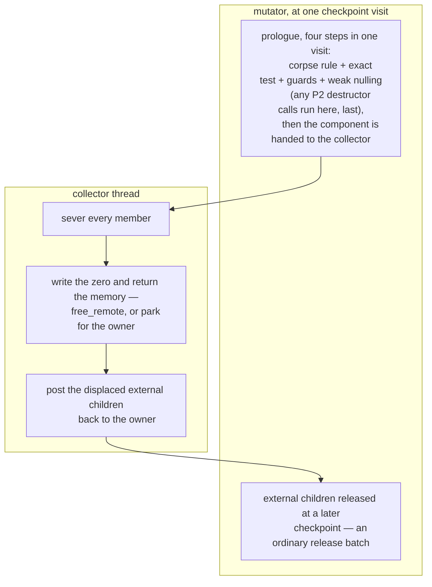

# Pure destructors and the hand-off drain

## Scope

The classification of a class by what its destructor may do, and what
each class of destructor lets the runtime skip. It owns the purity
ladder (P0, P1, P2, NR), the transitive closure that turns a body-level
tier into a class-level verdict, the hand-off drain that the closure
makes sound, and the trust class the resulting bit belongs to. The
collector's protocol is [rc-walk.md](rc-walk.md); this document changes
none of it, and only says which of its steps a component may skip.

Two other designs read the verdict as an instrument.
[gc-horizon.md](gc-horizon.md) uses it twice — for the release horizon
and for the checkpoint condition — and the drop-point policy of
[static-lifetimes.md](../memory/static-lifetimes.md#drop-point-policy)
already splits on destructor presence, which is the P0 row of the ladder
under another name.

> **Status: analysis, partly built.** Proposed by Edmond, 2026-08-18,
> and analysed the same day against the code repository at `23c3216`
> through three lenses (protocol soundness, purity semantics, payoff and
> composition), then through two Critic rounds. The P0 runtime paths
> exist and are listed below; the compiler tiers need a compiler; the
> hand-off drain waits on the residual duties and the tail bound named
> in the open questions. Moved here 2026-08-20 from the code
> repository's `dev/design/pure-destructors.md`, which stays as the
> working note and now points here.

## The design philosophy this is judged by

Stated by Edmond, 2026-08-18: the collector may do more work — that is
acceptable; the mutator strives to do nothing beyond the program's own
code. Unreachable at 100 %, so every mechanism below is weighed by the
mutator-side cost it leaves, and a design that spends collector cycles
to remove mutator cycles wins the tie.

## The verdict, first

Three parts, in decreasing certainty.

1. **The runtime side of the proposal is already built.** The runtime
   tracks destructor absence per class (`CLASS_HAS_DESTRUCTOR`) and per
   instance (`DESTRUCTOR_PENDING`), registers nothing at construction
   for a destructor-less class, frees destructor-less whites raw in the
   rc-trace collector, and skips Phase 4's re-verify whenever no
   destructor ran. Purity as a compile-time fact widens those paths; it
   does not invent them.
2. **"Reclaimed by the collector itself", read literally — the collector
   doing everything on its own evidence — is unsound.** Purity removes
   user code from the drain, but none of the five owner-bound races
   below comes from user code: the exact test, the corpse rule, the
   guard writes and the weak nulling read and write state only the owner
   may touch. That prologue is irreducibly the mutator's.
3. **Purity makes the hand-off drain sound.** The prologue stays where
   today's whole drain already runs — on the mutator, at its own
   checkpoint, so no external stop and no collision with the principle
   that forbids stopping the mutator from outside
   ([rc-walk.md](rc-walk.md#when-the-collector-runs-the-pressure-ladder))
   — and everything after it can move to the collector once the residual
   duties are resolved and the tail bound is chosen: after the exact
   test, the guards and the weak nulling, no mutator action can reach an
   all-pure component or mint a path to it, so the collector severs it
   and returns its memory. The mutator's Phase 4 share shrinks from the
   whole drain to the prologue — one trace plus one pass over the
   members. The O(component) prologue floor remains, because the exact
   test cannot be split. Purity is load-bearing: an impure destructor may
   store a member into a live slot, after which a half-collected
   component is reachable and none of this holds.

What freeing becomes, per case:

| Death | Today | Under this design |
|---|---|---|
| ordinary zero-count death, any impure class | dispose, then free | unchanged |
| ordinary zero-count death, P0 class | guard retain and release, two further header loads and three branches in `ll_default_dispose`, then free | specialized dispose: that phase removed (buildable today, no compiler) |
| condemned component with an NR or impure member | the whole drain on the mutator | unchanged |
| condemned component, every member P0 — or P2 under the order ruling | the whole drain on the mutator | the prologue on the mutator; sever and memory return on the collector |

## The purity ladder

A dying object's own fields are dead stores: any write a destructor
makes into `$this` is discarded by the free that follows. That collapses
most candidate tiers.

| Tier | Definition | Compiler obligation | What the runtime may skip |
|---|---|---|---|
| **P0** | no `__destruct` in the hierarchy | none — the class linker computes it today | everything: no registration, no guard pair, no re-verify contribution; the cycle collectors already key on it dynamically |
| **P1** | body writes only own non-counted slots; no calls except provably effect-free ones; **no throw**; external reads allowed, their results being dead | intraprocedural effect analysis plus a no-throw proof | erased to P0: the compiler clears `CLASS_HAS_DESTRUCTOR` and emits no registration — no new runtime state at all |
| **P2** | P1 plus nulling own counted slots (`$this->x = null`, `unset`) | P1 plus null-only counted writes, no hooked or dynamic properties | the resurrection machinery only. The sever nulls those slots anyway, so P2 would differ from P0 in the order of child releases alone — and that order is specified language surface (ruling below), so P2 keeps its call |
| **NR** | impure (I/O, external writes), but no address reachable through `$this` — `$this` itself or any member it can name — escapes into anything outliving the call; no throw | escape analysis of every address reachable through `$this`, through every callee | the resurrection machinery: the guard pair on ordinary death and the Phase 4 re-verify — never timing, never thread freedom |

A fifth candidate, "reads external, writes none", collapses into P1:
pure reads are unobservable, and any output channel makes the class NR.

### Purity is transitive

**Edmond's ruling, 2026-08-18.** The rows above grade one destructor
body; the class-level verdict joins the body's tier with a closure. A
destructor is pure only when its own body qualifies and every destructor
reachable through the death cascade qualifies too: the classes every
counted field can hold, their fields' classes, and so on to the closure.
One impure destructor anywhere in it makes the holder impure — there is
no partially pure variant.

What the transitive guarantee buys is categorical: no resurrection can
occur anywhere in the cascade, so the guard-discounted re-verify is
unnecessary for the whole teardown, and every child destructor runs
unconditionally to completion. The compiler obligation is a closed-world
closure over the field-type graph — the same discipline, and the same
failure modes (a subclass opening the set, `mixed`, an array of unknown
element class), as the acyclic flag
([rc-walk.md](rc-walk.md#the-compilers-acyclic-flag)); any edge the
analysis cannot close makes the class impure.

A consequence for the hand-off: the external children of a pure
component are inside the closure, so the owner's release batch runs no
user code — it stays on the owner for the counts, but it is mechanical
and bounded. NR sits outside this definition: it is not purity, gains
none of the transitive guarantees, and keeps only its ordinary-death
payoff.

The no-throw obligation is hard for P1, P2 and NR: an exception leaving
`__destruct` carries `$this` in its backtrace — an escape channel the
resurrection audit cannot otherwise close. PHP 8 arithmetic and typed
properties can throw. Hypothesis, undecided until the corpus scan below:
this obligation prunes the passing population more than any other rule.

### Why resurrection cannot happen

Resurrection requires a counted store of a member's address into a slot
that outlives the destructor call. P0 runs no code; P1 writes only own
scalars; P2 writes only nulls; NR forbids by proof the escape of any
address reachable through `$this` — a member's address included, which
is why the obligation is wider than escape analysis of the receiver
alone. Weak cells are nulled before any destructor runs
([rc-walk.md](rc-walk.md#what-this-design-does-not-solve), the weak
obligation of 2026-07-26), closing the one non-store channel.

A P2 destructor's own-slot stores preserve the exact test's equality
term by term: displacing an in-component child moves `rc` and `indeg`
together, and an external store touches no member row. So for a
component of ≤ P2/NR members, `rc` cannot come to exceed
`indeg + guard`, and the re-verify is redundant by construction. Under
the transitive ruling the same holds for the whole cascade rather than
only the component's members: nothing a pure teardown reaches can
resurrect anything.

## What is already built

- Construction is free for P0: generated code emits
  `ll_object_constructed` only where the class has a destructor, and the
  call returns immediately otherwise (`model/src/object.rs`).
- rc-trace frees whites raw — no dispose, no guards — once nothing in
  the white set owes a destructor (`model/src/gc.rs`, the white-free
  arm).
- The drain and the synchronous walk skip the guard-discounted re-verify
  when no destructor ran (`model/src/walk.rs`, `any_destructor_ran`).
- The arena reset logs only destructor-bearing instances, so a P0 corpse
  costs the reset's destructor fixpoint nothing
  ([arena-reset.md](../memory/arena-reset.md#step-1--validate-trace-destruct-a-fixpoint-loop));
  a corpse that is a weak target still costs its cell nulling in the
  reset's weak pass.

## P0 gains available without compiler work

1. **A specialized dispose.** For a P0 class, `ll_default_dispose`'s
   phase 1 is discarded knowledge: the guard retain and release, two
   further header loads, the pending test between them and the
   `refcount > 0` branch all answer a question the class settles at link
   time. The descriptor already reserves a per-class dispose slot; a
   generated one omits the phase whole. How hot the no-destructor death
   path is on a real heap waits on the census extension below.
2. **A raw-sever arm in the drain.** For a component whose every member
   tests `DESTRUCTOR_PENDING`-clear, port the rc-trace white-free
   precedent: sever and free without guards and without per-edge
   `ll_release`, external children still deferred through the barrier.
   This is "freeing simpler and faster" for the destructor-less case, by
   a per-member flag test the drain already performs.

## The five owner-bound races

Why the literal reading fails: each of these runs on the owning mutator
for a reason purity does not touch.

1. **The exact test reads current counts.** Counts are plain non-RMW
   fields under a single-writer contract; only the owner reads them
   race-free and current, and the test's trace reads plainly — against a
   running mutator that is undefined behaviour, not staleness.
2. **The corpse rule needs atomicity with releases.** Off-thread, a
   member can die between the collector's read and its guard write — the
   guard is written into a corpse's header and teardown runs twice.
3. **Guard and unguard are whole-word header stores.** They race the
   mutator's narrow count stores as a lost update; the channel that
   keeps this reachable is `ll_weakref_get`'s retain, until the cells are
   nulled.
4. **Weak nulling is owner-TLS.** The weak table is a per-thread plain
   map no other thread may even reach
   ([weak-references.md](../weak-references.md#the-weak-table-address--subscriber-row));
   skipping the nulling instead leaves race 3 open permanently.
5. **Teardown has owner-bound side duties.** `ll_entity_die` reports into
   the owner's reset window (TLS — consulted on the wrong thread it
   silently no-ops against an open reset), its journal record is written
   into the calling thread's ring (misattribution, not corruption), and
   external-child releases decrement counts of live, reachable
   entities — unfixable by any component-local argument; they must
   round-trip to the owner in every design.

The heap itself is not the blocker: cross-thread free exists
(`Heap::free_remote`), and parking for the owner is the deferred-free
queue's existing shape. The hand-back channel is the missing piece: the
verdict protocol runs in one direction today, and a component the
mutator returns to the collector needs the other.

## The hand-off drain

The target mechanism under the philosophy: the mutator runs the prologue
at its own checkpoint and hands the component to the collector; the
collector does the rest. Scope: condemned components only — an ordinary
zero-count death of a pure object is unchanged. Eligible is a component
whose every member is runtime-P0 after the compiler's erasure, or P2
under the specified-order ruling, P2 destructor calls running in the
prologue after the weak nulling. An NR member routes its component to
the unchanged whole drain: NR destructors do I/O, and the hand-off buys
nothing worth extending its soundness argument over them.

Death timing is unchanged for the members: the weak nulling in the
prologue is where their death becomes observable, exactly as today; only
the sever and the physical release move. The external children do die
later — their release batch runs at a checkpoint after the one that ran
the prologue, where today the whole drain releases them inside one
visit. That delay is a cost of the design, accepted by ruling on
2026-08-18.

The prologue completes within one checkpoint visit, with no return to
program code between its steps — a scheduling rule rather than a lock,
since nothing else runs on this thread. A P2 destructor call inside the
visit is not such a return, today's drain already running destructors at
the checkpoint, and the gap between those calls and the hand-off needs
no argument beyond P2's own: its writes stay inside the dying component.
What a split loses, per gap: program code between the exact test and the
guards can move a reference and invalidate the test's result; between
the guards and the weak nulling, `ll_weakref_get` can still mint a
strong reference into the component.

Why the tail is sound off-thread after the prologue and only then: the
exact test proved no external counted reference exists, the weak cells
are nulled, and purity rules out a destructor having minted a new
channel — so the mutator can neither reach the members nor mint a path
to them, and the collector's cell stores and header writes race nothing.
The cross-thread memory return exists today (`Heap::free_remote`, and
the buffer arena's remote stack); what does not exist yet is the
residual-duties question below.

Edmond's clarified intent (2026-08-18) settles the memory route: the
collector runs the dispose-side work — the sever, never a user
destructor — on its own thread and posts the physical frees to the
memory manager's queues instead of freeing in place. `Heap::free_remote`'s
per-block remote stacks are that queue; while the epoch is still open
the collector's own frees park like anyone's, the slot-identity rule
knowing no exceptions, and the parked backlog goes to the queues after
close.

What the mutator still pays, and why each piece stays:

| Mutator work | Why irreducible |
|---|---|
| the prologue, O(component) | counts are owner-written plain fields; the weak table is owner TLS |
| the external-child release batch | live entities, single-writer counts |
| checkpoint acks | the epoch's ordering, unchanged by this feature |

A fallback exists while the residual duties are unresolved: the same
pipeline entirely on the mutator, its tail sliced across checkpoints
while the prologue stays one visit — sound by the same unobservability
argument and needing no hand-back channel, but leaving the tail on the
mutator, a cost under the stated philosophy.

The cost has a name in both forms: the verdict stays outstanding until
the tail completes, so the component holds the epoch open longer, and
deferred memory is unbounded in epoch duration
(`model/dev/RC_WALK_CRITICAL_REVIEW.md`). A completion bound — a
deadline on the collector's tail, a per-checkpoint slice budget in the
fallback — is part of this design rather than an option on it; the
number is the tail-bound question below.

## The trust model: a soundness-bearing bit

The acyclic class flag is recall-bearing: a wrong flag leaks and frees
nothing early. A purity flag used for the re-verify skip or the sliced
tail is soundness-bearing: a wrongly-erased effectful destructor
silently drops user effects, and a wrongly-NR class frees a resurrected
component, which is a use-after-free. Purity therefore sits in the trust
class of `dispose` and `traced_runs`, beside the birth count's constant
and the uniqueness proof, and not beside the acyclic bit.

Only NR needs a new descriptor bit at all; P1 and P2 are expressed by
clearing `CLASS_HAS_DESTRUCTOR`, whose documentation already reads "with
side effects" as if anticipating exactly this erasure. Purity is
re-derived per most-derived class against its resolved vtable — a pure
parent destructor calling an overridable method is impure in the
subclass that overrides it — and anything not closed at analysis time
(late classes, dynamic properties, hooks, invoked closures) defaults
impure.

## Composition

**With unique ownership**
([rc-walk.md](rc-walk.md#unique-ownership-one-owning-slot-and-no-count)):
a unique entity of a P0 class dies at its owning slot's overwrite with
no teardown protocol left but its children's releases; add "no counted
fields" and the overwrite is literally a plain store plus a parked free
— the fast class is unique + P0 + leaf. The same composition thins the
checkpoint fabric: a unique death bypasses the displaced reference's
death-branch ack, and the unique + P0 + leaf overwrite has no teardown
exit either, so a workload converted wholesale to that class passes
neither ack site, its ack rate falling to what the unconverted remainder
produces (unmeasured). The full accounting, including how the fast class
can block its own memory return, is in
`model/dev/design/owned-slots-and-the-walk.md`.

**With the acyclic flag**: same delivery channel, different analysis,
different failure tier. Acyclic + pure + weak-free is the true fast
class — never walked, never drained, dying at zero through a plain free
and parked while an epoch is open — and it shrinks the census and the
per-epoch metadata.

**With the birth count**
([rc-walk.md](rc-walk.md#the-birth-count-a-known-in-degree-is-written-at-allocation)):
mechanically orthogonal, birth-side against death-side, no shared state;
they share the compiler-proof delivery channel and the Phase D gate.

**With GC horizon** ([gc-horizon.md](gc-horizon.md)): the transitive
verdict is that design's instrument in two places — the release horizon
reads it per released class, and the checkpoint condition reads it over
the condemned set's downward closure. Because the closure is what both
need, a change to what "pure" means moves both horizon kinds with it.

**With the arena reset**
([arena-reset.md](../memory/arena-reset.md#step-1--validate-trace-destruct-a-fixpoint-loop)):
P0 corpses already cost zero; what the compile-time bit adds is skipping
the dirty re-trace that today over-triggers on allocation by a
destructor that only touched its own dying fields, and fixpoint
convergence in fewer passes for strictly pure destructors (unmeasured).
The COW reconciliation is untouched.

## Prior art

None of the sources below were re-read at a pinned revision; verify
before citing as ground truth. Java deprecated finalizers for legal
resurrection, unspecified ordering and unbounded delay (JEP 421); purity
removes the first two by construction and makes the third unobservable.
Boehm's ordered finalization never finalizes cycles at all, which is what
cross-object observation costs; purity makes destructor order inside a
component unobservable. .NET's `SuppressFinalize` is the precedent for a
first-class no-finalizer path. Swift's `deinit` is the timing contract
this runtime already honours and must keep for everything impure.

## What to measure first

1. A static corpus scan outside the crate: the fraction of classes
   declaring `__destruct` in php-src's stdlib and a Packagist sample,
   and of those, the fraction with trivially pure bodies. If
   destructor-bearing classes are rare, P0's existing paths plus the two
   buildable-today gains are nearly the whole payoff. Unmeasured.
2. A census extension with per-flag counts — destructor presence,
   weak-target bit, later the acyclic and purity bits — to price the fast
   class on a real heap. The mechanism needs no compiler; population
   numbers wait on Phase D workloads.
3. Per-component member count, drain duration and an "all-P0, weak-free"
   bit in the epoch statistics — the number that decides whether the
   hand-off tail is worth building. Blocked on a production driver.

## Open questions

1. ~~Is child-release order inside one teardown specified?~~ — ruled by
   Edmond, 2026-08-18: **specified**. Today's order is language surface
   and no tier may reorder it, so P2 keeps its call and sheds only the
   resurrection machinery; the ladder stays three-tier plus NR
   (`model/dev/DECISIONS.md`, "child-release order is language
   surface"). The same entry accepts the hand-off's external-child
   delay as the design's cost.
2. **The hand-off tail's residual duties.** Three must be resolved
   before the collector may finish a component: the owner's
   reset-window record (`ll_entity_die` reports completed teardowns into
   owner TLS — prove the raw pure path owes nothing there, or route it
   back), journal attribution (records are written to the wrong thread's
   ring — acceptable or not), and the hand-back channel itself, a second
   direction the verdict protocol does not have today.
3. **What bounds an open tail?** The deadline on the collector's tail —
   and in the sliced fallback the per-checkpoint budget — against the
   parked-memory currency of epoch duration; which rung of the pressure
   ladder ([rc-walk.md](rc-walk.md#when-the-collector-runs-the-pressure-ladder))
   forces completion.
4. **The weak-table redesign.** A per-entity weak cell reachable by
   address would make nulling one atomic store from any thread. Under
   the hand-off design the nulling stays in the mutator's prologue, so
   this is worth costing only if the prologue itself is ever to leave the
   mutator; the `get()` fast path and
   [weak-references.md](../weak-references.md) both move with it.

## Build order

- **A. Runtime-only P0** — the specialized dispose and the raw-sever
  drain arm, still on the mutator. No ruling needed, no compiler needed,
  measurable today; it also builds the raw path the hand-off tail
  reuses.
- **B. The hand-off drain** — the philosophy's target: prologue on the
  mutator's checkpoint, tail on the collector. Needs the residual duties
  resolved and the tail bound chosen; the sliced mutator-side fallback
  is the intermediate step if the duties resolve slowly.
- **C. Compiler tiers** — P1 erasure first (zero new runtime state), P2
  after the order ruling, the NR bit last and only if the escape
  analysis earns its keep. Wholesale conversion of a workload to the
  unique-pure fast class additionally waits on the compensating-poll
  rule of `model/dev/design/owned-slots-and-the-walk.md`.
