# The question graph

Every open question of the design of record, as a node with what would
answer it and what it blocks. The graph covers the collector, the barrier,
the proof side inherited from [`../gc-horizon.md`](../gc-horizon.md), and the
verification debt. A node carries a mark for what blocks it:
**today** — answerable with the code and instruments that exist;
**measure** — a number nobody has taken, on instruments that exist;
**design** — a decision to be made and written, no instrument involved;
**compiler** — blocked on a compiler that does not exist;
**corpus** — blocked on a measurement of real PHP programs;
**hardware** — blocked on a machine this project does not have;
**Sage** — deferred to the arbitrating role;
**read** — prior art already read, feeding another node.

The rulings below bound the graph and are not nodes.

## Rulings of 2026-08-22

Edmond, in the session that refused the capture-count regime.

1. **The count stays on heap edges.** It is the write barrier, and it also
   frees at zero, answers the uniqueness test and carries the arena's
   escape hold-count. Nothing else on the table supplies all four.
2. **No thread is stopped from outside.** A thread short of memory may
   spend its own time collecting; the fourth principle of
   [`../rc-walk.md`](../rc-walk.md) stands unamended.
3. **Freeing runs in bounded batches.** The bound is relaxed while memory
   is short. Its ceiling is time rather than a count of entities, checked
   between entities: a destructor is user code, so per-entity cost has no
   bound and a count of entities bounds no pause. Both constants are
   unmeasured (node D3).
4. **A grown verdict queue activates the mutator.** The mutator drains it
   rather than waiting for its ordinary cadence.
5. **The collector is the main freeing path.** Verification stays on the
   mutator: its thread is the one place a verdict is checked against the
   true graph with no race ([`../rc-walk.md`](../rc-walk.md), Phase 4).
6. **Large OS-direct entities are walked.** Ruled on the premise that they
   were not, which was wrong: the registry landed on 2026-08-10 and both
   enumerators read it (`ll-model` `src/memory/large_entity.rs`). The ruling
   stands as a statement of what the design requires and closes node B3
   rather than opening it.
7. **An FFI wrapper holds the references itself.** Every PHP reference the
   C side can reach lies in a declared field of the wrapper; the C
   structure holds at most a raw address of what the wrapper already holds.
   The collector then traces the wrapper as an ordinary entity, and the
   memory of the C structure stays outside the collector's business.
8. **The collector runs user code only where purity is proven.** An impure
   destructor keeps its call on the mutator.
9. **The purity ladder keeps four rungs and every destructor call.** No
   rung folds into another, and no proof licenses skipping a call.
10. **The confirmation's pause is accepted rather than bounded.** A
    component is judged whole, and the exact test runs in one
    uninterrupted stretch over it (nodes D2 and D4).
11. **A value read through a weak cell is always counted.** It is an
    owned base case, and no elision rule reaches it (node G1).

## The graph

```mermaid
flowchart TD
    A1[A1 the pair against its working set<br/>measured 2026-08-22] --> A6
    A6[A6 what share of stores survives the proofs<br/>corpus] --> A2 & A3 & A4
    A2[A2 the birth count<br/>compiler]
    A3[A3 unique ownership<br/>compiler]
    A4[A4 anchor-chain elision<br/>compiler]
    A5[A5 a cheaper count word<br/>answered, prefetch unsettled]
    A7[A7 the unique-ownership discriminant<br/>answered 2026-08-22]
    A8[A8 clearing the COW flag by proof<br/>compiler] --> A3

    B1[B1 skip kinds that cannot ring<br/>rate measured, share corpus] --> C1
    A6 --> B1
    B2[B2 the acyclic class flag<br/>compiler] --> C1
    B4[B4 arrays as the commonest spine<br/>measured 2026-08-22] --> A6
    B5[B5 the epoch-abort watermark<br/>design + measure] --> C1
    B6[B6 skip by block, not by entity<br/>design + measure]
    B1 --> B6

    C1[C1 background cadence<br/>measure] --> C3
    C2[C2 the young-free exemption<br/>design + measure] --> C1
    C3[C3 the pressure ladder's constants<br/>measure]
    C4[C4 do the rungs earn their keep<br/>measure] --> C3

    D1[D1 the hand-off and hand-back channels<br/>specified 2026-08-22] --> D5
    D3[D3 the batch constants<br/>measure]
    D5[D5 collector-side destructor calls<br/>answered 2026-08-22]
    D6[D6 WeakMap ephemerons<br/>design]

    E1[E1 actors and per-thread epochs<br/>design] --> E3
    E3[E3 the domains proposal<br/>design]
    E2[E2 AArch64 header access<br/>hardware]

    G2[G2 the counted-out categories<br/>open, wider than question 8] --> G7
    G3[G3 placement, raise sites and pad sets<br/>design]
    G8[G8 anchored parameters<br/>design] --> G6
    G9[G9 one borrow analysis or two<br/>design] --> G6
    G4[G4 the trigger set against the sentinel<br/>design]
    G7[G7 borrow scopes across suspensions<br/>design] --> G6
    G6[G6 the summary language<br/>design] --> G5
    G5[G5 the trusted-effect boundary<br/>design]

    H1[H1 the checker models the old protocol<br/>scoped, re-derivation unstarted]

    F1[F1 coalescing RC<br/>read] --> A5
    F2[F2 arborescent GC<br/>read]
    F3[F3 partial tracing, read<br/>record only]
```

## A. What the count costs, and what removes it

### A1. What the counted pair costs against its working set  [measured]

Answered 2026-08-22, `ll-model` `dev/BENCHMARKS.md`. The pair an overwriting
store adds over a plain one costs 2.9 ns where both foreign headers are warm
and 33 ns at a population of a million entities, median of six runs, spread
of 12 % at the wide end. The figure is the difference between two arms of one
run, not the store's whole cost.

An earlier measurement the same day read 88 ns and is retracted in that file:
its probe published every store into one slot, so the displaced header was
warm where the retained one was cold, and it charged the counted arm for
scattered owner traffic the plain arm did not pay.

**What it changed:** an elided publication is worth up to 33 ns rather than
the 2.4 ns the hot figure suggested — about eleven times — which raises every
compiler proof below against every collector-side lever. Node N's estimate of
roughly 80 ns for the same quantity is high by a factor of 2.4, so the
crossover it draws must be re-derived on the measured figure.

### A2. What the birth count removes  [compiler]

`../rc-walk.md`, "The birth count". The factory writes the in-degree the
construction sequence will produce, and the sequence's publications emit no
retain. **What would answer it:** the share of publications that are
construction publications, which needs a compiler to elide and a corpus to
count. **What it blocks:** nothing; it is the largest compiler-owed lever.

### A3. Unique ownership  [compiler]

`../rc-walk.md`, "Unique ownership". An entity the compiler proves is owned
by exactly one heap slot carries no count. **The open rule is the move**
(`../rc-walk.md`): it must resolve as copy, or as a proof that the entity
never moves. A move that emits a barrier readmits node M's fatal ordering
through a side door.

### A4. Anchor-chain elision  [compiler]

Form A of `../gc-horizon.md`: a borrow anchored by a counted holder emits no
pair. **What would answer it:** the share of borrows whose anchor the
compiler can prove.

### A7. The unique-ownership header discriminant  [answered against the header; one consequence is new]

`../rc-walk.md` left it between a sentinel value in the count word and a
bit of the freed byte. Read against the header as it stands (`ll-model`
`src/refcount.rs`, and [`../../classes.md`](../../classes.md#flags-layout) for the flag map),
the first option is not a discriminant at all and the second exists in
only one build.

**The sentinel value cannot discriminate.** `../rc-walk.md` names the
sentinel as the value 1, which is exactly what an ordinary entity holding
one reference reads. It is an occupancy marker — it keeps the walker's
"is this slot live" test working — and it says nothing about whether the
word is a count. A discriminant made of a value would have to reserve one
no real count reaches, `u32::MAX` being the only candidate, and that rests
on a count never arriving there rather than on a proof.

**The flag word has no free bit below the epoch byte.** Bits 0-1 are the
memory category, 2-3 the GC state, 4-5 the collector colour, 6 the
buffered bit, 7 the weak-reference bit, 8 and 9 the two destructor bits,
10 COW, 11 the live-escapee bit and **12-14 the entity kind**. Bit 15 is
the string's out-of-line bit for one kind, and the whole of 15-31 is the
candidate-buffer index in an `rc-trace` build.

**So the discriminant is a bit of the retired condemned byte, 24-31**,
free under `rc-walk` since the eager-death amendment of 2026-07-27 and
used by nothing today.

**The consequence nobody has recorded: unique ownership is then an
`rc-walk`-only feature.** Under `rc-trace` bits 15-31 are the candidate
index, so no bit is free and the count word is the only place left, which
is the option this node just refused. Strategy selection is a build-time
feature precisely because the two cannot share the top half of the word
(`../strategies.md`), so a proof that changes what the count word means
cannot be strategy-neutral. Either unique ownership is declared
`rc-walk`-only, or the candidate index is narrowed to make room —
131 070 positions today, and the fallback for an out-of-range index is a
linear scan rather than an error.

### A5. A cheaper count word  [answered in direction; one lever unpriced]

The narrow mutator already writes back four bytes rather than eight
(`../rc-walk.md`). The node asked whether any further shape pays after
A1's figure. **The width is not the lever, and A1 says so**: the pair
costs 2.9 ns with both foreign headers warm and 33 ns at a population of a
million. The store is inside the 2.9; what the other 30 buys is the miss.
A narrower or cheaper store cannot reach it.

**Coalescing is bounded by the checkpoint cadence.** F1's shape — one log
entry per object per epoch instead of one pair per write — pays only where
the same header is touched more than once inside the window, and the
window cannot be an epoch here: the exact test recomputes in-degree from
current fields and compares it against the count, and only the owner reads
the counts current
([`../pure-destructors.md`](../pure-destructors.md#the-five-owner-bound-races)).
A log must therefore drain before any checkpoint that can run the test,
and checkpoints sit on every loop back edge. What is left to coalesce is
one straight-line stretch.

**A deferred log is already refused where the count matters most.**
[`../../values.md`](../../values.md#refcount-is-always-maintained-on-cow-entities)
rules deferred ARC out for COW entities at any tier, the sharing test
being consumed at the instant of the write. Every COW-eligible reference
is counted by base case, so the log would apply to the remainder only, and
the remainder is what the compiler proofs of section A are trying to
remove anyway.

**The lever is the miss, and a prefetch was measured against it**,
2026-08-22, `ll-model` `dev/BENCHMARKS.md`. Two arms, both counted,
identical but for a read prefetch of the retained and the displaced header
issued eight stores ahead. Where nothing misses it costs 0.9 ns per store,
stable across runs. At a million entities seven repeats recovered +11.6,
+7.3, −0.3, −1.3, +20.3, +1.3 and +7.2 ns — median +7.2, five of seven
positive, and the spread crosses zero while the bare arm's own median moves
between 79 and 107 ns. **The direction is suggestive and the magnitude is
unmeasured.** Probe:
`memory::barrier::tests::what_a_prefetch_recovers_from_a_cold_pair`.

**What would settle it:** a wide point that holds still — a pinned core and
a longer round, or a machine that is not WSL2 — and then the prefetch
distance varied, which is fixed at eight and not tuned.

### A8. Clearing the COW flag by proof  [compiler]

The road Edmond's ruling of 2026-08-22 opens
(`../../../dev/DECISIONS.md`). COW is one bit of `RcHeader.flags` and
non-COW arrays and objects already exist
([`../../values.md`](../../values.md#cow-is-a-per-object-flag)), so an
entity the compiler proves never needs the separation test can leave COW
outright and become eligible for A3. **What would answer it:** the proof
obligation — every write to the entity is through a holder the compiler
knows to be sole, over the entity's whole life — and what the flag's other
readers do when it is clear. **What it does not reach:** strings, where
the flag is the layout, set meaning bytes inline, and is fixed at
creation.

### A6. What share of stores survives every proof  [corpus]

The root of section A. If the proofs remove almost every pair, A1's figure
buys nothing and the collector-side levers decide; if they remove a third,
the store path is where the work belongs. **What would answer it:** a scan
of real PHP programs, which the repository has needed for three separate
questions and has never had.

**The scan splits in two, and one half is buildable today.** The
store-side share — how many publications survive the compiler proofs —
needs the compiler and waits. The *heap-side* share does not: how many live
entities are of a kind that cannot ring, and how many counted edges a heap
holds per entity, are properties of a running program's object graph, and a
reachability walk over a booted application reports both. What the answer
would be approximate about is the mapping from Zend's object model to this
design's entity kinds, which has to be stated with the figures rather than
assumed.

**A third quantity for the same scan, added 2026-08-22: the ratio of
counted edges to entities.** B4 measured a cell at 43-47 ns against a leaf
row's 40-54, so the walk's cost is carried by edges as much as by rows, and
which of B1 and B6 is worth building turns on that ratio as well as on the
share of leaf kinds.

## B. What the walk reads

### B1. Skip the kinds that cannot sit on a ring  [rate measured, share corpus]

The census enrols every `GcHeap` entity (`ll-model` `src/walk.rs`), strings,
weak cells and FFI boxes among them, although `trace_entity` files all three
under "the kinds with no counted children" and a leaf cannot be a ring
member. The acyclic skip is described in `../rc-walk.md` and is not taken in
code.

**The rate is answered**, 2026-08-22 (`ll-model` `dev/BENCHMARKS.md`):
skipping such an entity returns about 40 ns, give or take a fifth — roughly
half what an object row costs, since a leaf pays the header read, the id-map
entry and the count store and skips only the edge trace. The walk is about
70 % of an epoch.

**What is left is the share.** How many entities of these kinds a real PHP
heap holds is a corpus question and nothing here measures it. The same scan
answers node A6, so the two travel together. B4's measurement of 2026-08-22
bounds what the skip can be worth: it removes rows and no edges, and an edge
costs about what a row does, so its ceiling is the leaf share times the row
alone.

### B2. The acyclic class flag  [compiler]

The per-class form of B1: a class whose field types cannot close a ring.
**What would answer it:** the closed-world closure over the field-type
graph, with the same failure modes the purity closure has — subclassing,
`mixed`, arrays of unknown element class.

### B3. Large OS-direct entities are in the walk  [closed]

Closed before this graph was written, on 2026-08-10. An entity too large for
a pooled block lives in an OS-direct run, which no region contains, so it is
enumerated from its own registry — `ll-model` `src/memory/large_entity.rs`,
one address per run, entered before the memory and removed before the free —
and both `for_each_entity_slot` and the concurrent epoch's snapshot read it
(`src/memory/heap.rs`).

**The confusion this node was opened on**, recorded so it is not repeated:
`BLOCK_KIND_LARGE_RUN` (kind 4) is a raw C buffer, holds no entity and cannot
ring; `BLOCK_KIND_ENTITY_LARGE_RUN` (kind 10) holds one entity and is the
registered kind. The comment saying huge allocations stay outside the walk is
about the first.

### B6. Skip by block, not by entity  [design + measure]

B1 skips a leaf after reading its header; this node asks whether the walk
can decline to touch the block at all. Today it cannot: entity blocks are
divided by block kind and then by size class only (`ll-model`
`src/memory/heap.rs`), so a string and an object of the same size share one.

Two shapes, and their prices differ by more than their benefits.

- **Segregate entity blocks by entity kind.** The walk then skips whole
  blocks untouched, which is worth more than B1's 40 ns per entity — most of
  that 40 is the header miss the walk would no longer take. The price is a
  partly-filled tail block per pair of size class and kind, paid in footprint
  and fragmentation.
- **Count the ring-capable entities in each block.** Zero means skip the
  block. One word per block, maintained where a slot is handed out and
  returned — paths that touch the block header already. Mixed blocks are read
  as they are today, and a block that came out uniform by itself, which
  consecutive allocation of same-size strings makes common, is skipped for
  almost nothing.

The second costs nothing in layout and is where to start. **What would
answer it:** the share of blocks that come out uniform under a real
allocation pattern, which is the corpus question of A6 again, one level up.

Against B1 this node gained ground on 2026-08-22: a skipped block skips its
rows **and** its edges, where B1 skips rows only, and B4 measured an edge at
about what a row costs. A skipped block of arrays saves the storage-head read
as well, 23 ns each.

### B5. The epoch-abort watermark  [design + measure]

The second collector-side bounding mechanism in the backlog beside C2's
young-free exemption, and `../rc-walk.md` says it needs its own proof pass.
C2 alone does not bound a long epoch.

### B4. Arrays as the spine of the commonest ring  [measured and closed]

`../rc-walk.md` calls the array the spine of the commonest PHP cycle, and
arrays are copy-on-write, so they keep their count under every regime. The
node asked whether the walk can read an array's storage differently from
an object's fields.

**It already does, and the layout is not where the cost is.** The array
arm reads the storage head under a version and gives the array up when the
two readings disagree, then picks a stride from the tag (`ll-model`
`src/walk.rs`, `src/array/head.rs`), where the object arm chases the class
word. A vector's key is its position, so only the value is a cell; a hash
entry's string key is a counted child beside the value, so a hash row
carries two. The third tag, a typed vector, no producer stamps and the
walker refuses rather than striding.

**Measured 2026-08-22**, `ll-model` `dev/BENCHMARKS.md`, five arms in one
binary: 23 ns the storage head once per array, **43 ns a cell in array
storage against 47 ns a cell in an object body**, medians over six runs
with overlapping spreads. Per cell the two containers are
indistinguishable, so an array's whole structural excess is the head read.
Probe: `collector::tests::what_an_array_row_costs_the_walk`.

**What the measurement changed, and it is bigger than the node.** A cell
costs 43-47 ns and a leaf row 40-54, so an edge costs about what an entity
does: **the walk's mass is edges, not rows.** B1's acyclic skip removes
rows and no edges, which is the smaller half of the work; B6's skip by
block removes both for a uniform block, and the head read with them. The
ratio of edges to entities in a real heap therefore joins the corpus scan
of A6 as a quantity that decides between them.

**The floors are floors.** Every filled cell in the probe names one shared
entity, so the `IN` increments hit one cache line where a real heap
scatters them; both cell figures are lower bounds.

### C1. The background cadence  [measure]

Open question 1 of `../rc-walk.md`, undecided since 2026-07-28: how much
deferred memory, how many suspects, or how long since the last epoch
justifies a background epoch while nothing is failing. The pressure half is
decided — the allocation-failure path climbs the self-help ladder.
**What it blocks:** every threshold in C3.

### C2. The young-free exemption  [design + measure]

`../rc-walk.md` carries it in the backlog. Parked records are one for one
with mid-epoch deaths, births included (`dev/BENCHMARKS.md`), and parked
memory bounded by churn times duration is the epoch's currency. Removing
the records of entities born and died inside one epoch makes a long epoch
cheap, which is what lets C1's cadence fall. **What would answer it:** the
proof pass the design already asks for, then the measurement.

### C4. Do the fixpoint and stratification rungs earn their keep  [measure]

`../rc-walk.md` open question 3: whether either rung beats simply re-running
the epoch plus the forced verdict. C3 prices their constants and assumes they
exist; this node asks whether they should.

### C3. The pressure ladder's constants  [measure]

`R`, its doubling, the per-epoch forced-post cap, the stratification
threshold. All are measurements nobody has taken, and `../rc-walk.md` says
so.

## D. The verdict, and who frees

### D1. The hand-off and hand-back channels  [specified against the queue that exists]

Ruling 5 needs them. The verdict protocol runs one way today, collector to
mutator, and the hand-off drain of
[`../pure-destructors.md`](../pure-destructors.md#the-hand-off-drain) needs
two more crossings: the mutator handing a confirmed component to the
collector, and the collector posting the external children its sever
displaced back to the owner.

**What exists, read from `ll-model` `src/epoch.rs`.** One mutex-guarded
queue of confirmation messages, each a vector of raw member pointers that
the collector treats as opaque ids. Three statics beside it: a handshake
flag the collector raises and the next checkpoint lowers, a monotonic ack
count whose `AcqRel` bump is the handshake's release fence, and
`OUTSTANDING_VERDICTS`, which the post increments **before** the message
becomes visible and whose zero is the collector's licence to end the
epoch. Pickup is gated by two thread-locals: `MID_DRAIN`, which closes the
recursion when a drained destructor's release checkpoints inside the
drain, and `TEARDOWN_DEPTH`, which refuses a pickup while any entity on
this thread is between its committing zero store and the end of its
dispose. The queue is a mutex rather than a lock-free structure because
verdicts are a cold per-epoch trickle.

**The hand-off, mutator to collector.** The mirror image, with one rule
that is not symmetric: **the mutator does not decrement
`OUTSTANDING_VERDICTS` when it hands off.** The count is the epoch's
licence to end, the work is not finished, and it has only changed hands —
so the collector decrements it when its tail is done. This is the
mechanical form of what the drain already states, that the verdict stays
outstanding until the tail completes and the component holds the epoch open
longer. The collector polls this queue between its own steps; it needs no
handshake, having no reentrancy to close.

**The hand-back, collector to mutator.** A second message kind on the
existing queue rather than a second queue, because the pickup gating is
exactly what a batch of releases needs: those releases run destructors, and
`MID_DRAIN` and `TEARDOWN_DEPTH` are what keep a destructor's own release
from picking up another message mid-teardown. **The hand-back message must
not touch `OUTSTANDING_VERDICTS`**: its payload is live entities whose
deaths are ordinary deaths, and counting it would make the epoch wait for
ordinary release work.

Two orderings the channels owe:

- The collector posts the hand-back **after** the sever is complete for the
  whole component. Posted earlier, the owner could release a child whose
  in-edge from the component still exists, and the count would go one below
  the truth.
- An undrained hand-back at thread exit is drained there like any other
  pending message. The thread-exit teardown already walks the static blocks
  and disposes the thread's weak table
  ([`../../weak-references.md`](../../weak-references.md#the-weak-table-address--subscriber-row));
  a batch left on the queue instead leaks every child in it.

**What stays open:** the tail's completion bound, which
[`../pure-destructors.md`](../pure-destructors.md#the-hand-off-drain) calls
part of the design rather than an option on it, and whose number is node
D3's.

### D2. Cutting a garland  [closed]

Components are weakly connected — "a garland of linked garbage rings is
judged as one unit", decided 2026-07-26 (`ll-model` `src/walk.rs`). Cutting
one would bound the confirmation's pause and cost completeness: a ring cut
between two of its members is not recognised as dead on that pass.

**Closed by ruling 10**: the pause is accepted, so the reason to cut is gone.
The garland is judged whole. Edmond deferred this to Sage earlier the same
day, on the premise that the pause had to be bounded; the ruling removes the
premise, and the deferral with it.

### D3. The batch constants  [measure]

Ruling 3. The time ceiling of a freeing batch, and how far memory pressure
relaxes it.

### D4. The indivisible verification  [closed]

The exact test compares every member's count against its in-component
in-degree, recomputed from current fields, and it cannot be split. Splitting
is not merely expensive but unsound, and one example shows it: a component of
X and Y with a local holding Y. Check X — count 1, in-degree 1, passes. The
mutator then reads `$y->x` into a local, raising X's count to 2, and releases
Y. Check Y — count 1, in-degree 1, passes. Both halves agree and X is held.

Nothing beats the bound either: carrying the walk's in-degree instead of
recomputing it uses the stale number the recomputation exists to replace;
summing over the component still reads every member; trial deletion costs the
same. The test is Ω(N) reads in one uninterrupted stretch.

**Closed by ruling 10**, which accepts the pause rather than bounding it. The
lever was never the test but N itself, and N is no longer to be reduced.

### D6. WeakMap ephemerons  [design]

[`../../weak-references.md`](../../weak-references.md) records the mechanism
and defers it: a map's key-to-value edge is conditional on the key's
liveness, so the walk must not treat it as an ordinary edge — and the
recorded decision is a known limitation, behaviour matching PHP 8.0-8.2, with
the gap logged in the backlog. This node asks whether the design of record
keeps that deferral or closes it.

### D5. Collector-side destructor calls  [answered: the permission stays unused]

Ruling 8 lets the collector call a destructor proven pure. **The design of
record does not use the permission, and should not.**

**Where the calls sit is already fixed.** The hand-off drain runs every
destructor call in the mutator's prologue, after the weak nulling and
before the component is handed over, and the collector's share is the sever
and the physical release — never a user destructor
([`../pure-destructors.md`](../pure-destructors.md#the-hand-off-drain)).
Death timing is unchanged for the members: the weak nulling is where their
death becomes observable, exactly as today.

**Moving a P2 call to the collector buys nothing and costs two things.**
The mechanical work the collector could take is the sever, and it already
takes it. What a P2 destructor does beyond that is null its own counted
slots, which releases children — and an external child's release is
owner-bound, counts being plain single-writer fields
([`../pure-destructors.md`](../pure-destructors.md#the-five-owner-bound-races),
race 5), so the call would have to round-trip what the sever round-trips
anyway. The second cost is order: P2 differs from P0 in the order of child
releases alone, and that order is specified language surface, which is why
ruling 9 keeps the rung and its call at all
([`../pure-destructors.md`](../pure-destructors.md#the-purity-ladder)).

**So the permission stays available and unused**, recorded here so the
question is not re-derived: what makes the tail sound off-thread is that
the exact test proved no external counted reference exists, the weak cells
are nulled, and purity rules out a destructor minting a new channel — and
that argument licenses the sever, which is all the collector needs.

**What remains open** is not the call but the fallback: the same pipeline
entirely on the mutator with its tail sliced across checkpoints, which
[`../pure-destructors.md`](../pure-destructors.md#the-hand-off-drain) keeps
while the residual duties are unresolved. D1 resolves the channels; whether
the fallback is retired with them is the ruling that closes this node.

### G1. The weak cell is an uncounted edge  [closed]

`../gc-horizon.md` question 7, opened by the case-book review of 2026-08-20.
A weak cell references its target with no count, so a chain anchored on a
path through it is anchored on nothing, and the exact test — which balances
counted references only — would free the referent under a live borrow. It was
the one soundness hole among the open nodes.

**Closed by ruling 11**: the value a weak-cell read produces is an owned base
case. It is counted always and elided never, which is what happens today by
the convention that a call result is owned, and is now a rule rather than an
accident of lowering. The alternative considered and refused was a
precondition on the elision rules — "the region contains no weak-cell load" —
which forbids more than the hazard: it would strip elision from every value
in a region that merely contains a `get()`.

The collector's side of the same edge is covered elsewhere: a weak cell is an
in-edge the equality cannot see, so a component naming one is judged by the
mutator, which nulls the cells inside the visit that frees, with no user code
between — ruling 8 keeps such a component off the collector's arm.

### G2. Promotion buys nothing in the counted-out categories  [open, and wider than the question]

`../gc-horizon.md` question 8. An answer was written on 2026-08-22 saying
the hazard reduces to G7 and the rest is cost; a review round broke it on
its central premise. What the round established is below, and it makes the
node larger rather than smaller.

**The early return is on any non-zero category, so there are three cases,
not two.** `ll_retain` returns before the counter word when the category
bits are set and the entity is not COW
([`../../lowering.md`](../../lowering.md#retain--release)), which covers
request-arena, immortal **and long-lived**. A long-lived entity dies —
"minimal RC or explicit free", the strategy per object type still
undecided
([`../../memory/arenas.md`](../../memory/arenas.md#long-lived-arena)) — so
there the promotion retain buys nothing and no arena discipline protects
the borrow either. The shape needs no fiber and no message boundary: a
borrow of a long-lived referent, a horizon, the subsystem's explicit free
inside it, and the borrow reads freed memory. The chain edge into such a
referent is uncounted for the same reason, which is node G1's shape in a
category nobody checked.

**An arena is not always reset at a boundary: a `#[Region]` arena resets
mid-message.** A region's arenas reset when the region object dies, by
refcount or by its owner's drop
([`../../memory/regions.md`](../../memory/regions.md#definition)), and its
collector runs on its own threshold rather than at a message boundary. A
region inherits the arena discipline wholesale and shares the same two
category bits, so no lattice axis over the category can tell a region
referent from a request-arena one.

**The reset's fixpoint frees as it goes.** Object memory is logically
freed as each destructor runs, and only the arena's pages are held until a
pure round closes the loop
([`../../memory/arena-reset.md`](../../memory/arena-reset.md#step-1--validate-trace-destruct-a-fixpoint-loop)).
A destructor's own frame is live while later destructors run, since a
child release inside it runs the next teardown, so a borrow taken in one
destructor spans another's stores.

**What the reset happens at is itself unsettled.** `actors.md` states
"actor death = arena reset"
([`../../../runtime/actors.md`](../../../runtime/actors.md#actor-memory));
what a long-lived actor does at a message boundary is *collection*
([`../../memory/arenas.md`](../../memory/arenas.md#request-arena)), and
[`../domains.md`](../domains.md) says an arena's collection is its reset
while its own table has an arena entity judged by nobody. Question 8, this
node's earlier answer, and `../gc-horizon-cases/arena.md` all read the
boundary as a reset without a source that says so.

**What survives:** the immortal category has no hazard. Those entities are
never freed, no thread-exit path tears them down, and a class descriptor
and its metadata train are immortal with the code
([`../../memory/arenas.md`](../../memory/arenas.md#immortal-objects)). The
elision there is free.

**The cost half is not a lattice question.** An immortal entity needs no
retain and no release at all, so where the compiler knows the value is
immortal the right lowering emits nothing — no call, no flag test, no
promotion. That holds for interned strings, class descriptors, `null`,
`true`, `false`, small integers and enum cases, and it holds in today's
lowering as much as under this design: a `retain` on a string literal is
dead code either way.
[`../../memory/arc-optimizations.md`](../../memory/arc-optimizations.md)
carries the runtime half only — the flag makes the operations no-ops —
and the compile-time half, dropping the call where the value's
immortality is a static fact, is written nowhere. What remains beyond it
is a field load, where the category lives in the header and not in the
type, so removing the call there needs the category propagated to the use
site.

**What would answer this node:** the compile-time elision above, which is
owed by the lowering rather than by the lattice; the long-lived category's
reclamation strategy, which `arenas.md` marks undecided; a rule that separates a
region referent from a request-arena one, or a proof that a borrow cannot
outlive a region reset; the fixpoint's relation to the checkpoint
protocol, which `../gc-horizon-cases/arena.md` open item 3 already calls
underivable; and what a long-lived actor does to its arena at a message
boundary.

### G3. Placement, raise sites, and what a landing pad releases  [partly ruled]

`../gc-horizon.md` question 9. Three review rounds ran over this node on
2026-08-22 and each broke the closure the one before it produced. What
survived is in `../gc-horizon.md`, in the promotion section; what did not
is here, so the road is not walked a fourth time.

**Ruled: the raise sites join the quantifier.** That is the reading
question 9 offered first, and PH9 asserts it — "the retain is before the
invoke on every normal and exceptional path"
([`../gc-horizon-cases/adversarial.md`](../gc-horizon-cases/adversarial.md))
— as do `unwind.md`, `call.md` and `array.md`. The cost is that a
promotion is not hoisted past an allocating store, and since most loop
bodies allocate, a borrow live across one is promoted at or near its
birth. What the design keeps whole is the case it exists for: a borrow
whose horizon set is empty pays nothing at all.

**Ruled: every set the quantifier names is computed over the graph
including its exceptional edges.** The alternative was tried and it
breaks liveness itself. A value read only inside a `catch` has its last
normal-path use before the `try`, so the drop-point policy
([`../../memory/static-lifetimes.md`](../../memory/static-lifetimes.md#drop-point-policy))
releases it before the raise site and the handler reads freed memory. The
same deletion strands borrow-is-use: a borrow used only in a handler
keeps its anchor live nowhere.

**Ruled: a pad release is a release.** The claim that no horizon kind is
owed for one was wrong. A pad releases the frame's owned values, their
classes unconstrained, and eager death runs `__destruct` at each — a
destructor that stores into a live anchor path severs it there exactly as
it would on the normal path. The earlier argument proved only that a pad
does not release the *anchor itself*, which is a smaller claim, and it does
not hold for an anchor that is a static or an arena slot, neither of which
has the liveness borrow-is-use reasons from.

**Ruled: pad state is per edge and per SSA generation**, by split pads or
an ownership phi. PH22's third option, a tag, is a runtime flag written on
the normal path, and the granularity ruling of 2026-08-18 excludes mutator
work beyond the program's own code.

**Ruled: what a pad releases turns on where phase 1 selected the
handler**, not on the pad's syntactic kind. Selected in an outer frame,
the frame dies and the pad releases the owned set live at the raise site.
Selected in this frame — a `catch` here, or a `finally` that returns,
which discards the in-flight exception
([`../../../runtime/exceptions.md`](../../../runtime/exceptions.md#semantics))
— the frame runs on and the pad releases only what is dead where control
resumes. A `finally` that rethrows into a `catch` of the same frame is the
shape that defeats the syntactic reading.

**Open: the execute-once condition.** A promotion must run once per
instance of the live range, and dominance does not say so. The shape that
needs it: a borrow that is a loop-header phi is born inside the cycle, so
any condition phrased over "a cycle the birth lies outside of" admits a
retain per iteration. The balancing release is the one the phi's own kill
owes when it overwrites the previous instance, and no rule states it.

**Open: a suspended generator's pads.** Both released sets above are
functions of a raise site, and a generator destroyed at a suspension
enters its `finally` blocks from a destruction instead
([`../gc-horizon-cases/unwind.md`](../gc-horizon-cases/unwind.md), open
item 4). There is no edge for the per-edge state to key on.

**Owed elsewhere:** oracle A1 of `unwind.md` asserts the pad's set equals
the owned locals live at the raise site, which is now true of a dying
frame only; the promotion-point wording is quoted without the amendment in
`../gc-horizon-states.md` and in six case files. Both are step S5.7 of
`../../../dev/PLAN.md`.

### G4. COW and unique ownership intersect  [ruled; the trigger set stays open]

`../gc-horizon.md` question 10. **Ruled by Edmond, 2026-08-22: COW wins**
(`../../../dev/DECISIONS.md`). The unique-ownership proof establishes
lifetime — one owning slot, death at the overwrite — and lifetime is not
what the separation test asks, so the proof neither answers that test nor
licenses removing the count. A COW-eligible entity keeps its count
whatever else is proved about it, and the intersection is empty rather
than contradictory: the occupancy sentinel and the COW flag never sit in
one header.

The elision licence
[`../../values.md`](../../values.md#refcount-is-always-maintained-on-cow-entities)
grants — a pair may be elided "only where it has proved that no second
holder arises" — is therefore not discharged by the uniqueness proof. The
road it does open is node A8: prove COW itself unnecessary and clear the
flag, after which the entity is no longer COW-eligible and unique
ownership applies to it normally.

**What stays open is the trigger set, which the collision only exposed.**
Two defects survive the ruling because neither is about COW.

- **A retain against the sentinel from a base case.** The unique-crossing
  base case ([`../gc-horizon.md`](../gc-horizon.md#the-ownership-lattice))
  classifies a borrow as owned *because* the entity is unique. Where the
  borrow's target is that entity — `$n = $this->e` on the owning slot —
  the retain lands on the sentinel, and the demotion trigger set names
  convention retains and horizon-reaching borrows only, so nothing fires.
  Reading the set as a closure over the lowering does not repair it: the
  base case's predicate is the verdict the set computes, so the two
  oscillate. Evaluated once against the lowering computed under the
  assumption of uniqueness, and never revisited, it terminates — and that
  one-pass rule then demotes every entity ever loaded into a local, whose
  cost is node A3's share and A6 has not measured it.
- **A release against the sentinel.** `new` is owned by the lattice, which
  absorbs the creation reference and releases at the drop point
  ([`../gc-horizon.md`](../gc-horizon.md#the-ownership-lattice)), while
  the owning store into a unique slot takes no count — so the temporary's
  release drives the sentinel to zero, which is eager death, a destructor
  call, a free, and a walker reading an occupied slot as free. Either the
  trigger set names release sites, or the owner's allocation is specified
  as a move that consumes the temporary.

**What would answer this node:** a written trigger rule that is one-pass
and that names release sites as well as retain sites.

### G5. The trusted-effect boundary  [design]

`../gc-horizon.md` question 11. A stored callee summary is not the only
source of effect knowledge — body analysis, builtin models, ABI contracts,
the joined models of a closed multi-target call establish the same facts.
The design needs one source-independent rule for sufficiency, trust,
composition, freshness and invalidation.

### G6. The summary language  [design]

`../gc-horizon.md` question 1. What a summary states, who writes the ones for
the standard library, the conservative default at every unknown, and the
versioning rule.

### G7. Borrow scopes across suspensions  [design]

`../gc-horizon.md` question 2, and the case book's two hole reports
(`../gc-horizon-cases/closure.md`, `../gc-horizon-cases/suspension.md`). A
yield is a horizon unless the summary system learns resumption points, and a
fiber suspended across an arena reset carries frame borrows the reset cannot
see. `gc-horizon.md` marks it as shaping the IR early, which puts it before
most of section A.

### G8. Anchored parameters  [design]

`../gc-horizon.md` question 6. Whether caller-guarantee summaries can lift
the receiver and by-value parameters out of the owned default, and what the
re-entrancy obligation costs there.

### G9. One borrow analysis, or two  [design]

`../gc-horizon.md` question 5. One IR-level borrow analysis parameterized by
the invalidation set, serving unique ownership and the horizon together. The
working default recorded 2026-08-18 is one analysis with two invalidation
sets, with Edmond's veto open.

**Closed by the refusal of 2026-08-22:** `../gc-horizon.md` question 12,
selective collector-computed counts. That is Form C, and the capture-count
regime is its descendant.

## H. Verification debt

### H1. Both model-checker specifications model a protocol that is gone  [scoped by a run; the re-derivation is unstarted]

`../../../dev/tools/rc-walk/README.md` and `../drain-window.md` record the
drift: the TLA+ specifications were written against the pre-amendment
protocol, while eager death is the premise of everything since.

**The battery is alive, and it agrees with itself.** Run whole on
2026-08-22, OpenJDK 21 with the vendored TLC: 22 scenario configs against
`RcWalk.tla` and 4 against `DrainWindow.tla`, **all 26 matching the
expectation recorded for them** in
[`../rc-walk-proof.md`](../rc-walk-proof.md) — every sound config
exhausts clean, every kill config ends in its violated invariant, and the
two liveness kills (`SC_dtor_reentrant`, `SC_nosever`) end in a violated
temporal property. Scenario runs take seconds. So the instrument works
and the specs have not rotted; what is wrong with them is what they
describe.

**What green there does not say.** The specs carry a shared condemned
byte, the F5 death deferral and message-based acquittals with drain
duties ([`../rc-walk-model.md`](../rc-walk-model.md), the 2026-07-27
banner). The protocol since the amendment has none of the three:
condemnation is collector-private, every death is eager, the drain drops
on any zero-count member by the corpse rule, and an acquittal posts
nothing. A green battery is therefore evidence for the superseded rule
set — except where a scenario exercises machinery the amendment kept,
which the banner itself says is most of it: the walk, the filter, the
exact test, the sever and the deferred queue.

**What the re-derivation has to change**, and it is a list rather than a
rewrite: the condemned byte leaves the state vector; the death action
loses its deferral arm and commits at zero; the acquittal action stops
posting and becomes collector-private; the drain's entry condition
becomes the corpse rule. Then the rulings of 2026-08-22 add what has no
model at all — the collector as the freeing path, the hand-off and
hand-back crossings of node D1, and the batch bound of D3.

**What it blocks:** any model-checker scenario written today inherits the
drift, so the re-derivation is a precondition of that instrument rather
than a task beside it — which is what
[`../gc-horizon-cases/README.md`](../gc-horizon-cases/README.md) already
tells the case book about its third candidate oracle.

### E1. Actors and the epoch protocol  [design]

Refcounts are non-atomic and the crate is single-mutator
(`../rc-walk.md`). Actor isolation keeps that valid — a reference into
actor memory never crosses the boundary raw
([`../../../runtime/actors.md`](../../../runtime/actors.md)), so a count
keeps one writer. **What remains open:** whether each actor runs its own
epoch, and what the collector's single shared write — the epoch stamp —
becomes across several of them.

### E2. AArch64 header access  [hardware]

`../rc-walk.md` open question 2. x86-64 is settled — plain moves, no lock
prefix, no read-modify-write. The instruction half of the AArch64 claim is
settled too; the cost half is not, and no machine here can take it.

### E3. The domains proposal sits behind E1  [design]

[`../domains.md`](../domains.md) is the standing multi-mutator design and
carries its own open list, which E1 as a single node hides: a domain dying
mid-epoch, per-domain enumeration, the drain-window invariant re-derived for
a second mutator — [`../drain-window.md`](../drain-window.md) names that as a
kill variant of the proven invariant — the move's counter semantics, and the
shared-class destructor question.

## F. Prior art, round two

Round two of the search is [prior-art.md](prior-art.md). Its three findings
that change a node:

### F1. Barrier forms  [read]

LXR's field logging and SATB are already in this repository. Coalescing
(sliding-view) reference counting, Levanoni and Petrank, is not, and is the
shape A5 asks for: one log entry per object per epoch rather than one pair
per write. Feeds A5.

### F2. Cycle collection  [read]

Arborescent GC (ISMM 2025) is the only published shape found that decomposes
D4's global question into local ones — a spanning forest inside the program's
own graph, checked locally on each edge removal. It costs about two words per
object. Feeds D2 and D4, which have no other candidate.

### F3. Partial tracing  [read, record only]

**Concurrent Deferred Partial Tracing (PLDI 2026) is the published form of
the capture-count regime** — "DRC counts heap edges and traces the roots; PT
counts the roots and traces the heap" — and it carries the same blocker this
design refused it for, destruction timing. Recorded so that the refusal is
findable against the literature. Nothing in it is proposed for this design.

## Inherited record

The capture-count regime and the two reviews that closed it are kept in
[`../gc-horizon-v2/questions.md`](../gc-horizon-v2/questions.md), nodes M
and N. Nothing in this graph re-derives them.
