# The question graph

Every open question of the second version of the walk, as a node with what
would answer it and what it blocks. A node carries one of three marks:
**today** — answerable with the code and instruments that exist;
**compiler** — blocked on a compiler that does not exist;
**corpus** — blocked on a measurement of real PHP programs.

The rulings below bound the graph and are not nodes.

## Rulings of 2026-08-22

Edmond, in the session that refused the capture-count regime.

1. **The count stays on heap edges.** It is the write barrier, and it also
   frees at zero, answers the uniqueness test and carries the arena's
   escape hold-count. Nothing else on the table supplies all four.
2. **No thread is stopped from outside.** A thread short of memory may
   spend its own time collecting; the fourth principle of
   [`../rc-walk.md`](../rc-walk.md) stands unamended.
3. **Freeing runs in bounded batches.** The bound is relaxed while memory
   is short. Its ceiling is time rather than a count of entities, checked
   between entities: a destructor is user code, so per-entity cost has no
   bound and a count of entities bounds no pause. Both constants are
   unmeasured (node D3).
4. **A grown verdict queue activates the mutator.** The mutator drains it
   rather than waiting for its ordinary cadence.
5. **The collector is the main freeing path.** Verification stays on the
   mutator: its thread is the one place a verdict is checked against the
   true graph with no race ([`../rc-walk.md`](../rc-walk.md), Phase 4).
6. **Large OS-direct entities enter a registry and the walk.** They are
   outside the region registry today, so a ring through one is never
   collected (node B3).
7. **An FFI wrapper holds the references itself.** Every PHP reference the
   C side can reach lies in a declared field of the wrapper; the C
   structure holds at most a raw address of what the wrapper already holds.
   The collector then traces the wrapper as an ordinary entity, and the
   memory of the C structure stays outside the collector's business.
8. **The collector runs user code only where purity is proven.** An impure
   destructor keeps its call on the mutator.
9. **The purity ladder keeps four rungs and every destructor call.** No
   rung folds into another, and no proof licenses skipping a call.

## The graph

```mermaid
flowchart TD
    A1[A1 the pair against its working set<br/>measured 2026-08-22] --> A6
    A6[A6 what share of stores survives the proofs<br/>corpus] --> A2 & A3 & A4
    A2[A2 the birth count<br/>compiler]
    A3[A3 unique ownership<br/>compiler]
    A4[A4 anchor-chain elision<br/>compiler]
    A5[A5 a cheaper count word<br/>today]

    B1[B1 skip kinds that cannot ring<br/>today] --> C1
    B2[B2 the acyclic class flag<br/>compiler] --> C1
    B3[B3 large entities into the registry<br/>today]
    B4[B4 arrays as the commonest spine<br/>today]

    C1[C1 background cadence<br/>measure] --> C3
    C2[C2 the young-free exemption<br/>design + measure] --> C1
    C3[C3 the pressure ladder's constants<br/>measure]

    D1[D1 the hand-back channel<br/>design] --> D5
    D2[D2 cutting a garland<br/>Sage] --> D4
    D3[D3 the batch constants<br/>measure]
    D4[D4 the indivisible verification<br/>design]
    D5[D5 collector-side destructor calls<br/>design]

    E1[E1 actors and per-thread epochs<br/>design]

    F1[F1 coalescing RC<br/>read] --> A5
    F2[F2 arborescent GC<br/>read] --> D2 & D4
    F3[F3 partial tracing, read<br/>record only]
```

## A. What the count costs, and what removes it

### A1. What the counted pair costs against its working set  [measured]

Answered 2026-08-22, `ll-model` `dev/BENCHMARKS.md`. An overwriting store
costs 4.1 ns where the two foreign headers are warm and 88 ns at a
population of a million entities, median of eight runs, spread of seven at
the wide end. The direction is settled and the magnitude is not.

**What it changed:** an elided publication is worth up to 88 ns rather than
the 2.4 ns the hot figure suggested, which raises every compiler proof
below against every collector-side lever.

### A2. What the birth count removes  [compiler]

`../rc-walk.md`, "The birth count". The factory writes the in-degree the
construction sequence will produce, and the sequence's publications emit no
retain. **What would answer it:** the share of publications that are
construction publications, which needs a compiler to elide and a corpus to
count. **What it blocks:** nothing; it is the largest compiler-owed lever.

### A3. Unique ownership  [compiler]

`../rc-walk.md`, "Unique ownership". An entity the compiler proves is owned
by exactly one heap slot carries no count. **The open rule is the move**
(`../rc-walk.md`): it must resolve as copy, or as a proof that the entity
never moves. A move that emits a barrier readmits node M's fatal ordering
through a side door.

### A4. Anchor-chain elision  [compiler]

Form A of `../gc-horizon.md`: a borrow anchored by a counted holder emits no
pair. **What would answer it:** the share of borrows whose anchor the
compiler can prove.

### A5. A cheaper count word  [today]

The narrow mutator already writes back four bytes rather than eight
(`../rc-walk.md`). **What would answer it:** whether any further shape —
coalescing repeated updates within a region, a per-thread deferred log —
pays after A1's figure. F1 feeds this node.

### A6. What share of stores survives every proof  [corpus]

The root of section A. If the proofs remove almost every pair, A1's figure
buys nothing and the collector-side levers decide; if they remove a third,
the store path is where the work belongs. **What would answer it:** a scan
of real PHP programs, which the repository has needed for three separate
questions and has never had.

## B. What the walk reads

### B1. Skip the kinds that cannot sit on a ring  [today]

The census enrols every `GcHeap` entity (`ll-model` `src/walk.rs`), strings
and weak references among them, although a string holds no reference and
cannot be a ring member; the acyclic skip is described in `../rc-walk.md`
and is not taken in code. The walk is about 70 % of an epoch
(`dev/BENCHMARKS.md`), so the win is the share of such entities in the
population. **What would answer it:** `entity_census.by_kind` over a
representative workload, then the epoch cost measured with and without.

### B2. The acyclic class flag  [compiler]

The per-class form of B1: a class whose field types cannot close a ring.
**What would answer it:** the closed-world closure over the field-type
graph, with the same failure modes the purity closure has — subclassing,
`mixed`, arrays of unknown element class.

### B3. Large OS-direct entities enter the walk  [today]

Ruling 6. `BLOCK_KIND_LARGE_RUN` allocations are not regions and are not in
the registry the walker enumerates (`ll-model` `src/memory/block_pool.rs`),
so a ring through a huge entity is never collected. Freeing needs no such
list, because the address alone finds the block; enumeration does.
**What would answer it:** the list, with removal on free. The huge path is
already marked cold, so its cost is not expected to appear in a measurement
— which is a prediction to check, not a result.

### B4. Arrays as the spine of the commonest ring  [today]

`../rc-walk.md` calls the array the spine of the commonest PHP cycle, and
arrays are copy-on-write, so they keep their count under every regime.
**What would answer it:** whether the walk can treat an array's storage
differently from an object's fields — the storage is a separate raw buffer
(`../../layouts.md`), which the walk reaches through a second dereference.

## C. When the walk runs

### C1. The background cadence  [measure]

Open question 1 of `../rc-walk.md`, undecided since 2026-07-28: how much
deferred memory, how many suspects, or how long since the last epoch
justifies a background epoch while nothing is failing. The pressure half is
decided — the allocation-failure path climbs the self-help ladder.
**What it blocks:** every threshold in C3.

### C2. The young-free exemption  [design + measure]

`../rc-walk.md` carries it in the backlog. Parked records are one for one
with mid-epoch deaths, births included (`dev/BENCHMARKS.md`), and parked
memory bounded by churn times duration is the epoch's currency. Removing
the records of entities born and died inside one epoch makes a long epoch
cheap, which is what lets C1's cadence fall. **What would answer it:** the
proof pass the design already asks for, then the measurement.

### C3. The pressure ladder's constants  [measure]

`R`, its doubling, the per-epoch forced-post cap, the stratification
threshold. All are measurements nobody has taken, and `../rc-walk.md` says
so.

## D. The verdict, and who frees

### D1. The hand-back channel  [design]

Ruling 5 needs it. The verdict protocol runs in one direction today:
collector to mutator. A component the mutator has confirmed and hands back
needs the other direction, and `../pure-destructors.md` names it as the
missing piece of the hand-off drain. **What would answer it:** the protocol,
with the reentrancy gates the pickup already has.

### D2. Cutting a garland  [Sage]

Components are weakly connected — "a garland of linked garbage rings is
judged as one unit", decided 2026-07-26 (`ll-model` `src/walk.rs`). A
garland is therefore larger than any ring in it, and its verification is one
indivisible stretch on the mutator. Cutting it bounds the pause and costs
completeness: a ring cut between two of its members is not recognised as
dead on that pass. **Deferred to Sage by Edmond, 2026-08-22.**

### D3. The batch constants  [measure]

Ruling 3. The time ceiling of a freeing batch, and how far memory pressure
relaxes it.

### D4. What bounds the indivisible verification  [design]

The exact test compares every member's count against its in-component
in-degree, recomputed from current fields. Stopping halfway and resuming
invalidates the first half, because the mutator itself moves counts in
between, so the test cannot be split. At 32–108 ns per entity a component of
a million members freezes its thread for 32–108 ms, and no bound on
component size appears anywhere in the design. **What would answer it:** a
bound, and what it costs in collection completeness. D2 is the first
candidate and not the only one.

### D5. Collector-side destructor calls  [design]

Ruling 8 lets the collector call a destructor proven pure. Purity is
transitive, so nothing inside an eligible component writes anything
observable and no order inside it is observable either. **What remains
open:** where the call sits relative to the sever and the weak nulling, and
what the collector owes the owner for the external children the component
displaces.

## E. Threads

### E1. Actors and the epoch protocol  [design]

Refcounts are non-atomic and the crate is single-mutator
(`../rc-walk.md`). Actor isolation keeps that valid — a reference into
actor memory never crosses the boundary raw
([`../../../runtime/actors.md`](../../../runtime/actors.md)), so a count
keeps one writer. **What remains open:** whether each actor runs its own
epoch, and what the collector's single shared write — the epoch stamp —
becomes across several of them.

## F. Prior art, round two

Round two of the search is [prior-art.md](prior-art.md). Its three findings
that change a node:

### F1. Barrier forms  [read]

LXR's field logging and SATB are already in this repository. Coalescing
(sliding-view) reference counting, Levanoni and Petrank, is not, and is the
shape A5 asks for: one log entry per object per epoch rather than one pair
per write. Feeds A5.

### F2. Cycle collection  [read]

Arborescent GC (ISMM 2025) is the only published shape found that decomposes
D4's global question into local ones — a spanning forest inside the program's
own graph, checked locally on each edge removal. It costs about two words per
object. Feeds D2 and D4, which have no other candidate.

### F3. Partial tracing  [read, record only]

**Concurrent Deferred Partial Tracing (PLDI 2026) is the published form of
the capture-count regime** — "DRC counts heap edges and traces the roots; PT
counts the roots and traces the heap" — and it carries the same blocker this
design refused it for, destruction timing. Recorded so that the refusal is
findable against the literature. Nothing in it is proposed for this design.

## Inherited record

The capture-count regime and the two reviews that closed it are kept in
[`../gc-horizon-v2/questions.md`](../gc-horizon-v2/questions.md), nodes M
and N. Nothing in this graph re-derives them.
