# The question graph

Every open question of the design of record, as a node with what would
answer it and what it blocks. The graph covers the collector, the barrier,
the proof side inherited from [`../gc-horizon.md`](../gc-horizon.md), and the
verification debt. A node carries a mark for what blocks it:
**today** — answerable with the code and instruments that exist;
**measure** — a number nobody has taken, on instruments that exist;
**design** — a decision to be made and written, no instrument involved;
**compiler** — blocked on a compiler that does not exist;
**corpus** — blocked on a measurement of real PHP programs;
**hardware** — blocked on a machine this project does not have;
**Sage** — deferred to the arbitrating role;
**read** — prior art already read, feeding another node.

The rulings below bound the graph and are not nodes.

## Rulings of 2026-08-22

Edmond, in the session that refused the capture-count regime.

1. **The count stays on heap edges.** It is the write barrier, and it also
   frees at zero, answers the uniqueness test and carries the arena's
   escape hold-count. Nothing else on the table supplies all four.
2. **No thread is stopped from outside.** A thread short of memory may
   spend its own time collecting; the fourth principle of
   [`../rc-walk.md`](../rc-walk.md) stands unamended.
3. **Freeing runs in bounded batches.** The bound is relaxed while memory
   is short. Its ceiling is time rather than a count of entities, checked
   between entities: a destructor is user code, so per-entity cost has no
   bound and a count of entities bounds no pause. Both constants are
   unmeasured (node D3).
4. **A grown verdict queue activates the mutator.** The mutator drains it
   rather than waiting for its ordinary cadence.
5. **The collector is the main freeing path.** Verification stays on the
   mutator: its thread is the one place a verdict is checked against the
   true graph with no race ([`../rc-walk.md`](../rc-walk.md), Phase 4).
6. **Large OS-direct entities are walked.** Ruled on the premise that they
   were not, which was wrong: the registry landed on 2026-08-10 and both
   enumerators read it (`ll-model` `src/memory/large_entity.rs`). The ruling
   stands as a statement of what the design requires and closes node B3
   rather than opening it.
7. **An FFI wrapper holds the references itself.** Every PHP reference the
   C side can reach lies in a declared field of the wrapper; the C
   structure holds at most a raw address of what the wrapper already holds.
   The collector then traces the wrapper as an ordinary entity, and the
   memory of the C structure stays outside the collector's business.
8. **The collector runs user code only where purity is proven.** An impure
   destructor keeps its call on the mutator.
9. **The purity ladder keeps four rungs and every destructor call.** No
   rung folds into another, and no proof licenses skipping a call.

## The graph

```mermaid
flowchart TD
    A1[A1 the pair against its working set<br/>measured 2026-08-22] --> A6
    A6[A6 what share of stores survives the proofs<br/>corpus] --> A2 & A3 & A4
    A2[A2 the birth count<br/>compiler]
    A3[A3 unique ownership<br/>compiler]
    A4[A4 anchor-chain elision<br/>compiler]
    A5[A5 a cheaper count word<br/>today]
    A7[A7 the unique-ownership discriminant<br/>today]

    B1[B1 skip kinds that cannot ring<br/>rate measured, share corpus] --> C1
    A6 --> B1
    B2[B2 the acyclic class flag<br/>compiler] --> C1
    B4[B4 arrays as the commonest spine<br/>today]
    B5[B5 the epoch-abort watermark<br/>design + measure] --> C1
    B6[B6 skip by block, not by entity<br/>design + measure]
    B1 --> B6

    C1[C1 background cadence<br/>measure] --> C3
    C2[C2 the young-free exemption<br/>design + measure] --> C1
    C3[C3 the pressure ladder's constants<br/>measure]
    C4[C4 do the rungs earn their keep<br/>measure] --> C3

    D1[D1 the hand-back channel<br/>design] --> D5
    D3[D3 the batch constants<br/>measure]
    D5[D5 collector-side destructor calls<br/>design]
    D6[D6 WeakMap ephemerons<br/>design]

    E1[E1 actors and per-thread epochs<br/>design] --> E3
    E3[E3 the domains proposal<br/>design]
    E2[E2 AArch64 header access<br/>hardware]

    G1[G1 the weak cell is uncounted<br/>today] --> G4
    G2[G2 promotion in two categories<br/>today]
    G3[G3 placement must dominate raises<br/>today]
    G8[G8 anchored parameters<br/>design] --> G6
    G9[G9 one borrow analysis or two<br/>design] --> G6
    G4[G4 COW and unique intersect<br/>today]
    G7[G7 borrow scopes across suspensions<br/>design] --> G6
    G6[G6 the summary language<br/>design] --> G5
    G5[G5 the trusted-effect boundary<br/>design]

    H1[H1 the checker models the old protocol<br/>today]

    F1[F1 coalescing RC<br/>read] --> A5
    F2[F2 arborescent GC<br/>read]
    F3[F3 partial tracing, read<br/>record only]
```

## A. What the count costs, and what removes it

### A1. What the counted pair costs against its working set  [measured]

Answered 2026-08-22, `ll-model` `dev/BENCHMARKS.md`. The pair an overwriting
store adds over a plain one costs 2.9 ns where both foreign headers are warm
and 33 ns at a population of a million entities, median of six runs, spread
of 12 % at the wide end. The figure is the difference between two arms of one
run, not the store's whole cost.

An earlier measurement the same day read 88 ns and is retracted in that file:
its probe published every store into one slot, so the displaced header was
warm where the retained one was cold, and it charged the counted arm for
scattered owner traffic the plain arm did not pay.

**What it changed:** an elided publication is worth up to 33 ns rather than
the 2.4 ns the hot figure suggested — about eleven times — which raises every
compiler proof below against every collector-side lever. Node N's estimate of
roughly 80 ns for the same quantity is high by a factor of 2.4, so the
crossover it draws must be re-derived on the measured figure.

### A2. What the birth count removes  [compiler]

`../rc-walk.md`, "The birth count". The factory writes the in-degree the
construction sequence will produce, and the sequence's publications emit no
retain. **What would answer it:** the share of publications that are
construction publications, which needs a compiler to elide and a corpus to
count. **What it blocks:** nothing; it is the largest compiler-owed lever.

### A3. Unique ownership  [compiler]

`../rc-walk.md`, "Unique ownership". An entity the compiler proves is owned
by exactly one heap slot carries no count. **The open rule is the move**
(`../rc-walk.md`): it must resolve as copy, or as a proof that the entity
never moves. A move that emits a barrier readmits node M's fatal ordering
through a side door.

### A4. Anchor-chain elision  [compiler]

Form A of `../gc-horizon.md`: a borrow anchored by a counted holder emits no
pair. **What would answer it:** the share of borrows whose anchor the
compiler can prove.

### A7. The unique-ownership header discriminant  [today]

`../rc-walk.md` leaves it undecided: a sentinel value in the count word, or a
bit of the freed byte. A3 asks what share of entities the proof reaches; this
asks how the runtime tells one apart.

### A5. A cheaper count word  [today]

The narrow mutator already writes back four bytes rather than eight
(`../rc-walk.md`). **What would answer it:** whether any further shape —
coalescing repeated updates within a region, a per-thread deferred log —
pays after A1's figure. F1 feeds this node.

### A6. What share of stores survives every proof  [corpus]

The root of section A. If the proofs remove almost every pair, A1's figure
buys nothing and the collector-side levers decide; if they remove a third,
the store path is where the work belongs. **What would answer it:** a scan
of real PHP programs, which the repository has needed for three separate
questions and has never had.

## B. What the walk reads

### B1. Skip the kinds that cannot sit on a ring  [rate measured, share corpus]

The census enrols every `GcHeap` entity (`ll-model` `src/walk.rs`), strings,
weak cells and FFI boxes among them, although `trace_entity` files all three
under "the kinds with no counted children" and a leaf cannot be a ring
member. The acyclic skip is described in `../rc-walk.md` and is not taken in
code.

**The rate is answered**, 2026-08-22 (`ll-model` `dev/BENCHMARKS.md`):
skipping such an entity returns about 40 ns, give or take a fifth — roughly
half what an object row costs, since a leaf pays the header read, the id-map
entry and the count store and skips only the edge trace. The walk is about
70 % of an epoch.

**What is left is the share.** How many entities of these kinds a real PHP
heap holds is a corpus question and nothing here measures it. The same scan
answers node A6, so the two travel together.

### B2. The acyclic class flag  [compiler]

The per-class form of B1: a class whose field types cannot close a ring.
**What would answer it:** the closed-world closure over the field-type
graph, with the same failure modes the purity closure has — subclassing,
`mixed`, arrays of unknown element class.

### B3. Large OS-direct entities are in the walk  [closed]

Closed before this graph was written, on 2026-08-10. An entity too large for
a pooled block lives in an OS-direct run, which no region contains, so it is
enumerated from its own registry — `ll-model` `src/memory/large_entity.rs`,
one address per run, entered before the memory and removed before the free —
and both `for_each_entity_slot` and the concurrent epoch's snapshot read it
(`src/memory/heap.rs`).

**The confusion this node was opened on**, recorded so it is not repeated:
`BLOCK_KIND_LARGE_RUN` (kind 4) is a raw C buffer, holds no entity and cannot
ring; `BLOCK_KIND_ENTITY_LARGE_RUN` (kind 10) holds one entity and is the
registered kind. The comment saying huge allocations stay outside the walk is
about the first.

### B6. Skip by block, not by entity  [design + measure]

B1 skips a leaf after reading its header; this node asks whether the walk
can decline to touch the block at all. Today it cannot: entity blocks are
divided by block kind and then by size class only (`ll-model`
`src/memory/heap.rs`), so a string and an object of the same size share one.

Two shapes, and their prices differ by more than their benefits.

- **Segregate entity blocks by entity kind.** The walk then skips whole
  blocks untouched, which is worth more than B1's 40 ns per entity — most of
  that 40 is the header miss the walk would no longer take. The price is a
  partly-filled tail block per pair of size class and kind, paid in footprint
  and fragmentation.
- **Count the ring-capable entities in each block.** Zero means skip the
  block. One word per block, maintained where a slot is handed out and
  returned — paths that touch the block header already. Mixed blocks are read
  as they are today, and a block that came out uniform by itself, which
  consecutive allocation of same-size strings makes common, is skipped for
  almost nothing.

The second costs nothing in layout and is where to start. **What would
answer it:** the share of blocks that come out uniform under a real
allocation pattern, which is the corpus question of A6 again, one level up.

### B5. The epoch-abort watermark  [design + measure]

The second collector-side bounding mechanism in the backlog beside C2's
young-free exemption, and `../rc-walk.md` says it needs its own proof pass.
C2 alone does not bound a long epoch.

### B4. Arrays as the spine of the commonest ring  [today]

`../rc-walk.md` calls the array the spine of the commonest PHP cycle, and
arrays are copy-on-write, so they keep their count under every regime.
**What would answer it:** whether the walk can treat an array's storage
differently from an object's fields — the storage is a separate raw buffer
(`../../layouts.md`), which the walk reaches through a second dereference.

## C. When the walk runs

### C1. The background cadence  [measure]

Open question 1 of `../rc-walk.md`, undecided since 2026-07-28: how much
deferred memory, how many suspects, or how long since the last epoch
justifies a background epoch while nothing is failing. The pressure half is
decided — the allocation-failure path climbs the self-help ladder.
**What it blocks:** every threshold in C3.

### C2. The young-free exemption  [design + measure]

`../rc-walk.md` carries it in the backlog. Parked records are one for one
with mid-epoch deaths, births included (`dev/BENCHMARKS.md`), and parked
memory bounded by churn times duration is the epoch's currency. Removing
the records of entities born and died inside one epoch makes a long epoch
cheap, which is what lets C1's cadence fall. **What would answer it:** the
proof pass the design already asks for, then the measurement.

### C4. Do the fixpoint and stratification rungs earn their keep  [measure]

`../rc-walk.md` open question 3: whether either rung beats simply re-running
the epoch plus the forced verdict. C3 prices their constants and assumes they
exist; this node asks whether they should.

### C3. The pressure ladder's constants  [measure]

`R`, its doubling, the per-epoch forced-post cap, the stratification
threshold. All are measurements nobody has taken, and `../rc-walk.md` says
so.

## D. The verdict, and who frees

### D1. The hand-back channel  [design]

Ruling 5 needs it. The verdict protocol runs in one direction today:
collector to mutator. A component the mutator has confirmed and hands back
needs the other direction, and `../pure-destructors.md` names it as the
missing piece of the hand-off drain. **What would answer it:** the protocol,
with the reentrancy gates the pickup already has.

### D2. Cutting a garland  [closed]

Components are weakly connected — "a garland of linked garbage rings is
judged as one unit", decided 2026-07-26 (`ll-model` `src/walk.rs`). Cutting
one would bound the confirmation's pause and cost completeness: a ring cut
between two of its members is not recognised as dead on that pass.

**Closed by ruling 10**: the pause is accepted, so the reason to cut is gone.
The garland is judged whole. Edmond deferred this to Sage earlier the same
day, on the premise that the pause had to be bounded; the ruling removes the
premise, and the deferral with it.

### D3. The batch constants  [measure]

Ruling 3. The time ceiling of a freeing batch, and how far memory pressure
relaxes it.

### D4. The indivisible verification  [closed]

The exact test compares every member's count against its in-component
in-degree, recomputed from current fields, and it cannot be split. Splitting
is not merely expensive but unsound, and one example shows it: a component of
X and Y with a local holding Y. Check X — count 1, in-degree 1, passes. The
mutator then reads `$y->x` into a local, raising X's count to 2, and releases
Y. Check Y — count 1, in-degree 1, passes. Both halves agree and X is held.

Nothing beats the bound either: carrying the walk's in-degree instead of
recomputing it uses the stale number the recomputation exists to replace;
summing over the component still reads every member; trial deletion costs the
same. The test is Ω(N) reads in one uninterrupted stretch.

**Closed by ruling 10**, which accepts the pause rather than bounding it. The
lever was never the test but N itself, and N is no longer to be reduced.

### D6. WeakMap ephemerons  [design]

[`../../weak-references.md`](../../weak-references.md) records the mechanism
and defers it: a map's key-to-value edge is conditional on the key's
liveness, so the walk must not treat it as an ordinary edge — and the
recorded decision is a known limitation, behaviour matching PHP 8.0-8.2, with
the gap logged in the backlog. This node asks whether the design of record
keeps that deferral or closes it.

### D5. Collector-side destructor calls  [design]

Ruling 8 lets the collector call a destructor proven pure. Purity is
transitive, so nothing inside an eligible component writes anything
observable and no order inside it is observable either. **What remains
open:** where the call sits relative to the sever and the weak nulling, and
what the collector owes the owner for the external children the component
displaces.

## G. The proof side, inherited

`gc-horizon.md` supplies the compiler proofs this design keeps, so its open
questions are open questions of the design of record. They were not in the
first draft of this graph. Numbering here is local; the number in
`gc-horizon.md` is given for each.

### G1. The weak cell is an uncounted edge, and no base case excludes it  [today]

`../gc-horizon.md` question 7, opened by the case-book review of 2026-08-20.
A weak cell references its target with no count, so a path through it is not
the counted chain the anchor-chain invariant requires, and the exact test —
which balances counted references only — would free the referent under a live
borrow. **This is a soundness hole, not a gap in the prose**, and it is the
most severe node in this graph. **What would answer it:** naming the
weak-cell edge in the owned base-case list, and deciding whether the
always-provable elision rules need "the region contains no weak-cell load"
among their preconditions.

### G2. Promotion buys nothing in two memory categories  [today]

`../gc-horizon.md` question 8. Retain and release return early on immortal
entities and are absent for request-arena ones, so a promotion retain is a
no-op there, while the lattice reads the static class and never the category.
Two parts: whether the category becomes an axis of the lattice, and what
protects a borrow of an arena-resident referent across an actor's message
boundary, where the arena resets. The reset's own destructor fixpoint runs
user code in rounds and is a severing point the horizon list does not name.

### G3. Placement must dominate every raise site  [today]

`../gc-horizon.md` question 9. A copy-on-write separating store allocates and
can throw, so the raise sites of a live range are not a subset of its call
sites. Either the placement rule reads "dominates every horizon, every exit
and every raise site", or the landing-pad claim is weaker than it states.

### G4. COW and unique ownership intersect inconsistently  [today]

`../gc-horizon.md` question 10. A referent that is both COW-eligible and
unique needs a counted holder by one base case and forbids every retain by
the other, and the demotion trigger set does not name the base-case retains.
The intersection has no defined lowering.

### G5. The trusted-effect boundary  [design]

`../gc-horizon.md` question 11. A stored callee summary is not the only
source of effect knowledge — body analysis, builtin models, ABI contracts,
the joined models of a closed multi-target call establish the same facts.
The design needs one source-independent rule for sufficiency, trust,
composition, freshness and invalidation.

### G6. The summary language  [design]

`../gc-horizon.md` question 1. What a summary states, who writes the ones for
the standard library, the conservative default at every unknown, and the
versioning rule.

### G7. Borrow scopes across suspensions  [design]

`../gc-horizon.md` question 2, and the case book's two hole reports
(`../gc-horizon-cases/closure.md`, `../gc-horizon-cases/suspension.md`). A
yield is a horizon unless the summary system learns resumption points, and a
fiber suspended across an arena reset carries frame borrows the reset cannot
see. `gc-horizon.md` marks it as shaping the IR early, which puts it before
most of section A.

### G8. Anchored parameters  [design]

`../gc-horizon.md` question 6. Whether caller-guarantee summaries can lift
the receiver and by-value parameters out of the owned default, and what the
re-entrancy obligation costs there.

### G9. One borrow analysis, or two  [design]

`../gc-horizon.md` question 5. One IR-level borrow analysis parameterized by
the invalidation set, serving unique ownership and the horizon together. The
working default recorded 2026-08-18 is one analysis with two invalidation
sets, with Edmond's veto open.

**Closed by the refusal of 2026-08-22:** `../gc-horizon.md` question 12,
selective collector-computed counts. That is Form C, and the capture-count
regime is its descendant.

## H. Verification debt

### H1. Both model-checker specifications model a protocol that is gone  [today]

`../../../dev/tools/rc-walk/README.md` and `../drain-window.md` record it:
the TLA+ specifications were written against the pre-amendment protocol,
while eager death is the premise of everything since. The design of record
therefore has no verified model of the protocol it actually states, and any
new scenario written against the checker inherits the drift. **What would
answer it:** re-deriving the specifications, which is a precondition of any
model-checker work rather than a task beside it.

## E. Threads

### E1. Actors and the epoch protocol  [design]

Refcounts are non-atomic and the crate is single-mutator
(`../rc-walk.md`). Actor isolation keeps that valid — a reference into
actor memory never crosses the boundary raw
([`../../../runtime/actors.md`](../../../runtime/actors.md)), so a count
keeps one writer. **What remains open:** whether each actor runs its own
epoch, and what the collector's single shared write — the epoch stamp —
becomes across several of them.

### E2. AArch64 header access  [hardware]

`../rc-walk.md` open question 2. x86-64 is settled — plain moves, no lock
prefix, no read-modify-write. The instruction half of the AArch64 claim is
settled too; the cost half is not, and no machine here can take it.

### E3. The domains proposal sits behind E1  [design]

[`../domains.md`](../domains.md) is the standing multi-mutator design and
carries its own open list, which E1 as a single node hides: a domain dying
mid-epoch, per-domain enumeration, the drain-window invariant re-derived for
a second mutator — [`../drain-window.md`](../drain-window.md) names that as a
kill variant of the proven invariant — the move's counter semantics, and the
shared-class destructor question.

## F. Prior art, round two

Round two of the search is [prior-art.md](prior-art.md). Its three findings
that change a node:

### F1. Barrier forms  [read]

LXR's field logging and SATB are already in this repository. Coalescing
(sliding-view) reference counting, Levanoni and Petrank, is not, and is the
shape A5 asks for: one log entry per object per epoch rather than one pair
per write. Feeds A5.

### F2. Cycle collection  [read]

Arborescent GC (ISMM 2025) is the only published shape found that decomposes
D4's global question into local ones — a spanning forest inside the program's
own graph, checked locally on each edge removal. It costs about two words per
object. Feeds D2 and D4, which have no other candidate.

### F3. Partial tracing  [read, record only]

**Concurrent Deferred Partial Tracing (PLDI 2026) is the published form of
the capture-count regime** — "DRC counts heap edges and traces the roots; PT
counts the roots and traces the heap" — and it carries the same blocker this
design refused it for, destruction timing. Recorded so that the refusal is
findable against the literature. Nothing in it is proposed for this design.

## Inherited record

The capture-count regime and the two reviews that closed it are kept in
[`../gc-horizon-v2/questions.md`](../gc-horizon-v2/questions.md), nodes M
and N. Nothing in this graph re-derives them.
