# The question graph

Every open question of the design of record, as a node with what would
answer it and what it blocks. The graph covers the collector, the barrier,
the proof side inherited from [`../gc-horizon.md`](../gc-horizon.md), and the
verification debt. A node carries a mark for what blocks it:
**today** — answerable with the code and instruments that exist;
**measure** — a number nobody has taken, on instruments that exist;
**design** — a decision to be made and written, no instrument involved;
**compiler** — blocked on a compiler that does not exist;
**corpus** — blocked on a measurement of real PHP programs;
**hardware** — blocked on a machine this project does not have;
**Sage** — deferred to the arbitrating role;
**read** — prior art already read, feeding another node.

The rulings below bound the graph and are not nodes.

## Rulings of 2026-08-22

Edmond, in the session that refused the capture-count regime.

1. **The count stays on heap edges.** It is the write barrier, and it also
   frees at zero, answers the uniqueness test and carries the arena's
   escape hold-count. Nothing else on the table supplies all four.
2. **No thread is stopped from outside.** A thread short of memory may
   spend its own time collecting; the fourth principle of
   [`../rc-walk.md`](../rc-walk.md) stands unamended.
3. **Freeing runs in bounded batches.** The bound is relaxed while memory
   is short. Its ceiling is time rather than a count of entities, checked
   between entities: a destructor is user code, so per-entity cost has no
   bound and a count of entities bounds no pause. Both constants are
   unmeasured (node D3).
4. **A grown verdict queue makes the collector stop judging.** Nobody is
   woken and nothing is pushed toward a thread; the queue's growth is
   back-pressure on the collector's own arm. Restated by Edmond 2026-08-23,
   replacing "a grown verdict queue activates the mutator, which drains it
   rather than waiting for its ordinary cadence" — which asked for a
   mechanism the design has no room for (`../../../dev/DECISIONS.md`).
5. **The mutator frees.** Restated by Edmond 2026-08-23, replacing "the
   collector is the main freeing path". The collector walks and judges;
   suspects go to the mutator; the mutator verifies against the true graph
   with no race ([`../rc-walk.md`](../rc-walk.md), Phase 4) and frees what it
   confirms. Nothing returns to the collector, and nothing needs to
   (`../../../dev/DECISIONS.md`).
6. **Large OS-direct entities are walked.** Ruled on the premise that they
   were not, which was wrong: the registry landed on 2026-08-10 and both
   enumerators read it (`ll-model` `src/memory/large_entity.rs`). The ruling
   stands as a statement of what the design requires and closes node B3
   rather than opening it.
7. **An FFI wrapper holds the references itself.** Every PHP reference the
   C side can reach lies in a declared field of the wrapper; the C
   structure holds at most a raw address of what the wrapper already holds.
   The collector then traces the wrapper as an ordinary entity, and the
   memory of the C structure stays outside the collector's business.
8. **The collector runs user code only where purity is proven.** An impure
   destructor keeps its call on the mutator.
9. **The purity ladder keeps four rungs and every destructor call.** No
   rung folds into another, and no proof licenses skipping a call.
10. **The confirmation's pause is accepted rather than bounded.** A
    component is judged whole, and the exact test runs in one
    uninterrupted stretch over it (nodes D2 and D4).
11. **A value read through a weak cell is always counted.** It is an
    owned base case, and no elision rule reaches it (node G1).

**Three of these rulings are attacked by the review of 2026-08-23, and the
attacks are recorded rather than executed.** A ruling is Edmond's to amend;
what a review can do is name the defect and put it where the work will meet
it.

- **Ruling 4 is implemented for every thread that runs, and a first draft
  missed it.** A checkpoint attends when the handshake flag is up, when
  `OUTSTANDING_VERDICTS` is non-zero, or when a flush is due (D1), so a
  non-empty queue already makes the next checkpoint pick up rather than wait
  for the flush interval — which is exactly what the ruling asks for. What no
  mechanism reaches is the thread that arrives at no checkpoint at all, and
  that is a narrower question than the ruling. Node D7.
- **Ruling 3 holds; what a first draft said against it does not.** The draft
  claimed the ceiling bounds only the arm that runs no user code, on the
  ground that the raw sever's per-entity cost is bounded. It is not: severing
  one array means releasing every cell it holds, at 3.3 to 16.3 ns a cell
  depending on whether the child dies (measured 2026-08-24, node D3),
  and B3 exists because one entity can be large enough to need its own
  OS-direct run — so a component holding one array of a million cells is one
  entity, and a ceiling in entities admits it whole. The ruling's stated
  reason therefore supports the ruling for both arms. What survives is
  narrower and true of both: a check between entities cannot bound an overrun
  inside one. Node D3 carries it with the constants.
- **Ruling 7's tracing arm has no root.** "The collector traces the wrapper
  as an ordinary entity" holds while something counts the wrapper, and a
  wrapper reachable only from the C side carries no counted in-edge at all: a
  field of a heap object qualifies as a root through the chain rule and never
  on its own. The foreign structure is not the loose end, the box's teardown
  running the wrapped type's `dispose`
  ([`../../memory/ffi.md`](../../memory/ffi.md)); the loose end is what roots
  the box. That is `../gc-horizon.md` open question 18, node G14.

## The graph

```mermaid
flowchart TD
    A1[A1 the pair against its working set<br/>measured 2026-08-22] --> A6
    A6[A6 the corpus scan<br/>corpus found, three of seven taken] --> A5 & B1 & C2 & D6
    A5[A5 a cheaper count word<br/>width and distance answered, miss and window open]
    A7[A7 the unique-ownership discriminant<br/>answered 2026-08-22] --> A3
    A3[A3 what the walk does with a unique entity<br/>answered 2026-08-23]

    B1[B1 skip kinds that cannot ring<br/>rate measured, share corpus] --> B6
    B3[B3 large OS-direct entities are walked<br/>closed 2026-08-10]
    B4[B4 arrays as the commonest spine<br/>measured 2026-08-22] --> A6
    B5[B5 the epoch-abort watermark<br/>open; returns no memory when it fires]
    B6[B6 skip by block, not by entity<br/>measured; segregate, not count]
    B7[B7 soft segregation by skippability<br/>residue measured, three figures open] --> B6
    B8[B8 what roots a C-held entity<br/>design; the category exists, its mechanism does not] --> D3

    C1[C1 background cadence<br/>open; two candidates eliminated] --> B5 & C2 & C3
    C2[C2 the young-free exemption<br/>curve measured; unsound as written]
    C3[C3 the escalation ladder's constants<br/>the rungs are unbuilt and no workload starves]
    C4[C4 do the rungs earn their keep<br/>round measured, rate needs the rungs] --> C3

    D1[D1 the channel to the mutator<br/>open; one direction, not two] --> D5
    D2[D2 cutting a garland<br/>closed]
    D3[D3 the batch constants<br/>prices and mechanism settled, constants open]
    D4[D4 the indivisible verification<br/>closed by ruling 10]
    D5[D5 collector-side destructor calls<br/>open; nearly unrealisable]
    D6[D6 WeakMap ephemerons<br/>open; the shape is written, the corpus is not]
    D7[D7 how a mutator is activated<br/>answered 2026-08-23: nobody is]
    D8[D8 the epoch's completion bound<br/>stated in the protocol text, number and arm open]

    E1[E1 actors and the epoch protocol<br/>stamp half answered for actors, four items open] --> D1 & E3 & E4
    E2[E2 AArch64 header access<br/>hardware]
    E3[E3 the domains proposal<br/>sorted; waits on E1]
    E4[E4 what may be moved into an actor<br/>restrictions classified, list owner open] --> D1

    H1[H1 the checker models the old protocol<br/>scoped, re-derivation unstarted]

    F1[F1 coalescing RC<br/>read] --> A5
    F2[F2 arborescent GC<br/>read]
    F3[F3 partial tracing, read<br/>record only]
```

**Reading the arrows.** `X --> Y` means X must be answered before Y can be,
so the roots are the nodes nothing points at. Thirty-two nodes and twenty
edges
after the scope ruling of 2026-08-23, which struck four questions of section A
— A2, A4, A8 and A9 — one of section B, B2, and the whole of section G.

**Ten nodes carry no edge, for four reasons.** B3, D2 and D4 are closed and
block nothing still open, so they are in the graph to be found by a reader
rather than to be traversed. D3, D8 and E2 wait on a measurement, on a
workload and on a machine, and answer to no other node. F2 and F3 are records
of prior art: F2 is read against D2 and D4, which are closed, so it blocks
nothing until ruling 10 is revisited, and F3 feeds nothing by design. D7 and
H1 each keep an open half that no node in this graph consumes: D7's
checkpoint-free thread, waiting on a bound over how long such a stretch runs
in real code, and H1's re-derivation, which the two model-checker
specifications need before either can be reused.

**C1 and C2 depend on each other and the graph draws `C1 --> C2` alone.**
C2's free variable is the interval between walks, which C1 sets; C1's
threshold is written in a currency C2's exemption changes, since the
exemption removes the parked records of entities dying before the second walk
meets them. The pair converges by iteration rather than by ordering — pick a
cadence, measure the exemption against it, re-price the threshold — and the
single arrow records which half moves first, not that the dependency is
one-way. It is drawn one-way because a two-cycle tells a reader nothing about
where to start.

**Six edges a draft drew backwards or without support, corrected
2026-08-23.** B5 and C1 pointed at each other; the watermark's firing point
has to be named before its cost, which puts B5 behind C1 and not beside it.
C2 pointed at C1, which is the half of the mutual dependency described above.
G7 and G8 pointed at G6 where the summary language is what they read, and all
three were struck later the same day. B1 and B2 pointed at C1 with nothing in
either body claiming to block the cadence, and those two edges are removed
rather than redrawn.

**A6's table is not this edge set.** The table under A6 lists which node
*consumes* each measured quantity, which is a wider relation than blocking: a
quantity already taken blocks nothing, and B4 both feeds A6's cost model and
consumes the ratio A6 computes from it. Where the two disagree, the graph
says what must be answered first and the table says who reads the answer.

## A. What the count costs, and what removes it

### A1. What the counted pair costs against its working set  [measured]

Answered 2026-08-22, `ll-model` `dev/BENCHMARKS.md`. The pair an overwriting
store adds over a plain one costs 2.9 ns where both foreign headers are warm
and 33 ns at a population of a million entities, median of six runs, spread
of 12 % at the wide end. The figure is the difference between two arms of one
run, not the store's whole cost.

An earlier measurement the same day read 88 ns and is retracted in that file:
its probe published every store into one slot, so the displaced header was
warm where the retained one was cold, and it charged the counted arm for
scattered owner traffic the plain arm did not pay.

**What it changed:** the pair's price is set by cache state and not by
instruction count — 2.9 ns warm against 33 ns cold, about eleven times — so
every compiler proof below is worth what it removes from the cold end and the
collector-side levers compete against that. Node N's estimate of roughly
80 ns for the same quantity is high by a factor of 2.4, so the crossover it
draws must be re-derived on the measured figure. The 2.4 belongs to that
factor alone; a draft of this node transcribed it into the nanosecond slot
above, where the hot figure is 2.9.

**What the figure is not: the price of one elision.** The probe's arm
overwrites, so its pair touches two foreign headers, the retained target and
the displaced one. The cold figure splits into about 2.9 ns of instructions,
which the warm arm also pays, and about 30 ns of miss over two headers, so
**one cold header costs about 15 ns**. Section A's levers each remove a
different number of touches, and a draft of this node priced all three at one
derived figure:

| lever | what it removes | cold price, derived |
|---|---|---|
| the birth count | the construction retain; the matching release still runs at death | one touch, ~16 ns |
| unique ownership | the retain and the release, at opposite ends of the entity's life, so both touches miss | two touches, ~33 ns |
| anchor-chain elision | a retain and the release that cancels it, usually adjacent, so the second touch is warm | one touch, ~16 ns, and ~3 ns where the first is warm too |

**Every number in that column is derived from this node's two arms and none
has been measured.** What it assumes is which touches miss, and that
assumption is where it can be wrong: unique ownership's two touches are
separated by the entity's whole life and anchor-chain elision's are usually
adjacent, but neither separation has
been measured against a real working set. The probe that would settle the
one-touch row retains without displacing, and it has not been written.

### A3. What the walk does with a uniquely owned entity  [answered 2026-08-23]

**Ruled by Edmond, 2026-08-23** (`../../../dev/DECISIONS.md`). Where the
compiler proves that exactly one heap slot owns an entity, **the walk does not
collect that entity, and it still reads what the entity holds** — its children
are edges like any other entity's. The header mark is A7's bit of the retired
condemned byte.

The proof itself, and the move rule `../rc-walk.md` leaves open — copy the
entity or prove it never moves — are compiler business under the same day's
scope ruling and are not this document's subject.

### A5. A cheaper count word  [the width and the prefetch distance are answered; the miss and the coalescing window are not]

The narrow mutator already writes back four bytes rather than eight
(`../rc-walk.md`). The node asked whether any further shape pays after
A1's figure. **The width is not the lever, and A1 says so**: the pair
costs 2.9 ns with both foreign headers warm and 33 ns at a population of a
million. The store is inside the 2.9; what the other 30 buys is the miss.
A narrower or cheaper store cannot reach it.

**Coalescing is bounded by the checkpoint cadence.** F1's shape — one log
entry per object per epoch instead of one pair per write — pays only where
the same header is touched more than once inside the window, and the
window cannot be an epoch here: the exact test recomputes in-degree from
current fields and compares it against the count, and only the owner reads
the counts current
([`../pure-destructors.md`](../pure-destructors.md#the-five-owner-bound-races)).
A log must therefore drain before any checkpoint that can run the test.

**How much that leaves is unmeasured, and a draft closed the node by
assuming it away.** The claim it rested on — that a checkpoint sits on every
loop back edge — is denied by the documents in force. A checkpoint rides a
death or a poll, so a pure compute or pure-allocation loop reaches none
(`../rc-walk.md`); the strategies that never stop threads compile the poll
away ([`../strategies.md`](../strategies.md)); and actor code carries no poll
safepoints at all
([`../../../runtime/actors.md`](../../../runtime/actors.md#per-actor-collection-at-message-boundaries)).
`../gc-horizon.md` open question 13 is closed over that same denial. So the
coalescing window is the distance between checkpoints, that distance varies
by strategy and by what the code does, and this node stays open on it.
**What would answer it:** the distribution of stores between two checkpoints
that can run the test. That is narrower than "stores per checkpoint-free
stretch", which a first draft asked for: a checkpoint attends only when the
handshake flag is up, when a verdict is outstanding, or when a flush is due
(D1), so a loop that allocates and frees with no epoch in flight reaches many
checkpoints and none of them can run the test. Asked the wrong way the
measurement reports a window far smaller than the real one and would close
this node against coalescing a second time.

**A deferred log is already refused where the count matters most.**
[`../../values.md`](../../values.md#refcount-is-always-maintained-on-cow-entities)
rules deferred ARC out for COW entities at any tier, the sharing test
being consumed at the instant of the write. Every COW-eligible reference
is counted by base case, so the log would apply to the remainder only, and
the remainder is what the compiler proofs of section A are trying to
remove anyway.

**The lever is the miss, and a prefetch was measured against it**,
2026-08-22, `ll-model` `dev/BENCHMARKS.md`. Two arms, both counted,
identical but for a read prefetch of the retained and the displaced header
issued eight stores ahead. Where nothing misses it costs 0.9 ns per store,
stable across runs. At a million entities seven repeats recovered +11.6,
+7.3, −0.3, −1.3, +20.3, +1.3 and +7.2 ns — median +7.2, five of seven
positive, and the spread crosses zero while the bare arm's own median moves
between 79 and 107 ns. **That reading was superseded on 2026-08-24** by the
pinned sweep below, which finds no sign at all at the wide end rather than a
suggestive one; the seven repeats are kept as the record of what an unpinned
run gave. Probe:
`memory::barrier::tests::what_a_prefetch_recovers_from_a_cold_pair`.

**The distance was swept on 2026-08-24 and it is not the lever, on a pinned
core** (`ll-model` `dev/BENCHMARKS.md`). Five distances — 1, 4, 8, 32,
128 — over three runs at five working sets. Where the reading is stable the
answer does not move with the distance and the prefetch loses: 0.55 to 1.30 ns
a store at working sets 1, 64 and 4 096, ten of the fifteen readings between
0.7 and 1.0, at every distance including 1, which prefetches for the very next
store and can hide nothing. What that arm
pays is three address computations and two instructions — the count the
2026-08-22 entry for the same probe already gives — and none of them depends
on how far ahead they are issued.

**Where the prefetch could pay there is still no sign, and pinning did not
give it one.** At a million entities the three runs read −24 to −9, −16 to
−8 and +9.7 to +18.1; the bare arm alone moves from 59 to 122 ns a store
inside one run's sweep, so the difference is smaller than the swing of the
arm it is taken from. The wide sets hold two owner populations and one child
population, about 150 MB against a 16 MiB L3, and what varies between runs
is the page walk rather than the code.

**What would settle it** is therefore no longer a pinned core: it is an
instrument that does not carry two populations at the wide end, or huge
pages, or a machine that is not WSL2. The distance half of this question is
closed and the miss half waits on that.

### A6. The corpus scan  [three quantities of seven are taken over a recorded bootstrap; neither recorded column of 2026-08-22 can be re-taken, and the instrument omits two populations]

The root of section A, and one node standing for seven distinct
measurements rather than for one. They share an instrument and nothing else,
so each is listed with the node that consumes it and what it costs today.
This is not the dependency graph above: a quantity already taken blocks
nothing, and B4 both feeds the cost model and reads the ratio computed from
it.

| quantity | consumed by | status |
|---|---|---|
| share of stores surviving the compiler proofs | outside this document since 2026-08-23 | — |
| share of entities that are leaf kinds | B1, B6 | taken 2026-08-22 |
| counted edges per entity | B1, B4, B6 | taken 2026-08-22 |
| companion records per entity | C2 | taken 2026-08-22 |
| share of classes the purity closure passes | outside this document since 2026-08-23 | — |
| share of programs holding a WeakMap value that names its key | D6 | never attempted |
| stores between two checkpoints that can run the test | A5 | never attempted |

The first is what the node's old name meant, and it decides where the work
belongs: if the proofs remove almost every pair, A1's figure buys nothing and
the collector-side levers decide; if they remove a third, the store path is
where the work belongs. The three taken quantities are below; the rest wait
on a compiler or on a scan nobody has written.

**The three heap-side quantities came off one run**, 2026-08-22, because
none of them needs a compiler. `../../../dev/tools/heap-composition.php`
takes them: a reachability walk over a booted application, run here on
PHP 8.6, once after boot and once after one handled HTTP request.

**What it was run against is not a Laravel skeleton**, corrected 2026-08-25
after two drafts of this node and one of B6 called it one. The tree is
`~/laravel-spawn-example`: `laravel/framework` `^13.0`, but
`bootstrap/app.php` returns `Spawn\Laravel\Foundation\AsyncApplication`
rather than the framework's own container, and the composer file adds an
async adapter, Inertia, Sanctum, Ziggy and — registered in
`bootstrap/providers.php` — Telescope. Four extra provider trees are exactly
what moves an object count, so a reader who takes these figures for a
skeleton's will not reproduce them from a skeleton.

| | booted | after a request |
|---|---|---|
| objects, exact | 507 | 387 |
| distinct strings, proxy | 797 | 721 |
| array slots | 1 302 | 1 253 |
| counted slots | 3 765 | 3 753 |
| string share of counted slots | 40.5 % | 43.9 % |
| counted slots per object | 7.43 | 9.70 |
| object-valued slots per object | 1.85 | 2.20 |

Taking entities as objects plus distinct strings plus arrays, that is
**about 31 % of entities being strings in both runs, and 1.4 to 1.6 counted
edges per entity.** The last row counts every slot whose value is an object,
including a cell inside an array, so it is not the object-to-object edge
count two drafts and the tool's own label called it.

**One correction was written on 2026-08-23 and is withdrawn the same day.**
It read the `array slots` row as cells inside arrays, called it a double
count against the array entities, and recomputed the whole node on non-empty
arrays as the entity population: 38 % strings, 1.8 to 2.0 edges, 0.38 to 0.40
companions, 72 % entity records. The row is not cells. `arraySlots` is a
classifier over counted slots and holds the slots whose value **is** an array
(`../../../dev/tools/heap-composition.php`), exactly as `objectSlots` holds
the 938 slots pointing at the 507 objects; cells inside arrays are
`arrayElements` and were never in the entity total. So the array is counted
once as an entity and once as the edge that reaches it, which is what every
kind gets, and the withdrawn figures were the correct ones. Kept here because
the same misreading is available to the next reader of the table.

**The two counters are not disjoint**, which the sentence above invites a
reader to assume, corrected 2026-08-25. `classify` is called from the array
branch exactly as from the object branch, so an array-valued cell inside an
array increments `arraySlots` and `arrayElements` both. They answer different
questions rather than covering different populations: `arrayElements` counts
every cell inside an array, and `arraySlots` counts every slot — object
property or array cell — whose value is an array.

**The entity total cannot be re-derived from the table above**, and that is
the defect the episode did expose. The tool's denominator is
`objects + strings + arraysWalked`, and `arraysWalked` — arrays reached, one
count per reaching slot — is printed by the tool and is not a row here. The
table prints `arraySlots` instead, a different counter with a nearby value.

**The re-run was taken on 2026-08-24 and closes half of that.** The corpus is
`~/laravel-spawn-example`, a Laravel `^13.0` tree outside this repository;
Edmond did not know the path and gave leave to search for it, and it was
identified by what it returns rather than by its version. Second run, one
handled request, PHP 8.6.0-dev:

| | recorded 2026-08-22 | re-run 2026-08-24 |
|---|---|---|
| objects, exact | 387 | 387 |
| distinct strings, proxy | 721 | 723 |
| array slots | 1 253 | 1 255 |
| **arrays walked** | not printed | **1 255** |
| counted slots | 3 753 | 3 759 |
| companion records per entity | 0.31-0.32 | 0.32 |
| entity share of records | 76 % | 75.9 % |

So the entity total is `387 + 723 + 1255 = 2 365`, the string share
`723 / 2365` = **30.6 %**, and the counted edges per entity
`3759 / 2365` = **1.59** — both inside what the node already states, and now
re-derivable from the rows.

**Neither recorded column can be re-taken, and the after-a-request one is in
the same state as the booted one**, established 2026-08-25 against the tree
itself. "Booted" names a state the record does not define: the same tree
scanned with no bootstrappers run gives 44 objects, with the kernel's
bootstrappers 327, against a recorded 507 that exceeds its own
after-a-request neighbour. The re-run of 2026-08-24 wrote down no bootstrap
either, and four plausible ones reach 387 from neither side — through the
HTTP kernel with `terminate`, GET `/up` gives 376 objects and GET `/` and
`/restaurants` give 378, `handleRequest` gives 376, and dropping `terminate`
gives 373, none of them 387. Neither the tree nor the instrument moved
underneath the record: the tree's `composer.lock` and bootstrap caches are
untouched since 2026-07-02, the tool's last commit before this sitting is of
2026-08-22, and those four runs were taken before this sitting changed it.
So the 2026-08-24 column reproduces its own **ratios** and not its counts,
which is what identifies the corpus and is all it identifies.

**What was owed is therefore taken rather than narrowed**, and the bootstrap
is checked in as `../../../dev/tools/heap-bootstrap-laravel.php`: every
provider registered and booted, one GET of the health route `/up` routed,
dispatched and terminated. Two runs on 2026-08-25 agree byte for byte.

| | recorded 2026-08-24 | recorded bootstrap, 2026-08-25 |
|---|---|---|
| objects, exact | 387 | 381 |
| distinct strings, values only | 723 | 703 |
| array slots | 1 255 | 1 207 |
| arrays walked | 1 255 | 1 207 |
| counted slots, values only | 3 759 | 3 806 |
| string keys | not counted | **2 439, 1 050 distinct** |
| closures walked | not walked | **179** |
| objects with no readable state | not counted | **18** |

**The last two rows are the review's own finding**, and the two counters
above them close it. The scan classified array **values** alone —
`foreach ($value as $element)` — where a hash entry's string key is a counted
child of the array beside the value (B4, and `ll-model` `src/walk.rs`, which
takes the key word as a child above `KEY_SENTINEL_LIMIT` while a vector's
key is its position). And `properties_of` read
`get_mangled_object_vars`, which is empty for a closure, so half the objects
of a booted container contributed a row and no edges. A closure's state is
readable — `ReflectionFunction::getClosureThis` and
`getClosureUsedVariables` — and the scan reads it since 2026-08-25, which is
what left 18 objects unread rather than 185.

**The first two rows are one number, and the table prints both on purpose.**
`arraySlots` counts the array-valued slots and `arraysWalked` counts the
arrays popped from those slots, so their difference is exactly the arrays the
depth cutoff dropped. Equal rows are the check that `HEAP_MAX_DEPTH` did not
bite; a draft of this table printed one of them and lost the check.

**Corrected, this bootstrap gives 2.13 counted edges per entity and a string
share of 45.9 %** — `3806 + 2439 = 6 245` edges over
`381 + 1349 + 1207 = 2 937` entities, where 646 of the 1 050 distinct key
contents appear nowhere as a value and are string entities the proxy omitted
with them. Under the old convention the same run reads 1.66 and 30.7 %, both
inside the brackets the recorded columns state.

**Which way each corrected figure is wrong is not the same for the two.** The
key count is per reaching slot, so a shared array's keys are counted once per
holder, while the distinct key contents are deduped across the whole heap. So
**2.13 is a ceiling and 45.9 % a floor** under any array sharing, and B1's
product of the two carries both errors rather than cancelling them. Closing
that needs a distinct-array count, which an instrument without array identity
cannot produce.

**Three limits that stay**, none of them closed by this pass. The 2 439 key
edges are priced at B4's 43-47 ns, which was measured on vector cells, and a
table's key cell is a different read at a different stride — no arm has timed
it. An object's size class here follows the count of *initialised*
properties times 16 bytes, where `ll-model` sizes an object from its class's
declared slots at per-kind widths, so B6's histogram is an approximation in
both directions, and a closure lands in it as an object of its capture count
rather than as the entity kind Limelight gives it. And the scan's copy of the
size-class table is a hand copy of `src/memory/heap.rs` that nothing checks.

**What the figures are approximate about**, stated rather than assumed:
object *identity* is exact, `spl_object_id` giving it; object *coverage* is
not, by the closure hole above. Strings and arrays have no identity in PHP,
so distinct string contents stand in for string entities and under-count,
while an array is counted per reaching slot and over-counts a shared one.
Over-counting arrays inflates the denominator, so the measured **30.6 % is a
floor for the string share** against those two errors — a draft rounded it to
31 % and then called 31 the floor, which asserts a bound the measurement does
not reach. Against the key strings the direction is the same and the size is
now known: 46.2 % on the 2026-08-25 bootstrap. Against the closure hole the
direction is unknown.

**The corpus is not the corpus of record.** These runs are one Laravel 13
application, described above, while `../gc-horizon.md` open question 3 records
WordPress, Monica and Sylius as the working choice with Edmond's veto open. One framework, one
machine, one request: every figure here is a first bracket from a container
that no step has agreed to measure.

**A third quantity for the same scan, added 2026-08-22: the ratio of
counted edges to entities.** B4 measured a cell at 43-47 ns against a leaf
row's 40-54, so the walk's cost is carried by edges as much as by rows, and
which of B1 and B6 is worth building turns on that ratio as well as on the
share of leaf kinds.

**A fourth, added the same day for node C2: headerless companion records.**
A dying entity parks its own slot; a non-empty array parks its table storage
and an out-of-line string parks its payload as records with no header, which
no epoch byte can exempt. The scan counts 800 non-empty arrays booted and
746 after the request, against 0 out-of-line strings in either — a `GcHeap`
string stays inline up to `MAX_SMALL`, 8 192 bytes, and the widest string
here lands in the 7 168 class. That is **0.31 to 0.32 companion records per
entity, so entity records are 76 % of what the deaths in a heap of this shape
would park**, which bounds C2's exemption before any question of age. Two
things the figure is not: it counts arrays per reaching slot in both halves
of the ratio, so a shared array raises numerator and denominator together and
the direction of the residual error is unresolved; and it counts a stock of
live entities where the parked list is a rate, which leaves out every payload
freed by *growth* rather than by death — those park and are never exempt.

**Two things the re-run of 2026-08-22 established about the instrument
itself.** The tool sized a string's fixed part at 16 bytes, the object's
header and class word, where `LLString` is 24 — an 8-byte header, a 4-byte
length, four bytes of padding and the hash (`ll-model` `src/string.rs`).
Corrected, the booted scan's extra tail blocks fall from 6 to 5 and the
request scan's stay at 8, so the figure recorded for B6 is unaffected; the
control run with the old constant is what says so. And the booted scan now
reports 3 764 counted slots where the table above says 3 765, twice in a
row, so the container is not identical from day to day at one slot in four
thousand.

### A7. The unique-ownership header discriminant  [answered: a bit of the retired condemned byte, and it makes unique ownership rc-walk-only]

`../rc-walk.md` left it between a sentinel value in the count word and a
bit of the freed byte. Read against the header as it stands (`ll-model`
`src/refcount.rs`, and [`../../classes.md`](../../classes.md#flags-layout) for the flag map),
the first option is not a discriminant at all and the second exists in
only one build.

**The sentinel value cannot discriminate.** `../rc-walk.md` names the
sentinel as the value 1, which is exactly what an ordinary entity holding
one reference reads. It is an occupancy marker — it keeps the walker's
"is this slot live" test working — and it says nothing about whether the
word is a count. A discriminant made of a value would have to reserve one
no real count reaches, `u32::MAX` being the only candidate, and that rests
on a count never arriving there rather than on a proof.

**The flag word has no free bit below the epoch byte.** Bits 0-1 are the
memory category, 2-3 the GC state, 4-5 the collector colour, 6 the
buffered bit, 7 the weak-reference bit, 8 and 9 the two destructor bits,
10 COW, 11 the live-escapee bit and **12-14 the entity kind**. Bit 15 is
the string's out-of-line bit for one kind, and the whole of 15-31 is the
candidate-buffer index in an `rc-trace` build.

**So the discriminant is a bit of the retired condemned byte, 24-31**,
free under `rc-walk` since the eager-death amendment of 2026-07-27 and
used by nothing today.

**The consequence nobody has recorded: unique ownership is then an
`rc-walk`-only feature.** Under `rc-trace` bits 15-31 are the candidate
index, so no bit is free and the count word is the only place left, which
is the option this node just refused. Strategy selection is a build-time
feature precisely because the two cannot share the top half of the word
(`../strategies.md`), so a proof that changes what the count word means
cannot be strategy-neutral. Either unique ownership is declared
`rc-walk`-only, or the candidate index is narrowed to make room —
131 070 positions today, and the fallback for an out-of-range index is a
linear scan rather than an error.

### Struck 2026-08-23 as compiler business

Edmond ruled that this repository does not examine the compiler's proof
logic: it is assumed to exist and to work (`../../../dev/DECISIONS.md`).
Questions of the form "what can the compiler prove" therefore left the graph.
Their text is kept here as a record, at a heading level the node index does
not read, so that the work behind them is findable and no tool counts them
among the open questions. What replaced them, where anything did, is the
runtime's use of a proof already given — A3 is the one such replacement.

#### A2. What the birth count removes  [struck]

`../rc-walk.md`, "The birth count". The factory writes the in-degree the
construction sequence will produce, and the sequence's publications emit no
retain. **What would answer it:** the share of publications that are
construction publications, which needs a compiler to elide and a corpus to
count. **What it blocks:** nothing; it is the largest compiler-owed lever.

#### A4. Anchor-chain elision  [struck]

Form A of `../gc-horizon.md`: a borrow anchored by a counted holder emits no
pair. **What would answer it:** the share of borrows whose anchor the
compiler can prove.

#### A8. Clearing the COW flag by proof  [struck]

The road Edmond's ruling of 2026-08-22 opens
(`../../../dev/DECISIONS.md`). COW is one bit of `RcHeader.flags` and
non-COW arrays and objects already exist
([`../../values.md`](../../values.md#cow-is-a-per-object-flag)), so an
entity the compiler proves never needs the separation test can leave COW
outright and become eligible for A3. **What would answer it:** the proof
obligation — every write to the entity is through a holder the compiler
knows to be sole, over the entity's whole life — and what the flag's other
readers do when it is clear. **What it does not reach:** strings, where
the flag is the layout, set meaning bytes inline, and is fixed at
creation.

#### A9. The purity closure  [struck]

The fifth proof of [compiler-proofs.md](compiler-proofs.md) and the only one
with no node until 2026-08-23. Ruling 8 lets the collector call a destructor
only where purity is proven, so the share of classes the closure passes is
what decides whether the collector's freeing arm has a population worth
having, and D5's whole case rests on it.

**What would answer it:** the share of classes whose destructor body writes
nothing observable, whose `__destruct` provably cannot throw, and whose
field-type closure holds only such classes.
[`../pure-destructors.md`](../pure-destructors.md) records the hypothesis
that the no-throw obligation prunes harder than the other two, PHP 8
arithmetic and typed properties both being able to throw, and nobody has
checked that hypothesis against real code.

**What it does not block:** rung P0, no `__destruct` anywhere in the
hierarchy, which the class linker computes today with no compiler at all.
**That population is not yet safe to free, and G11 is why.** P0 reads
`__destruct` and no other finalization, and two kinds satisfy it while still
finalizing: a suspended generator, whose segment is unwound separately so its
`finally` blocks run, and a weak cell, whose kind-5 teardown arm clears the
weak-table registration. Sever either raw and the finalization is skipped —
a `finally` that never runs, or a subscriber row left naming freed memory. So
the day-one arm is P0 minus whatever G11's predicate excludes, and nobody has
written that predicate.

**What it blocks:** D5, and the reach of ruling 8.

#### B2. The acyclic class flag  [struck]

The per-class form of B1: a class whose field types cannot close a ring.
**What would answer it:** the closed-world closure over the field-type
graph, with the same failure modes the purity closure has — subclassing,
`mixed`, arrays of unknown element class.

## B. What the walk reads

### B1. Skip the kinds that cannot sit on a ring  [rate measured, share corpus]

The census enrols every `GcHeap` entity (`ll-model` `src/walk.rs`), strings,
weak cells and FFI boxes among them, although `trace_entity` files all three
under "the kinds with no counted children" and a leaf cannot be a ring
member. The acyclic skip is described in `../rc-walk.md` and is not taken in
code.

**The rate is answered**, 2026-08-22 (`ll-model` `dev/BENCHMARKS.md`):
skipping such an entity returns about 40 ns, give or take a fifth — roughly
half what an object row costs, since a leaf pays the header read, the id-map
entry and the count store and skips only the edge trace. The walk is about
70 % of an epoch.

**The share has a first measurement**, 2026-08-22: about 31 % of entities
after a handled request are strings (node A6, whose booted column of the same
day cannot be re-taken). What the skip returns is the measured 40 ns above,
not a row's 40-54: against a walk costing a row plus 1.4 to 1.6 edges at
43-47 ns each, `0.31 × 40` over `40 + 1.4×43` to `54 + 1.6×47` is **10 to
12 % of the walk**.

**Both terms of that arithmetic move once the scan counts hash keys and reads
closures** (A6, 2026-08-25): the share becomes 45.9 % and the ratio 2.13,
giving `0.459 × 40` over `40 + 2.13×43` to `54 + 2.13×47` — **12 to 14 %**.
The lever grows by half and the bracket barely moves, because the correction
that adds string entities adds their in-edges beside them. It does not
tighten the bracket, though: the share is a floor and the ratio a ceiling
under array sharing (A6), so the product carries both errors. Naming the row range as the numerator instead gives 12 to 16 %, and
the 40 ns is what was measured. That is one
framework on one machine and an estimate built from two measurements rather
than one, so it is a first bracket and not the number. B4's measurement of 2026-08-22
bounds what the skip can be worth: it removes rows and no edges, and an edge
costs about what a row does, so its ceiling is the leaf share times the row
alone. B6's measurement of the same day removes its rival's cheap
shape rather than the skip itself: no block comes out uniform under any
interleaving, so a per-entity skip is what is available until entity blocks
are segregated by kind.

### B3. Large OS-direct entities are in the walk  [closed]

Closed before this graph was written, on 2026-08-10. An entity too large for
a pooled block lives in an OS-direct run, which no region contains, so it is
enumerated from its own registry — `ll-model` `src/memory/large_entity.rs`,
one address per run, entered before the memory and removed before the free —
and both `for_each_entity_slot` and the concurrent epoch's snapshot read it
(`src/memory/heap.rs`).

**The confusion this node was opened on**, recorded so it is not repeated:
`BLOCK_KIND_LARGE_RUN` (kind 4) is a raw C buffer, holds no entity and cannot
ring; `BLOCK_KIND_ENTITY_LARGE_RUN` (kind 10) holds one entity and is the
registered kind. The comment saying huge allocations stay outside the walk is
about the first.

### B4. Arrays as the spine of the commonest ring  [measured and closed]

`../rc-walk.md` calls the array the spine of the commonest PHP cycle, and
arrays are copy-on-write, so they keep their count under every regime. The
node asked whether the walk can read an array's storage differently from
an object's fields.

**It already does, and the layout is not where the cost is.** The array
arm reads the storage head under a version and gives the array up when the
two readings disagree, then picks a stride from the tag (`ll-model`
`src/walk.rs`, `src/array/head.rs`), where the object arm chases the class
word. A vector's key is its position, so only the value is a cell; a hash
entry's string key is a counted child beside the value, so a hash row
carries two. The third tag, a typed vector, no producer stamps and the
walker refuses rather than striding.

**Measured 2026-08-22**, `ll-model` `dev/BENCHMARKS.md`, five arms in one
binary: 23 ns the storage head once per array, **43 ns a cell in array
storage against 47 ns a cell in an object body**, medians over six runs
with overlapping spreads. Per cell the two containers are
indistinguishable, so an array's whole structural excess is the head read.
Probe: `collector::tests::what_an_array_row_costs_the_walk`.

**What the measurement changed, and it is bigger than the node.** A cell
costs 43-47 ns and a leaf row 40-54, so an edge costs about what an entity
does: **the walk's mass is edges, not rows.** B1's acyclic skip removes
rows and no edges, which is the smaller half of the work; B6's skip by
block removes both for a uniform block, and the head read with them. The
ratio of edges to entities in a real heap therefore joins the corpus scan
of A6 as a quantity that decides between them.

**The floors are floors.** Every filled cell in the probe names one shared
entity, so the `IN` increments hit one cache line where a real heap
scatters them; both cell figures are lower bounds.

**And the ratio it needed now has a first value**: 1.4 to 1.6 counted edges
per entity after a handled request, node A6. At that ratio edges carry
53 to 65 % of the walk against the row's 35 to 47, so edges outweigh rows
across the brackets and stand near parity at the corner where rows are
dearest and edges cheapest.

**The parity corner closes once the scan counts hash keys.** A6's instrument
classified array values and not their string keys, where this node's own
sentence above says a hash row carries two children; corrected on the
2026-08-25 bootstrap the ratio is 2.13, at which edges carry 63 to 71 % and
the corner where rows are dearest reads 63 rather than 53. Two things that
margin is not. The added edges are table key cells and the 43-47 ns is a
vector cell's read, so they are priced by extrapolation rather than by
measurement — a sixth arm of string-keyed entries in the same probe would
close that. And the corrected ratio is a ceiling under array sharing (A6),
so the margin is an upper one.

### B5. The epoch-abort watermark  [open; the identity half holds, three objections stand, the epoch number is discharged]

The second collector-side bounding mechanism beside C2's exemption:
abandon the epoch when parked volume crosses a watermark. `../rc-walk.md`
says it is sound while nothing is posted, the identity obligation running
only from walk to drain of posted messages, and asks for its own proof
pass.

**The identity half holds; three other halves do not.** Before the first
post no id is in flight, so no address has to stay stable and the walk's
tables — rows, edges, versions, all collector-private — go with the epoch.
What a review round found beside it:

- **The abort returns no memory when it fires.** The park list is
  thread-local and flushed by its own thread at a checkpoint (`ll-model`
  `src/memory/deferred_free.rs`), so ending the window turns parked memory
  into flushable memory and nothing more. The workload that crosses a
  parked-volume watermark is a mutator allocating without reaching a
  checkpoint, and that is exactly the one the abort cannot relieve.
- **What the abort costs depends on where it fires**, and two drafts have
  now priced one firing point as though it were all of them. `walk_rows` is
  one uninterrupted loop over every block and `run_epoch` chains whole
  phases (`ll-model` `src/collector.rs`), which leaves three points:
  - **Before the ack.** `Epoch::open` raises the deferral bit and then the
    protocol waits for the handshake, so parking is on while the collector
    makes no progress at all — the workload of the bullet above, and the
    first place a watermark would fire. Nothing has been stamped, so the
    next epoch meets the young cohort at zero, stamps it and skips it: the
    abandoned epoch leaves *less* enrolled rather than more, and under C2's
    predicate those entities then die exempt. What it costs is coverage, a
    cycle in that cohort waiting another epoch, and the handshake state the
    bullet below describes.
  - **After the walk.** Every slot carries the number a completed epoch
    would have left, the next epoch enrols the same set, and the abort
    costs the walk alone. Parked volume is untouched either way while
    parking stays unconditional.
  - **Inside the walk.** Swept blocks carry the number and the rest carry
    zero, which is the second case for part of the heap and the first for
    the remainder.

  So a watermark policy has to name its firing point before its cost can be
  stated, which puts it with C1's cadence rather than beside it.
- **The handshake flag and the ack counter are cross-epoch state.** An
  abort before any ack leaves the request raised with no epoch behind it,
  and the ack counter is a single global whose first ack lowers the flag
  for everyone, so a second mutator can be counted as having acked an
  epoch it never saw.

**The epoch number, at least, the code already discharges.** An aborted epoch's stamps stay on the entities it
skipped, so a number reused immediately would make them read current and
be skipped again. `Epoch::open` takes its number from a counter that
advances on every open (`ll-model` `src/collector.rs`), so an abort
consumes its number like any other epoch, and the 1-255 cycle's wrap is
already accounted as latency rather than error.

**What is left is the watermark itself**, and it is not one number but a
policy: parked volume against what — the live heap, the allocation rate,
a fixed ceiling — and what the collector does after an abort, since
re-walking immediately would abort again under the same pressure. That
sits with C1's cadence and C3's constants rather than apart from them.

### B6. Skip by block, not by entity  [measured; the two shapes swapped places]

B1 skips a leaf after reading its header; this node asks whether the walk
can decline to touch the block at all. Today it cannot: entity blocks are
divided by block kind and then by size class only (`ll-model`
`src/memory/heap.rs`), so a string and an object of the same size share
one.

Two shapes, and the node used to say the second was where to start.
**Measurement reversed that**, 2026-08-22, `ll-model` `dev/BENCHMARKS.md`.

- **Count the ring-capable entities in each block and skip at zero.** One
  word per block on paths that touch the block header already. Measured
  with a one-property object and a string sized into the same class 32, so
  the two kinds really do share blocks: **one object per sixteen strings
  contaminates every block**, and every interleaving ratio tried leaves
  zero skippable blocks. A block at that class holds 2 000 slots and the
  allocator bumps through it, so one ring-capable entity anywhere in a
  block's fill is enough. A same-kind run has to exceed a whole block
  before any block comes out uniform, and a run of 10 000 — five blocks'
  worth — still leaves 40 %. A first reading blamed run boundaries landing
  mid-block; the arithmetic refutes it, a sequential one-block-at-a-time
  fill predicting 50 / 60 / 50 % where 0 / 40 / 40 was measured with every
  block full. The allocator keeps a per-class chain of available blocks
  rather than one open block, which makes the result stronger: exact block
  multiples still come out mixed. The shape costs nothing in layout and
  returns nothing without runs no interleaved program produces. Probe:
  `collector::tests::how_uniform_a_block_comes_out`, which now asserts the
  size-class collision the measurement rests on.

  Two limits on reading it as more than shape 1's refutation: the probe
  classifies on `kind_may_close_a_cycle`, which is B1's rung and not the
  walk's enrolment test, and the population is quiescent, where a running
  epoch's stamp test would skip most young entities anyway.
- **Segregate entity blocks by entity kind as well as by size class.** The
  walk then skips whole blocks untouched, which is worth more than B1's
  per-entity skip: B4 measured a leaf row at 40-54 ns and an edge at
  43-47, and a skipped block saves both for every slot plus the
  storage-head read for any array. The price is a partly-filled tail block
  per pair of size class and kind, paid in footprint and fragmentation.
  **This is the shape that delivers**, and it is the one to price.

**Shape 2's price has a first measurement**, 2026-08-22, taken with
`../../../dev/tools/heap-composition.php` over the Laravel application A6
describes, after one handled request. Objects there occupy 15 size classes
and strings 10, for 25 pairs of class and kind over 17 distinct classes — so
segregation costs **8 extra tail blocks, half a mebibyte** at the 64 KiB
block. The same scan over A6's recorded bootstrap on 2026-08-25 gives 23
pairs over 16 classes and 7 tail blocks, 0.4 MiB: the price is stable in
shape across two bootstraps of one tree while the counts behind it are not.
**Both figures are approximations of the layout rather than readings of it**,
which A6 records: the object half sizes an object by its initialised
properties where `ll-model` sizes it from the class's declared slots at
per-kind widths, and a closure lands in that histogram as an object of its
capture count. A draft called that
under two per cent of a ~28 MiB boot heap; the scan prints no heap total and
no source was named for the 28 MiB, so the denominator is withdrawn and the
half mebibyte stands on its own. The figure covers two kinds; the other five
add pairs of their own, and one framework is not a class population.

**What would answer what is left:** the same figure over more than one
program. The second half of that question is answered below.

**The fill cannot be steered by kind today, and the reason is that kind never
reaches the allocator.** Read off `ll-model` on 2026-08-24: a heap's block
lists are indexed by size class alone — `available`, `empty_reserve` and
`owned`, each one pointer per class over 32 classes (`src/memory/heap.rs`) —
and the second dimensions that exist are not kind: a whole `Heap` instance per
block kind, `ThreadHeaps` holding a raw heap and an entity heap; and, over the
same per-class lists, the process-global abandoned pool, whose `heads` are
indexed by population first and size class second so adoption can never move a
block between raw and entity. The entity factories pass a memory
category and a size and nothing else: `entity_alloc_in` drops everything but
the size (`src/memory/routing.rs`), and `EntityKind` never leaves the factory.

**So the cost of steering by kind has two halves, and the first is not the
free lists.** Before any list gains a dimension, the kind has to be threaded
from the factory through `entity_alloc_in`, `entity_alloc` and `Heap::alloc`,
none of which takes it. Only then does the list question arise, and there it
is a multiplier on three arrays of 32 pointers per heap plus every site that
indexes them, twenty in `heap.rs`, and on the abandoned pool's own second
dimension beside them. B7's preference shape is the
cheaper answer to the same question precisely because it needs no second list:
it asks the allocator to try a group first, which is a choice among existing
lists rather than a new axis.

### B7. Soft segregation: prefer the skippable group, fall back anywhere  [the residue measured 2026-08-24 at about 4 ns; all three of the node's own measurements stand]

Proposed by Edmond for the design queue. **The mechanism as stated:** the
allocator is handed the block group to prefer; it tries to allocate there
first, and where it cannot, it allocates wherever it can. The group is named
by skippability rather than by kind — see below.

**Why it belongs beside B6.** B6 priced hard segregation at 8 extra tail
blocks, about half a mebibyte, and refuted the cheaper shape beside it: a
per-block count of ring-capable entities is worthless under today's mixing,
because one object per sixteen strings contaminates every block and every
interleaving tried leaves zero skippable blocks. Preference is the same idea
without the reservation — it buys uniformity without a block per pair of
size class and kind.

**The group key is skippability, not kind.** Edmond widened it the same day:
this is not only about strings. An object of a class the compiler marks as
unable to close a cycle is as skippable as a string, so its instances join
the same groups. The flag itself stays compiler business under the scope
ruling of 2026-08-23 — the runtime consumes the answer rather than deriving
it. What the widening changes is the ceiling: B1's leaf skip is worth
10-12 % of the walk because strings are about 31 % of entities — 12-15 % at
the 46 % share A6's corrected scan gives — and that bound is a bound on leaf
**kinds**, not on skippable entities.

**What would answer it**, and Edmond names the risk himself, that it may only
cost:

- what share of blocks come out uniform under preference alone, measured on a
  real allocation trace rather than a hand-built one — every workload in
  `ll-model` is hand-built, which is the same gate C1 sits behind;
- what the fallback costs on the allocation path, where the failed attempt is
  a test and then a second search;
- whether B6's per-block counter earns its word once contamination is rare,
  since that counter is the only reason to want uniformity at all.

**What it buys, in Edmond's words:** the ability to tell the collector which
blocks it need not walk. That is the payoff the three measurements above are
against, and it names the quantity nobody has taken.

**What that residue is, read off the walk on 2026-08-24, and it is smaller
than a draft of this node claimed.** The draft said a skipped leaf still pays
"the header read, the id-map entry and the count store", quoting B1's
sentence — but B1 writes that about a leaf the walk **enrols**, as the
composition of the 39-46 ns row it measured, not about what survives a skip.
The census store and the row pushes are exactly what an entity skip removes
(`ll-model` `src/collector.rs`, `walk_rows`). What a skipped entity still pays
is the slot's address arithmetic, one relaxed 64-bit header load, and the
classification tests before the skip could fire — occupancy, the epoch byte,
the category — plus four bytes of `slot_rows`, which the snapshot allocates
and initialises per slot whether or not anything is enrolled. A skipped
**block** removes all of that, multiplied by the block's slot count: 2 040 at
size class 32, 1 020 at class 64 (`src/memory/heap.rs`,
`src/memory/block_pool.rs` — a 64 KiB block less a 256-byte header line). The
correction cuts what this node adds over B1 rather than raising it.

**The residue was measured the same day: about 4 ns an entity** (`ll-model`
`dev/BENCHMARKS.md`, probe
`collector::tests::what_a_skipped_entity_still_costs`). Nine runs of a
four-point slope over a population the walk skips at the category test:
1.14, 2.18, 2.48, 3.67, 4.14, 4.36, 4.80, 5.29 and 5.56 ns, median 4.1, and
the two endpoints alone give a median of 4.8 over the last six. Read it as
an order rather than a point — the effect is a tenth of B1's against the
same 8 ms baseline, and the four-point line's residual runs 0.3 to 0.7 ms.

**So this node's quantity, at last, and it is the small half.** A skipped
block removes about 4 ns times its slot count: **8 µs per block** at size
class 32 and 4 µs at class 64. Against B1's enrolled leaf row of 39-46 ns,
the entity skip already returns about nine tenths of a row and the block
skip returns the last tenth. That ratio is what this node's own three
measurements have to be worth — the share of blocks uniform under preference,
the fallback's cost on the allocation path, and whether B6's per-block counter
earns its word — and none of the three is taken.

**What it does not supply: a guarantee.** With a fallback no block is uniform
by construction, so the walk keeps testing rather than trusting, and the
question is only whether the test starts paying.

### B8. What roots an entity only the C side holds  [design; the root category exists and its mechanism does not, and an idea of Edmond's is recorded undecided]

**The design of record already names the root, and the question is what
stands behind the name.** `../rc-walk.md`'s central identity lists the
holders that put an entity outside the walked heap — "a stack local, a static
block, an arena slot, an immortal container, **an FFI handle**. Every one of
those is *counted* — the store barrier retains on any store regardless of the
holder's category" — and
[`../../memory/static-lifetimes.md`](../../memory/static-lifetimes.md#what-may-own-a-borrow)
repeats the list for what may own a borrow. A first version of this node
asserted the opposite, that such an entity has no holder and reads as
garbage, without naming either sentence.

**What the review of 2026-08-25 established is narrower and survives.** The
category is honoured for a C caller that retains: `ll_retain` is exported
(`ll-model` `src/refcount.rs`), and a retained wrapper carries `RC` with no
`IN`, so `garbage_components` reads it as a root exactly as the identity
says. Ruling 7 then describes a holder that does not retain — "the C
structure holds at most a raw address of what the wrapper already holds" — and
a raw address passes through no barrier. So the hole is not in root
derivation; it is that **nothing in force says whether a foreign call receives
an owned reference or a borrowed one**, and
[`../../memory/ffi.md`](../../memory/ffi.md) defers foreign functions and
per-argument marshalling to the interop RFC. Until that convention exists, an
uncounted C-side holder is a contract violation rather than a design case,
and which of the two it is decides whether this node needs a mechanism at
all.

**The failure it would produce is ARC's, not the walk's.** An entity whose
count reaches zero is freed on the spot by the release path, so no walk ever
meets a live entity at zero: an extension holding an uncounted pointer loses
its referent at the last store that drops the count, with or without a cycle
collector. The walk is the killer only for a wrapper inside a garbage cycle,
and there `../rc-walk.md` says the wrapper is not judged at all — an `FFIBox`
is "skipped totally: conservative, and cycles through FFI wrappers go
uncollected", which is no row, no out-edge and no in-edge. The design's
stated failure mode for an FFI wrapper is therefore a leak, and the crate
diverges from it in the direction B1 records: the census enrols every
`GcHeap` entity, boxes among them.

**Ruling 7 forces an edit to that skip, and nobody has made it.** If every
PHP reference the C side can reach lies in a declared field of the wrapper,
the wrapper has counted managed children and cannot be a leaf: it needs a
row, a stride over its declared fields, and a teardown arm. The crate says
the arm is owed — `ll_entity_die` has no `BOX` case, and its comment reads
"Box gains its arm when the crate can produce one (FFI), and reaching it
today is a bug" — and `sever_cells` files `BOX` with `STRING | WEAKREF` under
"the kinds with no counted children". Until that edit lands, ruling 7's
tracing arm and the kind list contradict each other, and the acyclic flag on
the box's descriptor is unsound under the ruling.

**An idea, Edmond, 2026-08-24, recorded and not decided:** something like a
**micro-list of held objects** — a small registry the foreign side adds to and
the walk reads as a root source. Two implemented precedents answer three of
the four questions a draft of this node called open. `ll-model`
`src/static_block.rs` is a thread-local registry of headerless root-bearing
blocks: appended beside the block it registers, drained in reverse
initialisation order at thread exit, per thread, and a lost entry costs that
block's roots for the life of the process. The escapee list is the second
(E4), and it answers the removal question with the arena reset while naming
exactly the property that does not carry over to an actor. So what is
genuinely open is the removal event, and whether the entry carries a count —
and if it does, it is a retain, and the walk needs no new root source at all.

**Three answers, not two.** The registry; a written refusal naming what a C
extension must do instead; or the counted hand-out the central identity
already assumes, `ll_retain` at the call boundary in the shape of a JNI
global reference. Two more are available in principle and closed in practice:
`Immortal` pins at the price of never being reclaimed, and `LongLived` is
marked out of use in the crate, `ll_retain` and `ll_release` returning early
on it.

**Where it came from.** Node G14 carried half of this before section G was
struck as compiler business on 2026-08-23; that half is not compiler
business, and D3's resurrection line rests on it — resurrection is closed on
every managed channel and open on FFI alone. G14 stays a record and keeps the
compiler half, which is the horizon's own root list.

## C. When the collector runs

### C1. The background cadence  [open; two candidates eliminated, three named in their place]

Open question 1 of `../rc-walk.md`, undecided since 2026-07-28: how much
deferred memory, how many suspects, or how long since the last epoch
justifies a background epoch while nothing is failing. The pressure half is
decided — the allocation-failure path climbs the self-help ladder.

**Parked volume was picked on 2026-08-22 and is eliminated, by the formula
that was cited for it.** Parked volume is churn rate times epoch duration,
so with no epoch in flight it is zero, and the code says the same
mechanically: a free parks only while `deferred_free::active()`, a bit that
`begin_epoch` sets and `end_epoch` clears (`ll-model`
`src/memory/deferred_free.rs`, `src/memory/stdapi.rs`). The quantity cannot
cross a threshold under the condition the trigger exists for — nothing
collecting.

**The suspect count was named next, and the design of record does not have
one.** A suspect is an entity whose count was decremented to a non-zero
value, and enrolling one is the candidate buffer of `rc-trace`, the regime
this design replaced (`ll-model` `src/gc.rs`). Under `rc-walk` that arm of
`ll_release` is not compiled: the path calls `release_word`, the death
branch acks the handshake, and the non-final release carries no test at all
(`ll-model` `src/refcount.rs`), candidates being computed by the walk
instead — which the same file calls the design's advertised net reduction
on this path. So the quantity does not exist to be read, and creating it
means restoring the store on the release path that the regime was chosen to
remove.

**Three quantities the crate already keeps, and the cheapest is the worst.**
`memory_stats` reads `blocks_out` in O(1) from counters kept on pool get and
put (`ll-model` `src/memory/stats.rs`), and the crate refuses it as an
instrument in its own words: it is process-global over every consumer —
arena, heap, buffer, immortal, large — and it moves only once a block empties
or is commissioned (`ll-model` `src/memory/heap.rs`). A request that
allocates arena memory and no counted entity moves it; a cycle population
growing inside blocks already committed does not.

**The per-block occupancy counter is nearer the quantity, and is cheap for a
reason that does not survive being read.** `BlockPrivate.used` is raised in
`alloc` and lowered in `free` over the entity-block population, one word per
block written where the block header is already in hand (`ll-model`
`src/memory/heap.rs`). It shares a cache line with the block's owner, free
list and bump cursor, and the crate has the price of making a word of that
line collector-visible: an atomic bump cursor cost 14 % on larson
(`ll-model` `dev/BENCHMARKS.md`, 2026-07-26), on a word that moves once per
carve where this one moves on every allocation and every free. The counter is
free to the mutator and not free to a collector that reads it.

**And it covers one of the four populations the walk enumerates.** The
snapshot takes entity blocks, pooled large-entity blocks, retained
former-arena blocks and OS-direct entity runs; only the first keeps `used`, a
retained block holding its occupancy in its own index and a large-entity
block holding one occupant and no count (`ll-model` `src/memory/heap.rs`,
`src/memory/retained.rs`). An arena reset that promotes survivors into
retained blocks rewrites their category to `GcHeap` in place, so the walkable
population grows while the sum does not move. What sums `used` today is a
per-thread test oracle over one thread's owned chain, not a global
instrument, and it is owner-private besides: a cross-thread free deliberately
leaves the counter alone until the owner collects.

**The walk hands back two numbers for nothing, and neither is an allocation
rate.** `EpochStats` carries `stamped_new` — the slots the walk met reading
zero or the current number, so entities born since the previous walk *and
still alive when the walk reached them*, of any category, the stamp preceding
the category test — and `confirmed`, the epoch's yield (`ll-model`
`src/collector.rs`); `close` returns the struct and every caller drops it. The
first misses everything born and dead between two walks: at a churn of three
populations per epoch it reported 9 497 against 30 000 births (`ll-model`
`dev/BENCHMARKS.md`, 2026-08-22). The second is the back-off a cadence needs
to stop re-walking a heap that returns nothing.

**What would answer this node:** a threshold over occupied entity slots with
the back-off `confirmed` supplies, or a further quantity nobody has named.
The threshold is not this crate's to give: every workload in `ll-model` is
hand-built, so a rate measured over one is
the probe's own loop bound read back, and the gate `../rc-walk.md` puts on
a starvation measurement stands. Two answers below it change the numbers
rather than the shape: C2's exemption removes the parked records of
entities dying before the second walk that meets them, and B4's figure
makes an epoch's price edges as much as rows, so a threshold written in
entities is not written in the walk's currency.

### C2. The young-free exemption  [curve measured; unsound as written — a second walker, a retiring block, and an unpublished epoch number]

`../rc-walk.md` carries it in the backlog: an entity whose epoch byte reads
0 or the current number at free time is in no snapshot row and no
component, so its slot appears recyclable rather than parked, at the cost
of one byte test on the cold parked path. The design asks for a proof pass
before the measurement. **The pass holds, and the reason is that the test
is the walk's own skip predicate spelled backwards.**

`walk_rows` enrols a slot only when its count is non-zero, its stamp is
neither 0 nor the current number, and its category is `GcHeap` (`ll-model`
`src/collector.rs`). A stamp of 0 or current is exactly the allocate-black
branch: the walk stamps such an entity with the current number and skips
it, and it stamps **only** there, so an enrolled entity keeps the older
number it was met with. So the byte at free time answers the question the
exemption needs — whether this entity was enrolled — and answers it with
the same predicate rather than an inference about it.

What the parking protects is slot identity: an id must name one entity from
walk to drain. Every consumer of an id names an enrolled entity — the row
vector, the edge list, and the members of a posted message. An exempt
entity is in none of them, so recycling its slot confuses nothing. A
recycled slot refilled mid-epoch takes a fresh header with stamp 0, which
the walk skips in turn, so no slot gains a row after the fact.

**A mid-teardown slot is covered by the stamp and not by the occupancy
test**, which a draft had it the other way round. The teardown guard raises
the count for the duration of `__destruct`, so the walk can meet a dying
entity at count 1 and fall past the occupancy skip — `ll-model`
`src/object.rs` names the consequence itself, a phantom row. What decides
the case is the byte: a mature entity mid-teardown reads an old number, is
enrolled, and its slot parks; a young one takes the allocate-black branch,
gains no row, and is exempt. So the exemption is sound here for the same
reason as everywhere else, and the occupancy argument is not available.

**The proof is incomplete, and a review round found where.** Two hazards
live outside the epoch's own vectors: one is a second reader of a slot
identity, the other is a recycling path with no reader at all, and the
exemption removes the protection each of them rests on.

- **The synchronous collection is a second walker.** `collect_cycles_inner`
  enrols every `GcHeap` slot with no epoch-stamp test at all, keys a map by
  address and places raw guards (`ll-model` `src/walk.rs`), and
  `../rc-walk.md`'s ladder lets it run while an epoch is in flight on the
  argument that frees still park. A young entity is in its tables, and the
  exemption recycles that slot from under them.
- **A block can empty and retire, and the failure is corruption rather
  than a missed verdict.** Parking is what keeps a block from emptying,
  returning to the pool and being re-commissioned mid-epoch. The epoch's
  snapshot holds that block's payload address, stride and slot count, so a
  block re-commissioned as a buffer is still walked as entity slots: the
  walk reads raw bytes as headers and `collector_stamp_epoch` writes into
  them. A retained block is the case [`../domains.md`](../domains.md)
  already names, and an ordinary entity block is the same case on the
  commonest event in the system. **The condition is cheap where the free
  already is:** `Heap::free` holds the block's occupancy in a register and
  branches on it reaching zero two lines later (`ll-model`
  `src/memory/heap.rs`), so the exemption can be refused on exactly that
  branch. Two gaps in that: a cross-thread free never touches the counter
  and so can never empty a block, and a retained block empties through its
  own index rather than through this one.

So the exemption needs a second condition, no synchronous collection active
and nothing that would retire a block under a live snapshot, or it is
unsound on the design's own self-help path.

**The three objections priced against the crate, 2026-08-24, and one of the
two repairs this node proposed does not survive the pricing.**

*The unpublished number is the small one.* The live number is `Epoch::number`,
a field of a collector-owned struct with no accessor, and the dispenser behind
it is a private static (`ll-model` `src/collector.rs`); the one thing the free
path reads from the epoch today is a bool, `deferred_free`'s `ACTIVE`
(`src/memory/deferred_free.rs`). Publishing the number is therefore a source
change of a shape that path already carries — the park site does a
process-global relaxed load, and the exemption's test is a second load of the
same kind.

*The retiring block's repair sits downstream of the decision it would
refuse.* The paragraph above offers `Heap::free`'s `used == 0` branch as the
place to refuse the exemption. `ll_free` decides whether to park and returns
before it reaches `Heap::free` at all (`src/memory/stdapi.rs`), and an
exempted free is by construction one that was **not** parked — so the branch
does run on exactly these frees, and it runs after the exemption has already
been taken. It cannot refuse the exemption. **What it can refuse is the
retirement**, which is the hazard itself: the branch's own action is
`retire_empty`, and declining that while an epoch is in flight leaves the
block commissioned under the snapshot that names it. That is a smaller repair
than either the node or a draft of this paragraph proposed, and it is placed
where the occupancy is already in a register.

*The second walker is not a source change at all.* A flag exists and a free
path could read it — `walk_active()` is `pub(crate)` (`src/walk.rs`) — but it
is a thread-local `Cell`, while the synchronous collection enumerates every
block of every region process-wide (`src/memory/heap.rs`). A thread-local test
cannot see a collection on another thread, so covering the hazard needs a
process-wide guard, which the crate does not have and which is a design
question rather than an edit.

*The predicate itself exists nowhere in production.* Its only written form is
the probe's, inside the test that measured the curve, and it can read the
epoch's number only because that test owns the `Epoch`.

**The exempt window is two epochs wide, not one.** The byte reads 0 from
birth until a walk meets the slot, and that walk writes the current number
and skips the entity, which the exemption reads as exempt in turn. So an
entity is exempt until the **second** walk that meets it: through the rest
of the epoch it was born in, and through the whole of the next one.

**The free variable is the interval between two walks**, which is the
epoch's own churn plus whatever the collector idles between epochs. A death
at position `t` of an epoch is exempt exactly when the entity's age is under
`t + W` for `W` deaths between walks, so the epoch's length alone does not
decide the share and **C1's cadence does**.

**The number is taken against that rule** (`ll-model` `dev/BENCHMARKS.md`,
2026-08-22, probe `collector::tests::what_the_young_free_exemption_removes`,
which runs three epochs of churn before the one it measures and sweeps the
idle gap). Over a constant population of 10 000 entities, a collector that
never idles: nothing exempt while a lifetime spans more than two walk
intervals, 15 % where an epoch is a tenth of the mean lifetime, 58 % at six
tenths, 77 % at one, 98 % at three. At a duty cycle of a half the same cells
read 22 %, 77 % and 91 %, and the fixed-lifetime arm goes from a third to
everything. Both disjuncts of the predicate carry weight: at an epoch per
lifetime the exempt records split 3 669 never met by a walk against 4 042
stamped and skipped by that epoch's own walk. **So "large by construction"
is withdrawn and replaced by a surface**, and what a corpus has to supply is
the age at death against the walk interval rather than a churn rate.

**The first measurement of the day is retracted**, and how it failed is
worth keeping: its arm opened one epoch and churned after the walk, so
nothing born in the loop could be stamped, only the zero disjunct fired, and
the reported shares were a floor read as the answer. The wrong closure that
came with it — "zero by construction for a heap whose entities outlive the
epoch" — is off by a whole epoch.

**Two mechanical conditions the measurement uncovered.** The current epoch
number is published nowhere a free path can read it, `deferred_free` holding
one activity bit while the counter behind `Epoch::open` stays private to the
collector (`ll-model` `src/memory/deferred_free.rs`, `src/collector.rs`), so
the number has to be published before the exemption's test can be written at
all. The byte itself does reach the park site: the releasing decrement
stores the counter half only and teardown's flag writes preserve the byte
(`ll-model` `src/refcount.rs`), so the one-byte test `../rc-walk.md` prices
is the price.

**The exemption's reach is narrower than the parked list.** Only an entity
slot carries a header, so a dying string's out-of-line payload, a dying
array's table storage and every buffer-arena chunk park whatever the
entity's age (`ll-model` `src/string.rs`, `src/memory/buffer_arena.rs`).
**Nor does a companion record need a death at all**: `body_ensure` grows a
payload by allocating, copying and freeing the old chunk, and that free parks
like any other (`ll-model` `src/memory/routing.rs`). An epoch in which a
script appends to one array parks a record per growth step with no entity
dying, and the exemption reaches none of them. Nor are the collector's own
confirmed members ever exempt: they are torn down before the epoch closes and
every one of them was enrolled, so each reads an older epoch's number.

**The corpus figure for the death half is taken**, node A6: on the recorded
bootstrap of 2026-08-25, 699 companion records against 2 291 entities — 0.31
per entity, all of them array storage and none of them string payload — so
entity records are 76.6 % of what the deaths in such a heap would park. A
draft quoted 0.31 and 76 % together as one measurement; they are one figure
from each of two columns of 2026-08-22, and A6 has since retired the booted
one. Counting the hash keys the same scan omits raises the entity population
and with it this bound, to 0.24 companions per entity and 81 % — the
exemption's ceiling rises when the population it divides is counted whole.
The string-payload half of that sentence is a claim about value strings: no
key string was length-tested for the out-of-line layout until 2026-08-25, and
none reaches it on this corpus. The measured tables are a share of that
76 %, and the growth records sit outside both — unmeasured, and the reason
the parked list is not a picture of the live heap.

### C3. The escalation ladder's constants  [the rungs they ration are unbuilt, no workload starves, and the trigger they count has no cross-epoch identity]

`R`, its doubling, the per-epoch forced-post cap, the stratification
threshold. They are the forced-verdict half of `../rc-walk.md` open
question 1, whose cadence half is node C1; neither node named the other
before 2026-08-25, so anyone closing that question from C1 alone closed half
of it.

**They ration rungs 3 and 4, and `../rc-walk.md` fixes one of the four by
argument.** The stratification threshold is rung 3's and `R`, its doubling
and the per-epoch cap are rung 4's. The escalation ladder's own sentence
names three as measurements — "`R`, the per-epoch cap and the stratification
threshold are measurements, not arguments" — while open question 1 lists four;
the difference is the doubling, which rung 4 fixes where it states the ration
("`R` doubles per forced drop for that component"). What is unmeasured about
the doubling is therefore whether doubling is the right law, not what its
value is.

**Rung 2 takes no constant at all, and that is the gap this node makes
invisible.** It reads "repeat until two consecutive rounds agree", and its own
parenthetical says the agreement is not guaranteed: "one touch resets the
round". So the collector may re-walk the candidate set without bound, each
round costing a mutator round trip — 6.0 µs against a mutator that
checkpoints continuously and 131 at thirteen checkpoints an epoch (C4,
measured 2026-08-24) — and each round extending the epoch, which is the
multiplicand of parked volume. What is owed is a round budget for rung 2, or
the rule that sends the collector to rung 4 instead; no node holds it, and a
reader who takes the four constants for the ladder's whole parameter set will
not look for it. `R` itself carries a contradiction rather than a gap:
rung 4 fires "after `R` consecutive acquittals of the same component" while
the trigger rule below counts "same component `R` **epochs** running", and
rung 2 acquits once per round with several rounds to an epoch. The design
does decide — `R` counts epochs — so what is defective is rung 4's own
sentence, and it is repaired by amending one of the two rather than by
measuring anything.

**The trigger `R` counts is defined over an object with no cross-epoch
identity.** `../rc-walk.md` tracks it "as a hash of the member slot set", and
Phase 2 recomputes weakly connected components from a fresh walk every epoch,
so the hash is stable only while the component's membership is. A garland
that gains one linked ring per request — a dead cache array is such an
edge — presents a different member set every epoch, `R` resets to zero every
epoch, and rung 4 never fires, against its own guarantee that no component
starves. Rung 3's "on repeat acquittals" needs the same identity and fails on
the same input. A counter per member rather than a hash per component is the
shape that survives a growing component; this node records the defect and
chooses nothing, the trigger being `../rc-walk.md`'s.

**Nothing in the crate counts any of it.** An acquittal increments a statistic
and the component is dropped from the collector's private tables (`ll-model`
`src/collector.rs`), so no per-component history survives the epoch. Rungs 2
to 4 are build step 5 of `../rc-walk.md`, conditioned there on measurement
showing starvation, and nothing in the crate implements them. Neither does
anything run the ladder's first rung on its own: `run_epoch` chains the
phases for the production shape but carries `#[cfg_attr(not(test),
expect(dead_code))]` and has no caller outside tests, because when an epoch
runs at all is C1's question. So the ladder has no floor either, and the
built/unbuilt line falls below rung 1 rather than above it.

**What would answer it: a sweep, not a run.** The constants are the ladder's
parameters, so an experiment that builds one ladder to measure them contains
its own unknown; what the node owes is a parameterised ladder swept over `R`
and the cap, as C2 swept the idle gap and A5 the prefetch distance, against a
stated objective — forced drains removed per unit of epoch duration is the
one C4 half-supplies.

**The workload it needs is stronger than C1's and B7's**, and that is the
likelier reason this node closes than a number is. Those two want a real
allocation trace; `../rc-walk.md`'s channel analysis says perpetual starvation
of true garbage requires a weak-reference poller, so a corpus can be
faithfully real and contain no starving component at all. Then build step 5's
condition fails, the rungs are never built, and the four constants are never
needed — which closes this node without measuring anything.

### C4. Do the fixpoint and stratification rungs earn their keep  [the round's price measured 2026-08-24; the rate needs the rungs built]

`../rc-walk.md` open question 3: whether rung 2 (re-walk the candidate set
to a fixpoint) or rung 3 (stratify a repeatedly-acquitted garland) beats
re-running the epoch plus the forced verdict of rung 4.

**Neither rung carries the termination guarantee, and the design says so.**
Rung 2's guarantee "rests on monotone marking, which this rung alone lacks:
one touch resets the round", and it is rung 4 that restores it; rung 3 is
called an optional refinement outright. So the question is not soundness or
termination but precision: how many forced drains the two rungs remove.

**A draft priced both rungs in mutator cycles and both prices were wrong.**

- **Rung 2 does not cost an ack; it costs epoch duration.** The ack is two
  atomics, but a handshake is the collector *waiting* for one, and the wait
  is a mutator-checkpoint interval per round, repeated until two rounds
  agree. `../rc-walk.md` prices that itself — "the queue of deferred
  releases also grows for the duration of an epoch: a slower collector
  costs memory" — and epoch duration is the multiplicand of the quantity
  that bounds the whole design. Against it, rung 4's exact test runs at a
  checkpoint the thread was reaching anyway.
- **Rung 3's arithmetic is private; its output is not.** Condensing one
  component into strata posts several messages where the design charged
  one, and the mutator's cost table charges one verification pass per
  confirmed component. The epoch cannot close until all of them are acked,
  and the hot stratum is re-posted every round.

**The wait was measured on 2026-08-24 and the round's price now has a
number** (`ll-model` `dev/BENCHMARKS.md`, probe
`collector::tests::what_the_collector_waits_for`). An epoch's three
spin-yield waits, swept over the mutator's work between checkpoints, two
runs agreeing within a microsecond:

| checkpoints per epoch | open ack, µs | condemn ack, µs | drain, µs |
|---|---|---|---|
| ~365 000 | 0.1 | 0.1 | 6.0 |
| ~1 180 | 1.3 | 0.1 | 6.8 |
| ~104 | 8.0 | 9.1 | 9.7 |
| 13 | 128 | 76 | 131 |

Two runs, agreeing to a tenth of a microsecond in the columns that read 0.1,
to a microsecond in the rest, and to 3 % in the last row — where 3 % is about
four microseconds.

**Both acks are bounded by the checkpoint interval and neither is only
that**: at about 1 180 checkpoints an epoch the open ack reads 1.3 µs and the
condemn ack 0.1, thirteen times apart at one and the same interval, because
the mutator's position in its loop when the flag goes up is not the same for
the two raises. What the interval sets is the bound, and the bound is what
grows: the three waits total about 335 µs at thirteen checkpoints an epoch and
about eight at 1 180. **The
drain has a floor the acks do not** — never under about 6 µs even against
a mutator that checkpoints continuously, because the message still has to
be picked up, drained, and its outstanding count let fall. So rung 2's
per-round price is one such round trip, and it is set by the workload
rather than by the collector.

**So the question is open on both rungs**, and the comparison it needs is
between epoch duration and verification passes rather than between mutator
cycles alone. What is unmeasured is still the rate — rounds to convergence
for rung 2, and how often a repeatedly-acquitted component has a stratum
with no in-edge from the acquitted remainder — and the rate is now
multiplied by a measured round rather than by an argued one. The rungs
themselves are unbuilt, so the rate cannot be taken here at all.

## D. The verdict, and who frees

### D1. The channel to the mutator  [open; one direction, and the specification is owed]

**One direction, not two, and this node's name is wrong.** Edmond restated
the algorithm on 2026-08-23: the collector judges, and suspects go to the
mutator. Ruling 5 asked for no return channel even in its
pre-restatement form, which put freeing on the collector and verification on
the mutator and said nothing about channels. The hand-off and hand-back pair is
[`../pure-destructors.md`](../pure-destructors.md)'s own design, where the
hand-back is called the missing piece; a draft of this node attributed it to
ruling 5.

**Closed the same day.** The mutator frees what it confirms; Edmond restated
ruling 5 over that, so nothing returns to the collector and nothing needs to.
What survives in this node is the one channel's own specification, and the
requirement list a review round left on the attempt of 2026-08-22. **One
requirement was added the same day**: the specification carries the drain
cursor D3 needs. After the second Sage pass licensed a split inside one
entity, that cursor is five fields rather than two — the member vector, the
member set, a tag saying the sever has begun, a member index paired with a
position inside that member's storage, and the displaced-so-far vector.
Whether a pickup during a pause may admit a second drain, and whether two
paused severs may be outstanding at once, is this specification's business
too.

A specification was attempted on 2026-08-22 against
the queue in `ll-model` `src/epoch.rs` and a review round broke it in five
places. What the round produced is the requirement list any design has to
satisfy, and it is worth more than the attempt was.

**What exists.** One process-global mutex queue of confirmation messages,
each a bare vector of member pointers with **no owner field**. Beside it a
handshake flag, an ack count, and `OUTSTANDING_VERDICTS`, incremented
before the message becomes visible, whose zero is the collector's licence
to end the epoch. A checkpoint attends only when the flag is up, the count
is non-zero, or a flush is due, and then refuses a pickup while `MID_DRAIN`
is set, `TEARDOWN_DEPTH` is non-zero, **or `walk_active()` is true** — the
third gate covering the synchronous collection, which holds guards a
message may name.

**Constraint 1: the collector cannot run the tail on an ungated thread.**
The tail is the sever and the release, and every release goes through
`ll_release`, whose death branch calls `checkpoint_ack`, while every
dispose is bracketed by `teardown_enter`/`teardown_exit` and the outermost
exit calls the full `checkpoint`. On the collector's thread all three gates
are in their open default, so a tail would ack the mutator's handshake with
no mutator having reached a checkpoint — `snapshot` then runs against a
mutator that has not observed the deferred-free activity bit — and would
pick up a confirmation and drain it, running user destructors against
another thread's weak table and reset window. The reentrancy the queue
closes is a property of the release path, not of the mutator.

**Constraint 2: an uncounted hand-back never wakes anybody.** The three
pickup triggers are the only ones there are. A message that touches none of
them sits in the queue until something else raises one, so the counts it
holds pin a subgraph for an unbounded time.

**Constraint 3: a counted hand-back must not outlive its epoch.** The
counter's documented invariant is that an id names one entity from walk to
drain and that at most one epoch's verdicts are in flight. A hand-back
carries raw member pointers like a confirmation, so a message surviving a
close falsifies it — and while it survives, the external children still
carry the dead component's edges, so the next walk computes `RC − IN > 0`
for them and calls them roots. Today the window does not exist: the drain
releases the external children inside the same visit.

**Constraint 4: the queue has no owner routing, and the thread model is
undecided.** One global queue, one global ack counter, and a pickup that
pops the front unconditionally under a comment asserting single-mutator
ownership. Owner-bound duties are exactly what the hand-off exists to
respect, so the channel cannot be specified before node E1 decides whether
each actor runs its own epoch — and `../../../runtime/actors.md` closes the
other end, an actor taking outside business only at a mailbox boundary.

**Constraint 5: `drain-window.md`'s exclusivity must be re-derived, not
assumed.** [`../drain-window.md`](../drain-window.md) states that from the
post until the mutator's drain acks, the collector performs no access to
that component. Under a hand-off the collector is the party that severs and
frees after the post, so the invariant's third link is the one the design
rewrites. `DW_touch_after_post.cfg` is the kill variant that models exactly
that access.

**Two more the attempt got wrong and the round corrected.** The reason to
post the hand-back late is not that an early release would undercount — the
sever nulls a slot before it lists the child, so the release is against the
truth — but that between sever and free no user code runs at all, which
requires posting after the members are freed rather than after they are
severed. And there is no thread-exit drain to lean on: `ll_thread_exit` is
a five-step sequence with no epoch-queue step, and its own ordering rules
say where such a step could go and where it could not.

**A contradiction the round surfaced, and it decides constraint 2's
shape.** [`../pure-destructors.md`](../pure-destructors.md#purity-is-transitive)
says the external children of a pure component are inside the closure, so
the owner's release batch "runs no user code" and is mechanical and
bounded. But the closure admits P2, which keeps its destructor call by
ruling 9 — so an external child of a P2 class does run user code in that
batch. Either the sentence is wrong, or the hand-off's eligibility must
exclude a component with a P2 external child. Which it is decides whether
the hand-back needs the gated queue at all, and whether a bounded
mechanical batch could be counted the way constraint 2 wants.

**What would answer this node:** a channel design that satisfies the five,
which needs E1 first.

### D2. Cutting a garland  [closed]

Components are weakly connected — "a garland of linked garbage rings is
judged as one unit", decided 2026-07-26 (`ll-model` `src/walk.rs`). Cutting
one would bound the confirmation's pause and cost completeness: a ring cut
between two of its members is not recognised as dead on that pass.

**Closed by ruling 10**: the pause is accepted, so the reason to cut is gone.
The garland is judged whole. Edmond deferred this to Sage earlier the same
day, on the premise that the pause had to be bounded; the ruling removes the
premise, and the deferral with it.

### D3. The batch constants  [the per-cell prices and the ceiling's mechanism settled 2026-08-24; its constants and the per-entity distribution stay open]

Ruling 3. The time ceiling of a freeing batch, and how far memory pressure
relaxes it. Freeing moved to the mutator on 2026-08-23, so the ceiling bounds
a pause the mutator takes on its own thread rather than one the collector
takes beside it.

**Edmond leans to leaving the remainder**, asked what the mutator does when
the ceiling runs out with a group half freed; his words were «как вариант».
**Sage settled where it may be left, 2026-08-23, `Final`:** at two boundaries
and no others — between messages, and after the prologue completes but before
the sever begins. **The sever-to-free stretch has no interior boundary at
all**, and that is structural rather than a matter of taste: `unguard` runs
only after `sever_component` returns, and every member of a confirmed
component has at least one in-component in-edge, so a stop inside the sever is
always a stop with hollow members and nothing freed (`ll-model`
`src/walk.rs`). Beside it stands a second ground: the drain trusts nothing it
was told, and every other boundary is covered by a test the mutator can re-run
— the exact test, then the guard-discounted equality — while inside the sever
that equality is meaningless, the sever being what destroys the in-degrees it
reads.

**Narrowed the same day by a second Sage pass, `Final`, and this one gives
the ceiling its mechanism.** Edmond challenged the sever half — a very large
array's cells nulled in batches, the mutator returning to the program between
them — and the verdict licenses it. **The sever of one entity may be split at
cell granularity**, after a cell's empty-and-record pair completes and before
the next begins. That pair is the only granularity there is: pause between
emptying the cell and recording the child and the child has neither a cell nor
a count. Steps 6 to 8 still admit no boundary *between* them — `unguard` runs
once, after the last cell of the last member, and the external children drop
after it. (Edmond ruled a boundary **inside** step 8 on 2026-08-25, between
two external drops; the seams *between* the three steps are untouched by it.)

The first ground of the earlier verdict falls, and Edmond's reading of it was
right: hollow members forbid nothing, because the exact test excluded every
outside counted reference and the weak nulling ran before any destructor, so
program code cannot name a member across a pause whether its fields are
populated or empty — which is what the post-prologue boundary already rests
on. The second ground bars a *check* inside the sever, not a *pause*, and no
check runs there in any case, the remainder needing no re-verification.

**So D3's first candidate is chosen: the ceiling is checked inside the sever,
at the cell granularity the second verdict makes available.** The second — 
refusing to admit an unbounded unit at all, which is what ruling 8 does for
destructors — stays available as policy and is Edmond's to adopt, no longer
forced by structure.

**Resumption carries six things**, none of them specified: the member vector,
the member set, a tag saying which of the two interruptible stretches is in
progress, a cursor of member index plus position inside that member's storage,
the displaced-so-far vector, and — since the ruling of 2026-08-25 — an index
into the external children of step 8.
An in-component child may be released at any boundary — it stops at its guard
— while an external child is held unreleased until after `unguard`, exactly as
the unsplit drain holds it.

**Resurrection is closed on every managed channel and open on one.** A
destructor cannot run twice: `run_pre_destructor` refuses on `DESTRUCTOR_RAN`
and sets it, in the `rc-walk` build through `mutator_update_flags` (`ll-model`
`src/object.rs`). Another entity's destructor cannot name a member — the
counted channel is closed by the exact test, the weak channel by the nulling,
and minting a new weak reference needs a live reference to the target. The
synchronous collection hands no reference to program code and cannot condemn
what a pause holds: a guard is a count with no edge and a nulled cell is an
edge removed with no count removed, so `RC − IN` only rises and
`garbage_components` reads a rise as a root. **The open channel is FFI, node
B8:** a foreign handle taken without a retain carries no counted in-edge, so
it is invisible to every test above, and whether a foreign call may take one
is undecided. The split does not open
that channel — it is open at the already-permitted boundaries identically — it
changes what a stale foreign read meets, a hollow member rather than a
populated one.

**Superseded 2026-08-24 by the measurement below, and kept because the
borrowing it names ran through three documents.** It read: the per-cell
figure is borrowed from another operation and the figures derived from it
inherit that; B4 measured the walk *reading* a cell, while a severed cell is
a store plus a push and a released one an atomic decrement that may run a
whole teardown — cheaper and dearer than the read respectively, and neither
measured. Both are measured now. What survives the supersession is the
blocking item: the *distribution* of per-entity sever cost over a real heap,
which a per-cell price does not give.

**Edmond's latency instinct holds, and it is a comparison rather than a
preference.** One stretch does strictly less work — no cursor, no re-entry, no
per-slice check — and closes the epoch soonest, which matters because an open
epoch parks every thread's deferred memory. Splitting stretches the drain
across program time, so that backlog grows process-wide for the whole stretch;
what it buys is the mutator's worst-case pause, by construction. The deciding
quantities are the entity's cell count times the per-cell price against
ruling 3's ceiling, and beside it the parked-memory accrual per unit of open
epoch. **The per-cell price was measured on 2026-08-24 and the borrowing
retired with it** (`ll-model` `dev/BENCHMARKS.md`, probe
`walk::tests::what_a_sever_and_a_release_cost`): a severed cell is 2.3 ns,
the same in an object body and in array storage, against a null pair of 0.10;
a released child is 1.0 ns where it does not die and 13.0 ns more where it
does, at an empty leaf class. A million-cell array is therefore **2.3 ms** to
sever in one stretch rather than the 43 to 47 the borrowed read gave.

**And the slice size has no single value, which the one borrowed figure
hid.** A surviving child costs the sever plus the count-down, 3.3 ns, so a
millisecond buys about 300 000 cells; a dying one costs the sever, the
count-down and the teardown, 16.3 ns, so a millisecond buys about 61 000. A
class with a destructor or with children of its own pays more than the
second. Both replace "roughly twenty thousand cells to a
slice". Where no budget binds tighter than the entity's whole cost, one
stretch still wins every other column, and the margin it wins by is now an
order wider.

**The ceiling's mechanism, chosen 2026-08-24.** Edmond declined to rule the
split of step 8 separately: the adopted strategy already answers it — ruling 3
bounds the batch by time — and he named reading a clock as an admissible
mechanism, leaving the shape open. The shape follows from two prices measured
the same day.

**A clock read is 13.2 ns**, the steadiest figure the probe takes (three runs
inside 0.6 ns). That is six severed cells, thirteen released children, or one
whole mechanical teardown. So the ceiling cannot be **a clock read** on the
mechanical path: per cell it would cost six times the work it bounds. A
register compare per cell is a different thing and is exactly what the first
candidate above chose; a draft of this paragraph wrote "check" for both and
so stated and denied the same thing. The ceiling also cannot be a bare count
of cells, which assumes a mix and is wrong by a factor of five between an
all-surviving batch at 3.3 ns a cell and an all-dying one at 16.3.

**The 13.2 ns is this box's clocksource and not a constant of the design.**
`Instant::now` is `clock_gettime(CLOCK_MONOTONIC)`, and 13 ns is a vDSO read;
this box's `current_clocksource` reads `tsc`. Where the clocksource is HPET or
the ACPI timer the same call leaves the vDSO and costs about a microsecond. A
hypervisor is not that case — Linux gives the Hyper-V TSC reference page and
KVM's pvclock vDSO modes of their own — which matters here because the
reference box is WSL2 and its own reading is a fast one either way.

**The shape is open, and two rounds are why.** A charged budget was written
on 2026-08-24 and refuted on 2026-08-25 for debiting a floor, which bounds a
count of units and not a length of time. The repair — debit a conservative
per-unit ceiling — was refuted the same day by the second round, for three
reasons that no per-unit price answers:

- **The tail lives inside a charged unit.** A severed cell is an empty plus a
  `displaced.push`, and `sever_component` starts that vector at `Vec::new()`;
  the probe reserves its capacity outside the timer on purpose, so no measured
  price contains the regrowth. At half a million cells the doubling allocates
  8 MB and copies 4, which is hundreds of microseconds charged to one cell.
  The benchmark entry calls the regrowth a per-component term the ceiling
  carries separately; it is not additive, it is a spike landing on one unit,
  and reserving `displaced` to the component's cell count is what removes it.
- **The conservative factor is paid in the epoch's span, not in throughput.**
  A price 15 times the measured one does not make the drain 15 times dearer;
  it makes it 15 times more slices, each returning to program code, and while
  `OUTSTANDING_VERDICTS` is non-zero every thread's checkpoint takes the cold
  branch and no thread flushes parked memory. The mechanism that bounds one
  thread's pause multiplies, by its own safety factor, a window in which every
  other thread pays. That is D8's quantity, and it is the currency this
  ceiling actually spends.
- **The two reads have no consumer.** Carry the unspent remainder as credit
  and a conservative price relaxes back to the measured one within a few
  slices; recalibrate toward `elapsed / units` and the same collapse follows
  downward, or the price inflates for ever if it may only rise. A read that
  feeds neither is observability, which is a fair thing to want and not a
  mechanism.

**The standing candidate is a clock read every K units**, and the rejection
above only ever refuted `K = 1`. At `K = 512` on the cheapest unit the read
costs `13.2 / (512 × 2.3)` — about one per cent — and the overrun is at most
K units of whatever the shape actually costs, which is self-limiting where a
mispriced charge is not: a dear component overruns by 512 dear units rather
than by an unmeasured ratio. It needs no price table, no calibration and no
per-kind test, and K scales with a measured clock read, so the slow-clocksource
case is the same lever rather than a fallback. What it costs against the
charged budget is that one per cent.

**What any shape has to settle first, and none of the three does.** The slice
has no outer boundary written anywhere: `checkpoint_attend` pops and drains
**every** queued message in one loop (`ll-model` `src/epoch.rs`), so a budget
that resets per message gives fifty confirmed components fifty budgets and a
fiftyfold pause, while one that never resets ends every later slice after a
single unit. And a yield out of `drain_confirmed` returns into that loop,
which then does `fetch_sub` on a half-drained message — `DW_early_sub.cfg`,
the checked kill of drain exclusivity — so a slice boundary is not a return
from the drain but a restructuring of the pickup that distinguishes drained
from paused.

**One objection against the debit itself does not hold.** A draft called the
per-entity charge an unpriced add on the universal release path and cited two
refusals of the same shape. Both refused *atomicity*: the 14 % on larson was
isolated to one `bump += 1` turned into a relaxed atomic store, the plain add
measuring within noise in the same table, and C1 refuses `BlockPrivate.used`
because a collector reads it. This register is thread-local and read by the
thread that writes it. Nor does the teardown charge need a destructor-bit test
at every drop site: a drop that does not reach zero runs no teardown, and the
death branch already loads the flags word.

**Whatever the mechanism, it bounds a minority of the drain, and two hash
tables carry the rest.** Before any unit, `drain_confirmed` runs `exact_test`,
which builds a `HashMap` and calls `trace_entity` over every member, so it
reads every cell of the component — Ω(cells) and not Ω(members), which D4's
"N is no longer to be reduced" does not say. `sever_component` then builds a
`HashSet` over the members and probes it once per displaced child. Both are
`std::collections` over pointer keys, so both pay SipHash: on one array of a
million cells that is tens of milliseconds each, against a sever the measured
price puts at 2.3 ms. Beside them sit smaller terms — `Table::sever_entries`
writes `0xFF` over the whole slot index, `unguard` runs a death per member,
the `displaced` vector regrows — none of which the unit list names. Ruling 10
accepts the exact test's pause, so none of this contradicts the rulings; it
does mean the sentence "the ceiling bounds the mutator's pause" is false as
stated. **And it names a larger latency win than the ceiling delivers:**
replacing those two hash tables with a sorted member slice or a component-id
byte on the header takes tens of milliseconds off the same pause, and no node
holds that.

**Where a debit can be acted on is narrower than where one is written.**
`sever_component` empties every member's cells first and classifies and
releases the displaced children afterwards, so the in-component releases are a
second pass, not inline with the emptying — which is the seam the second
Sage verdict refuses, on the ground that `unguard` runs once, and the external
drops sit in the refused release stretch beside it. `DrainPause.tla` says
nothing against either: its `refused_boundaries` configuration opens both and
must exhaust clean, and its header says so. Of the three charged units only
the severed cell is debited where a verdict can be acted on today. This node's own
line above, that an in-component child may be released at any boundary,
describes a one-pass sever the code does not have.

**The atom on a hash-backed array is the entry, not the cell, and the window
starts at the hole.** A hash row carries two counted children (B4), but
`Table::sever_entries` empties the entry — `store_element_and_link` then
`make_hole` — and pushes the value and the key **after** it. A pause between
the hole and the first push loses the value's owed drop, which is an entity
and may be a whole subgraph; between the two pushes it loses the key's, one
string per entry a pause lands on. So the atom encloses the hole and both
pushes, and a repair that only pairs the two pushes still leaks the wider
window. Beside that, a pause inside the loop leaves `self.live` and
`self.holes` stale and the slot index unwritten, so the invariant that
method's own comment asserts does not hold at a licensed boundary; nothing is
known to read it there, and a design that moves the atom to the entry owes
that argument in writing. `Vector::sever_entries` has the opposite shape:
`head.set_used(0)` runs after the loop, so a paused sever leaves `used`
naming cells already emptied, which no reader is harmed by and which means the
cursor cannot be recovered from the storage head.

**Why a count of cells is admissible where ruling 3 refused a count of
entities.** The ruling refused *a count of entities* on the ground that a
destructor is user code and per-entity cost has no bound. A cell's mechanical
cost is bounded below the destructor, so the ruling's reason does not carry
down to cells — which licenses a per-cell mechanism without saying that a
charge is one.

**What this node owes, after two shapes broke.** The mechanism, which is a
choice between reading the clock every K units and charging a price, and the
value of K or of the price with it; the slice's outer boundary and the
budget's reset against the pickup loop; a boundary inside the release pass, or
the admission that the pause it leaves is unbounded on the commonest shape;
the destructor overrun's disposal; and the distribution of per-entity sever
cost, which decides whether the ceiling ever fires inside a sever at all.
**The rule this stage taught applies here:** both shapes were written by
argument and both broke under review, so what is written now is what would
answer the node rather than a third shape.

**The mechanism does not exist in code.** `sever_counted_children` and
`sever_entries` take a displaced vector and no cursor (`ll-model`
`src/array/entity.rs`, `src/array/vector.rs`, `src/array/table.rs`), and
`sever_cells` walks an entity's cells through a callback with no resumption
point. What still decides whether the ceiling ever fires inside a sever in
practice is the measurement already named: the distribution of per-entity
sever cost.

**What the first verdict established and this one leaves standing: the
permitted boundaries between messages and after the prologue sit outside the
unit the ceiling bounds.** The unbounded per-entity cost is the sever, so
those two boundaries are not an answer to ruling 3 — they are worth having
for their own reason. What answers it is the intra-unit boundary the second
verdict supplies, and what stays blocking is the measurement that says
whether the ceiling ever fires inside a sever at all: the distribution of
per-entity sever cost.

**What the pause costs, and it is more than the pause.** The message is not
fully drained, so the ack must come late or not at all: acking at pop is
`DW_early_sub.cfg`, a checked kill of the drain-exclusivity invariant. Late
means the epoch cannot close, and `deferred_free::flush_due` returns false
while the epoch is active, so **every thread's parked memory stays parked for
the length of the pause**, not only this component's. The bounded mutator
pause is bought with an unbounded epoch — which is the side of the ledger the
philosophy of 2026-08-18 says to move work to, but it is owed a completion
bound. That bound is stated in `../rc-walk.md` since 2026-08-24, beside the
gate it follows from, and node D8 carries what is open about it: the number,
which of the deferral window's three terms it names, and what arm could
enforce it when ruling 2 forbids reaching a thread.

**The guards stay outstanding across the pause, and the leak is wider than the
members.** The concurrent walk cannot run — the epoch is held open — but the
synchronous collection runs on this very thread by design, reads a guarded
member as a root, and at the permitted boundary the members' fields are still
populated, so it pins the whole transitive closure: members and external
children alike.

**The pin is arithmetic, and four clauses carry it.** A member holds a count
no walked cell explains — the guard — and `exact_test(members, 1)` says so
after the destructors have run, so `RC − IN = 1` and every member is a root.
A child of an emptied cell has lost an in-edge while the displaced vector
still holds the count, so its `RC − IN` rose by one against what the
collector confirmed. A child of a cell not yet emptied is reachable through a
live cell from a member, and the member is a root. And the mark walk
propagates forward from what it marks (`ll-model` `src/walk.rs`,
`garbage_components`), so a descendant of any of the three is marked with
it — which is the clause the closure of the component rests on, and the one
a first draft of this paragraph left out. Nothing of the paused component is
therefore unmarked, whatever its shape, and the collection condemns nothing
of it.

**One instance is checked, 2026-08-23, and it is an instance rather than the
warrant.** `../../../dev/tools/rc-walk/DrainPause.tla` carries the component
`m1 ↔ m2`, a child a program root also holds, a child a second garbage cycle
also holds, and four configurations. **Re-run 2026-08-25 over the ruling
that made the release seam permitted**, which moved that seam from the
refused set into the sound run: `DP_sound` now exhausts clean at 48 distinct
states, up from 45, and the three it gained are what a collection started
inside the release reaches. `DP_refused_boundaries`, which opens the one seam
still refused — after the last cell, before `unguard` — exhausts clean at the
same 48. **That makes it no evidence about that seam**: the two neighbour
each other once every cell is emptied, so a collection at the refused one
reaches states the sound run reaches anyway, and what the run says is that
this model cannot separate them. The clean runs are not vacuous: the 48
states are the set the earlier refused run enumerated, of which 25 have the
collection already done, having condemned and freed the second cycle, so what
exhausts clean is a run in which the collector works and leaves the paused
component alone. Two configurations violate, and each removes one of
the four clauses. `DP_guard_dropped` holds no guard across the pause and
loses the members themselves (`NoOwnedFreed`). `DP_double_drop` drops an
external child's count as the cell is emptied and keeps the displaced entry
too — the shape `ref_store` invites, being the composition of the publish
and the drop — and the collection reaps that child while a drop is still
owed on it (`NoOwedDrop`). The reachability and mark-propagation clauses
have no kill configuration, so two of the four are load-bearing by check and
two by argument.

**What the instance abstracts, each bounding the result.** The prologue is
one step, which is sound for a member's own count and silent about what a
destructor does to a non-member; a destructor that calls the collection
itself is an interleaving the model has no state for. The *mutator* runs no
program code at the pause, so retains and releases on non-members are
outside it — the collection does run user code there, and the model
collapses that too: its guard, weak nulling, destructors, re-verify and
acquittal are one atomic free, so nothing here says what a destructor run by
the collection at a pause may do. The sever releases an in-component child
as it empties the cell, where `sever_component` empties every member's cells
first and releases afterwards; the modelled count is the lower of the two,
so the clean runs cover both. There is one message, so the first verdict's
between-messages boundary has no state. The population's external children
are leaves, so "whatever its shape" leans on the fourth clause rather than
on the runs. And there is no foreign handle, so the FFI channel named above
is untouched.

**Three things the review found against the design rather than against the
model.** First, the ceiling as chosen bounds step 6 and leaves step 8
unbounded: `drop_ref` runs once per external counted cell of the whole
component and each call may run a full teardown (`ll-model` `src/walk.rs`,
`drain_confirmed`), and for the commonest shape — an array of objects —
every cell is external, so the whole release cost lands there and the split
sever buys nothing. The warrant already licenses the repair, a boundary
inside step 8: a child there has a parked count and no in-edge, which is the
second clause, and `DP_refused_boundaries` opens that seam and exhausts
clean — which says the warrant covers it, the verdict's refusal resting on
`unguard` running once rather than on a hazard the model can see. **Edmond
ruled it permitted on 2026-08-25** (`../../../dev/DECISIONS.md`): the drain
may return to program code between two external drops, as it may between two
severed cells. So the cursor gains an index into the external children, and
the seam that stays refused is the one between the last severed cell and
`unguard`. Second,
`MID_DRAIN` held across the pause is not a policy today's code can express —
the flag is set at pickup and cleared unconditionally on the way out of
`checkpoint_attend` (`src/epoch.rs`), and a pause returns through that
clear, so holding it means moving the clear to the drain's completion site.
Third, a paused drain makes a dying collector spin: `impl Drop for Epoch`
yields in a loop while `outstanding_verdicts()` is non-zero
(`src/collector.rs`), a wait its own comment sizes as "until the owning
thread's next checkpoint" and which a pause stretches to program time.

**`MID_DRAIN` is what the check leaves open, and each arm now has its cost.**
Held across the pause, the thread still acks the collector's handshake —
`ack_handshake` runs before the test (`ll-model` `src/epoch.rs`,
`checkpoint_attend`) — but picks up no message and flushes no parked memory
until the drain ends. Cleared, a second drain may start inside the paused
one, and it acquits on this one's residue: a parked count on a child of the
paused component exceeds every in-degree that second component's exact test
computes, so the component is dropped whole and waits an epoch. That is a
completeness cost rather than a safety one, and it argues for holding.
Beside it stands a cost nobody had priced on either arm: `OUTSTANDING_VERDICTS`
stays non-zero for the whole pause, so every checkpoint the paused thread
reaches takes the cold branch — with the flag cleared, one lock of the global
verdict queue per checkpoint over program code.

**Resumption needs a cursor and no re-verification.** The remainder is still
garbage at the permitted boundary: the counted channel is closed by the exact
test, the weak channel by the nulling that runs *before* the destructors, and
resurrection by the guard-discounted re-verify — the same argument that lets
the hand-off run a tail on a foreign thread while the mutator runs program
code. The cursor is unspecified and needs two fields rather than one, an index
into the member vector and a phase tag for which of the two boundaries it
stopped at. It waits on D1's channel specification.

**The ceiling is checked between entities, and one entity can overrun it by
any amount.** That is true of both arms and not only of the destructor arm a
first draft named. A destructor is user code with no bound; a raw sever of
one array releases every cell it holds, at 2.3 ns a cell to sever and 1.0 to
14.0 to release it (measured 2026-08-24, above), and B3 exists because one
entity can need its own OS-direct run. A component holding one
array of a million cells is one entity either way. So the ruling's choice of
time over a count of entities is right for the reason it gives, and what it
does not supply is a bound on the unit itself. **Two candidates, the first chosen
and unwritten in code:** a check inside the sever, at the cell granularity
the second verdict permits, which the batch loop does not reach today; and a refusal to admit
an unbounded unit to the collector's arm at all, which is what ruling 8
already does for destructors and nothing does for large entities. The
constants to measure are the ceiling's, and beside them the distribution of
per-entity sever cost that decides whether the second candidate is needed.

### D4. The indivisible verification  [closed]

The exact test compares every member's count against its in-component
in-degree, recomputed from current fields, and it cannot be split. Splitting
is not merely expensive but unsound, and one example shows it: a component of
X and Y with a local holding Y. Check X — count 1, in-degree 1, passes. The
mutator then reads `$y->x` into a local, raising X's count to 2, and releases
Y. Check Y — count 1, in-degree 1, passes. Both halves agree and X is held.

Nothing beats the bound either: carrying the walk's in-degree instead of
recomputing it uses the stale number the recomputation exists to replace;
summing over the component still reads every member; trial deletion costs the
same. The test is Ω(N) reads in one uninterrupted stretch.

**Closed by ruling 10**, which accepts the pause rather than bounding it. The
lever was never the test but N itself, and N is no longer to be reduced.

### D5. Collector-side destructor calls  [open, and nearly unrealisable: the final judge is the mutator]

**Edmond, 2026-08-23: the permission is nearly unrealisable, and the second
ruling of the same day narrows it further.** The final judge is the mutator
and the mutator frees, so the collector has no freeing arm for a destructor
call to sit beside; the node stays on the books with that written on it
rather than being closed. What follows is the record of the case as it stood.

Ruling 8 lets the collector call a destructor proven pure, and the design
of record does not use the permission: every destructor call sits in the
mutator's prologue, after the weak nulling and before the hand-off, while
the collector's share is the sever and the physical release
([`../pure-destructors.md`](../pure-destructors.md#the-hand-off-drain)).
`../gc-horizon.md` assumes the same two-arm shape independently, so a
ruling to move a call would amend two in-force documents.

An argument that the permission should stay unused was written on
2026-08-22 and does not hold. Both of its costs were overstated.

- **The round-trip.** A P2 body nulls in-component slots as well as
  external ones, and in-component releases do not round-trip — the sever
  does them in place. So a collector-side call round-trips the same
  external set the sever already round-trips and gets the in-component set
  for nothing.
- **The order.** P2 differs from P0 in the order of child releases and that
  order is specified language surface, which is why ruling 9 keeps the
  call. That is a reason the call exists, not a cost of where it runs: the
  same order comes out whether the call precedes the collector's sever or
  the mutator's hand-off.

**And there is a real gain the argument missed.** P2 is P1 plus null-only
counted writes, and P1 permits arbitrary computation and external reads. The
prologue must complete within one checkpoint visit with no return to program
code, and ruling 10 accepts that pause rather than bounding it — so a P2
destructor with a long pure loop runs uninterruptibly inside the mutator's
prologue. Moving the call removes unbounded user computation from the one
stretch the design refuses to bound, which is what the stated philosophy
asks for: a design that spends collector cycles to remove mutator cycles
wins.

**What blocks the ruling** is not this argument but D1: a collector that
runs user code needs the thread it runs on to be gated, and constraint 1
there says it is not. **What would answer this node:** D1's channels first,
then a ruling on whether P2 calls travel with them.

### D6. WeakMap ephemerons  [open; the shape is written, and the corpus question behind it is not asked]

[`../../weak-references.md`](../../weak-references.md#weakmap-cleanup-is-eager-not-lazy)
records the mechanism and defers it: a value that references its own key
keeps that key's count positive forever, so the key never dies, no
notification fires and the entry is never removed. Behaviour matches PHP
8.0-8.2; Zend gained the special support in 8.3 after shipping the leak
for three years. The node asked whether the design of record closes it.

**It cannot, and the reason is the shape of the exact test.** There is no
cycle to find. With `$map[$k] = $v` and `$v->key = $k`, the map holds `$v`
by a counted edge and `$v` holds `$k` by another, so `$v` is reachable from
a live root and `$k` is reachable from `$v`. Every count is right and every
entity is live by the rules the walk applies. What PHP's `WeakMap` means
instead is that the map-to-value edge exists only while the key is
reachable **otherwise**, and a conditional edge is not something a balance
of counted references can express: the judgement is `RC − IN` arithmetic
over counted edges, while an ephemeron needs a fixpoint over reachability —
mark the key live only if something outside the map reaches it, then mark
its value, then repeat until nothing new is marked.

**What closing it would cost was overstated once.** A draft charged the
per-kind hook B4's 43-47 ns per cell; B4 measured the cost of *reading* a
cell, and the stride is already kind-dispatched (`ll-model` `src/walk.rs`),
so one more arm on an existing dispatch is a predicted branch rather than a
cell read.

**And the shape the source names is cheaper than the one that draft
rejected.** `../../weak-references.md` asks that the map's key-to-value
edges be treated as conditional on key liveness — a rule over edges rather
than over a new traversal, which is the kind of arithmetic rung 3 of the
escalation ladder does.

**The material is not the same material, though**, corrected 2026-08-25.
Rung 3 condenses a *condemned candidate component* into strata, and this
node's own diagnosis below says the leaking configuration never becomes a
candidate: every count in a live map says every entry is live. So rung 3
never meets these edges. Worse, the recorded edge set carries no pairing: the
walk records one entry per counted child of the map, and the rule is
quantified over key-value pairs, which live in the map's own storage. So the
shape needs either a per-entry structure recorded in Phase 1 — new material,
which is what "edges already recorded" denies — or a Phase 2 read of the live
map's table, which spends the property that phase is built on, that it
touches no mutator memory. `ll-model` has no `WeakMap` (`src/weak.rs` says
the subscriber list gains its tagged form "when `WeakMap` lands"), so none of
this can be checked against code.

**Expressing it took two attempts, and the first one leaks worse than the
bug.** The draft said: drop those edges from `IN`, re-add the ones whose key
still shows `RC − IN > 0`, iterate. Dropping an edge from `IN` alone lowers
the value's in-degree while its count still carries the map's reference, so
every WeakMap value reads `RC − IN > 0`, which is the balance that means
"held from outside the component". Every value is then a root for as long as
the map lives, and nothing in the map is ever collected — where the bug being
closed loses one key per self-naming value.

**The second attempt named the wrong predicate**, and it frees rather than
leaks. It said: subtract every map-to-value edge from the value's `RC` and
from `IN` together, then judge a key live where it shows `RC − IN > 0`.
That balance is the **root** predicate — `../rc-walk.md` fixes its meaning as
"something outside the walked heap references this entity" — and liveness is
decided a phase later, by the breadth-first mark from those roots. A key held
by an ordinary live array shows `RC − IN = 0`, because both its in-edges are
inside the walked heap, so the rule judges it unreachable, never restores its
value edge and condemns a value the program can still read through
`$map[$k]`. That is a use-after-free on the shape a `WeakMap` is written for,
a side table keyed on objects a container already holds.

**The predicate the node's own diagnosis names is "marked".** Suppression has
to run inside the marking phase: subtract the map-to-value edges from `RC`
and `IN`, compute roots and mark from them, restore the value edge of every
key the mark reached, and re-mark until no further key is reached. That is
the fixpoint over reachability the paragraph above asks for. Rung 2 of the
escalation ladder re-walks a candidate set to a fixpoint of its own, but the
two are opposites and neither is built: rung 2 iterates against a live mutator
and is non-monotone by its own text, where this one is collector-private and
monotone, and rung 2 is build step 5, taken only if measurement shows
starvation (C3). A WeakMap repair resting on it ships when a workload starves,
which is unrelated to whether any program holds a value naming its key.

**Neither home the node offered can carry it.** The drain's weak pass runs
only after the exact test passes, on a component already condemned
(`../rc-walk.md`, Phase 4 order), and the leaking configuration is a live map
whose entries every count says are live, so that pass never meets it. The
walk's judgement can meet it, and what it condemns must then survive Phase 4,
which recomputes each member's in-degree from **current** fields and knows
nothing of a suppression private to the walk: a suppressed value reads
refcount 1 against in-component in-degree 0, mismatches, and is acquitted
every round for ever. So an ephemeron verdict is unreachable in one home and
unconfirmable in the other, and any workable shape has to say what the exact
test does with a suppressed edge — which reopens the one test D4 calls
indivisible.

**So the deferral is a choice rather than a consequence**, and what would
answer the node is a rule for the exact test over a suppressed edge, without
which the fixpoint has no site; and, before spending anything on it, how many
real programs hold a value that names its own key, which is the corpus
question of A6 in one more form.

### D7. How a mutator is activated  [answered 2026-08-23: nobody is]

Opened 2026-08-23 by the review's attack on ruling 4. The ruling says a grown
verdict queue activates the mutator, which drains it rather than waiting for
its ordinary cadence, and no node owned the mechanism.

**Answered by Edmond, 2026-08-23: nobody is woken.** A grown verdict queue
makes the collector stop judging, which is back-pressure on its own arm and
needs no reach toward any thread. Ruling 4 is restated over that, and the
rest of this node is the record of how the question was asked wrongly.

**What the design already supplied, for every thread that arrives at a
checkpoint.** A checkpoint attends when the handshake flag is up, when
`OUTSTANDING_VERDICTS` is non-zero, or when a flush is due (D1, "What
exists"). The middle trigger is ruling 4: a non-empty queue makes the next
checkpoint pick up instead of waiting for the flush interval. A first draft
of this node collapsed "the mutator's checkpoint rate" and "the flush
cadence" into one phrase and concluded that nothing existed, which would have
sent an implementer building a signal that ruling 2 forbids and the trigger
makes unnecessary.

**What is left is the thread that reaches no checkpoint** — parked in a
syscall, in an FFI call, in a pure compute or pure-allocation loop
(`../rc-walk.md` names the same set as the epoch's accepted limit). No
trigger reaches it, and the queue it holds grows until it returns. **The
question is whether that is a state to tolerate or to end**, and the two
answers cost differently: tolerating it accepts an unbounded queue and the
parked volume that rides with it, which is `churn rate × epoch duration` and
not the live heap; ending it needs a push, and a push is a thread stopped
from outside.

**What would answer it:** a bound on how long a checkpoint-free stretch can
last in real code, which is what decides whether the first answer is
acceptable. A draft called this the measurement A5 needs from the other side,
and A5 refuses it by name: its quantity is the distance between two
checkpoints that can run the test, which it says is the larger window, and
asking for the checkpoint-free stretch instead would close A5 against
coalescing a second time. The two are different measurements over the same
execution.

**What it blocks: nothing, since 2026-08-23.** The clause this node carried —
D1's hand-back direction, where a grown queue comes from — was written before
Edmond restated ruling 5, and D1 closed the hand-back the same day: the
mutator frees what it confirms and nothing returns to the collector. The open
half above waits on a measurement rather than on another node.

### D8. The epoch's completion bound  [stated in the protocol text; the number, the interval and the arm are all open]

**The requirement, and where it is stated.** While a posted confirmation is
unacknowledged the epoch stays open, and while it stays open no thread
returns freed memory to its allocator, so one slow component holds every
thread's memory. `../rc-walk.md` carries it beside the gate it follows from —
the epoch ends only after every posted confirmation is acknowledged — having
been moved there on 2026-08-24 from
[`../pure-destructors.md`](../pure-destructors.md), whose section on it is a
record since the mutator became the freeing path. It is **not** ruling 3's
ceiling, which bounds one batch and says nothing about how many batches a
component takes; D3 carries that.

**The interval it names is one term of three, and the term that fires first
is not it.** `Epoch::open` raises the deferral bit before it requests the
handshake (`ll-model` `src/collector.rs`), so parking is on from the instant
the epoch opens, before anything is posted — which is B5's first firing
point, and a mutator in a long syscall stalls there with `confirmed` at zero
and a bound on verdict outstandingness vacuously satisfied. At the other end,
memory returns only when each owning thread reaches a checkpoint and
`flush_due` fires, which D7's checkpoint-free thread need never do. So the
quantity is the whole deferral window — the pre-ack stall, the outstanding
verdict, and the post-close flush latency — and this node's requirement names
the middle term alone.

**The same document disposes of the same quantity the other way**, five
hundred lines earlier and not withdrawn: parked volume is "bounded only by
churn rate × epoch duration, not by the live heap", and that passage
continues "Deliberately still without a mutator-side fallback: no fairness
mechanism is worth a per-operation cost, and the memory returns at the
thread's first death or poll", naming B5's watermark and C2's exemption as
the two collector-side mechanisms instead. One document, one cost, two
dispositions.

**And the bound has no arm.** Ruling 2 forbids stopping a thread from
outside, ruling 4 pushes nothing toward one, and D7 answers that nobody is
woken. Trace a second thread short of memory while the first holds an
outstanding verdict and is parked in a syscall: the pressure ladder's first
rung flushes nothing, since `flush` returns early while the epoch is active;
the second drains a queue whose message belongs to the parked thread — under
Phase 4's routing to the owning mutator, which is the design's answer where
D1's constraint 4 records the crate as having none, so on today's unrouted
queue a second thread could pop it, end the epoch and free rung 1; the
third signals a collector that cannot end the epoch; the fourth runs the
synchronous collection, whose own frees park; the fifth fails the allocation.
So a completion bound cannot be a deadline anyone enforces. What is left for
it to be is a budget the collector spends — refusing to open the next epoch,
or refusing to post — and that is a choice nobody has made.

**What would answer it:** the number, which needs a workload and is the gate
C1 sits behind; the interval, which is a choice among the three terms above;
and the arm, which the rulings above have already narrowed to something the
collector does to itself. The requirement is unbuilt and its own
sentence in `../rc-walk.md` carries the "code lag" mark; what that document's
status block still enumerates as design ahead of code is the forced verdict
and the pressure ladder, and this belongs in that list beside them.

## E. Threads, actors and the machine

### E1. Actors and the epoch protocol  [the stamp half answered for actors 2026-08-24; four items open]

Refcounts are non-atomic and the crate is single-mutator
(`../rc-walk.md`). The node asked whether each actor runs its own epoch,
and what the collector's single shared write — the epoch stamp — becomes
across several of them.

**The stamp is single-writer today, and not for the reason a draft gave.**
That draft argued that only the general heap has an epoch, so the byte has
one writer. Two things refute it. There is no general heap in this memory
model — every block belongs to some thread's heap, which
`../../../runtime/actors.md`'s own open list records and node E3 repeats —
and an actor's memory is not only its arenas: a provably transferable
object is born directly in the general-heap category and held by the actor
while hosted by whichever pool thread mounts it. Second, the walk stamps
outside the category it enrols: `walk_rows` writes the stamp and *then*
tests the memory category (`ll-model` `src/collector.rs`), so the first
epoch that meets a slot reading zero or the current number stamps it
whatever its category, while only the `GcHeap` ones ever get a row. The set
that reaches the walk is `GcHeap` and `LongLived` together — the entity
blocks both allocate from, the walker skipping the second by category per
entity (`ll-model` `src/memory/routing.rs`) — plus the three populations the
same snapshot adds: pooled large-entity blocks, retained former-arena blocks
and OS-direct entity runs.

What keeps one writer is the protocol's single set of state: the handshake
flag, the ack counter, the verdict queue, the outstanding count and the
deferred-free activity bit are process-global statics with no second copy
(`src/epoch.rs`, `src/memory/deferred_free.rs`). The epoch number is not among
them — the static is a dispenser and `Epoch::open` keeps the number it draws
in the instance (`src/collector.rs`) — so two epochs would run under two
numbers. Two collectors would then reach the same header through the global
block registry, each reading the other's number as an old stamp. Nothing is
proposed for that: [`../domains.md`](../domains.md) does carry a per-block
"epoch number it was snapshotted in", but §7 invents it to gate the drain of a
block's remote-free queue against retirement, its own sidebar saying the field
gates the queue only — and adding that no epoch number is published outside
the collector, so a bare 1-255 number does not say whose epoch it is.

**Superseded 2026-08-24 by the answer below**, which reads the same statics
against a second epoch rather than against a second actor: a draft closed this
paragraph with "the stamp half is not answered; it is held by the same
single-mutator scaffolding E1's other half is about", and it also called the
protocol one-at-a-time *by construction*, which the crate does not support —
what objects to nesting is a `debug_assert!` release builds compile out.

**The ownership half is worse than "undecided": two in-force documents
disagree about what an owner is.**
[`../../../runtime/actors.md`](../../../runtime/actors.md#serial-execution-without-thread-affinity)
says an actor is not bound to a thread — the scheduler runs it on whatever
pool thread is free and it may migrate between messages, the invariant
being only that at most one thread executes it at a time.
[`../../weak-references.md`](../../weak-references.md#the-weak-table-address--subscriber-row)
builds the weak table **per thread**, calls entities thread-confined, runs
every notification on the owning thread, and disposes the table at thread
exit. Its own actor section, added 2026-08-23, closes the queue crossing and
says the residence question is this node's.

The two cannot both hold. An actor creates a weak reference while mounted
on one thread, so the row lands in that thread's table; the actor migrates;
the entity dies on the new thread, which looks in its own table, finds no
row, and never nulls the cell. The old thread then exits and disposes a
table still holding rows for live entities.

**Half of this is already recorded, for a different resource.**
[`../domains.md`](../domains.md) noted on 2026-07-28 that a transferable
entity promoted out of an actor's arena lands in the entity heap of
whichever pool thread was mounting the actor, "so its host is a thread while
its holder is an actor", and called the payload table and the allocation-site
selection owed a re-derivation. The weak table is the same crossing over a
second resource, and the drain gates, the reset window, the journal ring and
the park list are the same crossing over four more.

The same question decides the rest of the protocol's TLS: `MID_DRAIN` and
`TEARDOWN_DEPTH` are thread-locals guarding a drain whose entities belong
to an actor, the reset window and the journal ring are owner-bound the same
way
([`../pure-destructors.md`](../pure-destructors.md#the-five-owner-bound-races),
race 5), and the deferred-free park list is thread-local and flushed by its
own thread ([`../domains.md`](../domains.md)). Each is correct while the
owner is a thread and wrong once the owner is an actor that migrates.

**What would answer this node:** one ruling on what an owner is — a thread,
or an actor context the scheduler mounts — after which the weak table, the
drain gates, the reset window, the journal ring and the park list follow it
rather than each being decided separately. **What it blocks:** node D1,
whose channels cannot be routed to an owner that is not defined.

**Most of the structural half closes on 2026-08-23, and not by a ruling about
owners.** Two facts of `../../../runtime/actors.md` bound it. An actor's own
memory is collected by the actor itself, at its message boundary, on the thread
executing it — no poll safepoints inside actor code, the scope being one actor's
arenas, and the concurrent part shrinking to "the general heap outside any
actor". And nothing enters an actor except through the queue, so its object
graph is closed by construction. Inside an actor there is therefore never a
second thread to disagree with, and the drain gates, the reset window and the
journal ring, all of which live inside one execution, need no owner assigned.
The deferred-free park list is a thread resource on its own evidence: the list
is thread-local and the frees it defers are bound to the heap that issued the
block (`ll-model` `src/memory/deferred_free.rs`), and an actor's own memory is
returned by arena reset rather than parked. The static-block registry is
disposed at thread exit and was never actor state.

**What is left of the ownership half** is the weak table and the general heap.
For the weak table Edmond ruled on 2026-08-23 that a weak reference does not
cross the actor queue — an object holding one is not sendable and an object that
is the target of one may not be moved
([`../../../dev/DECISIONS.md`](../../../dev/DECISIONS.md)) — so a cell and its
target stay in one actor, and the rows are the actor's. What the table's
per-thread residence then owes is the mechanism, and the three candidates
reduce to two.

**Rows keyed by actor change the container rather than the key**, priced
2026-08-24 against `ll-model`. The key is already the target's address, a row
being address to canonical cell, so what moves is the table itself, out of a
thread-local `Cell` (`src/weak.rs`). **Where it moves to is not free to
choose**: the calling-convention entry of 2026-08-23 rejects putting the six
per-thread structures, the weak table first among them, into `LLContext`, and
gives this node as the reason — the move "would decide node E1 by
construction" and dismantles the thread-exit disposal order
([`../../../dev/DECISIONS.md`](../../../dev/DECISIONS.md)). What the same
entry does prescribe is the reaching mechanism rather than the residence: an
interior path takes the owner it works on as a parameter. So this candidate
owes a container the notification paths reach through that parameter, and it
owes the disposal order a replacement. The price of the parameter is eight
context-less call sites in five files, counted 2026-08-24. `notify_death`,
`notify_members`, `weakref_die` and `drain_arena_weak_log` take no context,
nor does `ll_entity_die` above them, so the owner has to reach `object.rs`
twice, `gc.rs` twice, `walk.rs` twice, and `promote.rs` and
`memory/arena.rs` once each. The last two already carry the arena they reset
while their drain reads the current thread's table, which is the residue
below. A ninth site is the disposal the rejection named: it is step 4 of
thread exit (`src/memory/heap.rs`), pinned there against the day static-block
teardown existed, and a per-actor table is not thread exit's to dispose.

**Rows following the actor presuppose that first candidate** rather than
competing with it. The map carries no owner column, so selecting one actor's
rows needs either the per-actor container or a second index built for it.
Beyond that it adds an ordering at the handoff, the cell's `target` being a
plain field written only by the owning thread.

**Pinning the actor costs nothing in this module and spends the invariant
`actors.md` rests on.** The per-actor row count it needs rides for free: one
insertion site and two removal sites, each coinciding with a set or a clear of
`HAS_WEAK_REFERENCES`. What it pays with is migration, since an actor holding
one weak reference stops being schedulable elsewhere, and free migration is
what "at most one thread executes it at a time" was weakened to preserve.

**A residence for the table is already written, in a proposal.**
[`../domains.md`](../domains.md) makes it per-domain and keyed by address, a
domain being a thread or an actor mounted on one, dated 2026-07-28 — before
this node asked. That document marks itself a proposal scoped to threads with
actors deferred, so what it supplies is a shape rather than a ruling. It also
says what keeps the shape from being free: a domain dying mid-epoch leaves a
weak table behind, which it calls the largest hole in the model.

**What is left of this half.** An arena's weak log follows the arena while its
drain reads the current thread's table (`src/memory/arena.rs`, `src/weak.rs`),
so an arena's owner has to be named beside the actor's. And no instrument
prices any candidate: the crate has no actor and no scheduler, so the three
figures above are call-site counts rather than measurements. By the rule this
stage taught, the half stops here rather than being closed by the argument.

**The stamp half is answered for actors, and what is left goes to E3.** No
actor produces a second writer of the epoch byte, and the ground is the
crate's rather than an argument: `collector_stamp_epoch` has one production
caller, the epoch's own walk (`src/collector.rs`, `src/refcount.rs`). Neither
collection the design gives an actor reaches it — `rc-trace`, which
[`../../../runtime/actors.md`](../../../runtime/actors.md#per-actor-collection-at-message-boundaries)
names for an actor's arenas, and the synchronous whole-heap `collect_cycles`
both run without an epoch number (`src/gc.rs`, `src/walk.rs`). The pickup gate
adds the second half of the separation: it reads `collect_cycles`'s
thread-local flag, so a message drain and that collection never interleave on
the thread the actor is mounted on (`src/epoch.rs`).

**What a second epoch would collide on is not the byte.** The byte is a plain
relaxed store, last writer wins, and it records no owner: two distinct numbers
cost the allocate-black skip, each walk reading the other's stamp as older and
enrolling an entity the other exempted, while colliding numbers make both
skip, which is conservative. The state with no second copy is the protocol's.
The handshake flag, the ack counter, the verdict queue, the outstanding count
and the deferred-free activity bit are process-global statics, so the first
`close` clears the activity bit while a second walk still reads it
(`src/epoch.rs`, `src/memory/deferred_free.rs`). What objects to a second
epoch is a `debug_assert!` that release builds compile out, and `Epoch::drop`
spinning on the outstanding count. The situation is unreachable today:
`Epoch::open` has no caller outside tests and `collector.rs` exports no ABI
symbol.

Whether two epochs are ever in flight at once is the domains question rather
than the actor question, and `../domains.md` owns it — through §6's disjoint
slices and the per-domain enumeration its §11 records as missing, rather than
through the block field of §7, which gates a queue drain. Node E3 carries it.

**Four items stay open on this node**, and the status line counts them: the
weak table's residence above, and the three obligations below.

**Three obligations were added to this node on 2026-08-23**, by the review
chain over the context-aware calling convention
([`../../../dev/DECISIONS.md`](../../../dev/DECISIONS.md)). First, the
assignment of the six per-thread structures splits in two before it can be
made: some are thread-owned resources correct under a thread invariant — the
block header's owner, the C-standard allocator surface, the buffer arena —
and are not waiting on this node at all, while the rest are actor state and
are. Second, a crossing into foreign code needs an entry mark saying a thread
is out of the ack population, and the measurement that would justify it
against the standing 2026-07-25 rejection. Third, that crossing needs a
re-entry mechanism for a callback, and this chain established two constraints
on it: it must survive a `longjmp` that skips the compiler's bracket, so a
discipline resting on drop glue will not do, and it must answer a callback
arriving on a thread that never entered.

### E2. AArch64 header access  [hardware]

`../rc-walk.md` open question 2. x86-64 is settled — plain moves, no lock
prefix, no read-modify-write. The instruction half of the AArch64 claim is
settled too; the cost half is not, and no machine here can take it.

### E3. The domains proposal sits behind E1  [sorted; the largest hole is named by the proposal itself]

[`../domains.md`](../domains.md) is the standing multi-mutator design and
carries its own open list, which E1 as a single node hides. Sorted by what
the epoch protocol actually needs, the first three taken from that list and
the fourth handed here by E1 on 2026-08-24:

**E1's question wearing another hat.** The list's actors item, recorded
2026-07-28, says `actors.md`'s allocation-site selection assumes a general
heap owned by no domain, that this memory model has none, and that a
transferable entity promoted out of an actor's arena therefore has a thread
for a host and an actor for a holder. That is E1, and it is owed a
re-derivation there rather than here. It is also the sentence that refuted
E1's first draft, which argued from a general heap that this item says does
not exist.

**What the epoch protocol needs before anything else.** Four items, and
the proposal ranks the first itself:

- **A domain dying mid-epoch** — an epoch nobody will close, a parked list,
  a weak table — which `../domains.md` calls the largest hole in the model.
  It is also what makes D1's constraint 4 sharp: a channel routed to an
  owner has to say what happens when the owner goes.
- **Per-domain enumeration does not exist.** The snapshot is global today
  (`ll-model` `src/memory/heap.rs`), which the same file's inventory of
  single-mutator points already records.
- **The drain-exclusivity window is proven for one mutator**, and the
  re-derivation is owed — the same third link node D1 rewrites for the
  hand-off, now for a second reason.
- **Whether two epochs are ever in flight at once**, handed here by E1 on
  2026-08-24. Actors raise no second writer of the epoch byte, so the
  multiplicity that is left is this proposal's. Five process-global statics
  have no second copy — the handshake flag, the ack counter, the verdict
  queue, the outstanding count and the deferred-free activity bit
  (`ll-model` `src/epoch.rs`, `src/memory/deferred_free.rs`) — and the first
  epoch to close clears the activity bit under a second walk still reading
  it. Neither half has a proposal: `../domains.md` answers multiplicity with
  §6's disjoint slices and the per-domain enumeration §11 records as missing,
  and its per-block "epoch number it was snapshotted in" is §7's gate on a
  remote-free drain rather than a shape for either.

**What is the movable-value design and does not touch the walk.** Frozen
from birth or after the send, `~=` on a DAG, the move's counter semantics,
where the resurrection ban is raised, what the arena copy of I6 owes, and
whether a `shared` class may have a destructor at all. They belong to the
proposal and are cited here so nobody folds them into the collector's
questions.

**One hard limit worth surfacing, because it is the same shape as A7's.**
The box that gives a shared entity its per-domain handle needs an entity
kind, and the kind field has **exactly one code left**, which `resource`
also wants ([`../../layouts.md`](../../layouts.md)). Three bits, seven kinds
assigned, one spare, two claimants.

**What would answer this node:** nothing here, until E1 says what an owner
is — except the fourth item above, which E1 handed over precisely because it
turns on no owner ruling. The sorting, and that item, are what this node
contributes.

### E4. What may be moved into an actor, and what a shared pointer owes  [the move's six restrictions classified 2026-08-24; the list's owner and the shared pointer open]

Edmond ruled the two forms on 2026-08-23
([`../../../dev/DECISIONS.md`](../../../dev/DECISIONS.md)): a shared object
reaches an actor as a **copied pointer** into memory the actor does not own and
reads by dereferencing, and a moved object joins a **list of moved objects**
handled as an object moved into another thread is. Both are stated; neither is
specified. This node holds what follows from them.

**The move's restrictions, derived from rules already in force rather than
ruled.** Each is the same argument — after the handoff the sender keeps no
binding and the object is inside another actor, whose graph nothing may enter
except through the queue.

- **No weak subscriber.** Ruled directly on 2026-08-23: the subscription row
  stays in the sender's table while the entity leaves, so a target of a weak
  reference falls back to a deep copy.
- **No `&` binding in the sender.** A reference box is a writable alias
  ([`../../values.md`](../../values.md#referencebox-)); a binding that survived
  the move would be a foreign writer inside the recipient.
- **No live second holder.** The send makes the sender's bindings dead
  ([`../../../runtime/actors.md`](../../../runtime/actors.md#message-payload-discipline)),
  so a second counted holder in the sender would name memory it no longer owns.
  For a COW value that reads as: count 1, or the form is a copy rather than a
  move.
- **No `#[Borrow]` view over it.** A raw pointer held by the C side into a
  moved object is a door the queue does not control
  ([`../../memory/ffi.md`](../../memory/ffi.md#the-owner-model)).
- **A closed reachable set.** Every object reachable from the moved one is
  itself moved, immortal, or shared by pointer; an edge left pointing into the
  sender's arena is the cross-arena reference `arenas.md` forbids by
  construction.
- **Not arena-resident.** A proven-transferable object is born in the general
  heap ([`../../../runtime/actors.md`](../../../runtime/actors.md#allocation-site-selection));
  arena memory dies at the sender's reset and cannot be handed on.

**The six restrictions split four and two against the header word,
2026-08-24.** Four are readable at pack time from it: **no weak subscriber** is
`HAS_WEAK_REFERENCES`, flag 7, which is the test `../../../runtime/actors.md`
already names; **not arena-resident** is the two category bits; **no live
second holder** is the refcount; and **no `&` binding**, below, is the kind of
the value being packed. A first version of this paragraph made the last a case
of the third and counted three; it is not.

**The `&` restriction is a fourth runtime test rather than a case of the
third**, and a draft of this paragraph had it the other way. A reference box
does not add a holder: "a reference is a separate refcounted box containing
one Value slot. Variables bound by `&` point to the same box"
([`../../values.md`](../../values.md#referencebox-)), so the box **replaces**
the binding and the referent's count is unchanged at one. What pack time can
see instead is that the sender's slot holds an entity of kind Reference rather
than the object, which is a kind test on the value being packed — cheap, and
in the same word as the other three.

**Two restrictions have no runtime test at all.** A `#[Borrow]` view is
invisible by construction: a borrowed field is "not owned, not freed, anchored
to an owner" ([`../../memory/ffi.md`](../../memory/ffi.md#attribute-catalog)),
so it writes no count and touches no flag. And a closed reachable set is a
trace rather than a test, its cost the size of the moved subgraph. Room for a
bit is not what is missing — the condemned byte, bits 24-31, was retired by
the eager-death amendment and `ll-model` `src/refcount.rs` says so — what is
missing is anything to write into one. So the classification the node asked
for: four pack-time tests over the header word, one pack-time trace, and one
restriction that is a compile-time refusal or nothing.

**What the moved-objects list holds, and where the analogue breaks.** The
escapee list is an append-only log of entity addresses on the arena (`ll-model`
`src/memory/arena.rs`), the hold-count being the escapee's own refcount while
`IS_ESCAPEE` is set (`src/refcount.rs`), consumed exactly once, at reset, which
decides promote-or-drop. Three properties carry over unchanged: a log of
addresses, appended by the party that makes the crossing, holding a claim about
a crossing rather than a count of its own.

**The fourth does not, and it is the question.** The escapee list's clearing
event is the arena reset, and the recipient actor has no equivalent: an arena
dies wholesale on a schedule the runtime sets, while an actor runs until it is
stopped, so nothing arrives to decide an entry's fate. Two shapes follow, and
this node chooses neither because no instrument separates them. The list is the
**sender's** and is drained at the send, in which case it holds nothing between
messages and is a ledger of the pack rather than a list. Or the list is the
**recipient's** and is drained by that actor's own message-boundary collection,
in which case the collection gains a root source — and what it must not do is
read the entry as an edge, which is the shared pointer's hazard again, one node
lower.

**One property a moved object must not inherit.** Recording an escapee is
infallible by construction: the crate panics rather than drop the record
(`src/memory/arena.rs`), because a dropped record dangles at reset. A
moved-objects list has the same shape of failure and no obvious refusal point,
since `../../../runtime/actors.md` fixes only that the send makes the sender's
bindings dead and not where in the sequence the record is written. Whichever
shape above is chosen inherits that question with it.

**What is still owed here.** For the shared pointer, two things:
what keeps the referent alive while an actor dereferences it — its creating
owner, or a lease for the duration — and how the actor's own collection is kept
from reading the pointer as one of its edges, which it must be, or the exact
test balances against memory the actor does not own. That second half is node
G1's shape at actor scope: an uncounted edge, which ruling 11 answered for a
weak cell by making the read produce an owned value.

**What it blocks:** the payload discipline is what decides whether an actor's
graph is closed, and every per-actor argument in this file rests on its being
closed.

## F. Prior art, read against the graph

### F1. Barrier forms  [read]

LXR's field logging and SATB are already in this repository. Coalescing
(sliding-view) reference counting, Levanoni and Petrank, is not, and is the
shape A5 asks for: one log entry per object per epoch rather than one pair
per write. Feeds A5.

### F2. Cycle collection  [read]

Arborescent GC (ISMM 2025) is the only published shape found that decomposes
D4's global question into local ones — a spanning forest inside the program's
own graph, checked locally on each edge removal. Against it, about two words
per object, a figure [`../gc-research.md`](../gc-research.md) marks as read
from a summary of the PDF rather than verified against the text. Feeds D2 and
D4, which have no other candidate.

### F3. Partial tracing  [read, record only]

**Concurrent Deferred Partial Tracing (PLDI 2026) is the published form of
the capture-count regime** — "DRC counts heap edges and traces the roots; PT
counts the roots and traces the heap" — and it carries the same blocker this
design refused it for, destruction timing. Recorded so that the refusal is
findable against the literature. Nothing in it is proposed for this design.
## G. The proof side, struck 2026-08-23 as compiler business

Edmond ruled it out of this repository on 2026-08-23, in the same pass that
struck A2, A4, A8, A9 and B2, and for the same reason. The exchange that
settled it: pairs on local references **are** removed where the compiler can
prove it safe, a horizon is the place where the proof stops covering a borrow
and the pair goes back, and both are the compiler's business — «убираем, но
это вопрос для компилятора».

Seventeen nodes left the index here. Their text is kept below at a heading
level the index does not read, so the work stays findable and no tool counts
them among this document's open questions.
[`../gc-horizon.md`](../gc-horizon.md) says the same of itself in its own
scope line — it owns "the compiler-side rule that decides which local
references carry a reference count", and "the collector is not a party to
it".

#### G1. The weak cell is an uncounted edge  [closed]

`../gc-horizon.md` question 7, opened by the case-book review of 2026-08-20.
A weak cell references its target with no count, so a chain anchored on a
path through it is anchored on nothing, and the exact test — which balances
counted references only — would free the referent under a live borrow. It was
the one soundness hole among the open nodes.

**Closed by ruling 11**: the value a weak-cell read produces is an owned base
case. It is counted always and elided never, which is what happens today by
the convention that a call result is owned, and is now a rule rather than an
accident of lowering. The alternative considered and refused was a
precondition on the elision rules — "the region contains no weak-cell load" —
which forbids more than the hazard: it would strip elision from every value
in a region that merely contains a `get()`.

The collector's side of the same edge is covered elsewhere: a weak cell is an
in-edge the equality cannot see, so a component naming one is judged by the
mutator, which nulls the cells inside the visit that frees, with no user code
between — ruling 8 keeps such a component off the collector's arm.

#### G2. Promotion buys nothing in the counted-out categories  [open, and wider than the question]

`../gc-horizon.md` question 8. An answer was written on 2026-08-22 saying
the hazard reduces to G7 and the rest is cost; a review round broke it on
its central premise. What the round established is below, and it makes the
node larger rather than smaller.

**The early return is on any non-zero category, so there are three cases,
not two.** `ll_retain` returns before the counter word when the category
bits are set and the entity is not COW
([`../../lowering.md`](../../lowering.md#retain--release)), which covers
request-arena, immortal **and long-lived**. A long-lived entity dies —
"minimal RC or explicit free", the strategy per object type still
undecided
([`../../memory/arenas.md`](../../memory/arenas.md#long-lived-arena)) — so
there the promotion retain buys nothing and no arena discipline protects
the borrow either. That half is a hole rather than a shape,
ruled 2026-08-23: no explicit-free operation exists in this repository
for a call in the borrow's live range to reach, and whatever strategy is
chosen will not observe the early-returning retain, so the failure cannot
be written as a snippet until the strategy is. The chain edge into such a
referent is uncounted for the same reason, which is node G1's shape in a
category nobody checked.

**An arena is not always reset at a boundary: a `#[Region]` arena resets
mid-message.** A region's arenas reset when the region object dies, by
refcount or by its owner's drop
([`../../memory/regions.md`](../../memory/regions.md#definition)), and its
collector runs on its own threshold rather than at a message boundary. A
region inherits the arena discipline wholesale and shares the same two
category bits, so no lattice axis over the category can tell a region
referent from a request-arena one. **This is the one shape that fails
inside a single frame**, ruled 2026-08-23, and it fires under three
conditions: the borrow's chain runs through neither the region object —
borrow-is-use would hold its count up — nor any counted holder, whose
hold-count and retention would save the referent; the chain's root is
itself region-resident, so the counted root the lattice records has no
count behind it; and the last counted reference to the region object is
droppable from inside a call in the live range. The snippet is in
[`../gc-horizon-cases/arena.md`](../gc-horizon-cases/arena.md), open item
1.

**The reset's fixpoint frees as it goes.** Object memory is logically
freed as each destructor runs, and only the arena's pages are held until a
pure round closes the loop
([`../../memory/arena-reset.md`](../../memory/arena-reset.md#step-1--validate-trace-destruct-a-fixpoint-loop)).
A destructor's own frame is live while later destructors run, since a
child release inside it runs the next teardown, so a borrow taken in one
destructor spans another's stores.

**What the reset happens at is itself unsettled.** `actors.md` states
"actor death = arena reset"
([`../../../runtime/actors.md`](../../../runtime/actors.md#actor-memory));
what a long-lived actor does at a message boundary is *collection*
([`../../memory/arenas.md`](../../memory/arenas.md#request-arena)), and
[`../domains.md`](../domains.md) says an arena's collection is its reset
while its own table has an arena entity judged by nobody. Question 8, this
node's earlier answer, and `../gc-horizon-cases/arena.md` all read the
boundary as a reset without a source that says so.

**What survives:** the immortal category has no hazard. Those entities are
never freed, no thread-exit path tears them down, and a class descriptor
and its metadata train are immortal with the code
([`../../memory/arenas.md`](../../memory/arenas.md#immortal-objects)). The
elision there is free.

**The cost half is not a lattice question.** An immortal entity needs no
retain and no release at all, so where the compiler knows the value is
immortal the right lowering emits nothing — no call, no flag test, no
promotion. That holds for interned strings, class descriptors, `null`,
`true`, `false`, small integers and enum cases, and it holds in today's
lowering as much as under this design: a `retain` on a string literal is
dead code either way.
[`../../memory/arc-optimizations.md`](../../memory/arc-optimizations.md)
carries the runtime half only — the flag makes the operations no-ops —
and the compile-time half, dropping the call where the value's
immortality is a static fact, is written nowhere. What remains beyond it
is a field load, where the category lives in the header and not in the
type, so removing the call there needs the category propagated to the use
site.

**What would answer this node:** the compile-time elision above, which is
owed by the lowering rather than by the lattice; the long-lived category's
reclamation strategy, which `arenas.md` marks undecided; a rule that separates a
region referent from a request-arena one, or a proof that a borrow cannot
outlive a region reset; the fixpoint's relation to the checkpoint
protocol, which `../gc-horizon-cases/arena.md` open item 3 already calls
underivable; and what a long-lived actor does to its arena at a message
boundary.

#### G3. Placement, raise sites, and what a landing pad releases  [ruled for pads and placement; the generator half is open]

`../gc-horizon.md` question 9. Three review rounds ran over this node on
2026-08-22 and each broke the closure the one before it produced. What
survived is in `../gc-horizon.md`, in the promotion section; what did not
is here, so the road is not walked a fourth time.

**Ruled: the raise sites join the quantifier.** That is the reading
question 9 offered first, and PH9 asserts it — "the retain is before the
invoke on every normal and exceptional path"
([`../gc-horizon-cases/adversarial.md`](../gc-horizon-cases/adversarial.md))
— as do `unwind.md`, `call.md` and `array.md`. The cost is that a
promotion is not hoisted past an allocating store, and since most loop
bodies allocate, a borrow live across one is promoted at or near its
birth. What the design keeps whole is the case it exists for: a borrow
whose horizon set is empty pays nothing at all.

**Ruled: every set the quantifier names is computed over the graph
including its exceptional edges.** The alternative was tried and it
breaks liveness itself. A value read only inside a `catch` has its last
normal-path use before the `try`, so the drop-point policy
([`../../memory/static-lifetimes.md`](../../memory/static-lifetimes.md#drop-point-policy))
releases it before the raise site and the handler reads freed memory. The
same deletion strands borrow-is-use: a borrow used only in a handler
keeps its anchor live nowhere.

**Ruled: a pad release is a release.** The claim that no horizon kind is
owed for one was wrong. A pad releases the frame's owned values, their
classes unconstrained, and eager death runs `__destruct` at each — a
destructor that stores into a live anchor path severs it there exactly as
it would on the normal path. The earlier argument proved only that a pad
does not release the *anchor itself*, which is a smaller claim, and it does
not hold for an anchor that is a static or an arena slot, neither of which
has the liveness borrow-is-use reasons from.

**Ruled: pad state is per edge and per SSA generation**, by split pads or
an ownership phi. PH22's third option, a tag, is a runtime flag written on
the normal path, and the granularity ruling of 2026-08-18 excludes mutator
work beyond the program's own code.

**Ruled: what a pad releases turns on where phase 1 selected the
handler**, not on the pad's syntactic kind. Selected in an outer frame,
the frame dies and the pad releases the owned set live at the raise site.
Selected in this frame — a `catch` here, or a `finally` that returns,
which discards the in-flight exception
([`../../../runtime/exceptions.md`](../../../runtime/exceptions.md#semantics))
— the frame runs on and the pad releases only what is dead where control
resumes. A `finally` that rethrows into a `catch` of the same frame is the
shape that defeats the syntactic reading.

**Two rules, not one, and the first was written and withdrawn twice.** The
placement rule needs the cycle condition *and* an edge rule for phis, and
they cover different shapes.

- **The cycle condition** — the promotion point lies inside no cycle the
  birth lies outside of — is what a loop-invariant borrow needs. Without
  it the latest point dominating a horizon inside a loop is inside the
  loop, and the retain runs per iteration against one release. Nothing
  else reaches that shape: the borrow is loop-invariant, so SSA gives it
  no header phi.
- **The edge rule** is what a loop-carried borrow needs, and it is PH20's
  own assertion rather than a new invention: phi liveness belongs to
  incoming edges, so a promoted phi is owned on each edge, the retain
  sits there, and where the edge replaces a previous instance the order
  is the store barrier's — retain the arriving value, then release the
  replaced one. An earlier draft said "a phi is an overwrite, so the value
  it replaces is released there"; that is block-granular, which PH20
  refuses, and it left the order unstated, so two edges naming one entity
  could drive its count through zero. It also generalised a rule the
  repository states for heap-slot stores only, and which
  [`../../memory/arenas.md`](../../memory/arenas.md#the-reverse-direction-request-arena--heap)
  makes an exception to.

**The generator half is not derivable and is back open.** A draft closed it
by treating the destruction of a suspended generator as a cleanup pad with
the suspension point for a raise site. The frame model is undecided:
[`../../../runtime/exceptions.md`](../../../runtime/exceptions.md#inlining-and-generators)
is a deferral naming two shapes that "differ completely", and under the one
PHP's own rule points at, a suspended generator has no frames at all, only
a data structure — no frame, no pad. `Generator::throw()` is a second way
into a `finally` around a `yield`, with the frame alive, so the "exactly
one incoming edge" the draft rested on is wrong. And selecting a set per
suspension point needs a resume index, which is a runtime tag written on
the normal path — PH22's third option, excluded by the granularity ruling
of 2026-08-18. [`../gc-horizon-cases/suspension.md`](../gc-horizon-cases/suspension.md)
is a hole report for exactly this, and it stays one.

**Owed elsewhere:** oracle A1 of `unwind.md` asserts the pad's set equals
the owned locals live at the raise site, which is now true of a dying
frame only; the promotion-point wording is quoted without the amendment in
`../gc-horizon-states.md` and in six case files. Both are step S5.7 of
`../../../dev/PLAN.md`.

#### G4. COW and unique ownership intersect  [ruled for COW; the trigger set stays open, and is restated over A7's discriminant]

`../gc-horizon.md` question 10. **Ruled by Edmond, 2026-08-22: COW wins**
(`../../../dev/DECISIONS.md`). The unique-ownership proof establishes
lifetime — one owning slot, death at the overwrite — and lifetime is not
what the separation test asks, so the proof neither answers that test nor
licenses removing the count. A COW-eligible entity keeps its count
whatever else is proved about it, so the intersection is empty by the
ruling. It is not empty by header layout, which a draft claimed: A7 puts the
unique-ownership discriminant in the retired condemned byte, bits 24-31,
while COW is bit 10, so the two can be set in one header and the layout
forbids no collision. A7 also establishes that the count word of a unique
entity holds an occupancy marker with the value 1, the same value an ordinary
entity holding one reference reads, so the two defects below are about writes
to that marker rather than about a value that discriminates anything.

The elision licence
[`../../values.md`](../../values.md#refcount-is-always-maintained-on-cow-entities)
grants — a pair may be elided "only where it has proved that no second
holder arises" — is therefore not discharged by the uniqueness proof. The
road it does open is compiler-side and left this document on 2026-08-23: prove COW itself unnecessary and clear the
flag, after which the entity is no longer COW-eligible and unique
ownership applies to it normally.

**What stays open is the trigger set, which the collision only exposed.**
Two defects survive the ruling because neither is about COW.

- **A retain against the occupancy marker from a base case.** The
  unique-crossing base case
  ([`../gc-horizon.md`](../gc-horizon.md#the-ownership-lattice)) classifies a
  borrow as owned *because* the entity is unique. Where the
  borrow's target is that entity — `$n = $this->e` on the owning slot —
  the retain lands on the occupancy marker and raises it to 2, and the
  demotion trigger set names
  convention retains and horizon-reaching borrows only, so nothing fires.
  Reading the set as a closure over the lowering does not repair it: the
  base case's predicate is the verdict the set computes, so the two
  oscillate. Evaluated once against the lowering computed under the
  assumption of uniqueness, and never revisited, it terminates — and that
  one-pass rule then demotes every entity ever loaded into a local, whose
  cost is the share of entities loaded into a local, which nobody has measured.
- **A release against the occupancy marker.** `new` is owned by the lattice,
  which absorbs the creation reference and releases at the drop point
  ([`../gc-horizon.md`](../gc-horizon.md#the-ownership-lattice)), while
  the owning store into a unique slot takes no count — so the temporary's
  release drives the marker to zero, which is eager death, a destructor
  call, a free, and a walker reading an occupied slot as free. Either the
  trigger set names release sites, or the owner's allocation is specified
  as a move that consumes the temporary.

**What would answer this node:** a written trigger rule that is one-pass
and that names release sites as well as retain sites.

#### G5. The trusted-effect boundary  [design]

`../gc-horizon.md` question 11. A stored callee summary is not the only
source of effect knowledge — body analysis, builtin models, ABI contracts,
the joined models of a closed multi-target call establish the same facts.
The design needs one source-independent rule for sufficiency, trust,
composition, freshness and invalidation.

#### G6. The summary language  [design]

`../gc-horizon.md` question 1. What a summary states, who writes the ones for
the standard library, the conservative default at every unknown, and the
versioning rule.

#### G7. Borrow scopes across suspensions  [design]

`../gc-horizon.md` question 2, and the case book's two hole reports
(`../gc-horizon-cases/closure.md`, `../gc-horizon-cases/suspension.md`). A
yield is a horizon unless the summary system learns resumption points, and a
fiber suspended across an arena reset carries frame borrows the reset cannot
see. `gc-horizon.md` marks it as shaping the IR early, which puts it before
most of section A.

#### G8. Anchored parameters  [design]

`../gc-horizon.md` question 6. Whether caller-guarantee summaries can lift
the receiver and by-value parameters out of the owned default, and what the
re-entrancy obligation costs there.

#### G9. One borrow analysis, or two  [design]

`../gc-horizon.md` question 5. One IR-level borrow analysis parameterized by
the invalidation set, serving unique ownership and the horizon together. The
working default recorded 2026-08-18 is one analysis with two invalidation
sets, with Edmond's veto open.

**Closed by the refusal of 2026-08-22:** `../gc-horizon.md` question 12,
selective collector-computed counts. That is Form C, and the capture-count
regime is its descendant.

#### G10. Weak observation is outside the drop-point policy and outside the oracle  [design]

`../gc-horizon.md` question 14. The drop-point policy moves a
destructor-free class's free to its last use because the timing is
unobservable, and a `WeakReference` cell or a `WeakMap` key observes that
death; the differential oracle then compares destructor sequences and death
sets per batch, so the relocation is visible to the program and invisible to
the check. **What would answer it:** the oracle gains weak-cell transitions,
`WeakMap` removals and the values weak loads return, or weak-subscribed
targets are excluded from both moves, and the policy states what
unobservable means once a subscriber exists. **What it blocks:** the
differential lowering as an instrument, which is S4's precondition.

#### G11. The destructor-free predicate reads `__destruct` and nothing else  [design]

`../gc-horizon.md` question 15. A suspended generator satisfies P0 and still
runs `finally` blocks when its segment is unwound, and the weak cell's kind-5
teardown arm clears a weak-table registration under the same predicate.
**What would answer it:** the predicate computed over observable
finalization rather than over `__destruct` alone, with the engine-side
handlers that count named. **What it blocks:** rung P0's licence, which is
the collector-side arm that has a population today.

#### G12. "Owned" must name an emitted count rather than a classification  [design]

`../gc-horizon.md` question 16. Inlining deletes a callee's by-value
parameter pair while the borrow metadata still ends at that now-uncounted
copy, so the chain ends in an uncounted root. Two shapes beside it: the width
of the elision rule is undecided, and in the immortal and request-arena
categories the promotion retain moves no count, so a local is labelled owned
with no live count. **What would answer it:** pair elision relabels the local
and rewrites the chains ending in it, or an elided local anchors no borrow;
and chains are rebuilt and certificates checked after optimisation rather
than before. **What it blocks:** G2, which is the same defect read from the
category side.

#### G13. The horizon set is enumerated over IR that is not final  [design]

`../gc-horizon.md` question 17. A property hook, a magic accessor, a
`__toString` cast, an iteration hook, autoload, an error handler and a stream
wrapper each run user code with no call in the source; in the other direction
lowering expands property and type operations, allocation slow paths and
helpers into invokes after a region was certified free of them. **What would
answer it:** every implicit invoke carries its normal and exceptional effects
in the final effectful IR, horizons are enumerated there, and the placement
passes name what invalidates them. **The rule cannot be adopted alone:** over
final lowered IR every `ll_*` entry is a call with no trusted summary, which
empties the free region, so it stands or falls with G5.

#### G14. The non-frame root categories have no identity or revocation rules  [design]

`../gc-horizon.md` question 18. A chain may end in an arena slot, a static,
an immortal or an FFI handle, and tearing down a static table, unloading a
module or unregistering a handle destroys such a root with no managed-slot
store, so no horizon kind names the event while `stable_path` reads
unchanged.

**This is where ruling 7 stops holding.** The ruling moves every reference
the C side can name into a declared field of the wrapper, so the handle is no
longer what a chain ends in — and what roots the wrapper opens in its place.
A field of a heap object qualifies as a root only through the chain rule,
never on its own
([`../../memory/static-lifetimes.md`](../../memory/static-lifetimes.md#what-may-own-a-borrow)),
and a wrapper reachable only from the C side carries no counted in-edge at
all, so "the collector traces the wrapper as an ordinary entity" names no
mechanism that reaches it. Folding ruling 7 into the lattice's root list is
owed and unstarted.

**What would answer it, per category:** the root's identity, what owns it,
what creates and revokes it, whether revocation is a non-liftable horizon,
and a non-reusable generation carried in the certificate.

**The runtime half of this node left it on 2026-08-24** — what roots a wrapper
only the C side holds is not compiler business and outlived the strike. It is
node B8, with Edmond's idea of a micro-list of held objects recorded there.
What stays here is the rest: the lattice's root list, and the categories a
horizon kind does not name.

#### G15. The closed-world closure is computed in an open world  [design]

`../gc-horizon.md` question 19. Transitive purity, destructor-freedom and the
acyclic flag are computed over a closed class set, while autoloading, `eval`,
plugin code and separately built units add classes afterwards; a subclass
adding `__destruct` or a property hook makes a shipped elision unsound at a
site whose class bit and summary version both still validate. **What would
answer it:** whether the most-derived class set is closed and versioned
across separately compiled units, and what loading a widening class does —
invalidate and recompile the dependants, or force counted lowering at the
original polymorphic site. **What it blocks:** every proof built on the
field-type graph — all of them compiler-side, and outside this document since
2026-08-23.

#### G16. The verification instruments detect a first divergence, not the invariant  [design]

`../gc-horizon.md` question 20. The shadow-count lowering fires when a shadow
word reaches zero under a live borrow, so a false proof whose target has a
second owner stays latent and a promotion emitted twice never crosses zero.
**What would answer it:** verification builds record allocation generations
and the identity of every edge in each live chain and check at each
invalidating operation that the chain is unchanged or the borrow already
promoted; the count equation is reconciled in both directions at quiescent
points; and the checker reconstructs the CFG, live ranges and dangerous
operations from final lowered IR rather than reading them from the producer.
**What it blocks:** both verification instruments, and with them S4.

#### G17. The economics instruments do not price what the design claims  [design]

`../gc-horizon.md` question 21. One defect per instrument: the census channel
counts horizon crossings where the cost is promotions per acquisition; pads,
certificates and unwind metadata can hold `Θ(N·H)` entries for linear source
with no fallback-to-owned cap; and the elision counter does not say whether
its increment sits at the acquisition or at the drop, which the unwind paths
distinguish. **The pair-cost half is this graph's own business:** A1 priced an
overwriting store's pair, two foreign headers, where the proofs of section A
remove one touch or two depending on the lever, and A1's table gives the
range as a derivation rather than a measurement.
The borrow pair's own sweep — header sharing, NUMA, working set, final
against non-final path — is owed by the economics section and unstarted.

#### Closed on the proof side

Five of `../gc-horizon.md`'s questions are closed and are kept here so the
section indexes that document whole rather than a selection of it.

- **Question 3**, the corpus names, settled 2026-08-18 with Edmond's veto
  open: WordPress, Monica and Sylius, each with its vendor tree. A6's three
  taken quantities came off one Laravel 13 application instead, which no step
  has agreed to; A6 records the divergence and what that tree is.
- **Question 4**, the hybrid's granularity, ruled by Edmond 2026-08-18: the
  class bit is the default, always-provable Swift-style elision is lawful per
  site in both regimes, fallible per-site deviation stays behind the
  certificate-plus-shadow-lowering gate, and no rule introduces a write
  barrier.
- **Question 12**, selective collector-computed counts, closed by the refusal
  of 2026-08-22; the record is in G9.
- **Question 13**, which end of a dominator chain "closest" names, closed
  2026-08-22: the latest, with the execute-at-most-once condition of question
  9 excluding the leak the reading admits. The back-edge poll does not
  exclude it, which is the same denial A5 rests on.
- **Question 22**, the loop-born borrow's two readings, closed 2026-08-23
  over strict SSA in favour of the liveness reading: a definition dominates
  its whole live range, so the owned base case cannot fail for a non-phi
  borrow, and a borrow live across a back edge is a loop-header phi the edge
  rule already decides. Closed by argument rather than by measurement, the
  subject being a property of SSA rather than a quantity.

## H. Verification debt

### H1. Two of the three model-checker specifications model a protocol that is gone  [scoped by a run and by the battery; the re-derivation is unstarted]

`../../../dev/tools/rc-walk/README.md` and `../drain-window.md` record the
drift: `RcWalk.tla` and `DrainWindow.tla` were written against the
pre-amendment protocol, while eager death is the premise of everything
since. `DrainPause.tla` is the third and carries no drift — it was written
on 2026-08-23 over the protocol in force, for node D3.

**The battery is alive, and it agrees with itself.** Run whole on
2026-08-22, OpenJDK 21 with the vendored TLC: 22 scenario configs against
`RcWalk.tla` and 4 against `DrainWindow.tla`, **all 26 matching the pass-or-kill
expectation recorded for them** — the 22 in
[`../rc-walk-proof.md`](../rc-walk-proof.md) and the four in
[`../drain-window.md`](../drain-window.md), which is where the
`DrainWindow` expectations live — every sound config
exhausts clean, every kill config ends in its violated invariant, and the
two liveness kills (`SC_dtor_reentrant`, `SC_nosever`) end in a violated
temporal property. Scenario runs take seconds. So the instrument works
and the specs have not rotted; what is wrong with them is what they
describe.

**What green there does not say.** The specs carry a shared condemned
byte, the F5 death deferral and message-based acquittals with drain
duties ([`../rc-walk-model.md`](../rc-walk-model.md), the 2026-07-27
banner). The protocol since the amendment has none of the three:
condemnation is collector-private, every death is eager, the drain drops
on any zero-count member by the corpse rule, and an acquittal posts
nothing. A green battery is therefore evidence for the superseded rule
set — except where a scenario exercises machinery the amendment kept,
which the banner itself says is most of it: the walk, the filter, the
exact test, the sever and the deferred queue.

**What the re-derivation has to change**, and it is a list rather than a
rewrite: the condemned byte leaves the state vector; the death action
loses its deferral arm and commits at zero; the acquittal action stops
posting and becomes collector-private; the drain's entry condition
becomes the corpse rule. Then the rulings of 2026-08-22 added what had no
model at all, and one day changed that list: ruling 5 of 2026-08-23 retired
the collector as the freeing path and D1 closed the hand-off crossings with
it, so what the re-derivation owes is the mutator's own drain. Of that,
`DrainPause.tla` models one slice — what a synchronous collection may
condemn while that drain is stopped at a boundary. The ceiling, the cursor
and the resumption D3's ruling implies have no model still.

**One of the four items is already a switch of the specification, and the
other three are not** — read off `RcWalk.tla` and the battery on 2026-08-24.
The death action's deferral arm is a constant: the rule is one predicate,
`MayDie(c, cbF) == OldDeath \/ ~cbF[c]`, and `OldDeath = TRUE` already means
a condemned entity dies on the ordinary path, which is what the amendment
makes universal. The condemned byte itself is not a switch but the field that
predicate reads, `cbF`, and it leaves the state vector with the rest of the
protocol; the acquittal action's posting and the drain's entry condition have
no constant at all. Beside them the specification carries two more switches
the amendment also retires without either being on the node's list —
`ByteOnly` (Phase 3 re-reads a byte instead of running Phase 4) and `NoDefer`
(a freed slot is reusable inside an epoch).

**What that costs the battery is six of its 22 configurations.** Three set
`ByteOnly` (`SC_borrow_byte`, `SC_dc2`, `SC_selfloop_byte`), two set
`OldDeath` (`SC_f5_old`, `SC_dc3_old`) and two set `NoDefer` (`SC_dc3_old`
again, and `SC_dc3_new`) — six distinct files, `SC_dc3_old` turning on two
levers at once. The two `OldDeath` rows are recorded
in [`../rc-walk-proof.md`](../rc-walk-proof.md) as **premise probes that pass
because the premise is unreachable**, not as kills — so what the amendment
does to them is not to move an expectation but to invert what they probe: the
premise becomes the rule, and a probe for an unreachable state has nothing
left to look for. Removing a switch also unmakes its FALSE setting, so the
sixteen that leave every one of them clear lose an arm of their own state
graph rather than a line of their configuration. Those six are re-derived or
retired, not re-run; the other sixteen keep their pass-or-kill expectation and
owe their distinct-state counts, which change with the state vector whatever
else does not.

**What it blocks:** any scenario written *against these two specs* inherits
the drift, so the re-derivation is a precondition of reusing them rather than
a task beside them. A scenario written from scratch over the protocol in
force does not, which is what `DrainPause.tla` establishes by example — at
the price of sharing nothing with the battery.

**Five numbers in that record no longer reproduce**, re-run 2026-08-23 on
OpenJDK 21.0.11 with the same vendored TLC: five sound configs exhaust at a
different distinct-state count than `../rc-walk-proof.md`'s battery table
records — `SC_allocblack_sound` 897 against 692, `SC_selfloop_sound` 5 946
against 5 852, `SC_borrow_sound` 818 against 817, `SC_f5_new` 1 354 against
1 352, `SC_dc3_new` 2 539 against 1 603. Every pass-or-kill expectation still
matches, so the drift this node names is untouched. **What moved is the
table.** `RcWalk.tla` and the five configurations are byte-identical to their
content at `4d0ad5d`, the commit that wrote the battery table, and a
distinct-state count is a property of the reachable graph rather than of the
run — the same at one worker and at eight. So those five rows were never
re-run against the spec as committed. Whether the table is corrected in place
or left as the dated record it calls itself, this node carrying the true
counts, is unplaced. The consumer it used to name — the case book's third candidate
oracle — became a record on 2026-08-23, so what the instrument serves now is
this document's own questions.

## Inherited record

The capture-count regime and the two reviews that closed it are kept in
[`../gc-horizon-v2/questions.md`](../gc-horizon-v2/questions.md), nodes M
and N. Nothing in this graph re-derives them.
